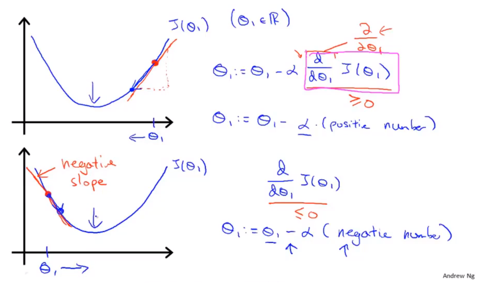
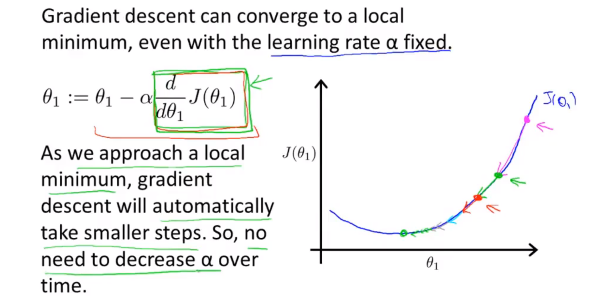
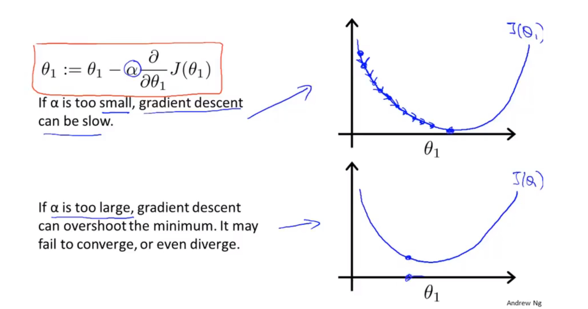

# LinearRegression
比如Univariate linear regression  
  
其中***h***为hypothesis函数，处理输入值x，得到预测值y,用来预测    
## cost function (代价函数)
目标：minimize the square difference between the output of hypothesis and the actual value  
like：
$$\mathop{minimize}\limits_{\theta_0\theta_1}\frac{1}{2m}{\sum_{i=1}^m(h_\theta^{i}-y^i)^2}$$
于是我们可以定义代价函数:  
$$J(\theta_0,\theta_1)=\frac{1}{2m}\sum_{i=1}^m (h_\theta^{i}-y^i)^2 $$
对其求最小值就是我们的代价函数,又叫平方误差代价函数，多用于求解regression question  
Golal:$\mathop{minimize}_{\theta_0\theta_1} J(\theta_0,\theta_1)$

## continue
for hypothesis function :$h_\theta(x)$ and cost function $J(\theta_1)$  
the hypothesis function has fixed $\theta_1$, is a function of x  
and the cost function is a function of $\theta_1$

# Gradient Descent(梯度下降)
not only be used in liner regression, but also in many other functions  

*Outline:*  
*Start with some $\theta_0,\theta_1$  
*Keep changing $\theta_0,\theta_1$  to reduce $J(\theta_0,\theta_1)$ until we hopefully end up at a minimum or local minimum  

## Gradient Algorithm

repeat until convergence{  
    $\theta_j:=\theta_j-\alpha\frac{\partial}{\partial\theta_j}(\theta_0,\theta_1)$ (for j = 0 and j = 1)  
}  
and , := means assignment  
$\alpha$ is *learning rate(学习率)*, it controls how big a step we take downhill with gradient descent  

$$\theta_0:=\theta_0-\alpha\frac{\partial}{\partial\theta_0}(\theta_0,\theta_1)$$

$$\theta_1:=\theta_1-\alpha\frac{\partial}{\partial\theta_1}(\theta_0,\theta_1)$$
**you want to simultaneously update  $\theta_0,\theta_1$**  
so:  
$$temp0:=\theta_0-\alpha\frac{\partial}{\partial\theta_0}(\theta_0,\theta_1)$$

$$temp1:=\theta_1-\alpha\frac{\partial}{\partial\theta_1}(\theta_0,\theta_1)$$

$$\theta_0:=temp0$$

$$\theta_1:=temp1$$
即当计算出了右边的部分时，存入临时值10中，再统一assignment即可(必须同步更新)

### 说明
  
  
  
if $\alpha$ is too small, gradient descent can be slow.  
if $\alpha$ is too big, gradient descent can be overshoot the minimum. It may fail to converge, or even diverge.  

### 公式推导
已知:
hypothesis function : $h_\theta(x)=\theta_0+\theta_1x$  
cost function : $J(\theta_0,\theta_1)=\frac{1}{2m}\sum_{i=1}^m(h_\theta(x^{(i)})-y^{(i)})^2$  
goal : $\mathop{minimum}\limits_{\theta_0,\theta_1}J(\theta_0,\theta_1)$  
Now:
$$\theta_0:=\frac{\partial}{\partial\theta_0}J(\theta_0,\theta_1)=\frac{\partial}{\partial\theta_0}\frac{1}{2m}(\theta_0+\theta_1x^{(i)}-y^{(i)})^2=\frac{1}{m}\sum_{i=1}^m(h_\theta(x^{(i)})-y^{(i)})$$
$$\theta_1:=\frac{\partial}{\partial\theta_1}J(\theta_0,\theta_1)=\frac{\partial}{\partial\theta_1}\frac{1}{2m}(\theta_0+\theta_1x^{(i)}-y^{(i)})^2=\frac{1}{m}\sum_{i=1}^m(h_\theta(x^{(i)})-y^{(i)})x^{(i)}$$

### 快捷运算： 
$$\theta = \theta - ( X * \theta^T - y )^T * X $$
其中X为m\*n, $\theta$为1\*n，
```Python

def gradientDescent_Function_1(X,y,theta,alpha,epoch):
    cost = np.zeros(epoch)
    m = X.shape[0] # number of data
    for i in  range(epoch):
        exp1 = ((X @ theta.T) - y).T @ X
        theta = theta - (alpha/m)*exp1 # 向量法，一次性更新所有theta
        cost[i]=computeCostFunction_LinearRegression(X,y,theta)
    return theta,cost

```

### Batch Gradient Descent
when we use it, each step of this algorithm uses all the training examples.  
