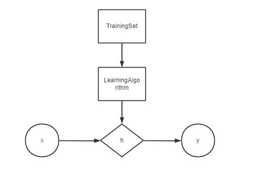

# LinearRegression
比如Univariate linear regression  
  
其中***h***为hypothesis函数，处理输入值x，得到预测值y,用来预测    
## cost function (代价函数)
目标：minimize the square difference between the output of hypothesis and the actual value  
like：
$$\mathop{minimize}_{\theta_0\theta_1}\frac{1}{2m}{\sum_{i=1}^m(h_\theta^{i}-y^i)^2}$$
于是我们可以定义代价函数:  
$$J(\theta_0,\theta_1)=\frac{1}{2m}\sum_{i=1}^m (h_\theta^{i}-y^i)^2 $$
对其求最小值就是我们的代价函数,又叫平方误差代价函数，多用于求解regression question  
Golal:$\mathop{minimize}_{\theta_0\theta_1} J(\theta_0,\theta_1)$

## continue
for hypothesis function :$h_\theta(x)$ and cost function $J(\theta_1)$  
the hypothesis function has fixed $\theta_1$, is a function of x  
and the cost function is a function of $\theta_1$

# Gradient Descent(梯度下降)
not only be used in liner regression, but also in many other functions  

*Outline:*  
*Start with some $\theta_0,\theta_1$  
*Keep changing $\theta_0,\theta_1$  to reduce $J(\theta_0,\theta_1)$ until we hopefully end up at a minimum or local minimum  

## Gradient Algorithm

repeat until convergence{  
    $\theta_j:=\theta_j-\alpha\frac{\partial}{\partial\theta_j}(\theta_0,\theta_1)$ (for j = 0 and j = 1)  
}  
and , := means assignment  
$\alpha$ is *learning rate(学习率)*, it controls how big a step we take downhill with gradient descent  

$$\theta_0:=\theta_0-\alpha\frac{\partial}{\partial\theta_0}(\theta_0,\theta_1)$$

$$\theta_1:=\theta_1-\alpha\frac{\partial}{\partial\theta_1}(\theta_0,\theta_1)$$
**you want to simultaneously update  $\theta_0,\theta_1$**  
so:  
$$temp0:=\theta_0-\alpha\frac{\partial}{\partial\theta_0}(\theta_0,\theta_1)$$

$$temp1:=\theta_1-\alpha\frac{\partial}{\partial\theta_1}(\theta_0,\theta_1)$$

$$\theta_0:=temp0$$

$$\theta_1:=temp1$$
即当计算出了右边的部分时，存入临时值中，再统一assignment即可(必须同步更新)
