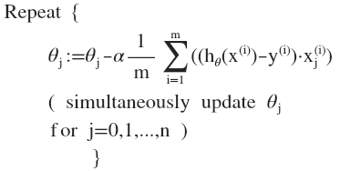

# 多元梯度下降
支持多变量的假设 $h$ 表示为：$h_{\theta}\left( x \right)={\theta_{0}}+{\theta_{1}}{x_{1}}+{\theta_{2}}{x_{2}}+...+{\theta_{n}}{x_{n}}$  
$h_{\theta} \left( x \right)={\theta^{T}}X$，其中上标$T$代表矩阵转置。  
## 多元梯度下降
与单变量线性回归类似，在多变量线性回归中，我们也构建一个代价函数，则这个代价函数是所有建模误差的平方和，即：$J\left( {\theta_{0}},{\theta_{1}}...{\theta_{n}} \right)=J(\theta)=\frac{1}{2m}\sum\limits_{i=1}^{m}{{{\left( h_{\theta} \left({x}^{\left( i \right)} \right)-{y}^{\left( i \right)} \right)}^{2}}}$ ，

其中：$h_{\theta}\left( x \right)=\theta^{T}X={\theta_{0}}+{\theta_{1}}{x_{1}}+{\theta_{2}}{x_{2}}+...+{\theta_{n}}{x_{n}}$  
多变量线性回归的批量梯度下降算法为：  


即：


求导数后得到：



当$n>=1$时，  
${{\theta }_{0}}:={{\theta }_{0}}-a\frac{1}{m}\sum\limits_{i=1}^{m}{({{h}_{\theta }}({{x}^{(i)}})-{{y}^{(i)}})}x_{0}^{(i)}$

${{\theta }_{1}}:={{\theta }_{1}}-a\frac{1}{m}\sum\limits_{i=1}^{m}{({{h}_{\theta }}({{x}^{(i)}})-{{y}^{(i)}})}x_{1}^{(i)}$

${{\theta }_{2}}:={{\theta }_{2}}-a\frac{1}{m}\sum\limits_{i=1}^{m}{({{h}_{\theta }}({{x}^{(i)}})-{{y}^{(i)}})}x_{2}^{(i)}$


我们开始随机选择一系列的参数值，计算所有的预测结果后，再给所有的参数一个新的值，如此循环直到收敛。  
当$n>=1$时，  
${{\theta }_{0}}:={{\theta }_{0}}-a\frac{1}{m}\sum\limits_{i=1}^{m}{({{h}_{\theta }}({{x}^{(i)}})-{{y}^{(i)}})}x_{0}^{(i)}$

${{\theta }_{1}}:={{\theta }_{1}}-a\frac{1}{m}\sum\limits_{i=1}^{m}{({{h}_{\theta }}({{x}^{(i)}})-{{y}^{(i)}})}x_{1}^{(i)}$

${{\theta }_{2}}:={{\theta }_{2}}-a\frac{1}{m}\sum\limits_{i=1}^{m}{({{h}_{\theta }}({{x}^{(i)}})-{{y}^{(i)}})}x_{2}^{(i)}$


我们开始随机选择一系列的参数值，计算所有的预测结果后，再给所有的参数一个新的值，如此循环直到收敛。

代码示例：

计算代价函数
$J\left( \theta  \right)=\frac{1}{2m}\sum\limits_{i=1}^{m}{{{\left( {h_{\theta}}\left( {x^{(i)}} \right)-{y^{(i)}} \right)}^{2}}}$
其中：${h_{\theta}}\left( x \right)={\theta^{T}}X={\theta_{0}}{x_{0}}+{\theta_{1}}{x_{1}}+{\theta_{2}}{x_{2}}+...+{\theta_{n}}{x_{n}}$

**Python** 代码：

```python
def computeCost(X, y, theta):
    inner = np.power(((X * theta.T) - y), 2)
    return np.sum(inner) / (2 * len(X))
```

# Trick in Gradient Descent

## Feature Scaling (特征缩放)
Idea: make sure features are on similar scale.  
E.g. $x_1$=size( 0--2000 $m^2$)  
$x_2$= number of bedrooms (1-5)  
Goal : get every feature into approximately of a $-1\le x_i \le1$  

### Mean normolization(均值归一化)  
Replace $x_i$ with $x_i-u_i$ to make feature have approximately zero mean( Don't apply to $x_0=1$ )  
最简单的方法是令：${{x}_{n}}=\frac{{{x}_{n}}-{{\mu}_{n}}}{{{s}_{n}}}$，其中 ${\mu_{n}}$是平均值，${s_{n}}$是标准差。($S_n$也可以用最大值减最小值代替)  
and, $S_n$ is :  
  
作用: make gradient descent run much faster and can converge in a lot fewer iterations  

## $a$ —— Learning rate
$\mathop{min}\limits_{\theta}J(\theta)$  


也有一些自动测试是否收敛的方法，例如将代价函数的变化值与某个阀值（例如0.001）进行比较，但通常看上面这样的图表更好。

梯度下降算法的每次迭代受到学习率的影响，如果学习率$a$过小，则达到收敛所需的迭代次数会非常高；如果学习率$a$过大，每次迭代可能不会减小代价函数，可能会越过局部最小值导致无法收敛。  
Can Declare convergence if $J(\theta)$ decreases by less than $10^{-3}$ in one iteration  

We have :  
For sufficiently small $a$ ,$J(\theta)$ should decrease on every iteration  
But if $a$ is too small, gradient descent can be slow to converge  

***Summary：***


通常可以考虑尝试些学习率：

$\alpha=0.01，0.03，0.1，0.3，1，3，10$

# 特征和多项式回归
## PolynomialRegression(多项式回归)

我们可以在原有特征的基础上定义新的特征，比如： 原有的特征是frontage与depth，那么我们可以定义新的特征Area=frontage*depth。

如房价预测问题，  
$h_{\theta}\left( x \right)={\theta_{0}}+{\theta_{1}}\times{frontage}+{\theta_{2}}\times{depth}$ 

${x_{1}}=frontage$（临街宽度），${x_{2}}=depth$（纵向深度），$x=frontage*depth=area$（面积），则：${h_{\theta}}\left( x \right)={\theta_{0}}+{\theta_{1}}x$。
线性回归并不适用于所有数据，有时我们需要曲线来适应我们的数据，比如一个二次方模型：$h_{\theta}\left( x \right)={\theta_{0}}+{\theta_{1}}{x_{1}}+{\theta_{2}}{x_{2}^2}$
 或者三次方模型： $h_{\theta}\left( x \right)={\theta_{0}}+{\theta_{1}}{x_{1}}+{\theta_{2}}{x_{2}^2}+{\theta_{3}}{x_{3}^3}$ 

 通常我们需要先观察数据然后再决定准备尝试怎样的模型。 另外，我们可以令：

${{x}_{2}}=x_{2}^{2},{{x}_{3}}=x_{3}^{3}$，从而将模型转化为线性回归模型。

根据函数图形特性，我们还可以使：

${{{h}}_{\theta}}(x)={{\theta }_{0}}\text{+}{{\theta }_{1}}(size)+{{\theta}_{2}}{{(size)}^{2}}$

或者:

${{{h}}_{\theta}}(x)={{\theta }_{0}}\text{+}{{\theta }_{1}}(size)+{{\theta }_{2}}\sqrt{size}$

注：如果我们采用多项式回归模型，在运行梯度下降算法前，特征缩放非常有必要。

***缺点：可能丢失特征***

## 正规方程(Normal equation)
No need to do features scaling  
offer a method to solve for $\theta$ analytically(解析求法).

Normal Equation:
$$\theta=(X^TX)^{-1}X^Ty$$

---

**what if $X^TX$ is non-invertable(Singular/defenerate)?**  
*Redundant features(linearly dependent).  
*Too many features, with too few training sets
E.g m$\le$n  
——delete some features or use regularization.

---

正规方程是通过求解下面的方程来找出使得代价函数最小的参数的：$\frac{\partial}{\partial{\theta_{j}}}J\left( {\theta_{j}} \right)=0$ 。
 假设我们的训练集特征矩阵为 $X$（包含了 ${{x}_{0}}=1$）并且我们的训练集结果为向量 $y$，则利用正规方程解出向量 $\theta ={{\left( {X^T}X \right)}^{-1}}{X^{T}}y$ 。
上标**T**代表矩阵转置，上标-1 代表矩阵的逆。设矩阵$A={X^{T}}X$，则：${{\left( {X^T}X \right)}^{-1}}={A^{-1}}$ 
 以下表示数据为例：


即：


运用正规方程方法求解参数：


注：对于那些不可逆的矩阵（通常是因为特征之间不独立，如同时包含英尺为单位的尺寸和米为单位的尺寸两个特征，也有可能是特征数量大于训练集的数量），正规方程方法是不能用的。

梯度下降与正规方程的比较：

| 梯度下降             | 正规方程                                     |
| ---------------- | ---------------------------------------- |
| 需要选择学习率$\alpha$  | 不需要                                      |
| 需要多次迭代           | 一次运算得出                                   |
| 当特征数量$n$大时也能较好适用 | 需要计算${{\left( {{X}^{T}}X \right)}^{-1}}$ 如果特征数量n较大则运算代价大，因为矩阵逆的计算时间复杂度为$O\left( {{n}^{3}} \right)$，通常来说当$n$小于10000 时还是可以接受的 |
| 适用于各种类型的模型       | 只适用于线性模型，不适合逻辑回归模型等其他模型                  |

总结一下，只要特征变量的数目并不大，标准方程是一个很好的计算参数$\theta $的替代方法。具体地说，只要特征变量数量小于一万，我通常使用标准方程法，而不使用梯度下降法。

随着我们要讲的学习算法越来越复杂，例如，当我们讲到分类算法，像逻辑回归算法，我们会看到，实际上对于那些算法，并不能使用标准方程法。对于那些更复杂的学习算法，我们将不得不仍然使用梯度下降法。因此，梯度下降法是一个非常有用的算法，可以用在有大量特征变量的线性回归问题。或者我们以后在课程中，会讲到的一些其他的算法，因为标准方程法不适合或者不能用在它们上。但对于这个特定的线性回归模型，标准方程法是一个比梯度下降法更快的替代算法。所以，根据具体的问题，以及你的特征变量的数量，这两种算法都是值得学习的。

正规方程的**python**实现：

```python
import numpy as np
    
 def normalEqn(X, y):
    
   theta = np.linalg.inv(X.T@X)@X.T@y #X.T@X等价于X.T.dot(X)
    
   return theta
```


**增加内容：**

$\theta ={{\left( {X^{T}}X \right)}^{-1}}{X^{T}}y$ 的推导过程：

$J\left( \theta  \right)=\frac{1}{2m}\sum\limits_{i=1}^{m}{{{\left( {h_{\theta}}\left( {x^{(i)}} \right)-{y^{(i)}} \right)}^{2}}}$
其中：${h_{\theta}}\left( x \right)={\theta^{T}}X={\theta_{0}}{x_{0}}+{\theta_{1}}{x_{1}}+{\theta_{2}}{x_{2}}+...+{\theta_{n}}{x_{n}}$

将向量表达形式转为矩阵表达形式，则有$J(\theta )=\frac{1}{2}{{\left( X\theta -y\right)}^{2}}$ ，其中$X$为$m$行$n$列的矩阵（$m$为样本个数，$n$为特征个数），$\theta$为$n$行1列的矩阵，$y$为$m$行1列的矩阵，对$J(\theta )$进行如下变换

$J(\theta )=\frac{1}{2}{{\left( X\theta -y\right)}^{T}}\left( X\theta -y \right)$

​     $=\frac{1}{2}\left( {{\theta }^{T}}{{X}^{T}}-{{y}^{T}} \right)\left(X\theta -y \right)$

​     $=\frac{1}{2}\left( {{\theta }^{T}}{{X}^{T}}X\theta -{{\theta}^{T}}{{X}^{T}}y-{{y}^{T}}X\theta -{{y}^{T}}y \right)$

接下来对$J(\theta )$偏导，需要用到以下几个矩阵的求导法则:

$\frac{dAB}{dB}={{A}^{T}}$ 

$\frac{d{{X}^{T}}AX}{dX}=2AX$                            

所以有:

$\frac{\partial J\left( \theta  \right)}{\partial \theta }=\frac{1}{2}\left(2{{X}^{T}}X\theta -{{X}^{T}}y -{}({{y}^{T}}X )^{T}-0 \right)$

$=\frac{1}{2}\left(2{{X}^{T}}X\theta -{{X}^{T}}y -{{X}^{T}}y -0 \right)$

​           $={{X}^{T}}X\theta -{{X}^{T}}y$

令$\frac{\partial J\left( \theta  \right)}{\partial \theta }=0$,

则有$\theta ={{\left( {X^{T}}X \right)}^{-1}}{X^{T}}y$

(为什么不化简为$X^{-1}y$ ==> X为n*m矩阵，不一定可逆)


