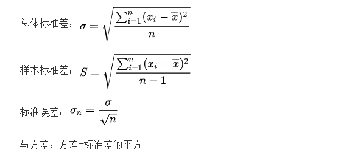
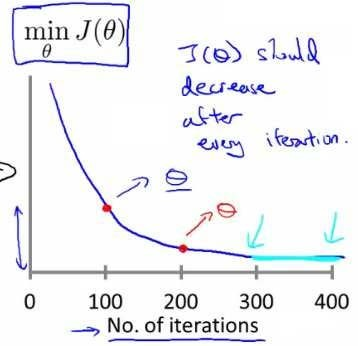

# 多元梯度下降
支持多变量的假设 $h$ 表示为：$h_{\theta}\left( x \right)={\theta_{0}}+{\theta_{1}}{x_{1}}+{\theta_{2}}{x_{2}}+...+{\theta_{n}}{x_{n}}$  
$h_{\theta} \left( x \right)={\theta^{T}}X$，其中上标$T$代表矩阵转置。  
## 多元梯度下降
与单变量线性回归类似，在多变量线性回归中，我们也构建一个代价函数，则这个代价函数是所有建模误差的平方和，即：$J\left( {\theta_{0}},{\theta_{1}}...{\theta_{n}} \right)=J(\theta)=\frac{1}{2m}\sum\limits_{i=1}^{m}{{{\left( h_{\theta} \left({x}^{\left( i \right)} \right)-{y}^{\left( i \right)} \right)}^{2}}}$ ，

其中：$h_{\theta}\left( x \right)=\theta^{T}X={\theta_{0}}+{\theta_{1}}{x_{1}}+{\theta_{2}}{x_{2}}+...+{\theta_{n}}{x_{n}}$  
多变量线性回归的批量梯度下降算法为：  


即：


求导数后得到：


当$n>=1$时，  
${{\theta }_{0}}:={{\theta }_{0}}-a\frac{1}{m}\sum\limits_{i=1}^{m}{({{h}_{\theta }}({{x}^{(i)}})-{{y}^{(i)}})}x_{0}^{(i)}$

${{\theta }_{1}}:={{\theta }_{1}}-a\frac{1}{m}\sum\limits_{i=1}^{m}{({{h}_{\theta }}({{x}^{(i)}})-{{y}^{(i)}})}x_{1}^{(i)}$

${{\theta }_{2}}:={{\theta }_{2}}-a\frac{1}{m}\sum\limits_{i=1}^{m}{({{h}_{\theta }}({{x}^{(i)}})-{{y}^{(i)}})}x_{2}^{(i)}$


我们开始随机选择一系列的参数值，计算所有的预测结果后，再给所有的参数一个新的值，如此循环直到收敛。  
当$n>=1$时，  
${{\theta }_{0}}:={{\theta }_{0}}-a\frac{1}{m}\sum\limits_{i=1}^{m}{({{h}_{\theta }}({{x}^{(i)}})-{{y}^{(i)}})}x_{0}^{(i)}$

${{\theta }_{1}}:={{\theta }_{1}}-a\frac{1}{m}\sum\limits_{i=1}^{m}{({{h}_{\theta }}({{x}^{(i)}})-{{y}^{(i)}})}x_{1}^{(i)}$

${{\theta }_{2}}:={{\theta }_{2}}-a\frac{1}{m}\sum\limits_{i=1}^{m}{({{h}_{\theta }}({{x}^{(i)}})-{{y}^{(i)}})}x_{2}^{(i)}$


我们开始随机选择一系列的参数值，计算所有的预测结果后，再给所有的参数一个新的值，如此循环直到收敛。

代码示例：

计算代价函数
$J\left( \theta  \right)=\frac{1}{2m}\sum\limits_{i=1}^{m}{{{\left( {h_{\theta}}\left( {x^{(i)}} \right)-{y^{(i)}} \right)}^{2}}}$
其中：${h_{\theta}}\left( x \right)={\theta^{T}}X={\theta_{0}}{x_{0}}+{\theta_{1}}{x_{1}}+{\theta_{2}}{x_{2}}+...+{\theta_{n}}{x_{n}}$

**Python** 代码：

```python
def computeCost(X, y, theta):
    inner = np.power(((X * theta.T) - y), 2)
    return np.sum(inner) / (2 * len(X))
```

# Trick in Gradient Descent

## Feature Scaling (特征缩放)
Idea: make sure features are on similar scale.  
E.g. $x_1$=size( 0--2000 $m^2$)  
$x_2$= number of bedrooms (1-5)  
Goal : get every feature into approximately of a $-1\le x_i \le1$  

### Mean normolization(均值归一化)  
Replace $x_i$ with $x_i-u_i$ to make feature have approximately zero mean( Don't apply to $x_0=1$ )  
最简单的方法是令：${{x}_{n}}=\frac{{{x}_{n}}-{{\mu}_{n}}}{{{s}_{n}}}$，其中 ${\mu_{n}}$是平均值，${s_{n}}$是标准差。($S_n$也可以用最大值减最小值代替)  
and, $S_n$ is :  
  
作用: make gradient descent run much faster and can converge in a lot fewer iterations  

## $a$ —— Learning rate
$\mathop{min}\limits_{\theta}J(\theta)$  


也有一些自动测试是否收敛的方法，例如将代价函数的变化值与某个阀值（例如0.001）进行比较，但通常看上面这样的图表更好。

梯度下降算法的每次迭代受到学习率的影响，如果学习率$a$过小，则达到收敛所需的迭代次数会非常高；如果学习率$a$过大，每次迭代可能不会减小代价函数，可能会越过局部最小值导致无法收敛。  
Can Declare convergence if $J(\theta)$ decreases by less than $10^{-3}$ in one iteration  

We have :  
For sufficiently small $a$ ,$J(\theta)$ should decrease on every iteration  
But if $a$ is too small, gradient descent can be slow to converge  

***Summary：***


通常可以考虑尝试些学习率：

$\alpha=0.01，0.03，0.1，0.3，1，3，10$

