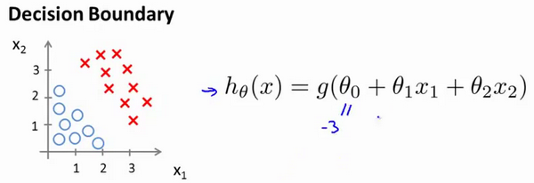
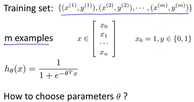
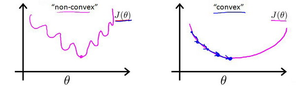

# LogisticRegression
---
## Classify  
---
## 假设陈述
Sigmoid function == logistic function
$h_\theta(x)$= estimated the probability that y=1 on input x.(估计在x的输入下，y=1的概率)

根据线性回归模型我们只能预测连续的值，然而对于分类问题，我们需要输出0或1，我们可以预测：

当${h_\theta}\left( x \right)>=0.5$时，预测 $y=1$。

当${h_\theta}\left( x \right)<0.5$时，预测 $y=0$ 。

我们引入一个新的模型，逻辑回归，该模型的输出变量范围始终在0和1之间。
逻辑回归模型的假设是： $h_\theta \left( x \right)=g\left(\theta^{T}X \right)$
其中：
$X$ 代表特征向量  
$g$ 代表逻辑函数（**logistic function**)是一个常用的逻辑函数为**S**形函数（**Sigmoid function**），公式为： $g\left( z \right)=\frac{1}{1+{{e}^{-z}}}$。

**python**代码实现：  
```python
import numpy as np
    
def sigmoid(z):
    
   return 1 / (1 + np.exp(-z))
```

该函数的图像为：


合起来，我们得到逻辑回归模型的假设：

对模型的理解： $g\left( z \right)=\frac{1}{1+{{e}^{-z}}}$。

$h_\theta \left( x \right)$的作用是，对于给定的输入变量，根据选择的参数计算输出变量=1的可能性（**estimated probablity**）即$h_\theta \left( x \right)=P\left( y=1|x;\theta \right)$
例如，如果对于给定的$x$，通过已经确定的参数计算得出$h_\theta \left( x \right)=0.7$，则表示有70%的几率$y$为正向类，相应地$y$为负向类的几率为1-0.7=0.3。

---
## DecisionBoundary
现在讲下决策边界(**decision boundary**)的概念。这个概念能更好地帮助我们理解逻辑回归的假设函数在计算什么。


在逻辑回归中，我们预测：

当${h_\theta}\left( x \right)>=0.5$时，预测 $y=1$。

当${h_\theta}\left( x \right)<0.5$时，预测 $y=0$ 。

根据上面绘制出的 **S** 形函数图像，我们知道当

$z=0$ 时 $g(z)=0.5$

$z>0$ 时 $g(z)>0.5$

$z<0$ 时 $g(z)<0.5$

又 $z={\theta^{T}}x$ ，即：  
${\theta^{T}}x>=0$  时，预测 $y=1$  
${\theta^{T}}x<0$  时，预测 $y=0$

现在假设我们有一个模型：



并且参数$\theta$ 是向量[-3 1 1]。 则当$-3+{x_1}+{x_2} \geq 0$，即${x_1}+{x_2} \geq 3$时，模型将预测 $y=1$。
我们可以绘制直线${x_1}+{x_2} = 3$，这条线便是我们模型的分界线，将预测为1的区域和预测为 0的区域分隔开。


假使我们的数据呈现这样的分布情况，怎样的模型才能适合呢？


因为需要用曲线才能分隔 $y=0$ 的区域和 $y=1$ 的区域，我们需要二次方特征：${h_\theta}\left( x \right)=g\left( {\theta_0}+{\theta_1}{x_1}+{\theta_{2}}{x_{2}}+{\theta_{3}}x_{1}^{2}+{\theta_{4}}x_{2}^{2} \right)$是[-1 0 0 1 1]，则我们得到的判定边界恰好是圆点在原点且半径为1的圆形。

我们可以用非常复杂的模型来适应非常复杂形状的判定边界。


---
## CostFunction

在这段视频中，我们要介绍如何拟合逻辑回归模型的参数$\theta$。具体来说，我要定义用来拟合参数的优化目标或者叫代价函数，这便是监督学习问题中的逻辑回归模型的拟合问题。



对于线性回归模型，我们定义的代价函数是所有模型误差的平方和。理论上来说，我们也可以对逻辑回归模型沿用这个定义，但是问题在于，当我们将${h_\theta}\left( x \right)=\frac{1}{1+{e^{-\theta^{T}x}}}$带入到这样定义了的代价函数中时，我们得到的代价函数将是一个非凸函数（**non-convexfunction**）。



这意味着我们的代价函数有许多局部最小值，这将影响梯度下降算法寻找全局最小值。

线性回归的代价函数为：$J\left( \theta  \right)=\frac{1}{m}\sum\limits_{i=1}^{m}{\frac{1}{2}{{\left( {h_\theta}\left({x}^{\left( i \right)} \right)-{y}^{\left( i \right)} \right)}^{2}}}$ 。
我们重新定义逻辑回归的代价函数为：$J\left( \theta  \right)=\frac{1}{m}\sum\limits_{i=1}^{m}{{Cost}\left( {h_\theta}\left( {x}^{\left( i \right)} \right),{y}^{\left( i \right)} \right)}$，其中


${h_\theta}\left( x \right)$与 $Cost\left( {h_\theta}\left( x \right),y \right)$之间的关系如下图所示：


这样构建的$Cost\left( {h_\theta}\left( x \right),y \right)$函数的特点是：当实际的  $y=1$ 且${h_\theta}\left( x \right)$也为 1 时误差为 0，当 $y=1$ 但${h_\theta}\left( x \right)$不为1时误差随着${h_\theta}\left( x \right)$变小而变大；当实际的 $y=0$ 且${h_\theta}\left( x \right)$也为 0 时代价为 0，当$y=0$ 但${h_\theta}\left( x \right)$不为 0时误差随着 ${h_\theta}\left( x \right)$的变大而变大。
将构建的 $Cost\left( {h_\theta}\left( x \right),y \right)$简化如下： 
$Cost\left( {h_\theta}\left( x \right),y \right)=-y\times log\left( {h_\theta}\left( x \right) \right)-(1-y)\times log\left( 1-{h_\theta}\left( x \right) \right)$
带入代价函数得到：
$J\left( \theta  \right)=\frac{1}{m}\sum\limits_{i=1}^{m}{[-{{y}^{(i)}}\log \left( {h_\theta}\left( {{x}^{(i)}} \right) \right)-\left( 1-{{y}^{(i)}} \right)\log \left( 1-{h_\theta}\left( {{x}^{(i)}} \right) \right)]}$
即：$J\left( \theta  \right)=-\frac{1}{m}\sum\limits_{i=1}^{m}{[{{y}^{(i)}}\log \left( {h_\theta}\left( {{x}^{(i)}} \right) \right)+\left( 1-{{y}^{(i)}} \right)\log \left( 1-{h_\theta}\left( {{x}^{(i)}} \right) \right)]}$

**Python**代码实现：

```python
import numpy as np
    
def cost(theta, X, y):
    
  theta = np.matrix(theta)
  X = np.matrix(X)
  y = np.matrix(y)
  first = np.multiply(-y, np.log(sigmoid(X* theta.T)))
  second = np.multiply((1 - y), np.log(1 - sigmoid(X* theta.T)))
  return np.sum(first - second) / (len(X))
```

在得到这样一个代价函数以后，我们便可以用梯度下降算法来求得能使代价函数最小的参数了。算法为：

**Repeat** {
$\theta_j := \theta_j - \alpha \frac{\partial}{\partial\theta_j} J(\theta)$
(**simultaneously update all** )
}


求导后得到：

**Repeat** {
$\theta_j := \theta_j - \alpha \frac{1}{m}\sum\limits_{i=1}^{m}{{\left( {h_\theta}\left( \mathop{x}^{\left( i \right)} \right)-\mathop{y}^{\left( i \right)} \right)}}\mathop{x}_{j}^{(i)}$ 
**(simultaneously update all** )
}

在这个视频中，我们定义了单训练样本的代价函数，凸性分析的内容是超出这门课的范围的，但是可以证明我们所选的代价值函数会给我们一个凸优化问题。代价函数$J(\theta)$会是一个凸函数，并且没有局部最优值。

推导过程：

$J\left( \theta  \right)=-\frac{1}{m}\sum\limits_{i=1}^{m}{[{{y}^{(i)}}\log \left( {h_\theta}\left( {{x}^{(i)}} \right) \right)+\left( 1-{{y}^{(i)}} \right)\log \left( 1-{h_\theta}\left( {{x}^{(i)}} \right) \right)]}$
考虑：
${h_\theta}\left( {{x}^{(i)}} \right)=\frac{1}{1+{{e}^{-{\theta^T}{{x}^{(i)}}}}}$
则：
${{y}^{(i)}}\log \left( {h_\theta}\left( {{x}^{(i)}} \right) \right)+\left( 1-{{y}^{(i)}} \right)\log \left( 1-{h_\theta}\left( {{x}^{(i)}} \right) \right)$
$={{y}^{(i)}}\log \left( \frac{1}{1+{{e}^{-{\theta^T}{{x}^{(i)}}}}} \right)+\left( 1-{{y}^{(i)}} \right)\log \left( 1-\frac{1}{1+{{e}^{-{\theta^T}{{x}^{(i)}}}}} \right)$
$=-{{y}^{(i)}}\log \left( 1+{{e}^{-{\theta^T}{{x}^{(i)}}}} \right)-\left( 1-{{y}^{(i)}} \right)\log \left( 1+{{e}^{{\theta^T}{{x}^{(i)}}}} \right)$

所以：
$\frac{\partial }{\partial {\theta_{j}}}J\left( \theta  \right)=\frac{\partial }{\partial {\theta_{j}}}[-\frac{1}{m}\sum\limits_{i=1}^{m}{[-{{y}^{(i)}}\log \left( 1+{{e}^{-{\theta^{T}}{{x}^{(i)}}}} \right)-\left( 1-{{y}^{(i)}} \right)\log \left( 1+{{e}^{{\theta^{T}}{{x}^{(i)}}}} \right)]}]$
$=-\frac{1}{m}\sum\limits_{i=1}^{m}{[-{{y}^{(i)}}\frac{-x_{j}^{(i)}{{e}^{-{\theta^{T}}{{x}^{(i)}}}}}{1+{{e}^{-{\theta^{T}}{{x}^{(i)}}}}}-\left( 1-{{y}^{(i)}} \right)\frac{x_j^{(i)}{{e}^{{\theta^T}{{x}^{(i)}}}}}{1+{{e}^{{\theta^T}{{x}^{(i)}}}}}}]$
$=-\frac{1}{m}\sum\limits_{i=1}^{m}{{y}^{(i)}}\frac{x_j^{(i)}}{1+{{e}^{{\theta^T}{{x}^{(i)}}}}}-\left( 1-{{y}^{(i)}} \right)\frac{x_j^{(i)}{{e}^{{\theta^T}{{x}^{(i)}}}}}{1+{{e}^{{\theta^T}{{x}^{(i)}}}}}]$
$=-\frac{1}{m}\sum\limits_{i=1}^{m}{\frac{{{y}^{(i)}}x_j^{(i)}-x_j^{(i)}{{e}^{{\theta^T}{{x}^{(i)}}}}+{{y}^{(i)}}x_j^{(i)}{{e}^{{\theta^T}{{x}^{(i)}}}}}{1+{{e}^{{\theta^T}{{x}^{(i)}}}}}}$
$=-\frac{1}{m}\sum\limits_{i=1}^{m}{\frac{{{y}^{(i)}}\left( 1\text{+}{{e}^{{\theta^T}{{x}^{(i)}}}} \right)-{{e}^{{\theta^T}{{x}^{(i)}}}}}{1+{{e}^{{\theta^T}{{x}^{(i)}}}}}x_j^{(i)}}$
$=-\frac{1}{m}\sum\limits_{i=1}^{m}{({{y}^{(i)}}-\frac{{{e}^{{\theta^T}{{x}^{(i)}}}}}{1+{{e}^{{\theta^T}{{x}^{(i)}}}}})x_j^{(i)}}$
$=-\frac{1}{m}\sum\limits_{i=1}^{m}{({{y}^{(i)}}-\frac{1}{1+{{e}^{-{\theta^T}{{x}^{(i)}}}}})x_j^{(i)}}$
$=-\frac{1}{m}\sum\limits_{i=1}^{m}{[{{y}^{(i)}}-{h_\theta}\left( {{x}^{(i)}} \right)]x_j^{(i)}}$
$=\frac{1}{m}\sum\limits_{i=1}^{m}{[{h_\theta}\left( {{x}^{(i)}} \right)-{{y}^{(i)}}]x_j^{(i)}}$

注：虽然得到的梯度下降算法表面上看上去与线性回归的梯度下降算法一样，但是这里的${h_\theta}\left( x \right)=g\left( {\theta^T}X \right)$与线性回归中不同，所以实际上是不一样的。另外，在运行梯度下降算法之前，进行特征缩放依旧是非常必要的。

一些梯度下降算法之外的选择：
除了梯度下降算法以外，还有一些常被用来令代价函数最小的算法，这些算法更加复杂和优越，而且通常不需要人工选择学习率，通常比梯度下降算法要更加快速。这些算法有：**共轭梯度**（**Conjugate Gradient**），**局部优化法**(**Broyden fletcher goldfarb shann,BFGS**)和**有限内存局部优化法**(**LBFGS**) ，**fminunc**是 **matlab**和**octave** 中都带的一个最小值优化函数，使用时我们需要提供代价函数和每个参数的求导，下面是 **octave** 中使用 **fminunc** 函数的代码示例：

```octave
function [jVal, gradient] = costFunction(theta)

    jVal = [...code to compute J(theta)...];
    gradient = [...code to compute derivative of J(theta)...];
    
end
    
options = optimset('GradObj', 'on', 'MaxIter', '100');
    
initialTheta = zeros(2,1);
    
[optTheta, functionVal, exitFlag] = fminunc(@costFunction, initialTheta, options);
```

在下一个视频中，我们会把单训练样本的代价函数的这些理念进一步发展，然后给出整个训练集的代价函数的定义，我们还会找到一种比我们目前用的更简单的写法，基于这些推导出的结果，我们将应用梯度下降法得到我们的逻辑回归算法。

---
## 简化代价函数与梯度下降

---
## 高级优化

---
## 多元分类：一对多