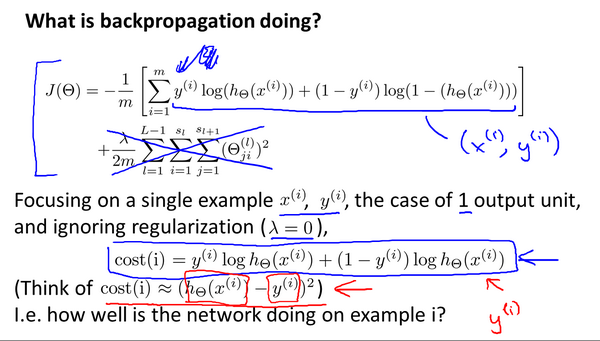

# 代价函数
首先引入一些便于稍后讨论的新标记方法：

假设神经网络的训练样本有$m$个，每个包含一组输入$x$和一组输出信号$y$，$L$表示神经网络层数，$S_I$表示每层的**neuron**个数($S_l$表示输出层神经元个数)，$S_L$代表最后一层中处理单元的个数。

将神经网络的分类定义为两种情况：二类分类和多类分类，

二类分类：$S_L=0, y=0\, or\, 1$表示哪一类；

$K$类分类：$S_L=k, y_i = 1$表示分到第$i$类；$(k>2)$


我们回顾逻辑回归问题中我们的代价函数为：


$$J(\theta)=-\frac{1}{m}[\sum_{i=1}^{m}{y}^{(i)}\log{h_\theta({x}^{(i)})}+(1-{y}^{(i)})log(1-h_\theta({x}^{(i)}))]+\frac{\lambda}{2m}\sum_{j=1}^{n}{\theta_j}^{2}$$

在逻辑回归中，我们只有一个输出变量，又称标量（**scalar**），也只有一个因变量$y$，但是在神经网络中，我们可以有很多输出变量，我们的$h_\theta(x)$是一个维度为$K$的向量，并且我们训练集中的因变量也是同样维度的一个向量，因此我们的代价函数会比逻辑回归更加复杂一些，为：$\newcommand{\subk}[1]{#1_k}$ 
$$h_\theta(x)\in \mathbb{R}^{K}$$ 
$${({h_\theta}(x))}_{i}={i}^{th} \text{output}$$

$J(\Theta) = -\frac{1}{m} [ \sum\limits_{i=1}^{m} \sum\limits_{k=1}^{k} {y_k}^{(i)} \log{(h_\Theta(x^{(i)}))} + ( 1 - y_k^{(i)} ) \log ( 1- {( h_\Theta ( x^{(i)} ) )} ) ] + \frac{\lambda}{2m} \sum\limits_{l=1}^{L-1} \sum\limits_{i=1}^{s_l} \sum\limits_{j=1}^{s_{l+1}} ( \Theta_{ji}^{(l)} )^2$

这个看起来复杂很多的代价函数背后的思想还是一样的，我们希望通过代价函数来观察算法预测的结果与真实情况的误差有多大，唯一不同的是，对于每一行特征，我们都会给出$K​$个预测，基本上我们可以利用循环，对每一行特征都预测$K​$个不同结果，然后在利用循环在$K​$个预测中选择可能性最高的一个，将其与$y​$中的实际数据进行比较。

正则化的那一项只是排除了每一层$\theta_0$后，每一层的$\theta$ 矩阵的和。最里层的循环$j$循环所有的行（由$s_{l+1}$  层的激活单元数决定），循环$i$则循环所有的列，由该层（$s_l$层）的激活单元数所决定。即：$h_\theta(x)$与真实值之间的距离为每个样本-每个类输出的加和，对参数进行**regularization**的**bias**项处理所有参数的平方和。


# 反向传播算法
之前我们在计算神经网络预测结果的时候我们采用了一种正向传播方法，我们从第一层开始正向一层一层进行计算，直到最后一层的$h_{\theta}(x)$。

现在，为了计算代价函数的偏导数$\frac{\partial}{\partial\Theta^{(l)}_{ij}}J(\Theta)$，我们需要采用一种反向传播算法，也就是首先计算最后一层的误差，然后再一层一层反向求出各层的误差，直到倒数第二层。
以一个例子来说明反向传播算法。

假设我们的训练集只有一个样本$({x}^{(1)},{y}^{(1)})$，我们的神经网络是一个四层的神经网络，其中$K=4，S_{L}=4，L=4$：

前向传播算法：


下面的公式推导过程见：<https://blog.csdn.net/qq_29762941/article/details/80343185>

我们从最后一层的误差开始计算，误差是激活单元的预测（${a^{(4)}}$）与实际值（$y^k$）之间的误差，（$k=1:k$）。
我们用$\delta$来表示误差，则：$\delta^{(4)}=a^{(4)}-y$
我们利用这个误差值来计算前一层的误差：$\delta^{(3)}=({\Theta^{(3)}})^{T}\delta^{(4)}\ast g'(z^{(3)})$
其中 $g'(z^{(3)})$是 $S$ 形函数的导数，$g'(z^{(3)})=a^{(3)}\ast(1-a^{(3)})$。而$(θ^{(3)})^{T}\delta^{(4)}$则是权重导致的误差的和。下一步是继续计算第二层的误差：
$\delta^{(2)}=(\Theta^{(2)})^{T}\delta^{(3)}\ast g'(z^{(2)})$
因为第一层是输入变量，不存在误差。我们有了所有的误差的表达式后，便可以计算代价函数的偏导数了，假设$λ=0$，即我们不做任何正则化处理时有：

$$\frac{\partial}{\partial\Theta_{ij}^{(l)}}J(\Theta)=a_{j}^{(l)}\delta_{i}^{l+1}$$

重要的是清楚地知道上面式子中上下标的含义：

$l$ 代表目前所计算的是第几层。

$j$ 代表目前计算层中的激活单元的下标，也将是下一层的第$j$个输入变量的下标。

$i$ 代表下一层中误差单元的下标，是受到权重矩阵中第$i$行影响的下一层中的误差单元的下标。

如果我们考虑正则化处理，并且我们的训练集是一个特征矩阵而非向量。在上面的特殊情况中，我们需要计算每一层的误差单元来计算代价函数的偏导数。在更为一般的情况中，我们同样需要计算每一层的误差单元，但是我们需要为整个训练集计算误差单元，此时的误差单元也是一个矩阵，我们用$\Delta^{(l)}_{ij}$来表示这个误差矩阵。第 $l$  层的第 $i$ 个激活单元受到第 $j$ 个参数影响而导致的误差。

我们的算法表示为：


即首先用正向传播方法计算出每一层的激活单元，利用训练集的结果与神经网络预测的结果求出最后一层的误差，然后利用该误差运用反向传播法计算出直至第二层的所有误差。

在求出了$\Delta_{ij}^{(l)}$之后，我们便可以计算代价函数的偏导数了，计算方法如下：


在**Octave** 中，如果我们要使用 `fminuc`这样的优化算法来求解求出权重矩阵，我们需要将矩阵首先展开成为向量，在利用算法求出最优解后再重新转换回矩阵。

假设我们有三个权重矩阵，Theta1，Theta2 和 Theta3，尺寸分别为 10\*11，10\*11 和1*11，
下面的代码可以实现这样的转换：

```
thetaVec = [Theta1(:) ; Theta2(:) ; Theta3(:)]

...optimization using functions like fminuc...

Theta1 = reshape(thetaVec(1:110, 10, 11);

Theta2 = reshape(thetaVec(111:220, 10, 11);

Theta1 = reshape(thetaVec(221:231, 1, 11);
```


前向传播算法：


反向传播算法做的是：




**感悟**：上图中的 $\delta^{(l)}_{j}="error" \ of cost \  for \ a^{(l)}_{j} \ (unit \ j \ in \ layer \ l)$ 理解如下：

$\delta^{(l)}_{j}$ 相当于是第 $l$ 层的第 $j$ 单元中得到的激活项的“误差”，即”正确“的 $a^{(l)}_{j}$ 与计算得到的 $a^{(l)}_{j}$ 的差。

而 $a^{(l)}_{j}=g(z^{(l)})$ ，（g为sigmoid函数）。我们可以想象 $\delta^{(l)}_{j}$ 为函数求导时迈出的那一丁点微分，所以更准确的说 $\delta^{(l)}_{j}=\frac{\partial}{\partial z^{(l)}_{j}}cost(i)$

# 梯度检测

当我们对一个较为复杂的模型（例如神经网络）使用梯度下降算法时，可能会存在一些不容易察觉的错误，意味着，虽然代价看上去在不断减小，但最终的结果可能并不是最优解。

为了避免这样的问题，我们采取一种叫做梯度的数值检验（**Numerical Gradient Checking**）方法。这种方法的思想是通过估计梯度值来检验我们计算的导数值是否真的是我们要求的。

对梯度的估计采用的方法是在代价函数上沿着切线的方向选择离两个非常近的点然后计算两个点的平均值用以估计梯度。即对于某个特定的 $\theta$，我们计算出在 $\theta$-$\varepsilon $ 处和 $\theta$+$\varepsilon $ 的代价值（$\varepsilon $是一个非常小的值，通常选取 0.001），然后求两个代价的平均，用以估计在 $\theta$ 处的代价值。


**Octave** 中代码如下：

`gradApprox = (J(theta + eps) – J(theta - eps)) / (2*eps)`

当$\theta$是一个向量时，我们则需要对偏导数进行检验。因为代价函数的偏导数检验只针对一个参数的改变进行检验，下面是一个只针对$\theta_1$进行检验的示例：
$$ \frac{\partial}{\partial\theta_1}=\frac{J\left(\theta_1+\varepsilon_1,\theta_2,\theta_3...\theta_n \right)-J \left( \theta_1-\varepsilon_1,\theta_2,\theta_3...\theta_n \right)}{2\varepsilon} $$

最后我们还需要对通过反向传播方法计算出的偏导数进行检验。

根据上面的算法，计算出的偏导数存储在矩阵 $D_{ij}^{(l)}$ 中。检验时，我们要将该矩阵展开成为向量，同时我们也将 $\theta$ 矩阵展开为向量，我们针对每一个 $\theta$ 都计算一个近似的梯度值，将这些值存储于一个近似梯度矩阵中，最终将得出的这个矩阵同 $D_{ij}^{(l)}$ 进行比较。

  

# Summary
小结一下使用神经网络时的步骤：

网络结构：第一件要做的事是选择网络结构，即决定选择多少层以及决定每层分别有多少个单元。

第一层的单元数即我们训练集的特征数量。

最后一层的单元数是我们训练集的结果的类的数量。

如果隐藏层数大于1，确保每个隐藏层的单元个数相同，通常情况下隐藏层单元的个数越多越好。

我们真正要决定的是隐藏层的层数和每个中间层的单元数。

训练神经网络：

1. 参数的随机初始化

2. 利用正向传播方法计算所有的$h_{\theta}(x)$

3. 编写计算代价函数 $J$ 的代码

4. 利用反向传播方法计算所有偏导数

5. 利用数值检验方法检验这些偏导数

6. 使用优化算法来最小化代价函数