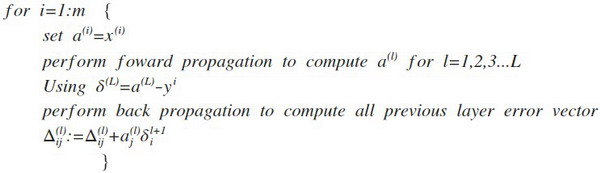
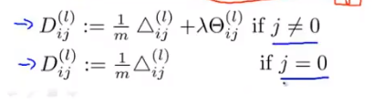

# 反向传播算法
之前我们在计算神经网络预测结果的时候我们采用了一种正向传播方法，我们从第一层开始正向一层一层进行计算，直到最后一层的$h_{\theta}\left(x\right)$。

现在，为了计算代价函数的偏导数$\frac{\partial}{\partial\Theta^{(l)}_{ij}}J\left(\Theta\right)$，我们需要采用一种反向传播算法，也就是首先计算最后一层的误差，然后再一层一层反向求出各层的误差，直到倒数第二层。
以一个例子来说明反向传播算法。

假设我们的训练集只有一个样本$\left({x}^{(1)},{y}^{(1)}\right)$，我们的神经网络是一个四层的神经网络，其中$K=4，S_{L}=4，L=4$：

前向传播算法：


下面的公式推导过程见：<https://blog.csdn.net/qq_29762941/article/details/80343185>

我们从最后一层的误差开始计算，误差是激活单元的预测（${a^{(4)}}$）与实际值（$y^k$）之间的误差，（$k=1:k$）。
我们用$\delta$来表示误差，则：$\delta^{(4)}=a^{(4)}-y$
我们利用这个误差值来计算前一层的误差：$\delta^{(3)}=\left({\Theta^{(3)}}\right)^{T}\delta^{(4)}\ast g'\left(z^{(3)}\right)$
其中 $g'(z^{(3)})$是 $S$ 形函数的导数，$g'(z^{(3)})=a^{(3)}\ast(1-a^{(3)})$。而$(θ^{(3)})^{T}\delta^{(4)}$则是权重导致的误差的和。下一步是继续计算第二层的误差：
$ \delta^{(2)}=(\Theta^{(2)})^{T}\delta^{(3)}\ast g'(z^{(2)})$
因为第一层是输入变量，不存在误差。我们有了所有的误差的表达式后，便可以计算代价函数的偏导数了，假设$λ=0$，即我们不做任何正则化处理时有：

$$\frac{\partial}{\partial\Theta_{ij}^{(l)}}J(\Theta)=a_{j}^{(l)}\delta_{i}^{l+1}$$

重要的是清楚地知道上面式子中上下标的含义：

$l$ 代表目前所计算的是第几层。

$j$ 代表目前计算层中的激活单元的下标，也将是下一层的第$j$个输入变量的下标。

$i$ 代表下一层中误差单元的下标，是受到权重矩阵中第$i$行影响的下一层中的误差单元的下标。

如果我们考虑正则化处理，并且我们的训练集是一个特征矩阵而非向量。在上面的特殊情况中，我们需要计算每一层的误差单元来计算代价函数的偏导数。在更为一般的情况中，我们同样需要计算每一层的误差单元，但是我们需要为整个训练集计算误差单元，此时的误差单元也是一个矩阵，我们用$\Delta^{(l)}_{ij}$来表示这个误差矩阵。第 $l$  层的第 $i$ 个激活单元受到第 $j$ 个参数影响而导致的误差。

我们的算法表示为：



即首先用正向传播方法计算出每一层的激活单元，利用训练集的结果与神经网络预测的结果求出最后一层的误差，然后利用该误差运用反向传播法计算出直至第二层的所有误差。

在求出了$\Delta_{ij}^{(l)}$之后，我们便可以计算代价函数的偏导数了，计算方法如下：




在**Octave** 中，如果我们要使用 `fminuc`这样的优化算法来求解求出权重矩阵，我们需要将矩阵首先展开成为向量，在利用算法求出最优解后再重新转换回矩阵。

假设我们有三个权重矩阵，Theta1，Theta2 和 Theta3，尺寸分别为 10\*11，10\*11 和1*11，
下面的代码可以实现这样的转换：

```
thetaVec = [Theta1(:) ; Theta2(:) ; Theta3(:)]

...optimization using functions like fminuc...

Theta1 = reshape(thetaVec(1:110, 10, 11);

Theta2 = reshape(thetaVec(111:220, 10, 11);

Theta1 = reshape(thetaVec(221:231, 1, 11);
```