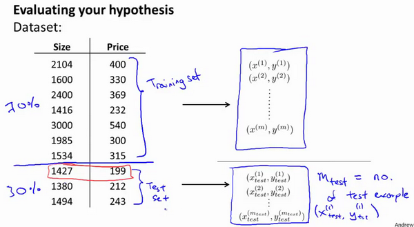

# 当训练模型的误差较大时
1. 获得更多的训练样本——通常是有效的，但代价较大，下面的方法也可能有效，可考虑先采用下面的几种方法。

2. 尝试减少特征的数量

3. 尝试获得更多的特征

4. 尝试增加多项式特征

5. 尝试减少正则化程度$\lambda$

6. 尝试增加正则化程度$\lambda$  

# 评估一个假设

当我们确定学习算法的参数的时候，我们考虑的是选择参量来使训练误差最小化，有人认为得到一个非常小的训练误差一定是一件好事，但我们已经知道，仅仅是因为这个假设具有很小的训练误差，并不能说明它就一定是一个好的假设函数。而且我们也学习了过拟合假设函数的例子，所以这推广到新的训练集上是不适用的。
	
那么，你该如何判断一个假设函数是过拟合的呢？对于这个简单的例子，我们可以对假设函数$h(x)$进行画图，然后观察图形趋势，但对于特征变量不止一个的这种一般情况，还有像有很多特征变量的问题，想要通过画出假设函数来进行观察，就会变得很难甚至是不可能实现。
	
因此，我们需要另一种方法来评估我们的假设函数过拟合检验。
	
为了检验算法是否过拟合，我们将数据分成训练集和测试集，通常用70%的数据作为训练集，用剩下30%的数据作为测试集。很重要的一点是训练集和测试集均要含有各种类型的数据，通常我们要对数据进行“洗牌”，然后再分成训练集和测试集。

测试集评估在通过训练集让我们的模型学习得出其参数后，对测试集运用该模型，我们有两种方式计算误差：

1. 对于线性回归模型，我们利用测试集数据计算代价函数$J$
2. 对于逻辑回归模型，我们除了可以利用测试数据集来计算代价函数外：

$$J_{test}{(\theta)} = -\frac{1}{{m}_{test}}\sum_{i=1}^{m_{test}}y_{test}^{(i)}\log{h_{\theta}(x^{(i)}_{test})}+(1-{y^{(i)}_{test}})\log{h_{\theta}(x^{(i)}_{test})}$$

误分类的比率，对于每一个测试集样本，计算：

然后对计算结果求平均

# 模型选择和交叉验证集
假设我们要在10个不同次数的二项式模型之间进行选择：

显然越高次数的多项式模型越能够适应我们的训练数据集，但是适应训练数据集并不代表着能推广至一般情况，我们应该选择一个更能适应一般情况的模型。我们需要使用交叉验证集来帮助选择模型。
	
即：使用60%的数据作为训练集，使用 20%的数据作为交叉验证集，使用20%的数据作为测试集

模型选择的方法为：

1.  使用训练集训练出10个模型

2.  用10个模型分别对交叉验证集计算得出交叉验证误差（代价函数的值）

3.  选取代价函数值最小的模型

4.  用步骤3中选出的模型对测试集计算得出推广误差（代价函数的值）

    ***Train/validation/test error***

    **Training error:**

$J_{train}(\theta) = \frac{1}{2m}\sum_{i=1}^{m}(h_{\theta}(x^{(i)})-y^{(i)})^2$

**Cross Validation error:**

$J_{cv}(\theta) = \frac{1}{2m_{cv}}\sum_{i=1}^{m}(h_{\theta}(x^{(i)}_{cv})-y^{(i)}_{cv})^2$

**Test error:**

$J_{test}(\theta)=\frac{1}{2m_{test}}\sum_{i=1}^{m_{test}}(h_{\theta}(x^{(i)}_{cv})-y^{(i)}_{cv})^2$

***为什么要交叉验证集而并非单独只使用测试集呢：***  
我们通过交叉验证集来选择最合适的模型，然后用测试集来验证我们模型的效果。  
如果使用测试集来选择模型、测试效果，那么就失去了意义。

# 诊断偏差与方差
高偏差和高方差的问题基本上来说是欠拟合和过拟合的问题。

我们通常会通过将训练集和交叉验证集的代价函数误差与多项式的次数绘制在同一张图表上来帮助分析：

**Bias/variance**

**Training error:**				               $J_{train}(\theta) = \frac{1}{2m}\sum_{i=1}^{m}(h_{\theta}(x^{(i)})-y^{(i)})^2$

**Cross Validation error:**				$J_{cv}(\theta) = \frac{1}{2m_{cv}}\sum_{i=1}^{m}(h_{\theta}(x^{(i)}_{cv})-y^{(i)}_{cv})^2$

对于训练集，当 $d$ 较小时，模型拟合程度更低，误差较大；随着 $d$ 的增长，拟合程度提高，误差减小。
	
对于交叉验证集，当 $d$ 较小时，模型拟合程度低，误差较大；但是随着 $d$ 的增长，误差呈现先减小后增大的趋势，转折点是我们的模型开始过拟合训练数据集的时候。
	
如果我们的交叉验证集误差较大，我们如何判断是方差还是偏差呢？根据上面的图表，我们知道:

## Bias(Underfit)
训练集误差和交叉验证集误差都比较大，且$J_{train}(\theta) \approx J_{cv}(\theta)$

## High Variance(Overfit)
训练集误差较小，交叉测试集误差较大$J_{cv}(\theta) >>> J_{train}(\theta)$

# 正则化和偏差/方差

参考视频: 10 - 5 - Regularization and Bias_Variance (11 min).mkv

在我们在训练模型的过程中，一般会使用一些正则化方法来防止过拟合。但是我们可能会正则化的程度太高或太小了，即我们在选择λ的值时也需要思考与刚才选择多项式模型次数类似的问题。

我们选择一系列的想要测试的 $\lambda$ 值，通常是 0-10之间的呈现2倍关系的值（如：$0,0.01,0.02,0.04,0.08,0.15,0.32,0.64,1.28,2.56,5.12,10$共12个）。 我们同样把数据分为训练集、交叉验证集和测试集。

选择$\lambda$的方法为：

1. 使用训练集训练出12个不同程度正则化的模型
2. 用12个模型分别对交叉验证集计算的出交叉验证误差
3. 选择得出交叉验证误差**最小**的模型
4. 运用步骤3中选出模型对测试集计算得出推广误差，我们也可以同时将训练集和交叉验证集模型的代价函数误差与λ的值绘制在一张图表上：

• 当 $\lambda$ 较小时，训练集误差较小（过拟合）而交叉验证集误差较大
	
• 随着 $\lambda$ 的增加，训练集误差不断增加（欠拟合），而交叉验证集误差则是先减小后增加

# 学习曲线
学习曲线就是一种很好的工具，我经常使用学习曲线来判断某一个学习算法是否处于偏差、方差问题。学习曲线是学习算法的一个很好的**合理检验**（**sanity check**）。学习曲线是将训练集误差和交叉验证集误差作为训练集样本数量（$m$）的函数绘制的图表。
	
即，如果我们有100行数据，我们从1行数据开始，逐渐学习更多行的数据。思想是：当训练较少行数据的时候，训练的模型将能够非常完美地适应较少的训练数据，但是训练出来的模型却不能很好地适应交叉验证集数据或测试集数据。

如何利用学习曲线识别高偏差/欠拟合：作为例子，我们尝试用一条直线来适应下面的数据，可以看出，无论训练集有多么大误差都不会有太大改观：

也就是说在高偏差/欠拟合的情况下，增加数据到训练集不一定能有帮助。
	
如何利用学习曲线识别高方差/过拟合：假设我们使用一个非常高次的多项式模型，并且正则化非常小，可以看出，当交叉验证集误差远大于训练集误差时，往训练集增加更多数据可以提高模型的效果。

也就是说在高方差/过拟合的情况下，增加更多数据到训练集可能可以提高算法效果。