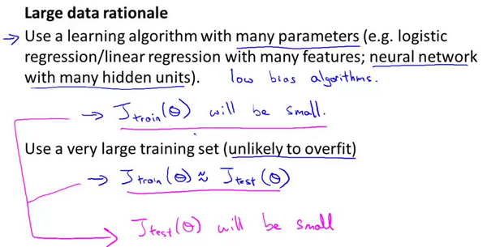

# 类偏斜的误差度量

在前面的课程中，我提到了误差分析，以及设定误差度量值的重要性。那就是，设定某个实数来评估你的学习算法，并衡量它的表现，有了算法的评估和误差度量值。有一件重要的事情要注意，就是使用一个合适的误差度量值，这有时会对于你的学习算法造成非常微妙的影响，这件重要的事情就是偏斜类（skewed classes）的问题。类偏斜情况表现为我们的训练集中有非常多的同一种类的样本，只有很少或没有其他类的样本。
	
例如我们希望用算法来预测癌症是否是恶性的，在我们的训练集中，只有0.5%的实例是恶性肿瘤。假设我们编写一个非学习而来的算法，在所有情况下都预测肿瘤是良性的，那么误差只有0.5%。然而我们通过训练而得到的神经网络算法却有1%的误差。这时，误差的大小是不能视为评判算法效果的依据的。

**查准率**（**Precision**）和**查全率**（**Recall**） 我们将算法预测的结果分成四种情况：
1. **正确肯定**（**True Positive,TP**）：预测为真，实际为真
	
2.**正确否定**（**True Negative,TN**）：预测为假，实际为假
	
3.**错误肯定**（**False Positive,FP**）：预测为真，实际为假
	
4.**错误否定**（**False Negative,FN**）：预测为假，实际为真

则：查准率=$\frac{TP}{TP+FP}$。例，在所有我们预测有恶性肿瘤的病人中，实际上有恶性肿瘤的病人的百分比，越高越好。
	
查全率=$\frac{TP}{TP+FN}$。例，在所有实际上有恶性肿瘤的病人中，成功预测有恶性肿瘤的病人的百分比，越高越好。
	
这样，对于我们刚才那个总是预测病人肿瘤为良性的算法，其查全率是0。

|            |              | **预测值**   |             |
| ---------- | ------------ | ------------ | ----------- |
|            |              | **Positive** | **Negtive** |
| **实际值** | **Positive** | **TP**       | **FN**      |
|            | **Negtive**  | **FP**       | **TN**      |

# 查准率和查全率之间的权衡
假使，我们的算法输出的结果在0-1 之间，我们使用阀值0.5 来预测真和假。

查准率**(Precision)=TP/(TP+FP)**
例，在所有我们预测有恶性肿瘤的病人中，实际上有恶性肿瘤的病人的百分比，越高越好。

查全率**(Recall)=TP/(TP+FN)**例，在所有实际上有恶性肿瘤的病人中，成功预测有恶性肿瘤的病人的百分比，越高越好。
	
如果我们希望只在非常确信的情况下预测为真（肿瘤为恶性），即我们希望更高的查准率，我们可以使用比0.5更大的阀值，如0.7，0.9。这样做我们会减少错误预测病人为恶性肿瘤的情况，同时却会增加未能成功预测肿瘤为恶性的情况。
	
如果我们希望提高查全率，尽可能地让所有有可能是恶性肿瘤的病人都得到进一步地检查、诊断，我们可以使用比0.5更小的阀值，如0.3。

***可以见得，在逻辑回归中，如果我们把阈值定得越大，那么查全率就越低，查准率就越高，阈值越低，查全率就越高，查准率就越低***

我们可以将不同阀值情况下，查全率与查准率的关系绘制成图表，曲线的形状根据数据的不同而不同：

我们希望有一个帮助我们选择这个阀值的方法。一种方法是计算**F1 值**（**F1 Score**），其计算公式为：

P:Precision(查准率)      R:Recall(查全率)

$调和平均数 : {{F}_{1}}Score:2\frac{P*R}{P+R}$

我们选择使得**F1**值最高的阀值。

# 机器学习的数据

那么让我们来看一看，大量的数据是有帮助的情况。假设特征值有足够的信息来预测$y$值，假设我们使用一种需要大量参数的学习算法，比如有很多特征的逻辑回归或线性回归，或者用带有许多隐藏单元的神经网络，那又是另外一种带有很多参数的学习算法，这些都是非常强大的学习算法，它们有很多参数，这些参数可以拟合非常复杂的函数，因此我要调用这些，我将把这些算法想象成低偏差算法，因为我们能够拟合非常复杂的函数，而且因为我们有非常强大的学习算法，这些学习算法能够拟合非常复杂的函数。很有可能，如果我们用这些数据运行这些算法，这种算法能很好地拟合训练集，因此，训练误差就会很低了。
	
现在假设我们使用了非常非常大的训练集，在这种情况下，尽管我们希望有很多参数，但是如果训练集比参数的数量还大，甚至是更多，那么这些算法就不太可能会过度拟合。也就是说训练误差有希望接近测试误差。
	
另一种考虑这个问题的角度是为了有一个高性能的学习算法，我们希望它不要有高的偏差和方差。
	
因此偏差问题，我么将通过确保有一个具有很多参数的学习算法来解决，以便我们能够得到一个较低偏差的算法，并且通过用非常大的训练集来保证。

我们在此没有方差问题，我们的算法将没有方差，并且通过将这两个值放在一起，我们最终可以得到一个低误差和低方差的学习算法。这使得我们能够很好地测试测试数据集。从根本上来说，这是一个关键的假设：特征值有足够的信息量，且我们有一类很好的函数，这是为什么能保证低误差的关键所在。它有大量的训练数据集，这能保证得到更多的方差值，因此这给我们提出了一些可能的条件，如果你有大量的数据，而且你训练了一种带有很多参数的学习算法，那么这将会是一个很好的方式，来提供一个高性能的学习算法。
	
我觉得关键的测试：首先，一个人类专家看到了特征值 $x$，能很有信心的预测出$y$值吗？因为这可以证明 $ y$ 可以根据特征值$x$被准确地预测出来。其次，我们实际上能得到一组庞大的训练集，并且在这个训练集中训练一个有很多参数的学习算法吗？如果你不能做到这两者，那么更多时候，你会得到一个性能很好的学习算法。