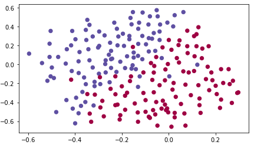
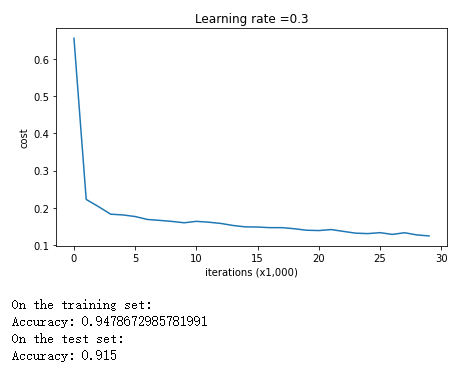
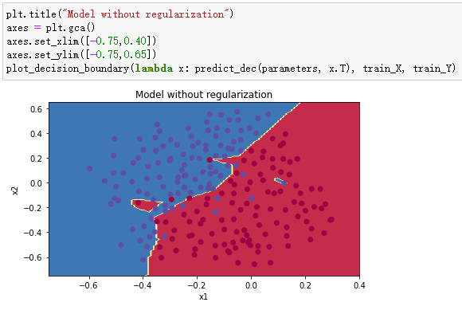
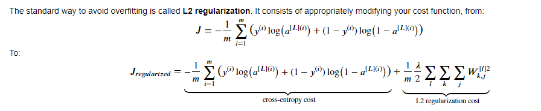
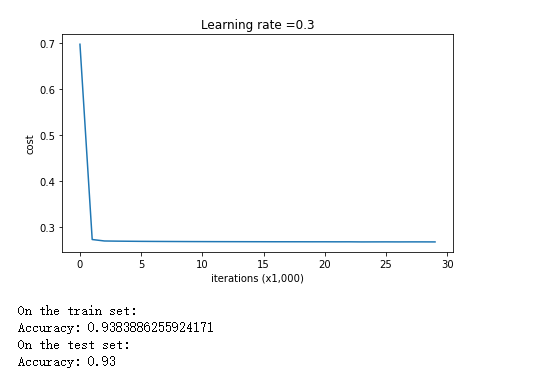
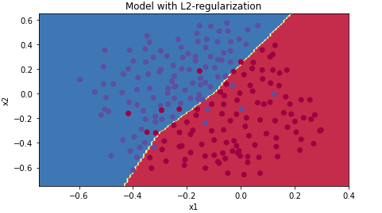
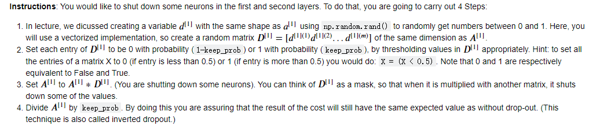
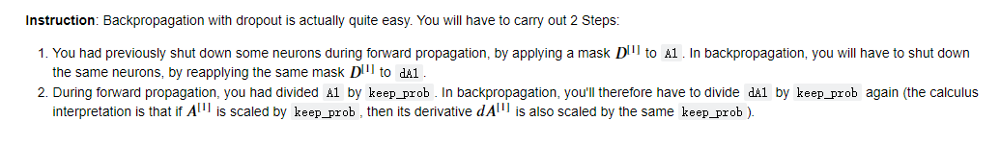
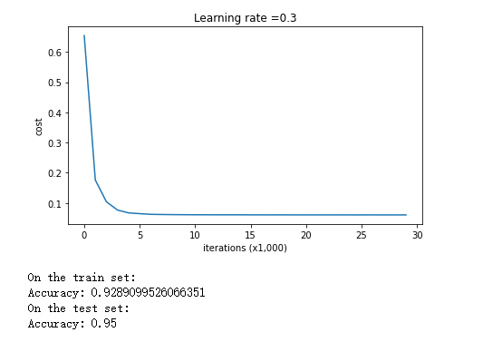
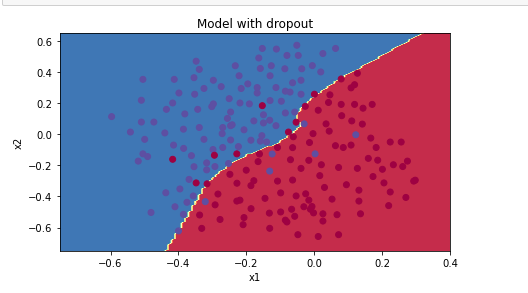

# 初始化
## random initialization
使用`W_l = np.random.randn(layers_dim[l],layers_dim[l-1]) * const_number`来完成初始化

## HE初始化
一般搭配RELU使用可以达到比较好的效果，在L层的weights权重矩阵初始化时，乘以上一层的层数相关参数
`W_l = np.random.randn(layers_dim[l],layers_dim[l-1]) * np.sqrt(2/layers_dim[l-1])`  
即乘以$\sqrt{\frac{2}{layers\_dim[l-1]}}$

# 正则化

## 不使用正则化时
在这种情况下有时会出现过拟合，如图所示  
  
上图是数据分布，使用神经网络拟合后得到如下数据：
  
他在训练集上的表现很好，但是在测试集上的表现不尽人意，出现了过拟合现象：  


## L-2范式正则化

Cost函数:


正则化方法：  
```Python
sum = 0
for l in range(1,layers):
    sum = sum + np.sum(np.square(W+str(l))
L2_regularization_cost = (1 / m) * (lambd / 2) * sum
```
同时在反向传播中加入修正项：  
$\frac{d}{dW}(\frac{\lambda}{2m}W^2) = \frac{\lambda}{m}W$
```Python
    dZ3 = A3 - Y
    
    ### START CODE HERE ### (approx. 1 line)
    dW3 = 1./m * np.dot(dZ3, A2.T) + lambd/m * W3
    ### END CODE HERE ###
    db3 = 1./m * np.sum(dZ3, axis=1, keepdims = True)
    
    dA2 = np.dot(W3.T, dZ3)
    dZ2 = np.multiply(dA2, np.int64(A2 > 0))
    ### START CODE HERE ### (approx. 1 line)
    dW2 = 1./m * np.dot(dZ2, A1.T) + lambd/m * W2
    ### END CODE HERE ###
    db2 = 1./m * np.sum(dZ2, axis=1, keepdims = True)
    
    dA1 = np.dot(W2.T, dZ2)
    dZ1 = np.multiply(dA1, np.int64(A1 > 0))
    ### START CODE HERE ### (approx. 1 line)
    dW1 = 1./m * np.dot(dZ1, X.T) + lambd/m * W1
    ### END CODE HERE ###
    db1 = 1./m * np.sum(dZ1, axis=1, keepdims = True)
```

正则化后得到：  



L2 regularization makes your decision boundary smoother. If  𝜆  is too large, it is also possible to "oversmooth", resulting in a model with high bias.

即：$\lambda$太小，相当于没有进行正则化，可能会过拟合。当$\lambda$太大时，正则化修正过猛，可能会欠拟合。

# Dropout

***key:***
np.random.rand() 输出在[0,1)区间的随机数
np.random.randn() 输出在正态分布内的随机数

Dropout一般用在学习参数$n_x$维度比较大，而数据量不足时(比如cv中)

## 前向传播
步骤：  
  

```Python
def forward_propagation_with_dropout(X, parameters, keep_prob = 0.5):
    
    np.random.seed(1)
    
    W1 = parameters["W1"]
    b1 = parameters["b1"]
    W2 = parameters["W2"]
    b2 = parameters["b2"]
    W3 = parameters["W3"]
    b3 = parameters["b3"]
    
    # LINEAR -> RELU -> LINEAR -> RELU -> LINEAR -> SIGMOID
    Z1 = np.dot(W1, X) + b1
    A1 = relu(Z1)
    D1 = np.random.rand(A1.shape[0],A1.shape[1])
    D1 = D1 < keep_prob # 将小于阈值的置1，达到了该矩阵元素1-keep_pron的概率为0                                       
    A1 = A1 * D1                                  
    A1 = A1 / keep_prob # 保证期望值不变   

    Z2 = np.dot(W2, A1) + b2
    A2 = relu(Z2)
    D2 = np.random.rand(A2.shape[0],A2.shape[1])                                        
    D2 = D2 < keep_prob                                     
    A2 = A2 * D2                                        
    A2 = A2 / keep_prob                                
    Z3 = np.dot(W3, A2) + b3
    A3 = sigmoid(Z3)
    
    cache = (Z1, D1, A1, W1, b1, Z2, D2, A2, W2, b2, Z3, A3, W3, b3)
    
    return A3, cache
```

## 后向传播
步骤：  
  

```Python
def backward_propagation_with_dropout(X, Y, cache, keep_prob):
    
    m = X.shape[1]
    (Z1, D1, A1, W1, b1, Z2, D2, A2, W2, b2, Z3, A3, W3, b3) = cache
    
    dZ3 = A3 - Y
    dW3 = 1./m * np.dot(dZ3, A2.T)
    db3 = 1./m * np.sum(dZ3, axis=1, keepdims = True)
    dA2 = np.dot(W3.T, dZ3)
    ### START CODE HERE ### (≈ 2 lines of code)
    dA2 = dA2 * D2              # Step 1: Apply mask D2 to shut down the same neurons as during the forward propagation
    dA2 = dA2 / keep_prob              # Step 2: Scale the value of neurons that haven't been shut down
    ### END CODE HERE ###
    dZ2 = np.multiply(dA2, np.int64(A2 > 0))
    dW2 = 1./m * np.dot(dZ2, A1.T)
    db2 = 1./m * np.sum(dZ2, axis=1, keepdims = True)
    
    dA1 = np.dot(W2.T, dZ2)
    ### START CODE HERE ### (≈ 2 lines of code)
    dA1 = dA1 * D1              # Step 1: Apply mask D1 to shut down the same neurons as during the forward propagation
    dA1 = dA1 / keep_prob              # Step 2: Scale the value of neurons that haven't been shut down
    ### END CODE HERE ###
    dZ1 = np.multiply(dA1, np.int64(A1 > 0))
    dW1 = 1./m * np.dot(dZ1, X.T)
    db1 = 1./m * np.sum(dZ1, axis=1, keepdims = True)
    
    gradients = {"dZ3": dZ3, "dW3": dW3, "db3": db3,"dA2": dA2,
                 "dZ2": dZ2, "dW2": dW2, "db2": db2, "dA1": dA1, 
                 "dZ1": dZ1, "dW1": dW1, "db1": db1}
    
    return gradients
```

## 效果
  
  
