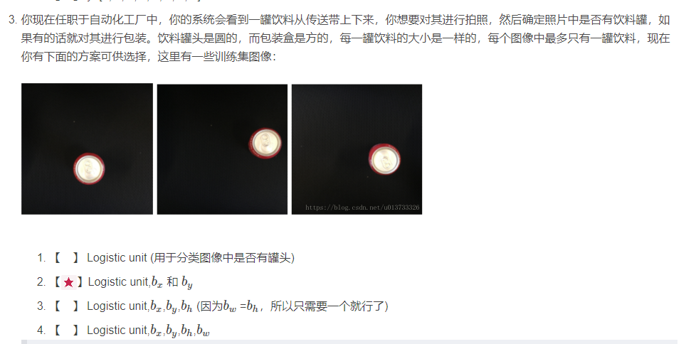
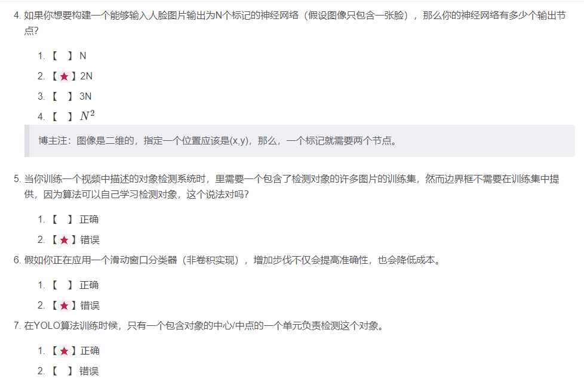
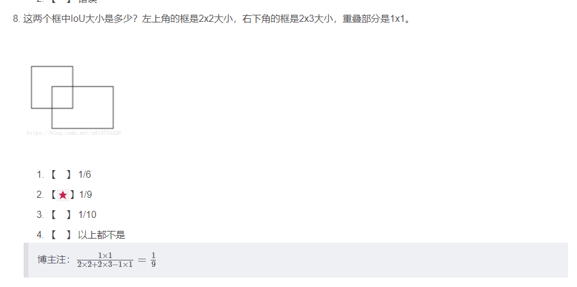
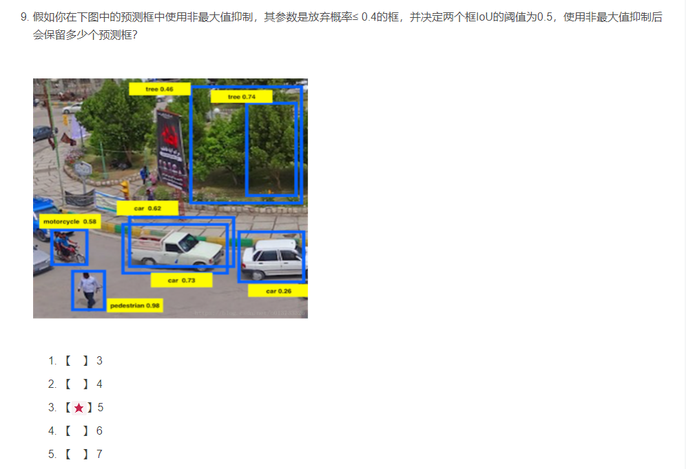
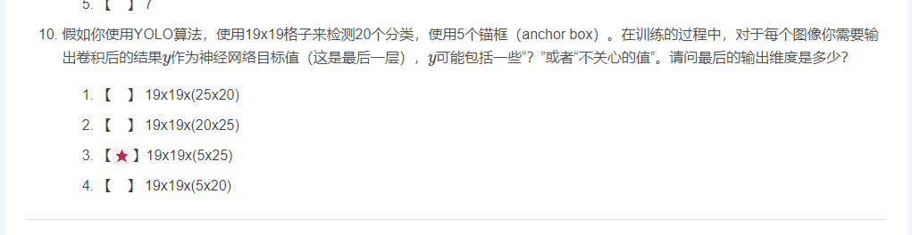

***3***

因为每个罐头的大小都是确定的，所以其实并不需要大小的参数

***4~7***

***8***

***9***

1. 左上角的两个Iou比明显小于0.5，所以都保留。
2. 右下角的车概率为0.26小于0.5，所以舍弃。
3. 中间那个车的Iou比大于0.5，所以将其两个框中概率最小的那个舍弃。

***10***

注意到有5个anchor box，图大小是19*19，所以为19×19×5.而每个anchor box中，$class(20) + n_x + n_y + n_h + n_w + p_c$,所以为 $19 × 19 × 5 ×(20 + 5)$