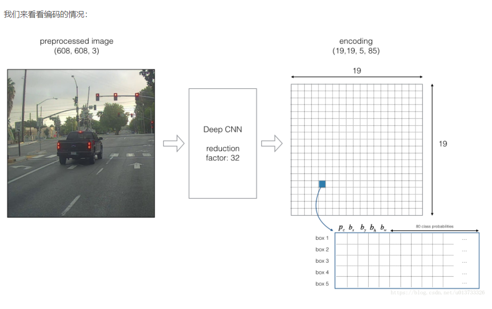

# Yolo

## Model details 

### 输入输出维度

***输入***的图像维度是(m,608,608,3)。
***输出***是一个识别分类与边界框（ bounding boxes）的列表。每个边框界由下组成：$(p_c,b_x,b_y,b_h,b_w,c)$，其中c是我们将要识别的object的个数，本练习中c=80.

那么我们将使用5个anchor boxes， 所以输出将是$(m,19,19,5,85)$



如果对象的中心/中点在单元格内，那么该单元格就负责识别该对象

由于我们使用的是5个锚定框，因此19x19单元中的每个单元都编码有关5个框的信息。锚框仅由其宽度和高度定义$(p_c,b_x,b_y,b_h,b_w)$。 为简单起见，我们将扁平化形状编码的最后两个最后维度$(m,19,19,5,85)$。因此，深CNN的输出为$(m,19,19,425)$。


### Class Score
对于每个单元格的每个锚框而言，我们将计算下列元素的乘积，并提取该框包含某一类的概率。通过寻找到最大概率的元素，我们来为其找到指定的类型。


### 可视化预测

这里有张YOLO预测图的可视化预测：

对于每个19x19的单元格，找寻最大的可能性值，在5个锚框和不同的类之间取最大值

根据单元格预测的最可能的对象来使用添加颜色的方式来标记单元格。


另一种可视化YOLO输出的方法是绘制它输出的边界框，这样做会导致可视化是这样的：


在上图中们只绘制了模型所猜测的高概率的锚框，但锚框依旧是太多了。我们希望将算法的输出过滤为检测到的对象数量更少，要做到这一点，我们将使用***非最大抑制(Non-max Suppression)***。具体来说，我们将执行以下步骤：

1. 舍弃掉低概率的锚框（意思是格子算出来的概率比较低我们就不要）
2. 当几个锚框相互重叠并检测同一个物体时，只选择一个锚框。

## Filtering with a threshold on class scores

现在我们要为阈值进行过滤，我们要去掉一些预测值低于预设值的锚框。模型共计会有19*19*5*85个数字，每一个anchor box 由85个数字组成。将维度为（19,19,5,85）或者（19,19,425）转换为下面的维度将会有利于我们的下一步操作：

**box_confidence** ：tensor类型，维度为（19x19,5,1），包含19x19单元格中每个单元格预测的5个锚框中的所有的锚框的一些对象的置信概率）

***boxes*** ：tensor类型，维度为(19x19,5,4)，包含了所有的锚框的$(p_x,p_y,p_h,p_w)$

***box_class_probs*** ： tensor类型，维度为(19x19,5,80)，包含了所有单元格中所有锚框的所有对象$(c_1,c_2,c_3,...,c_80)$检测的概率。


```Python
# GRADED FUNCTION: yolo_filter_boxes

def yolo_filter_boxes(box_confidence, boxes, box_class_probs, threshold = .6):
    """Filters YOLO boxes by thresholding on object and class confidence.
    
    Arguments:
    box_confidence -- tensor of shape (19, 19, 5, 1)
    boxes -- tensor of shape (19, 19, 5, 4)
    box_class_probs -- tensor of shape (19, 19, 5, 80)
    threshold -- real value, if [ highest class probability score < threshold], then get rid of the corresponding box
    
    Returns:
    scores -- tensor of shape (None,), containing the class probability score for selected boxes
    boxes -- tensor of shape (None, 4), containing (b_x, b_y, b_h, b_w) coordinates of selected boxes
    classes -- tensor of shape (None,), containing the index of the class detected by the selected boxes
    
    Note: "None" is here because you don't know the exact number of selected boxes, as it depends on the threshold. 
    For example, the actual output size of scores would be (10,) if there are 10 boxes.
    """
    
    # Step 1: Compute box scores 
    ### START CODE HERE ### (≈ 1 line)
    box_scores = box_confidence * box_class_probs
    ### END CODE HERE ###
    
    # Step 2: Find the box_classes using the max box_scores, keep track of the corresponding score
    ### START CODE HERE ### (≈ 2 lines)
    box_classes = K.argmax(box_scores,axis=3) # 或者是axis = -1 ，表示最后一个维度
    box_class_scores = K.max(box_scores,axis=3)
    ### END CODE HERE ###
    
    # Step 3: Create a filtering mask based on "box_class_scores" by using "threshold". The mask should have the
    # same dimension as box_class_scores, and be True for the boxes you want to keep (with probability >= threshold)
    ### START CODE HERE ### (≈ 1 line)
    filtering_mask = (box_class_scores >= threshold)
    ### END CODE HERE ###
    
    # Step 4: Apply the mask to box_class_scores, boxes and box_classes
    ### START CODE HERE ### (≈ 3 lines)
    scores = tf.boolean_mask(box_class_scores,filtering_mask)
    boxes = tf.boolean_mask(boxes,filtering_mask)
    classes = tf.boolean_mask(box_classes,filtering_mask)
    ### END CODE HERE ###
    
    return scores, boxes, classes
```

## Non-max Suppression

即使是我们通过阈值来过滤了一些得分较低的分类，但是我们依旧会有很多的锚框被留了下来，第二个过滤器就是让下图左边变为右边，我们叫它非最大值抑制（ non-maximum suppression (NMS)）


```Python
def iou(box1, box2):
    """Implement the intersection over union (IoU) between box1 and box2
    
    Arguments:
    box1 -- first box, list object with coordinates (box1_x1, box1_y1, box1_x2, box_1_y2)
    box2 -- second box, list object with coordinates (box2_x1, box2_y1, box2_x2, box2_y2)
    """

    # Assign variable names to coordinates for clarity
    (box1_x1, box1_y1, box1_x2, box1_y2) = box1
    (box2_x1, box2_y1, box2_x2, box2_y2) = box2
    
    # Calculate the (yi1, xi1, yi2, xi2) coordinates of the intersection of box1 and box2. Calculate its Area.
    ### START CODE HERE ### (≈ 7 lines)
    xi1 = np.maximum(box1[0],box2[0])
    yi1 = np.maximum(box1[1],box2[1])
    xi2 = np.minimum(box1[2],box2[2])
    yi2 = np.minimum(box1[3],box2[3])
    inter_width = max(xi2 - xi1,0)
    inter_height = max(yi2 - yi1,0)
    inter_area = inter_height *inter_width
    ### END CODE HERE ###    

    # Calculate the Union area by using Formula: Union(A,B) = A + B - Inter(A,B)
    ### START CODE HERE ### (≈ 3 lines)
    box1_area = (box1[2]-box1[0])*(box1[3]-box1[1])
    box2_area = (box2[2]-box2[0])*(box2[3]-box2[1])
    union_area = box1_area + box2_area - inter_area
    ### END CODE HERE ###
    
    # compute the IoU
    ### START CODE HERE ### (≈ 1 line)
    iou = inter_area / union_area
    ### END CODE HERE ###
    
    return iou
```

现在我们要实现非最大值抑制函数，关键步骤如下：

选择分值高的锚框
计算与其他框的重叠部分，并删除与iou_threshold相比重叠的框。
返回第一步，直到不再有比当前选中的框得分更低的框。
这将删除与选定框有较大重叠的其他所有锚框，只有得分最高的锚框仍然存在。

  我们要实现的函数名为yolo_non_max_suppression()，使用TensorFlow实现，TensorFlow有两个内置函数用于实现非最大抑制（所以你实际上不需要使用你的iou()实现）：

```Python
def yolo_non_max_suppression(scores, boxes, classes, max_boxes=10, iou_threshold=0.5):
    """
    为锚框实现非最大值抑制（ Non-max suppression (NMS)）
    
    参数：
        scores - tensor类型，维度为(None,)，yolo_filter_boxes()的输出
        boxes - tensor类型，维度为(None,4)，yolo_filter_boxes()的输出，已缩放到图像大小（见下文）
        classes - tensor类型，维度为(None,)，yolo_filter_boxes()的输出
        max_boxes - 整数，预测的锚框数量的最大值
        iou_threshold - 实数，交并比阈值。
        
    返回：
        scores - tensor类型，维度为(,None)，每个锚框的预测的可能值
        boxes - tensor类型，维度为(4,None)，预测的锚框的坐标
        classes - tensor类型，维度为(,None)，每个锚框的预测的分类
        
    注意："None"是明显小于max_boxes的，这个函数也会改变scores、boxes、classes的维度，这会为下一步操作提供方便。
    
    """
    max_boxes_tensor = K.variable(max_boxes,dtype="int32") #用于tf.image.non_max_suppression()
    K.get_session().run(tf.variables_initializer([max_boxes_tensor])) #初始化变量max_boxes_tensor
    
    #使用使用tf.image.non_max_suppression()来获取与我们保留的框相对应的索引列表
    nms_indices = tf.image.non_max_suppression(boxes, scores,max_boxes,iou_threshold)
    
    #使用K.gather()来选择保留的锚框
    scores = K.gather(scores, nms_indices)
    boxes = K.gather(boxes, nms_indices)
    classes = K.gather(classes, nms_indices)
    
    return scores, boxes, classes
```

### 对所有的框进行过滤

现在我们要实现一个CNN（19x19x5x85）输出的函数，并使用刚刚实现的函数对所有框进行过滤。

  我们要实现的函数名为yolo_eval()，它采用YOLO编码的输出，并使用分数阈值和NMS来过滤这些框。你必须知道最后一个实现的细节。有几种表示锚框的方式，例如通过它们的角或通过它们的中点和高度/宽度。YOLO使用以下功能（我们提供）在不同时间在几种这样的格式之间进行转换：
boxes = yolo_boxes_to_corners(box_xy, box_wh)
它将yolo锚框坐标（x，y，w，h）转换为角的坐标（x1，y1，x2，y2）以适应yolo_filter_boxes()的输入。
boxes = yolo_utils.scale_boxes(boxes, image_shape)
  YOLO的网络经过训练可以在608x608图像上运行。如果你要在不同大小的图像上测试此数据（例如，汽车检测数据集具有720x1280图像），则此步骤会重新缩放这些框，以便在原始的720x1280图像上绘制它们。

```Python
def yolo_eval(yolo_outputs, image_shape=(720.,1280.), 
              max_boxes=10, score_threshold=0.6,iou_threshold=0.5):
    """
    将YOLO编码的输出（很多锚框）转换为预测框以及它们的分数，框坐标和类。
    
    参数：
        yolo_outputs - 编码模型的输出（对于维度为（608,608,3）的图片），包含4个tensors类型的变量：
                        box_confidence ： tensor类型，维度为(None, 19, 19, 5, 1)
                        box_xy         ： tensor类型，维度为(None, 19, 19, 5, 2)
                        box_wh         ： tensor类型，维度为(None, 19, 19, 5, 2)
                        box_class_probs： tensor类型，维度为(None, 19, 19, 5, 80)
        image_shape - tensor类型，维度为（2,），包含了输入的图像的维度，这里是(608.,608.)
        max_boxes - 整数，预测的锚框数量的最大值
        score_threshold - 实数，可能性阈值。
        iou_threshold - 实数，交并比阈值。
        
    返回：
        scores - tensor类型，维度为(,None)，每个锚框的预测的可能值
        boxes - tensor类型，维度为(4,None)，预测的锚框的坐标
        classes - tensor类型，维度为(,None)，每个锚框的预测的分类
    """
    
    #获取YOLO模型的输出
    box_confidence, box_xy, box_wh, box_class_probs = yolo_outputs
    
    #中心点转换为边角
    boxes = yolo_boxes_to_corners(box_xy,box_wh)
    
    #可信度分值过滤
    scores, boxes, classes = yolo_filter_boxes(box_confidence, boxes, box_class_probs, score_threshold)
    
    #缩放锚框，以适应原始图像
    boxes = yolo_utils.scale_boxes(boxes, image_shape)
    
    #使用非最大值抑制
    scores, boxes, classes = yolo_non_max_suppression(scores, boxes, classes, max_boxes, iou_threshold)
    
    return scores, boxes, classes
```

### Summary
