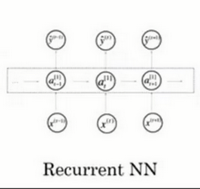

# 什么是神经网络

# 用神经网络进行监督学习(Supervised Learning)

也许对于房地产和在线广告来说可能是相对的标准一些的神经网络，正如我们之前见到的。对于图像应用，我们经常在神经网络上使用卷积（**Convolutional Neural Network**），通常缩写为**CNN**。对于序列数据，例如音频，有一个时间组件，随着时间的推移，音频被播放出来，所以音频是最自然的表现。作为一维时间序列（两种英文说法**one-dimensional time series / temporal sequence**）.对于序列数据，经常使用**RNN**，一种递归神经网络（**Recurrent Neural Network**），语言，英语和汉语字母表或单词都是逐个出现的，所以语言也是最自然的序列数据，因此更复杂的**RNNs**版本经常用于这些应用。

对于更复杂的应用比如自动驾驶，你有一张图片，可能会显示更多的**CNN**卷积神经网络结构，其中的雷达信息是完全不同的，你可能会有一个更定制的，或者一些更复杂的混合的神经网络结构。所以为了更具体地说明什么是标准的**CNN**和**RNN**结构，在文献中你可能见过这样的图片，这是一个标准的神经网络。

你也可能见过这样的图片，这是一个卷积神经网络的例子。

我们会在后面的课程了解这幅图的原理和实现，卷积网络(**CNN**)通常用于图像数据。

你可能也会看到这样的图片，而且你将在以后的课程中学习如何实现它。

递归神经网络(**RNN**)非常适合这种一维序列，数据可能是一个时间组成部分。

***结构化数据***意味着数据的基本数据库。例如在房价预测中，你可能有一个数据库，有专门的几列数据告诉你卧室的大小和数量，这就是结构化数据。或预测用户是否会点击广告，你可能会得到关于用户的信息，比如年龄以及关于广告的一些信息，然后对你的预测分类标注，这就是结构化数据，意思是每个特征，比如说房屋大小卧室数量，或者是一个用户的年龄，都有一个很好的定义。

相反***非结构化数据***是指比如音频，原始音频或者你想要识别的图像或文本中的内容。这里的特征可能是图像中的像素值或文本中的单个单词。

