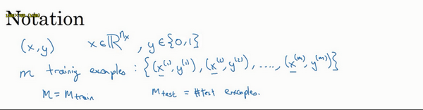
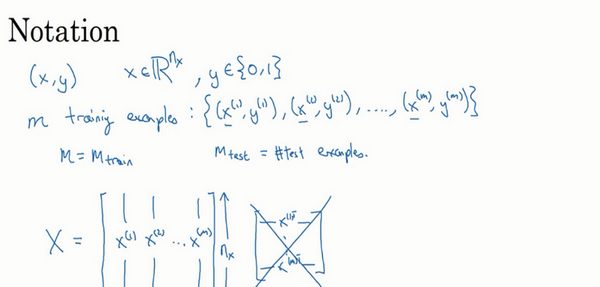
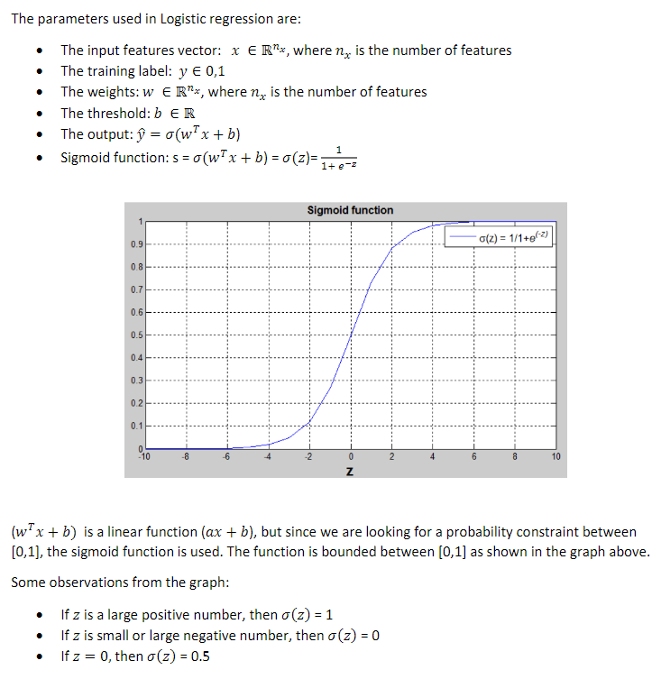
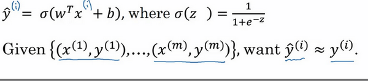
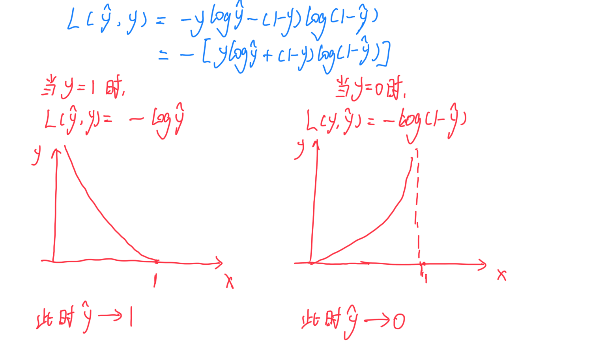
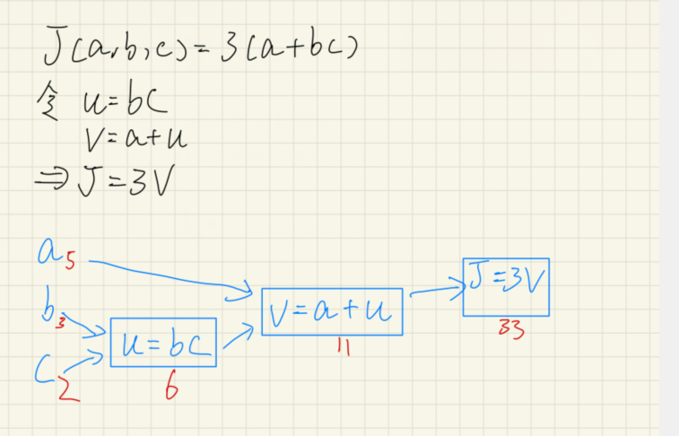
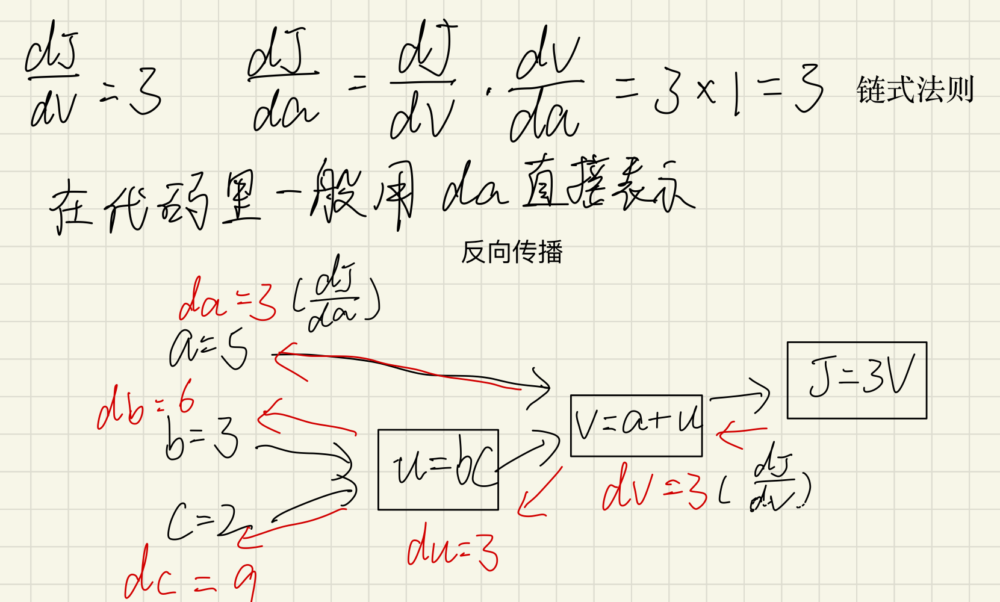
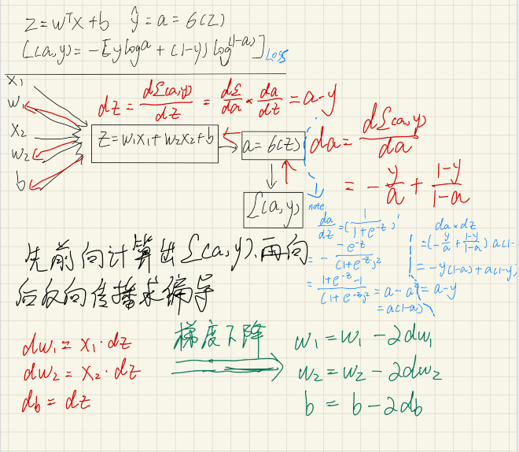

# 二分分类
**符号定义** ：

$x$：表示一个$n_x$维数据，为输入数据，向量维度为$(n_x,1)$； 

$y​$：表示输出结果，取值为$(0,1)​$；

$(x^{(i)},y^{(i)})$：表示第$i$组数据，可能是训练数据，也可能是测试数据，此处默认为训练数据； 

$X=[x^{(1)},x^{(2)},...,x^{(m)}]$：表示所有的训练数据集的输入值，放在一个 $n_x×m$的矩阵中，其中$m$表示样本数目; 

$Y=[y^{(1)},y^{(2)},...,y^{(m)}]$：对应表示所有训练数据集的输出值，维度为$1×m$。

用一对$(x,y)$来表示一个单独的样本，$x$代表$n_x$维的特征向量，$y$ 表示标签(输出结果)只能为0或1。
而训练集将由$m$个训练样本组成，其中$(x^{(1)},y^{(1)})$表示第一个样本的输入和输出，$(x^{(2)},y^{(2)})$表示第二个样本的输入和输出，直到最后一个样本$(x^{(m)},y^{(m)})$，然后所有的这些一起表示整个训练集。有时候为了强调这是训练样本的个数，会写作$M_{train}$，当涉及到测试集的时候，我们会使用$M_{test}$来表示测试集的样本数，所以这是测试集的样本数：



最后为了能把训练集表示得更紧凑一点，我们会定义一个矩阵用大写$X$的表示，它由输入向量$x^{(1)}$、$x^{(2)}$等组成，如下图放在矩阵的列中，所以现在我们把$x^{(1)}$作为第一列放在矩阵中，$x^{(2)}$作为第二列，$x^{(m)}$放到第$m$列，然后我们就得到了训练集矩阵$X$。所以这个矩阵有$m$列，$m$是训练集的样本数量，然后这个矩阵的高度记为$n_x$，注意有时候可能因为其他某些原因，矩阵$X$会由训练样本按照行堆叠起来而不是列，如下图所示：$x^{(1)}$的转置直到$x^{(m)}$的转置，但是在实现神经网络的时候，使用左边的这种形式，会让整个实现的过程变得更加简单：



现在来简单温习一下:$X$是一个规模为$n_x$乘以$m$的矩阵，当你用**Python**实现的时候，你会看到`X.shape`，这是一条**Python**命令，用于显示矩阵的规模，即`X.shape`等于$(n_x,m)$，$X$是一个规模为$n_x$乘以$m$的矩阵。所以综上所述，这就是如何将训练样本（输入向量$X$的集合）表示为一个矩阵。

那么输出标签$y$呢？同样的道理，为了能更加容易地实现一个神经网络，将标签$y$放在列中将会使得后续计算非常方便，所以我们定义大写的$Y$等于${{y}^{\left( 1 \right)}},{{y}^{\left( m \right)}},...,{{y}^{\left( m \right)}}$，所以在这里是一个规模为1乘以$m$的矩阵，同样地使用**Python**将表示为`Y.shape`等于$(1,m)$，表示这是一个规模为1乘以$m$的矩阵。


# LogisticsRegression


## Cost Function

**为什么需要代价函数：**

为了训练逻辑回归模型的参数参数$w$和参数$b$我们，需要一个代价函数，通过训练代价函数来得到参数$w$和参数$b$。先看一下逻辑回归的输出函数：



为了让模型通过学习调整参数，你需要给予一个$m$样本的训练集，这会让你在训练集上找到参数$w$和参数$b$,，来得到你的输出。

对训练集的预测值，我们将它写成$\hat{y}$，我们更希望它会接近于训练集中的$y$值，为了对上面的公式更详细的介绍，我们需要说明上面的定义是对一个训练样本来说的，这种形式也使用于每个训练样本，我们使用这些带有圆括号的上标来区分索引和样本，训练样本$i$所对应的预测值是${{y}^{(i)}}$,是用训练样本的${{w}^{T}}{{x}^{(i)}}+b$然后通过**sigmoid**函数来得到，也可以把$z$定义为${{z}^{(i)}}={{w}^{T}}{{x}^{(i)}}+b$,我们将使用这个符号$(i)$注解，上标$(i)$来指明数据表示$x$或者$y$或者$z$或者其他数据的第$i$个训练样本，这就是上标$(i)$的含义。

***损失函数(Loss/Error Function)：***

损失函数又叫做误差函数，用来衡量算法的运行情况，**Loss function:$L\left( \hat{y},y \right)$.**

我们通过这个$L$称为的损失函数，来衡量预测输出值和实际值有多接近。一般我们用预测值和实际值的平方差或者它们平方差的一半，但是通常在逻辑回归中我们不这么做，因为当我们在学习逻辑回归参数的时候，会发现我们的优化目标不是凸优化，只能找到多个局部最优值，梯度下降法很可能找不到全局最优值，虽然平方差是一个不错的损失函数，但是我们在逻辑回归模型中会定义另外一个损失函数。

我们在逻辑回归中用到的损失函数是：
$$L\left( \hat{y},y \right)=-y\log(\hat{y})-(1-y)\log (1-\hat{y})$$

为什么要用这个函数作为逻辑损失函数？当我们使用平方误差作为损失函数的时候，你会想要让这个误差尽可能地小，对于这个逻辑回归损失函数，我们也想让它尽可能地小，为了更好地理解这个损失函数怎么起作用，我们举两个例子：



当$y=1$时损失函数$L=-\log (\hat{y})$，如果想要损失函数$L$尽可能得小，那么$\hat{y}$就要尽可能大，因为**sigmoid**函数取值$[0,1]$，所以$\hat{y}$会无限接近于1。

当$y=0$时损失函数$L=-\log (1-\hat{y})$，如果想要损失函数$L$尽可能得小，那么$\hat{y}$就要尽可能小，因为**sigmoid**函数取值$[0,1]$，所以$\hat{y}$会无限接近于0。

**在这门课中有很多的函数效果和现在这个类似，就是如果$y$等于1，我们就尽可能让$\hat{y}$变大，如果$y$等于0，我们就尽可能让 $\hat{y}$ 变小。**
损失函数是在单个训练样本中定义的，它衡量的是算法在单个训练样本中表现如何，为了衡量算法在全部训练样本上的表现如何，我们需要定义一个算法的代价函数，算法的代价函数是对$m$个样本的损失函数求和然后除以$m$:
$$J\left( w,b \right)=\frac{1}{m}\sum\limits_{i=1}^{m}{L\left( {{{\hat{y}}}^{(i)}},{{y}^{(i)}} \right)}=\frac{1}{m}\sum\limits_{i=1}^{m}{\left( -{{y}^{(i)}}\log {{{\hat{y}}}^{(i)}}-(1-{{y}^{(i)}})\log (1-{{{\hat{y}}}^{(i)}}) \right)}$$
***损失函数只适用于像这样的单个训练样本，而代价函数是参数的总代价***，所以在训练逻辑回归模型时候，我们需要找到合适的$w$和$b$，来让代价函数 $J$ 的总代价降到最低。
根据我们对逻辑回归算法的推导及对单个样本的损失函数的推导和针对算法所选用参数的总代价函数的推导，结果表明逻辑回归可以看做是一个非常小的神经网络.

# 梯度下降(GradientDescent)

# 导数(Derivative)

# 计算图(Computation Graph)


# 使用计算图计算导数


# 逻辑回归中的梯度下降

假设样本只有两个特征${{x}_{1}}$和${{x}_{2}}$，为了计算$z$，我们需要输入参数${{w}_{1}}$、${{w}_{2}}$ 和$b$，除此之外还有特征值${{x}_{1}}$和${{x}_{2}}$。因此$z$的计算公式为：
$z={{w}_{1}}{{x}_{1}}+{{w}_{2}}{{x}_{2}}+b$ 
回想一下逻辑回归的公式定义如下：
$\hat{y}=a=\sigma (z)$,  
其中$z={{w}^{T}}x+b$   
$\sigma \left( z \right)=\frac{1}{1+{{e}^{-z}}}$  
损失函数：
$$L( {{{\hat{y}}}^{(i)}},{{y}^{(i)}})=-{{y}^{(i)}}\log {{\hat{y}}^{(i)}}-(1-{{y}^{(i)}})\log (1-{{\hat{y}}^{(i)}})$$
代价函数：
$$J\left( w,b \right)=\frac{1}{m}\sum\nolimits_{i}^{m}{L( {{{\hat{y}}}^{(i)}},{{y}^{(i)}})}$$ 
假设现在只考虑单个样本的情况，单个样本的代价函数定义如下：
$L(a,y)=-(y\log (a)+(1-y)\log (1-a))$ 
其中$a$是逻辑回归的输出，$y$是样本的标签值。现在让我们画出表示这个计算的计算图。
这里先复习下梯度下降法，$w$和$b$的修正量可以表达如下：

$w:=w-a \frac{\partial J(w,b)}{\partial w}$，$b:=b-a\frac{\partial J(w,b)}{\partial b}$



特别地，可以用:
$d{{w}_{1}}=\frac{1}{m}\sum\limits_{i}^{m}{x_{1}^{(i)}}({{a}^{(i)}}-{{y}^{(i)}})$ 
$d{{w}_{2}}=\frac{1}{m}\sum\limits_{i}^{m}{x_{2}^{(i)}}({{a}^{(i)}}-{{y}^{(i)}})$ 
$db=\frac{1}{m}\sum\limits_{i}^{m}{({{a}^{(i)}}-{{y}^{(i)}})}$ 
视频中，
$d{{w}_{1}}$ 表示$\frac{\partial L}{\partial {{w}_{1}}}={{x}_{1}}\cdot dz$， 
$d{{w}_{\text{2}}}$ 表示$\frac{\partial L}{\partial {{w}_{2}}}={{x}_{2}}\cdot dz$，
$db=dz$。
因此，关于单个样本的梯度下降算法，你所需要做的就是如下的事情：
使用公式$dz=(a-y)$计算$dz$，
使用$d{{w}_{1}}={{x}_{1}}\cdot dz$ 计算$d{{w}_{1}}$， $d{{w}_{2}}={{x}_{2}}\cdot dz$计算$d{{w}_{2}}$，
$db=dz$ 来计算$db$，
然后:
更新${{w}_{1}}={{w}_{1}}-a d{{w}_{1}}$，
更新${{w}_{2}}={{w}_{2}}-a d{{w}_{2}}$，
更新$b=b-\alpha db$。
这就是关于单个样本实例的梯度下降算法中参数更新一次的步骤。

# m个样本的梯度下降
![02-10-Gradient [00_02_18][20170816-103833-9]](../images/bf930b1f68d8e0726dda5393afc83672.png)

首先，让我们时刻记住有关于损失函数$J(w,b)$的定义。

$J(w,b)=\frac{1}{m}\sum\limits_{i=1}^{m}{L({{a}^{(i)}},{{y}^{(i)}})}$ 

当你的算法输出关于样本$y$的${{a}^{(i)}}$，${{a}^{(i)}}$是训练样本的预测值，即：$\sigma ( {{z}^{(i)}})=\sigma( {{w}^{T}}{{x}^{\left( i \right)}}+b)$。 
所以我们在前面的幻灯中展示的是对于任意单个训练样本，如何计算微分当你只有一个训练样本。因此$d{{w}_{1}}$，$d{{w}_{\text{2}}}$和$db$ 添上上标$i$表示你求得的相应的值。如果你面对的是我们在之前的幻灯中演示的那种情况，但只使用了一个训练样本$({{x}^{(i)}},{{y}^{(i)}})$。 
现在你知道带有求和的全局代价函数，实际上是1到$m$项各个损失的平均。 所以它表明全局代价函数对${{w}_{1}}$的微分，对${{w}_{1}}$的微分也同样是各项损失对${{w}_{1}}$微分的平均。


但之前我们已经演示了如何计算这项，即之前幻灯中演示的如何对单个训练样本进行计算。所以你真正需要做的是计算这些微分，如我们在之前的训练样本上做的。并且求平均，这会给你全局梯度值，你能够把它直接应用到梯度下降算法中。

所以这里有很多细节，但让我们把这些装进一个具体的算法。同时你需要一起应用的就是逻辑回归和梯度下降。

我们初始化$J=0,d{{w}_{1}}=0,d{{w}_{2}}=0,db=0$

代码流程：

```
J=0;dw1=0;dw2=0;db=0;
for i = 1 to m
    z(i) = wx(i)+b;
    a(i) = sigmoid(z(i));
    J += -[y(i)log(a(i))+(1-y(i)）log(1-a(i));
    dz(i) = a(i)-y(i);
    dw1 += x1(i)dz(i);
    dw2 += x2(i)dz(i);
    db += dz(i);
J/= m;
dw1/= m;
dw2/= m;
db/= m;
w=w-alpha*dw
b=b-alpha*db
```

幻灯片上只应用了一步梯度下降。因此你需要重复以上内容很多次，以应用多次梯度下降。看起来这些细节似乎很复杂，但目前不要担心太多。希望你明白，当你继续尝试并应用这些在编程作业里，所有这些会变的更加清楚。

但这种计算中有两个缺点，也就是说应用此方法在逻辑回归上你需要编写两个**for**循环。第一个**for**循环是一个小循环遍历$m$个训练样本，第二个**for**循环是一个遍历所有特征的**for**循环。这个例子中我们只有2个特征，所以$n$等于2并且${{n}_{x}}$ 等于2。 但如果你有更多特征，你开始编写你的因此$d{{w}_{1}}$，$d{{w}_{2}}$，你有相似的计算从$d{{w}_{3}}$一直下去到$d{{w}_{n}}$。所以看来你需要一个**for**循环遍历所有$n$个特征。

当你应用深度学习算法，你会发现在代码中显式地使用**for**循环使你的算法很低效，同时在深度学习领域会有越来越大的数据集。所以能够应用你的算法且没有显式的**for**循环会是重要的，并且会帮助你适用于更大的数据集。所以这里有一些叫做向量化技术,它可以允许你的代码摆脱这些显式的**for**循环。

我想在先于深度学习的时代，也就是深度学习兴起之前，向量化是很棒的。可以使你有时候加速你的运算，但有时候也未必能够。但是在深度学习时代向量化，摆脱for循环已经变得相当重要。因为我们越来越多地训练非常大的数据集，因此你真的需要你的代码变得非常高效。所以在接下来的几个视频中，我们会谈到向量化，以及如何应用向量化而连一个**for**循环都不使用。所以学习了这些，我希望你有关于如何应用逻辑回归，或是用于逻辑回归的梯度下降，事情会变得更加清晰。当你进行编程练习，但在真正做编程练习之前让我们先谈谈向量化。然后你可以应用全部这些东西，应用一个梯度下降的迭代而不使用任何**for**循环。