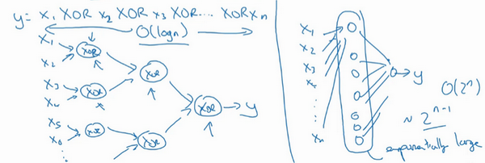

# 深层神经网络

# 深层网络中的前向传播
跟往常一样，我们先来看对其中一个训练样本$x$如何应用前向传播，之后讨论向量化的版本。

第一层需要计算${{z}^{[1]}}={{w}^{[1]}}x+{{b}^{[1]}}$，${{a}^{[1]}}={{g}^{[1]}} {({z}^{[1]})}$（$x$可以看做${{a}^{[0]}}$）

第二层需要计算${{z}^{[2]}}={{w}^{[2]}}{{a}^{[1]}}+{{b}^{[2]}}$，${{a}^{[2]}}={{g}^{[2]}} {({z}^{[2]})}$

以此类推，

第四层为${{z}^{[4]}}={{w}^{[4]}}{{a}^{[3]}}+{{b}^{[4]}}$，${{a}^{[4]}}={{g}^{[4]}} {({z}^{[4]})}$

前向传播可以归纳为多次迭代${{z}^{[l]}}={{w}^{[l]}}{{a}^{[l-1]}}+{{b}^{[l]}}$，${{a}^{[l]}}={{g}^{[l]}} {({z}^{[l]})}$。

向量化实现过程可以写成：

${{Z}^{[l]}}={{W}^{[l]}}{{a}^{[l-1]}}+{{b}^{[l]}}$，${{A}^{[l]}}={{g}^{[l]}}{({Z}^{[l]})}$    (${{A}^{[0]}} = X)$

这里只能用一个显式**for**循环，$l$从1到$L$，然后一层接着一层去计算。下一节讲的是避免代码产生BUG，我所做的其中一件非常重要的工作。

# 核对矩阵的维数
当实现深度神经网络的时候，其中一个我常用的检查代码是否有错的方法就是拿出一张纸过一遍算法中矩阵的维数。

$w$的维度是（下一层的维数，前一层的维数），即${{w}^{[l]}}$: (${{n}^{[l]}}$,${{n}^{[l-1]}}$)；

$b$的维度是（下一层的维数，1），即:

${{b}^{[l]}}$ : (${{n}^{[l]}},1)$；

${{z}^{[l]}}$,${{a}^{[l]}}$: $({{n}^{[l]}},1)$;

${{dw}^{[l]}}$和${{w}^{[l]}}$维度相同，${{db}^{[l]}}$和${{b}^{[l]}}$维度相同，且$w$和$b$向量化维度不变，但$z$,$a$以及$x$的维度会向量化后发生变化。

向量化后：

${Z}^{[l]}$可以看成由每一个单独的${Z}^{[l]}$叠加而得到，${Z}^{[l]}=({{z}^{[l][1]}}，{{z}^{[l][2]}}，{{z}^{[l][3]}}，…，{{z}^{[l][m]}})$，

$m$为训练集大小，所以${Z}^{[l]}$的维度不再是$({{n}^{[l]}},1)$，而是$({{n}^{[l]}},m)$。

${A}^{[l]}$：$({n}^{[l]},m)$，${A}^{[0]} = X =({n}^{[l]},m)$

# 为什么使用深层表示
我们都知道深度神经网络能解决好多问题，其实并不需要很大的神经网络，但是得有深度，得有比较多的隐藏层，这是为什么呢？我们一起来看几个例子来帮助理解，为什么深度神经网络会很好用。

首先，深度网络在计算什么？

首先，深度网络究竟在计算什么？如果你在建一个人脸识别或是人脸检测系统，深度神经网络所做的事就是，当你输入一张脸部的照片，然后你可以把深度神经网络的第一层，当成一个特征探测器或者边缘探测器。在这个例子里，我会建一个大概有20个隐藏单元的深度神经网络，是怎么针对这张图计算的。隐藏单元就是这些图里这些小方块（第一张大图），举个例子，这个小方块（第一行第一列）就是一个隐藏单元，它会去找这张照片里“\|”边缘的方向。那么这个隐藏单元（第四行第四列），可能是在找（“—”）水平向的边缘在哪里。之后的课程里，我们会讲专门做这种识别的卷积神经网络，到时候会细讲，为什么小单元是这么表示的。你可以先把神经网络的第一层当作看图，然后去找这张照片的各个边缘。我们可以把照片里组成边缘的像素们放在一起看，然后它可以把被探测到的边缘组合成面部的不同部分（第二张大图）。比如说，可能有一个神经元会去找眼睛的部分，另外还有别的在找鼻子的部分，然后把这许多的边缘结合在一起，就可以开始检测人脸的不同部分。最后再把这些部分放在一起，比如鼻子眼睛下巴，就可以识别或是探测不同的人脸（第三张大图）。

你可以直觉上把这种神经网络的前几层当作探测简单的函数，比如边缘，之后把它们跟后几层结合在一起，那么总体上就能学习更多复杂的函数。这些图的意义，我们在学习卷积神经网络的时候再深入了解。还有一个技术性的细节需要理解的是，边缘探测器其实相对来说都是针对照片中非常小块的面积。就像这块（第一行第一列），都是很小的区域。面部探测器就会针对于大一些的区域，但是主要的概念是，一般你会从比较小的细节入手，比如边缘，然后再一步步到更大更复杂的区域，比如一只眼睛或是一个鼻子，再把眼睛鼻子装一块组成更复杂的部分。

这种从简单到复杂的金字塔状表示方法或者组成方法，也可以应用在图像或者人脸识别以外的其他数据上。比如当你想要建一个语音识别系统的时候，需要解决的就是如何可视化语音，比如你输入一个音频片段，那么神经网络的第一层可能就会去先开始试着探测比较低层次的音频波形的一些特征，比如音调是变高了还是低了，分辨白噪音，咝咝咝的声音，或者音调，可以选择这些相对程度比较低的波形特征，然后把这些波形组合在一起就能去探测声音的基本单元。在语言学中有个概念叫做音位，比如说单词ca，c的发音，“嗑”就是一个音位，a的发音“啊”是个音位，t的发音“特”也是个音位，有了基本的声音单元以后，组合起来，你就能识别音频当中的单词，单词再组合起来就能识别词组，再到完整的句子。

所以深度神经网络的这许多隐藏层中，较早的前几层能学习一些低层次的简单特征，等到后几层，就能把简单的特征结合起来，去探测更加复杂的东西。比如你录在音频里的单词、词组或是句子，然后就能运行语音识别了。同时我们所计算的之前的几层，也就是相对简单的输入函数，比如图像单元的边缘什么的。到网络中的深层时，你实际上就能做很多复杂的事，比如探测面部或是探测单词、短语或是句子。

有些人喜欢把深度神经网络和人类大脑做类比，这些神经科学家觉得人的大脑也是先探测简单的东西，比如你眼睛看得到的边缘，然后组合起来才能探测复杂的物体，比如脸。这种深度学习和人类大脑的比较，有时候比较危险。但是不可否认的是，我们对大脑运作机制的认识很有价值，有可能大脑就是先从简单的东西，比如边缘着手，再组合成一个完整的复杂物体，这类简单到复杂的过程，同样也是其他一些深度学习的灵感来源，之后的视频我们也会继续聊聊人类或是生物学理解的大脑。

**Small**：隐藏单元的数量相对较少

**Deep**：隐藏层数目比较多

深层的网络隐藏单元数量相对较少，隐藏层数目较多，如果浅层的网络想要达到同样的计算结果则需要指数级增长的单元数量才能达到。

另外一个，关于神经网络为何有效的理论，来源于电路理论，它和你能够用电路元件计算哪些函数有着分不开的联系。根据不同的基本逻辑门，譬如与门、或门、非门。在非正式的情况下，这些函数都可以用相对较小，但很深的神经网络来计算，小在这里的意思是隐藏单元的数量相对比较小，但是如果你用浅一些的神经网络计算同样的函数，也就是说在我们不能用很多隐藏层时，你会需要成指数增长的单元数量才能达到同样的计算结果。

我再来举个例子，用没那么正式的语言介绍这个概念。假设你想要对输入特征计算异或或是奇偶性，你可以算$x_{1}XOR x_{2} XOR x_{3} XOR ……x_{n}$，假设你有$n$或者$n_{x}$个特征，如果你画一个异或的树图，先要计算$x_{1}$，$x_{2}$的异或，然后是$x_{3}$和$x_{4}$。技术上来说如果你只用或门，还有非门的话，你可能会需要几层才能计算异或函数，但是用相对小的电路，你应该就可以计算异或了。然后你可以继续建这样的一个异或树图（上图左），那么你最后会得到这样的电路来输出结果$y$，$\hat{y}=y$，也就是输入特征的异或，或是奇偶性，要计算异或关系。这种树图对应网络的深度应该是$O(log(n))$，那么节点的数量和电路部件，或是门的数量并不会很大，你也不需要太多门去计算异或。

但是如果你不能使用多隐层的神经网络的话，在这个例子中隐层数为$O(log(n))$，比如你被迫只能用单隐藏层来计算的话，这里全部都指向从这些隐藏单元到后面这里，再输出$y$，那么要计算奇偶性，或者异或关系函数就需要这一隐层（上图右方框部分）的单元数呈指数增长才行，因为本质上来说你需要列举耗尽$2^{n}$种可能的配置，或是$2^{n}$种输入比特的配置。异或运算的最终结果是1或0，那么你最终就会需要一个隐藏层，其中单元数目随输入比特指数上升。精确的说应该是$2^{n-1}$个隐藏单元数，也就是$O(2^{n})$。

我希望这能让你有点概念，意识到有很多数学函数用深度网络计算比浅网络要容易得多，我个人倒是认为这种电路理论，对训练直觉思维没那么有用，但这个结果人们还是经常提到的，用来解释为什么需要更深层的网络。

除了这些原因，说实话，我认为“深度学习”这个名字挺唬人的，这些概念以前都统称为有很多隐藏层的神经网络，但是深度学习听起来多高大上，太深奥了，对么？这个词流传出去以后，这是神经网络的重新包装或是多隐藏层神经网络的重新包装，激发了大众的想象力。抛开这些公关概念重新包装不谈，深度网络确实效果不错，有时候人们还是会按照字面意思钻牛角尖，非要用很多隐层。但是当我开始解决一个新问题时，我通常会从**logistic**回归开始，再试试一到两个隐层，把隐藏层数量当作参数、超参数一样去调试，这样去找比较合适的深度。但是近几年以来，有一些人会趋向于使用非常非常深邃的神经网络，比如好几打的层数，某些问题中只有这种网络才是最佳模型。