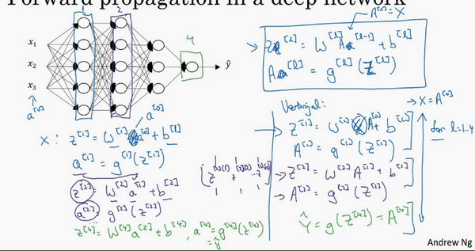

# 深层神经网络

# 深层网络中的前向传播
跟往常一样，我们先来看对其中一个训练样本$x$如何应用前向传播，之后讨论向量化的版本。

第一层需要计算${{z}^{[1]}}={{w}^{[1]}}x+{{b}^{[1]}}$，${{a}^{[1]}}={{g}^{[1]}} {({z}^{[1]})}$（$x$可以看做${{a}^{[0]}}$）

第二层需要计算${{z}^{[2]}}={{w}^{[2]}}{{a}^{[1]}}+{{b}^{[2]}}$，${{a}^{[2]}}={{g}^{[2]}} {({z}^{[2]})}$

以此类推，

第四层为${{z}^{[4]}}={{w}^{[4]}}{{a}^{[3]}}+{{b}^{[4]}}$，${{a}^{[4]}}={{g}^{[4]}} {({z}^{[4]})}$

前向传播可以归纳为多次迭代${{z}^{[l]}}={{w}^{[l]}}{{a}^{[l-1]}}+{{b}^{[l]}}$，${{a}^{[l]}}={{g}^{[l]}} {({z}^{[l]})}$。

向量化实现过程可以写成：

${{Z}^{[l]}}={{W}^{[l]}}{{a}^{[l-1]}}+{{b}^{[l]}}$，${{A}^{[l]}}={{g}^{[l]}}{({Z}^{[l]})}$    (${{A}^{[0]}} = X)$

这里只能用一个显式**for**循环，$l$从1到$L$，然后一层接着一层去计算。下一节讲的是避免代码产生BUG，我所做的其中一件非常重要的工作。

# 核对矩阵的维数
当实现深度神经网络的时候，其中一个我常用的检查代码是否有错的方法就是拿出一张纸过一遍算法中矩阵的维数。

$w$的维度是（下一层的维数，前一层的维数），即${{w}^{[l]}}$: (${{n}^{[l]}}$,${{n}^{[l-1]}}$)；

$b$的维度是（下一层的维数，1），即:

${{b}^{[l]}}$ : (${{n}^{[l]}},1)$；

${{z}^{[l]}}$,${{a}^{[l]}}$: $({{n}^{[l]}},1)$;

${{dw}^{[l]}}$和${{w}^{[l]}}$维度相同，${{db}^{[l]}}$和${{b}^{[l]}}$维度相同，且$w$和$b$向量化维度不变，但$z$,$a$以及$x$的维度会向量化后发生变化。

向量化后：

${Z}^{[l]}$可以看成由每一个单独的${Z}^{[l]}$叠加而得到，${Z}^{[l]}=({{z}^{[l][1]}}，{{z}^{[l][2]}}，{{z}^{[l][3]}}，…，{{z}^{[l][m]}})$，

$m$为训练集大小，所以${Z}^{[l]}$的维度不再是$({{n}^{[l]}},1)$，而是$({{n}^{[l]}},m)$。

${A}^{[l]}$：$({n}^{[l]},m)$，${A}^{[0]} = X =({n}^{[l]},m)$

