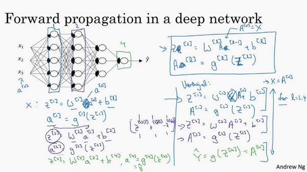

# 深层神经网络

# 深层网络中的前向传播
跟往常一样，我们先来看对其中一个训练样本$x$如何应用前向传播，之后讨论向量化的版本。

第一层需要计算${{z}^{[1]}}={{w}^{[1]}}x+{{b}^{[1]}}$，${{a}^{[1]}}={{g}^{[1]}} {({z}^{[1]})}$（$x$可以看做${{a}^{[0]}}$）

第二层需要计算${{z}^{[2]}}={{w}^{[2]}}{{a}^{[1]}}+{{b}^{[2]}}$，${{a}^{[2]}}={{g}^{[2]}} {({z}^{[2]})}$

以此类推，

第四层为${{z}^{[4]}}={{w}^{[4]}}{{a}^{[3]}}+{{b}^{[4]}}$，${{a}^{[4]}}={{g}^{[4]}} {({z}^{[4]})}$

前向传播可以归纳为多次迭代${{z}^{[l]}}={{w}^{[l]}}{{a}^{[l-1]}}+{{b}^{[l]}}$，${{a}^{[l]}}={{g}^{[l]}} {({z}^{[l]})}$。

向量化实现过程可以写成：

${{Z}^{[l]}}={{W}^{[l]}}{{a}^{[l-1]}}+{{b}^{[l]}}$，${{A}^{[l]}}={{g}^{[l]}}{({Z}^{[l]})}$    (${{A}^{[0]}} = X)$

这里只能用一个显式**for**循环，$l$从1到$L$，然后一层接着一层去计算。下一节讲的是避免代码产生BUG，我所做的其中一件非常重要的工作。