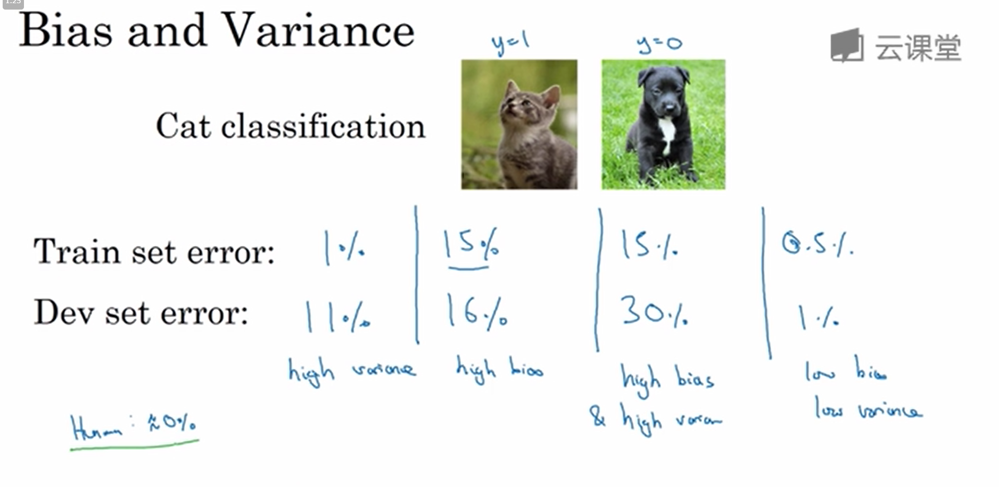
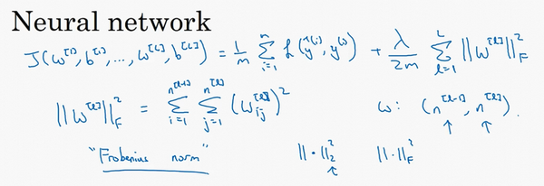
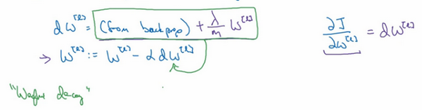
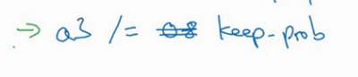
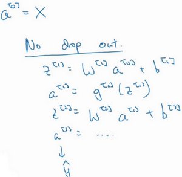
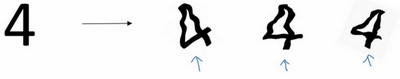
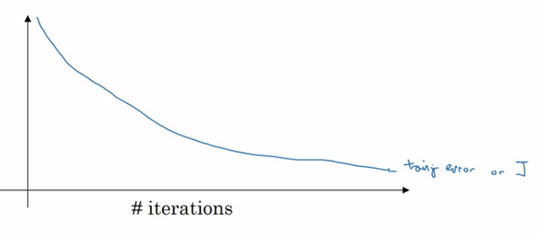

# 训练、开发、测试集
在配置训练、验证和测试数据集的过程中做出正确决策会在很大程度上帮助大家创建高效的神经网络。训练神经网络时，我们需要做出很多决策，例如：

1.  神经网络分多少层

2.  每层含有多少个隐藏单元

3.  学习速率是多少

4.  各层采用哪些激活函数

在机器学习发展的小数据量时代，常见做法是将所有数据三七分，就是人们常说的70%训练集，30%测试集。如果明确设置了验证集，也可以按照60%训练集，20%(交叉)验证集和20%测试集来划分。这是前几年机器学习领域普遍认可的最好的实践方法。

如果只有100条，1000条或者1万条数据，那么上述比例划分是非常合理的。

但是在大数据时代，我们现在的数据量可能是百万级别，那么验证集和测试集占数据总量的比例会趋向于变得更小。因为验证集的目的就是验证不同的算法，检验哪种算法更有效，因此，验证集只要足够大到能评估不同的算法，比如2个甚至10个不同算法，并迅速判断出哪种算法更有效。我们可能不需要拿出20%的数据作为验证集。

比如我们有100万条数据，那么取1万条数据便足以进行评估，找出其中表现最好的1-2种算法。同样地，根据最终选择的分类器，测试集的主要目的是正确评估分类器的性能，所以，如果拥有百万数据，我们只需要1000条数据，便足以评估单个分类器，并且准确评估该分类器的性能。假设我们有100万条数据，其中1万条作为验证集，1万条作为测试集，100万里取1万，比例是1%，即：训练集占98%，验证集和测试集各占1%。对于数据量过百万的应用，训练集可以占到99.5%，验证和测试集各占0.25%，或者验证集占0.4%，测试集占0.1%。

# 偏差、方差(Bias/Variance)
High Bias ==> 欠拟合
High Variance ==> 过拟合
  
实例：  


一般来说，最优误差也被称为贝叶斯误差，所以，最优误差接近0%，我就不在这里细讲了，如果最优误差或贝叶斯误差非常高，比如15%。我们再看看这个分类器（训练误差15%，验证误差16%），15%的错误率对训练集来说也是非常合理的，偏差不高，方差也非常低。

# 机器学习基础
这是我在训练神经网络时用到地基本方法，初始模型训练完成后，我首先要知道算法的偏差高不高，如果偏差较高，试着评估训练集或训练数据的性能。如果偏差的确很高，甚至无法拟合训练集，那么你要做的就是选择一个新的网络，比如含有更多隐藏层或者隐藏单元的网络，或者花费更多时间来训练网络，或者尝试更先进的优化算法，后面我们会讲到这部分内容。你也可以尝试其他方法，可能有用，也可能没用。

一会儿我们会看到许多不同的神经网络架构，或许你能找到一个更合适解决此问题的新的网络架构，加上括号，因为其中一条就是你必须去尝试，可能有用，也可能没用，不过采用规模更大的网络通常都会有所帮助，延长训练时间不一定有用，但也没什么坏处。训练学习算法时，我会不断尝试这些方法，直到解决掉偏差问题，这是最低标准，反复尝试，直到可以拟合数据为止，至少能够拟合训练集。

如果网络足够大，通常可以很好的拟合训练集，只要你能扩大网络规模，如果图片很模糊，算法可能无法拟合该图片，但如果有人可以分辨出图片，如果你觉得基本误差不是很高，那么训练一个更大的网络，你就应该可以……至少可以很好地拟合训练集，至少可以拟合或者过拟合训练集。一旦偏差降低到可以接受的数值，检查一下方差有没有问题，为了评估方差，我们要查看验证集性能，我们能从一个性能理想的训练集推断出验证集的性能是否也理想，如果方差高，最好的解决办法就是采用更多数据，如果你能做到，会有一定的帮助，但有时候，我们无法获得更多数据，我们也可以尝试通过正则化来减少过拟合，这个我们下节课会讲。有时候我们不得不反复尝试，但是，如果能找到更合适的神经网络框架，有时它可能会一箭双雕，同时减少方差和偏差。如何实现呢？想系统地说出做法很难，总之就是不断重复尝试，直到找到一个低偏差，低方差的框架，这时你就成功了。

有两点需要大家注意：

第一点，高偏差和高方差是两种不同的情况，我们后续要尝试的方法也可能完全不同，我通常会用训练验证集来诊断算法是否存在偏差或方差问题，然后根据结果选择尝试部分方法。举个例子，如果算法存在高偏差问题，准备更多训练数据其实也没什么用处，至少这不是更有效的方法，所以大家要清楚存在的问题是偏差还是方差，还是两者都有问题，明确这一点有助于我们选择出最有效的方法。

第二点，在机器学习的初期阶段，关于所谓的偏差方差权衡的讨论屡见不鲜，原因是我们能尝试的方法有很多。可以增加偏差，减少方差，也可以减少偏差，增加方差，但是在深度学习的早期阶段，我们没有太多工具可以做到只减少偏差或方差却不影响到另一方。但在当前的深度学习和大数据时代，只要持续训练一个更大的网络，只要准备了更多数据，那么也并非只有这两种情况，我们假定是这样，那么，只要正则适度，通常构建一个更大的网络便可以，在不影响方差的同时减少偏差，而采用更多数据通常可以在不过多影响偏差的同时减少方差。这两步实际要做的工作是：训练网络，选择网络或者准备更多数据，现在我们有工具可以做到在减少偏差或方差的同时，不对另一方产生过多不良影响。我觉得这就是深度学习对监督式学习大有裨益的一个重要原因，也是我们不用太过关注如何平衡偏差和方差的一个重要原因，但有时我们有很多选择，减少偏差或方差而不增加另一方。最终，我们会得到一个非常规范化的网络。从下节课开始，我们将讲解正则化，训练一个更大的网络几乎没有任何负面影响，而训练一个大型神经网络的主要代价也只是计算时间，前提是网络是比较规范化的。

解决高方差(过拟合)：增加训练集数据、使用正则

# 正则化

## In Logistics Regression
我们用逻辑回归来实现这些设想，求成本函数$J$的最小值，它是我们定义的成本函数，参数包含一些训练数据和不同数据中个体预测的损失，$w$和$b$是逻辑回归的两个参数，$w$是一个多维度参数矢量，$b$是一个实数。在逻辑回归函数中加入正则化，只需添加参数λ，也就是正则化参数，一会儿再详细讲。

$\frac{\lambda}{2m}$乘以$w$范数的平方，其中$\| w \|_2^2$是$w$的欧几里德范数的平方，等于$w_{j}$（$j$ 值从1到$n_{x}$）平方的和，也可表示为$w^{T}w$，也就是向量参数$w$ 的欧几里德范数（2范数）的平方，此方法称为$L2$正则化，因为这里用了欧几里德范数，被称为向量参数$w$的$L2$范数。


为什么只正则化参数$w$？为什么不再加上参数 $b$ 呢？你可以这么做，只是我习惯省略不写，因为$w$通常是一个高维参数矢量，已经可以表达高偏差问题，$w$可能包含有很多参数，我们不可能拟合所有参数，而$b$只是单个数字，所以$w$几乎涵盖所有参数，而不是$b$，如果加了参数$b$，其实也没太大影响，因为$b$只是众多参数中的一个，所以我通常省略不计，如果你想加上这个参数，完全没问题。


**$L2$正则化是最常见的正则化类型**，你们可能听说过$L1$正则化，$L1$正则化，加的不是$L2$范数，而是正则项$\frac{\lambda}{m}$乘以$\sum_{j= 1}^{n_{x}}{|w|}$，$\sum_{j =1}^{n_{x}}{|w|}$也被称为参数$w$向量的$L1$范数，无论分母是$m$还是$2m$，它都是一个比例常量。


**如果用的是$L1$正则化，$w$最终会是稀疏的**，也就是说$w$向量中有很多0，有人说这样有利于压缩模型，因为集合中参数均为0，存储模型所占用的内存更少。实际上，虽然$L1$正则化使模型变得稀疏，却没有降低太多存储内存，所以我认为这并不是$L1$正则化的目的，至少不是为了压缩模型，人们在训练网络时，越来越倾向于使用$L2$正则化。

我们来看最后一个细节，$\lambda$是正则化参数，我们通常使用验证集或交叉验证集来配置这个参数，尝试各种各样的数据，寻找最好的参数，我们要考虑训练集之间的权衡，把参数设置为较小值，这样可以避免过拟合，所以λ是另外一个需要调整的超级参数，顺便说一下，为了方便写代码，在**Python**编程语言中，$\lambda$是一个保留字段，编写代码时，我们删掉$a$，写成$lambd$，以免与**Python**中的保留字段冲突，这就是在逻辑回归函数中实现$L2$正则化的过程

## In Neural Network

神经网络含有一个成本函数，该函数包含$W^{[1]}$，$b^{[1]}$到$W^{[l]}$，$b^{[l]}$所有参数，字母$L$是神经网络所含的层数，因此成本函数等于$m$个训练样本损失函数的总和乘以$\frac{1}{m}$，正则项为:  
$$\frac{\lambda }{2m}{{\sum\nolimits_{1}^{L}{\| {{W}^{[l]}}\|}}^{2}}$$
，其中***Frobenius Norm(弗罗贝尼乌斯范数)***定义为：
$$\|W^{[l]} \|^2= \sum_{i=1}^{l}\sum_{j=1}^{l-1}(W_{ij}^{[l]})^2$$
，我们称${||W^{\left[l\right]}||}^{2}$为范数平方，这个矩阵范数${||W^{\left[l\right]}||}^{2}$（即平方范数），被定义为矩阵中所有元素的平方求和，




该矩阵范数被称作“弗罗贝尼乌斯范数”，用下标$F$标注”，鉴于线性代数中一些神秘晦涩的原因，我们不称之为“矩阵$L2$范数”，而称它为“弗罗贝尼乌斯范数”，矩阵$L2$范数听起来更自然，但鉴于一些大家无须知道的特殊原因，按照惯例，我们称之为“弗罗贝尼乌斯范数”，它表示一个矩阵中所有元素的平方和。


该如何使用该范数实现梯度下降呢？

用**backprop**计算出$dW​$的值，**backprop**会给出$J$对​$W$的偏导数，实际上是​$W^{[l]}$，把​$W^{[l]}$替换为​$W^{[l]}$减去学习率乘以​$dW$。


这就是之前我们额外增加的正则化项，既然已经增加了这个正则项，现在我们要做的就是给$dW$加上这一项$\frac {\lambda}{m}W^{[l]}$，然后计算这个更新项，使用新定义的$dW^{[l]}$，它的定义含有相关参数代价函数导数和，以及最后添加的额外正则项，这也是$L2$正则化有时被称为“权重衰减”的原因。



我们用$dW^{[l]}$的定义替换此处的$dW^{[l]}$，可以看到，$W^{[l]}$的定义被更新为$W^{[l]}$减去学习率$\alpha$ 乘以**backprop** 再加上$\frac{\lambda}{m}W^{[l]}$。


该正则项说明，不论$W^{[l]}$是什么，我们都试图让它变得更小，实际上，相当于我们给矩阵W乘以$(1 - \alpha\frac{\lambda}{m})$倍的权重，矩阵$W$减去$\alpha\frac{\lambda}{m}$倍的它，也就是用这个系数$(1-\alpha\frac{\lambda}{m})$乘以矩阵$W$，该系数小于1，因此$L2$范数正则化也被称为“权重衰减”，因为它就像一般的梯度下降，$W$被更新为少了$\alpha$乘以**backprop**输出的最初梯度值，同时$W$也乘以了这个系数，这个系数小于1，因此$L2$正则化也被称为“权重衰减”。


我不打算这么叫它，之所以叫它“权重衰减”是因为这两项相等，权重指标乘以了一个小于1的系数。

# 为什么正则化可以解决过拟合

总结一下，如果正则化参数变得很大，参数$W$很小，$z$也会相对变小，此时忽略$b$的影响，$z$会相对变小，实际上，$z$的取值范围很小，这个激活函数，也就是曲线函数$tanh$会相对呈线性，整个神经网络会计算离线性函数近的值，这个线性函数非常简单，并不是一个极复杂的高度非线性函数，不会发生过拟合。

# Dropout 正则化 
除了$L2$正则化，还有一个非常实用的正则化方法——“**Dropout**（随机失活）”，我们来看看它的工作原理。


假设你在训练上图这样的神经网络，它存在过拟合，这就是**dropout**所要处理的，我们复制这个神经网络，**dropout**会遍历网络的每一层，并设置消除神经网络中节点的概率。假设网络中的每一层，每个节点都以抛硬币的方式设置概率，每个节点得以保留和消除的概率都是0.5，设置完节点概率，我们会消除一些节点，然后删除掉从该节点进出的连线，最后得到一个节点更少，规模更小的网络，然后用**backprop**方法进行训练。


这是网络节点精简后的一个样本，对于其它样本，我们照旧以抛硬币的方式设置概率，保留一类节点集合，删除其它类型的节点集合。对于每个训练样本，我们都将采用一个精简后神经网络来训练它，这种方法似乎有点怪，单纯遍历节点，编码也是随机的，可它真的有效。不过可想而知，我们针对每个训练样本训练规模小得多的网络，最后你可能会认识到为什么要正则化网络，因为我们在训练规模小得多的网络。


如何实施**dropout**呢？方法有几种，接下来我要讲的是最常用的方法，即**inverted dropout**（反向随机失活），出于完整性考虑，我们用一个三层（$l=3$）网络来举例说明。编码中会有很多涉及到3的地方。我只举例说明如何在某一层中实施**dropout**。

首先要定义向量$d$，$d^{[3]}$表示网络第三层的**dropout**向量：

```Python
d3 = np.random.rand(a3.shape[0],a3.shape[1])
a3 = a3 * d3 # 将a3与d3相乘，去除掉0项
a3 = a3 / keep-prob # 保证a3的期望值不变

```

然后看它是否小于某数，我们称之为**keep-prob**，**keep-prob**是一个具体数字，上个示例中它是0.5，而本例中它是0.8，它表示保留某个隐藏单元的概率，此处**keep-prob**等于0.8，它意味着消除任意一个隐藏单元的概率是0.2，它的作用就是生成随机矩阵，如果对$a^{[3]}$进行因子分解，效果也是一样的。$d^{[3]}$是一个矩阵，每个样本和每个隐藏单元，其中$d^{[3]}$中的对应值为1的概率都是0.8，对应为0的概率是0.2，随机数字小于0.8。它等于1的概率是0.8，等于0的概率是0.2。

接下来要做的就是从第三层中获取激活函数，这里我们叫它$a^{[3]}$，$a^{[3]}$含有要计算的激活函数，$a^{[3]}$等于上面的$a^{[3]}$乘以$d^{[3]}$，`a3 =np.multiply(a3,d3)`，这里是元素相乘，也可写为$a3*=d3$，它的作用就是让$d^{[3]}$中所有等于0的元素（输出），而各个元素等于0的概率只有20%，乘法运算最终把$d^{\left\lbrack3 \right]}$中相应元素输出，即让$d^{[3]}$中0元素与$a^{[3]}$中相对元素归零。


如果用**python**实现该算法的话，$d^{[3]}$则是一个布尔型数组，值为**true**和**false**，而不是1和0，乘法运算依然有效，**python**会把**true**和**false**翻译为1和0，大家可以用**python**尝试一下。

最后，我们向外扩展$a^{[3]}$，用它除以0.8，或者除以**keep-prob**参数。



下面我解释一下为什么要这么做，为方便起见，我们假设第三隐藏层上有50个单元或50个神经元，在一维上$a^{[3]}$是50，我们通过因子分解将它拆分成$50×m$维的，保留和删除它们的概率分别为80%和20%，这意味着最后被删除或归零的单元平均有10（50×20%=10）个，现在我们看下$z^{\lbrack4]}$，$z^{[4]} = w^{[4]} a^{[3]} + b^{[4]}$，我们的预期是，$a^{[3]}$减少20%，也就是说$a^{[3]}$中有20%的元素被归零，为了不影响$z^{\lbrack4]}$的期望值，我们需要用$w^{[4]} a^{[3]}/0.8$，它将会修正或弥补我们所需的那20%，$a^{[3]}$的期望值不会变，划线部分就是所谓的**dropout**方法。


它的功能是，不论**keep-prop**的值是多少0.8，0.9甚至是1，如果**keep-prop**设置为1，那么就不存在**dropout**，因为它会保留所有节点。反向随机失活（**inverted dropout**）方法通过除以**keep-prob**，确保$a^{[3]}$的期望值不变。

事实证明，在测试阶段，当我们评估一个神经网络时，也就是用绿线框标注的反向随机失活方法，使测试阶段变得更容易，因为它的数据扩展问题变少，我们将在下节课讨论。

据我了解，目前实施**dropout**最常用的方法就是**Inverted dropout**，建议大家动手实践一下。**Dropout**早期的迭代版本都没有除以**keep-prob**，所以在测试阶段，平均值会变得越来越复杂，不过那些版本已经不再使用了。

现在你使用的是$d$向量，你会发现，不同的训练样本，清除不同的隐藏单元也不同。实际上，如果你通过相同训练集多次传递数据，每次训练数据的梯度不同，则随机对不同隐藏单元归零，有时却并非如此。比如，需要将相同隐藏单元归零，第一次迭代梯度下降时，把一些隐藏单元归零，第二次迭代梯度下降时，也就是第二次遍历训练集时，对不同类型的隐藏层单元归零。向量$d$或$d^{[3]}$用来决定第三层中哪些单元归零，无论用**foreprop**还是**backprop**，这里我们只介绍了**foreprob**。

如何在测试阶段训练算法，在测试阶段，我们已经给出了$x$，或是想预测的变量，用的是标准计数法。我用$a^{\lbrack0]}$，第0层的激活函数标注为测试样本$x$，我们在测试阶段不使用**dropout**函数，尤其是像下列情况：

$z^{[1]} = w^{[1]} a^{[0]} + b^{[1]}$

$a^{[1]} = g^{[1]}(z^{[1]})$

$z^{[2]} = \ w^{[2]} a^{[1]} + b^{[2]}$

$a^{[2]} = \ldots$

以此类推直到最后一层，预测值为$\hat{y}$。



显然在测试阶段，我们并未使用**dropout**，自然也就不用抛硬币来决定失活概率，以及要消除哪些隐藏单元了，因为在测试阶段进行预测时，我们不期望输出结果是随机的，如果测试阶段应用**dropout**函数，预测会受到干扰。理论上，你只需要多次运行预测处理过程，每一次，不同的隐藏单元会被随机归零，预测处理遍历它们，但计算效率低，得出的结果也几乎相同，与这个不同程序产生的结果极为相似。

**Inverted dropout**函数在除以**keep-prob**时可以记住上一步的操作，目的是确保即使在测试阶段不执行**dropout**来调整数值范围，激活函数的预期结果也不会发生变化，所以没必要在测试阶段额外添加尺度参数，这与训练阶段不同。

$l=keep-prob$

这就是**dropout**，大家可以通过本周的编程练习来执行这个函数，亲身实践一下。

为什么**dropout**会起作用呢？下节课我们将更加直观地了解**dropout**的具体功能。


# 理解 Dropout 正则化

**Dropout**可以随机删除网络中的神经单元，他为什么可以通过正则化发挥如此大的作用呢？

直观上理解：不要依赖于任何一个特征，因为该单元的输入可能随时被清除，因此该单元通过这种方式传播下去，并为单元的四个输入增加一点权重，通过传播所有权重，**dropout**将产生收缩权重的平方范数的效果，和之前讲的$L2$正则化类似；实施**dropout**的结果实它会压缩权重，并完成一些预防过拟合的外层正则化；$L2$对不同权重的衰减是不同的，它取决于激活函数倍增的大小。

总结一下，**dropout**的功能类似于$L2$正则化，与$L2$正则化不同的是应用方式不同会带来一点点小变化，甚至更适用于不同的输入范围。


第二个直观认识是，我们从单个神经元入手，如图，这个单元的工作就是输入并生成一些有意义的输出。通过**dropout**，该单元的输入几乎被消除，有时这两个单元会被删除，有时会删除其它单元，就是说，我用紫色圈起来的这个单元，它不能依靠任何特征，因为特征都有可能被随机清除，或者说该单元的输入也都可能被随机清除。我不愿意把所有赌注都放在一个节点上，不愿意给任何一个输入加上太多权重，因为它可能会被删除，因此该单元将通过这种方式积极地传播开，并为单元的四个输入增加一点权重，通过传播所有权重，**dropout**将产生收缩权重的平方范数的效果，和我们之前讲过的$L2$正则化类似，实施**dropout**的结果是它会压缩权重，并完成一些预防过拟合的外层正则化。

事实证明，**dropout**被正式地作为一种正则化的替代形式，$L2$对不同权重的衰减是不同的，它取决于倍增的激活函数的大小。

总结一下，**dropout**的功能类似于$L2$正则化，与$L2$正则化不同的是，被应用的方式不同，**dropout**也会有所不同，甚至更适用于不同的输入范围。


实施**dropout**的另一个细节是，这是一个拥有三个输入特征的网络，其中一个要选择的参数是**keep-prob**，它代表每一层上保留单元的概率。所以不同层的**keep-prob**也可以变化。第一层，矩阵$W^{[1]}$是7×3，第二个权重矩阵$W^{[2]}$是7×7，第三个权重矩阵$W^{[3]}$是3×7，以此类推，$W^{[2]}$是最大的权重矩阵，因为$W^{[2]}$拥有最大参数集，即7×7，为了预防矩阵的过拟合，对于这一层，我认为这是第二层，它的**keep-prob**值应该相对较低，假设是0.5。对于其它层，过拟合的程度可能没那么严重，它们的**keep-prob**值可能高一些，可能是0.7，这里是0.7。如果在某一层，我们不必担心其过拟合的问题，那么**keep-prob**可以为1，为了表达清除，我用紫色线笔把它们圈出来，每层**keep-prob**的值可能不同。


注意**keep-prob**的值是1，意味着保留所有单元，并且不在这一层使用**dropout**，对于有可能出现过拟合，且含有诸多参数的层，我们可以把**keep-prob**设置成比较小的值，以便应用更强大的**dropout**，有点像在处理$L2$正则化的正则化参数$\lambda$，我们尝试对某些层施行更多正则化，从技术上讲，我们也可以对输入层应用**dropout**，我们有机会删除一个或多个输入特征，虽然现实中我们通常不这么做，**keep-prob**的值为1，是非常常用的输入值，也可以用更大的值，或许是0.9。但是消除一半的输入特征是不太可能的，如果我们遵守这个准则，**keep-prob**会接近于1，即使你对输入层应用**dropout**。

总结一下，如果你担心某些层比其它层更容易发生过拟合，可以把某些层的**keep-prob**值设置得比其它层更低，缺点是为了使用交叉验证，你要搜索更多的超级参数，另一种方案是在一些层上应用**dropout**，而有些层不用**dropout**，应用**dropout**的层只含有一个超级参数，就是**keep-prob**。

## Summary
在CV领域经常使用Dropout，因为cv的输入量非常大(RGB)，往往没有足够的Dataset大小，所以容易过拟合。  
推广即:***当输入量比较大，而数据量不足时，容易产生过拟合，这个时候就可以考虑使用Dropout。***


**dropout**一大缺点就是代价函数$J$不再被明确定义，每次迭代，都会随机移除一些节点，如果再三检查梯度下降的性能，实际上是很难进行复查的。定义明确的代价函数$J$每次迭代后都会下降，因为我们所优化的代价函数$J$实际上并没有明确定义，或者说在某种程度上很难计算，所以我们失去了调试工具来绘制这样的图片。我通常会关闭**dropout**函数，将**keep-prob**的值设为1，运行代码，确保J函数单调递减。然后打开**dropout**函数，希望在**dropout**过程中，代码并未引入**bug**。我觉得你也可以尝试其它方法，虽然我们并没有关于这些方法性能的数据统计，但你可以把它们与**dropout**方法一起使用。

# 使用其他正则化方法
除了$L2$正则化和随机失活（**dropout**）正则化，还有几种方法可以减少神经网络中的过拟合:


## 一.数据扩增

假设你正在拟合猫咪图片分类器，如果你想通过扩增训练数据来解决过拟合，但扩增数据代价高，而且有时候我们无法扩增数据，但我们可以通过添加这类图片来增加训练集。例如，水平翻转图片，并把它添加到训练集。所以现在训练集中有原图，还有翻转后的这张图片，所以通过水平翻转图片，训练集则可以增大一倍，因为训练集有冗余，这虽然不如我们额外收集一组新图片那么好，但这样做节省了获取更多猫咪图片的花费。


除了水平翻转图片，你也可以随意裁剪图片，这张图是把原图旋转并随意放大后裁剪的，仍能辨别出图片中的猫咪。

通过随意翻转和裁剪图片，我们可以增大数据集，额外生成假训练数据。和全新的，独立的猫咪图片数据相比，这些额外的假的数据无法包含像全新数据那么多的信息，但我们这么做基本没有花费，代价几乎为零，除了一些对抗性代价。以这种方式扩增算法数据，进而正则化数据集，减少过拟合比较廉价。



像这样人工合成数据的话，我们要通过算法验证，图片中的猫经过水平翻转之后依然是猫。大家注意，我并没有垂直翻转，因为我们不想上下颠倒图片，也可以随机选取放大后的部分图片，猫可能还在上面。

对于光学字符识别，我们还可以通过添加数字，随意旋转或扭曲数字来扩增数据，把这些数字添加到训练集，它们仍然是数字。为了方便说明，我对字符做了强变形处理，所以数字4看起来是波形的，其实不用对数字4做这么夸张的扭曲，只要轻微的变形就好，我做成这样是为了让大家看的更清楚。实际操作的时候，我们通常对字符做更轻微的变形处理。因为这几个4看起来有点扭曲。所以，数据扩增可作为正则化方法使用，实际功能上也与正则化相似。

## 二.Early Stopping

还有另外一种常用的方法叫作**early stopping**，运行梯度下降时，我们可以绘制训练误差，或只绘制代价函数$J$的优化过程，在训练集上用0-1记录分类误差次数。呈单调下降趋势，如图。



因为在训练过程中，我们希望训练误差，代价函数$J$都在下降，通过**early stopping**，我们不但可以绘制上面这些内容，还可以绘制验证集误差，它可以是验证集上的分类误差，或验证集上的代价函数，逻辑损失和对数损失等，你会发现，验证集误差通常会先呈下降趋势，然后在某个节点处开始上升，**early stopping**的作用是，你会说，神经网络已经在这个迭代过程中表现得很好了，我们在此停止训练吧，得到验证集误差，它是怎么发挥作用的？


当你还未在神经网络上运行太多迭代过程的时候，参数$w$接近0，因为随机初始化$w$值时，它的值可能都是较小的随机值，所以在你长期训练神经网络之前$w$依然很小，在迭代过程和训练过程中$w$的值会变得越来越大，比如在这儿，神经网络中参数$w$的值已经非常大了，所以**early stopping**要做就是在中间点停止迭代过程，我们得到一个$w$值中等大小的弗罗贝尼乌斯范数，与$L2$正则化相似，选择参数w范数较小的神经网络，但愿你的神经网络过度拟合不严重。


术语**early stopping**代表提早停止训练神经网络，训练神经网络时，我有时会用到**early stopping**，但是它也有一个缺点，我们来了解一下。

我认为机器学习过程包括几个步骤，其中一步是选择一个算法来优化代价函数$J$，我们有很多种工具来解决这个问题，如梯度下降，后面我会介绍其它算法，例如**Momentum**，**RMSprop**和**Adam**等等，但是优化代价函数$J$之后，我也不想发生过拟合，也有一些工具可以解决该问题，比如正则化，扩增数据等等。


在机器学习中，超级参数激增，选出可行的算法也变得越来越复杂。我发现，如果我们用一组工具优化代价函数$J$，机器学习就会变得更简单，在重点优化代价函数$J$时，你只需要留意$w$和$b$，$J(w,b)$的值越小越好，你只需要想办法减小这个值，其它的不用关注。然后，预防过拟合还有其他任务，换句话说就是减少方差，这一步我们用另外一套工具来实现，这个原理有时被称为“正交化”。思路就是在一个时间做一个任务，后面课上我会具体介绍正交化，如果你还不了解这个概念，不用担心。

但对我来说**early stopping**的主要缺点就是你不能独立地处理这两个问题，因为提早停止梯度下降，也就是停止了优化代价函数$J$，因为现在你不再尝试降低代价函数$J$，所以代价函数$J$的值可能不够小，同时你又希望不出现过拟合，你没有采取不同的方式来解决这两个问题，而是用一种方法同时解决两个问题，这样做的结果是我要考虑的东西变得更复杂。

如果不用**early stopping**，另一种方法就是$L2$正则化，训练神经网络的时间就可能很长。我发现，这导致超级参数搜索空间更容易分解，也更容易搜索，但是缺点在于，你必须尝试很多正则化参数$\lambda$的值，这也导致搜索大量$\lambda$值的计算代价太高。

**Early stopping**的优点是，只运行一次梯度下降，你可以找出$w$的较小值，中间值和较大值，而无需尝试$L2$正则化超级参数$\lambda$的很多值。

如果你还不能完全理解这个概念，没关系，下节课我们会详细讲解正交化，这样会更好理解。

虽然$L2$正则化有缺点，可还是有很多人愿意用它。吴恩达老师个人更倾向于使用$L2$正则化，尝试许多不同的$\lambda$值，假设你可以负担大量计算的代价。而使用**early stopping**也能得到相似结果，还不用尝试这么多$\lambda$值。

这节课我们讲了如何使用数据扩增，以及如何使用**early stopping**降低神经网络中的方差或预防过拟合。

# 梯度消失与梯度下降
