# 1. Mini-Batch 梯度下降

***一般用在大型数据集上***  
## KEY:
将数据集划分为若干个大小的子集合

本周将学习优化算法，这能让你的神经网络运行得更快。机器学习的应用是一个高度依赖经验的过程，伴随着大量迭代的过程，你需要训练诸多模型，才能找到合适的那一个，所以，优化算法能够帮助你快速训练模型。

其中一个难点在于，深度学习没有在大数据领域发挥最大的效果，我们可以利用一个巨大的数据集来训练神经网络，而在巨大的数据集基础上进行训练速度很慢。因此，你会发现，使用快速的优化算法，使用好用的优化算法能够大大提高你和团队的效率，那么，我们首先来谈谈**mini-batch**梯度下降法。

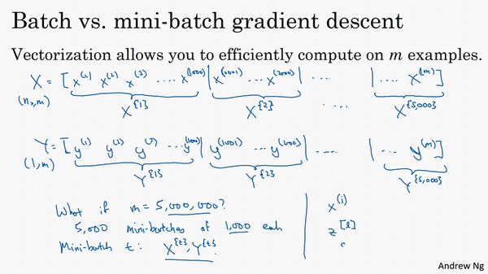

你之前学过，向量化能够让你有效地对所有$m$个样本进行计算，允许你处理整个训练集，而无需某个明确的公式。所以我们要把训练样本放大巨大的矩阵$X$当中去，$X= \lbrack x^{(1)}\ x^{(2)}\ x^{(3)}\ldots\ldots x^{(m)}\rbrack$，$Y$也是如此，$Y= \lbrack y^{(1)}\ y^{(2)}\ y^{(3)}\ldots \ldots y^{(m)}\rbrack$，所以$X$的维数是$(n_{x},m)$，$Y$的维数是$(1,m)$，向量化能够让你相对较快地处理所有$m$个样本。如果$m$很大的话，处理速度仍然缓慢。比如说，如果$m$是500万或5000万或者更大的一个数，在对整个训练集执行梯度下降法时，你要做的是，你必须处理整个训练集，然后才能进行一步梯度下降法，然后你需要再重新处理500万个训练样本，才能进行下一步梯度下降法。所以如果你在处理完整个500万个样本的训练集之前，先让梯度下降法处理一部分，你的算法速度会更快，准确地说，这是你可以做的一些事情。

你可以把训练集分割为小一点的子集训练，这些子集被取名为**mini-batch**，假设每一个子集中只有1000个样本，那么把其中的$x^{(1)}$到$x^{(1000)}$取出来，将其称为第一个子训练集，也叫做**mini-batch**，然后你再取出接下来的1000个样本，从$x^{(1001)}$到$x^{(2000)}$，然后再取1000个样本，以此类推。

接下来我要说一个新的符号，把$x^{(1)}$到$x^{(1000)}$称为$X^{\{1\}}$，$x^{(1001)}$到$x^{(2000)}$称为$X^{\{2\}}$，如果你的训练样本一共有500万个，每个**mini-batch**都有1000个样本，也就是说，你有5000个**mini-batch**，因为5000乘以1000就是5000万。

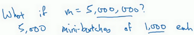

你共有5000个**mini-batch**，所以最后得到是$X^{\left\{ 5000 \right\}}$

对$Y$也要进行相同处理，你也要相应地拆分$Y$的训练集，所以这是$Y^{\{1\}}$，然后从$y^{(1001)}$到$y^{(2000)}$，这个叫$Y^{\{2\}}$，一直到$Y^{\{ 5000\}}$。

**mini-batch**的数量$t$组成了$X^{\{ t\}}$和$Y^{\{t\}}$，这就是1000个训练样本，包含相应的输入输出对。

在继续课程之前，先确定一下我的符号，之前我们使用了上角小括号$(i)$表示训练集里的值，所以$x^{(i)}$是第$i$个训练样本。我们用了上角中括号$[l]$来表示神经网络的层数，$z^{\lbrack l\rbrack}$表示神经网络中第$l$层的$z$值，我们现在引入了大括号${t}$来代表不同的**mini-batch**，所以我们有$X^{\{ t\}}$和$Y^{\{ t\}}$，检查一下自己是否理解无误。

$X^{\{ t\}}$和$Y^{\{ t\}}$的维数：如果$X^{\{1\}}$是一个有1000个样本的训练集，或者说是1000个样本的$x$值，所以维数应该是$(n_{x},1000)$，$X^{\{2\}}$的维数应该是$(n_{x},1000)$，以此类推。因此所有的子集维数都是$(n_{x},1000)$，而这些（$Y^{\{ t\}}$）的维数都是$(1,1000)$。

解释一下这个算法的名称，**batch**梯度下降法指的是我们之前讲过的梯度下降法算法，就是同时处理整个训练集，这个名字就是来源于能够同时看到整个**batch**训练集的样本被处理，这个名字不怎么样，但就是这样叫它。

相比之下，**mini-batch**梯度下降法，指的是我们在下一张幻灯片中会讲到的算法，你每次同时处理的单个的**mini-batch** $X^{\{t\}}$和$Y^{\{ t\}}$，而不是同时处理全部的$X$和$Y$训练集。

那么究竟**mini-batch**梯度下降法的原理是什么？在训练集上运行**mini-batch**梯度下降法，你运行`for t=1……5000`，因为我们有5000个各有1000个样本的组，在**for**循环里你要做得基本就是对$X^{\{t\}}$和$Y^{\{t\}}$执行一步梯度下降法。假设你有一个拥有1000个样本的训练集，而且假设你已经很熟悉一次性处理完的方法，你要用向量化去几乎同时处理1000个样本。

首先对输入也就是$X^{\{ t\}}$，执行前向传播，然后执行$z^{\lbrack 1\rbrack} =W^{\lbrack 1\rbrack}X + b^{\lbrack 1\rbrack}$，之前我们这里只有，但是现在你正在处理整个训练集，你在处理第一个**mini-batch**，在处理**mini-batch**时它变成了$X^{\{ t\}}$，即$z^{\lbrack 1\rbrack} = W^{\lbrack 1\rbrack}X^{\{ t\}} + b^{\lbrack1\rbrack}$，然后执行$A^{[1]k} =g^{[1]}(Z^{[1]})$，之所以用大写的$Z$是因为这是一个向量内涵，以此类推，直到$A^{\lbrack L\rbrack} = g^{\left\lbrack L \right\rbrack}(Z^{\lbrack L\rbrack})$，这就是你的预测值。注意这里你需要用到一个向量化的执行命令，这个向量化的执行命令，一次性处理1000个而不是500万个样本。接下来你要计算损失成本函数$J$，因为子集规模是1000，$J= \frac{1}{1000}\sum_{i = 1}^{l}{L(\hat y^{(i)},y^{(i)})}$，说明一下，这（$L(\hat y^{(i)},y^{(i)})$）指的是来自于**mini-batch**$X^{\{ t\}}$和$Y^{\{t\}}$中的样本。

如果你用到了正则化，你也可以使用正则化的术语，$J =\frac{1}{1000}\sum_{i = 1}^{l}{L(\hat y^{(i)},y^{(i)})} +\frac{\lambda}{2 1000}\sum_{l}^{}{||w^{[l]}||}_{F}^{2}$，因为这是一个**mini-batch**的损失，所以我将$J$损失记为上角标$t$，放在大括号里（$J^{\{t\}} = \frac{1}{1000}\sum_{i = 1}^{l}{L(\hat y^{(i)},y^{(i)})} +\frac{\lambda}{2 1000}\sum_{l}^{}{||w^{[l]}||}_{F}^{2}$）。

你也会注意到，我们做的一切似曾相识，其实跟之前我们执行梯度下降法如出一辙，除了你现在的对象不是$X​$，$Y​$，而是$X^{\{t\}}​$和$Y^{\{ t\}}​$。接下来，你执行反向传播来计算$J^{\{t\}}​$的梯度，你只是使用$X^{\{ t\}}​$和$Y^{\{t\}}​$，然后你更新加权值，$W​$实际上是$W^{\lbrack l\rbrack}​$，更新为$W^{[l]}:= W^{[l]} - adW^{[l]}​$，对$b​$做相同处理，$b^{[l]}:= b^{[l]} - adb^{[l]}​$。这是使用**mini-batch**梯度下降法训练样本的一步，我写下的代码也可被称为进行“一代”（**1 epoch**）的训练。一代这个词意味着只是一次遍历了训练集。

使用**batch**梯度下降法，一次遍历训练集只能让你做一个梯度下降，使用**mini-batch**梯度下降法，一次遍历训练集，能让你做5000个梯度下降。当然正常来说你想要多次遍历训练集，还需要为另一个**while**循环设置另一个**for**循环。所以你可以一直处理遍历训练集，直到最后你能收敛到一个合适的精度。

如果你有一个丢失的训练集，**mini-batch**梯度下降法比**batch**梯度下降法运行地更快，所以几乎每个研习深度学习的人在训练巨大的数据集时都会用到，下一个视频中，我们将进一步深度讨论**mini-batch**梯度下降法，你也会因此更好地理解它的作用和原理。

# 2. 理解mini-batch梯度下降法

在上周视频中，你知道了如何利用**mini-batch**梯度下降法来开始处理训练集和开始梯度下降，即使你只处理了部分训练集，即使你是第一次处理，本视频中，我们将进一步学习如何执行梯度下降法，更好地理解其作用和原理。

使用**batch**梯度下降法时，每次迭代你都需要历遍整个训练集，可以预期每次迭代成本都会下降，所以如果成本函数$J$是迭代次数的一个函数，它应该会随着每次迭代而减少，如果$J$在某次迭代中增加了，那肯定出了问题，也许你的学习率太大。

使用**mini-batch**梯度下降法，如果你作出成本函数在整个过程中的图，则并不是每次迭代都是下降的，特别是在每次迭代中，你要处理的是$X^{\{t\}}$和$Y^{\{ t\}}$，如果要作出成本函数$J^{\{ t\}}$的图，而$J^{\{t\}}$只和$X^{\{ t\}}$，$Y^{\{t\}}$有关，也就是每次迭代下你都在训练不同的样本集或者说训练不同的**mini-batch**，如果你要作出成本函数$J$的图，你很可能会看到这样的结果，走向朝下，但有更多的噪声，所以如果你作出$J^{\{t\}}$的图，因为在训练**mini-batch**梯度下降法时，会经过多代，你可能会看到这样的曲线。没有每次迭代都下降是不要紧的，但走势应该向下，噪声产生的原因在于也许$X^{\{1\}}$和$Y^{\{1\}}$是比较容易计算的**mini-batch**，因此成本会低一些。不过也许出于偶然，$X^{\{2\}}$和$Y^{\{2\}}$是比较难运算的**mini-batch**，或许你需要一些残缺的样本，这样一来，成本会更高一些，所以才会出现这些摆动，因为你是在运行**mini-batch**梯度下降法作出成本函数图。

你需要决定的变量之一是**mini-batch**的大小，$m$就是训练集的大小，极端情况下，如果**mini-batch**的大小等于$m$，其实就是**batch**梯度下降法，在这种极端情况下，你就有了**mini-batch**  $X^{\{1\}}$和$Y^{\{1\}}$，并且该**mini-batch**等于整个训练集，所以把**mini-batch**大小设为$m$可以得到**batch**梯度下降法。

另一个极端情况，假设**mini-batch**大小为1，就有了新的算法，叫做随机梯度下降法，每个样本都是独立的**mini-batch**，当你看第一个**mini-batch**，也就是$X^{\{1\}}$和$Y^{\{1\}}$，如果**mini-batch**大小为1，它就是你的第一个训练样本，这就是你的第一个训练样本。接着再看第二个**mini-batch**，也就是第二个训练样本，采取梯度下降步骤，然后是第三个训练样本，以此类推，一次只处理一个。

看在两种极端下成本函数的优化情况，如果这是你想要最小化的成本函数的轮廓，最小值在那里，**batch**梯度下降法从某处开始，相对噪声低些，幅度也大一些，你可以继续找最小值。

相反，在随机梯度下降法中，从某一点开始，我们重新选取一个起始点，每次迭代，你只对一个样本进行梯度下降，大部分时候你向着全局最小值靠近，有时候你会远离最小值，因为那个样本恰好给你指的方向不对，因此随机梯度下降法是有很多噪声的，平均来看，它最终会靠近最小值，不过有时候也会方向错误，因为随机梯度下降法永远不会收敛，而是会一直在最小值附近波动，但它并不会在达到最小值并停留在此。

实际上你选择的**mini-batch**大小在二者之间，大小在1和$m$之间，而1太小了，$m$太大了，原因在于如果使用**batch**梯度下降法，**mini-batch**的大小为$m$，每个迭代需要处理大量训练样本，该算法的主要弊端在于特别是在训练样本数量巨大的时候，单次迭代耗时太长。如果训练样本不大，**batch**梯度下降法运行地很好。

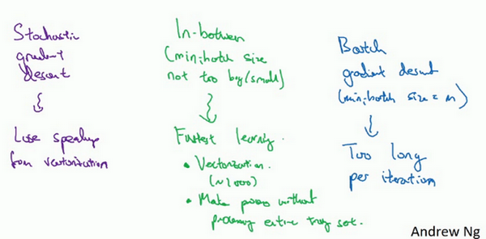

相反，如果使用随机梯度下降法，如果你只要处理一个样本，那这个方法很好，这样做没有问题，通过减小学习率，噪声会被改善或有所减小，但随机梯度下降法的一大缺点是，你会失去所有向量化带给你的加速，因为一次性只处理了一个训练样本，这样效率过于低下，所以实践中最好选择不大不小的**mini-batch**尺寸，实际上学习率达到最快。你会发现两个好处，一方面，你得到了大量向量化，上个视频中我们用过的例子中，如果**mini-batch**大小为1000个样本，你就可以对1000个样本向量化，比你一次性处理多个样本快得多。另一方面，你不需要等待整个训练集被处理完就可以开始进行后续工作，再用一下上个视频的数字，每次训练集允许我们采取5000个梯度下降步骤，所以实际上一些位于中间的**mini-batch**大小效果最好。

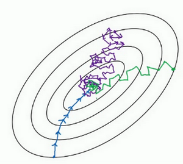

用**mini-batch**梯度下降法，我们从这里开始，一次迭代这样做，两次，三次，四次，它不会总朝向最小值靠近，但它比随机梯度下降要更持续地靠近最小值的方向，它也不一定在很小的范围内收敛或者波动，如果出现这个问题，可以慢慢减少学习率，我们在下个视频会讲到学习率衰减，也就是如何减小学习率。

## 如果**mini-batch**大小既不是1也不是$m$，应该取中间值，那应该怎么选择呢？其实是有指导原则的。

首先，如果训练集较小，直接使用**batch**梯度下降法，样本集较小就没必要使用**mini-batch**梯度下降法，你可以快速处理整个训练集，所以使用**batch**梯度下降法也很好，这里的少是说小于2000个样本，这样比较适合使用**batch**梯度下降法。不然，样本数目较大的话，一般的**mini-batch**大小为64到512，考虑到电脑内存设置和使用的方式，如果**mini-batch**大小是2的$n$次方，代码会运行地快一些，64就是2的6次方，以此类推，128是2的7次方，256是2的8次方，512是2的9次方。所以我经常把**mini-batch**大小设成2的次方。在上一个视频里，我的**mini-batch**大小设为了1000，建议你可以试一下1024，也就是2的10次方。也有**mini-batch**的大小为1024，不过比较少见，64到512的**mini-batch**比较常见。

最后需要注意的是在你的**mini-batch**中，要确保$X^{\{ t\}}​$和$Y^{\{t\}}​$要符合**CPU**/**GPU**内存，取决于你的应用方向以及训练集的大小。如果你处理的**mini-batch**和**CPU**/**GPU**内存不相符，不管你用什么方法处理数据，你会注意到算法的表现急转直下变得惨不忍睹，所以我希望你对一般人们使用的**mini-batch**大小有一个直观了解。事实上**mini-batch**大小是另一个重要的变量，你需要做一个快速尝试，才能找到能够最有效地减少成本函数的那个，我一般会尝试几个不同的值，几个不同的2次方，然后看能否找到一个让梯度下降优化算法最高效的大小。希望这些能够指导你如何开始找到这一数值。

你学会了如何执行**mini-batch**梯度下降，令算法运行得更快，特别是在训练样本数目较大的情况下。不过还有个更高效的算法，比梯度下降法和**mini-batch**梯度下降法都要高效的多，我们在接下来的视频中将为大家一一讲解。

# 3. 指数加权平均数

我想向你展示几个优化算法，它们比梯度下降法快，要理解这些算法，你需要用到指数加权平均，在统计中也叫做指数加权移动平均，我们首先讲这个，然后再来讲更复杂的优化算法。

虽然现在我生活在美国，实际上我生于英国伦敦。比如我这儿有去年伦敦的每日温度，所以1月1号，温度是40华氏度，相当于4摄氏度。我知道世界上大部分地区使用摄氏度，但是美国使用华氏度。在1月2号是9摄氏度等等。在年中的时候，一年365天，年中就是说，大概180天的样子，也就是5月末，温度是60华氏度，也就是15摄氏度等等。夏季温度转暖，然后冬季降温。

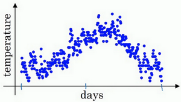

你用数据作图，可以得到以下结果，起始日在1月份，这里是夏季初，这里是年末，相当于12月末。

这里是1月1号，年中接近夏季的时候，随后就是年末的数据，看起来有些杂乱，如果要计算趋势的话，也就是温度的局部平均值，或者说移动平均值。

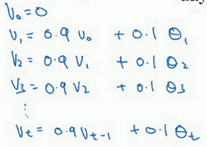

你要做的是，首先使$v_{0} =0$，每天，需要使用0.9的加权数之前的数值加上当日温度的0.1倍，即$v_{1} =0.9v_{0} + 0.1\theta_{1}$，所以这里是第一天的温度值。

第二天，又可以获得一个加权平均数，0.9乘以之前的值加上当日的温度0.1倍，即$v_{2}= 0.9v_{1} + 0.1\theta_{2}$，以此类推。

第二天值加上第三日数据的0.1，如此往下。大体公式就是某天的$v$等于前一天$v$值的0.9加上当日温度的0.1。

如此计算，然后用红线作图的话，便得到这样的结果。

你得到了移动平均值，每日温度的指数加权平均值。

看一下上一张幻灯片里的公式，$v_{t} = 0.9v_{t - 1} +0.1\theta_{t}$，我们把0.9这个常数变成$\beta$，将之前的0.1变成$(1 - \beta)$，即$v_{t} = \beta v_{t - 1} + (1 - \beta)\theta_{t}$

由于以后我们要考虑的原因，在计算时可视$v_{t}$大概是$\frac{1}{(1 -\beta)}$的每日温度，如果$\beta$是0.9，你会想，这是十天的平均值，也就是红线部分。

我们来试试别的，将$\beta$设置为接近1的一个值，比如0.98，计算$\frac{1}{(1 - 0.98)} =50$，这就是粗略平均了一下，过去50天的温度，这时作图可以得到绿线。

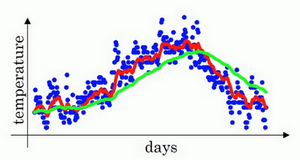

这个高值$\beta$要注意几点，你得到的曲线要平坦一些，原因在于你多平均了几天的温度，所以这个曲线，波动更小，更加平坦，缺点是曲线进一步右移，因为现在平均的温度值更多，要平均更多的值，指数加权平均公式在温度变化时，适应地更缓慢一些，所以会出现一定延迟，因为当$\beta=0.98$，相当于给前一天的值加了太多权重，只有0.02的权重给了当日的值，所以温度变化时，温度上下起伏，当$\beta$ 较大时，指数加权平均值适应地更缓慢一些。

我们可以再换一个值试一试，如果$\beta$是另一个极端值，比如说0.5，根据右边的公式（$\frac{1}{(1-\beta)}$），这是平均了两天的温度。

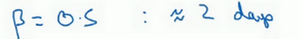

作图运行后得到黄线。

由于仅平均了两天的温度，平均的数据太少，所以得到的曲线有更多的噪声，有可能出现异常值，但是这个曲线能够更快适应温度变化。

所以指数加权平均数经常被使用，再说一次，它在统计学中被称为指数加权移动平均值，我们就简称为指数加权平均数。通过调整这个参数（$\beta$），或者说后面的算法学习，你会发现这是一个很重要的参数，可以取得稍微不同的效果，往往中间有某个值效果最好，$\beta$为中间值时得到的红色曲线，比起绿线和黄线更好地平均了温度。

现在你知道计算指数加权平均数的基本原理，下一个视频中，我们再聊聊它的本质作用。

# 4. 理解指数加权平均数

上个视频中，我们讲到了指数加权平均数，这是几个优化算法中的关键一环，而这几个优化算法能帮助你训练神经网络。本视频中，我希望进一步探讨算法的本质作用。

回忆一下这个计算指数加权平均数的关键方程。

${{v}_{t}}=\beta {{v}_{t-1}}+(1-\beta ){{\theta }_{t}}$

$\beta=0.9$的时候，得到的结果是红线，如果它更接近于1，比如0.98，结果就是绿线，如果$\beta$小一点，如果是0.5，结果就是黄线。

我们进一步地分析，来理解如何计算出每日温度的平均值。

同样的公式，${{v}_{t}}=\beta {{v}_{t-1}}+(1-\beta ){{\theta }_{t}}$

使$\beta=0.9$，写下相应的几个公式，所以在执行的时候，$t$从0到1到2到3，$t$的值在不断增加，为了更好地分析，我写的时候使得$t$的值不断减小，然后继续往下写。

首先看第一个公式，理解$v_{100}$是什么？我们调换一下这两项（$0.9v_{99}0.1\theta_{100}$），$v_{100}= 0.1\theta_{100} + 0.9v_{99}$。

那么$v_{99}$是什么？我们就代入这个公式（$v_{99} = 0.1\theta_{99} +0.9v_{98}$），所以：

$v_{100} = 0.1\theta_{100} + 0.9(0.1\theta_{99} + 0.9v_{98})$。

那么$v_{98}$是什么？你可以用这个公式计算（$v_{98} = 0.1\theta_{98} +0.9v_{97}$），把公式代进去，所以：

$v_{100} = 0.1\theta_{100} + 0.9(0.1\theta_{99} + 0.9(0.1\theta_{98} +0.9v_{97}))$。

以此类推，如果你把这些括号都展开，

$v_{100} = 0.1\theta_{100} + 0.1 \times 0.9 \theta_{99} + 0.1 \times {(0.9)}^{2}\theta_{98} + 0.1 \times {(0.9)}^{3}\theta_{97} + 0.1 \times {(0.9)}^{4}\theta_{96} + \ldots$

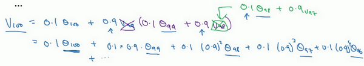

所以这是一个加和并平均，100号数据，也就是当日温度。我们分析$v_{100}$的组成，也就是在一年第100天计算的数据，但是这个是总和，包括100号数据，99号数据，97号数据等等。画图的一个办法是，假设我们有一些日期的温度，所以这是数据，这是$t$，所以100号数据有个数值，99号数据有个数值，98号数据等等，$t$为100，99，98等等，这就是数日的温度数值。

然后我们构建一个指数衰减函数，从0.1开始，到$0.1 \times 0.9$，到$0.1 \times {(0.9)}^{2}$，以此类推，所以就有了这个指数衰减函数。

计算$v_{100}$是通过，把两个函数对应的元素，然后求和，用这个数值100号数据值乘以0.1，99号数据值乘以0.1乘以${(0.9)}^{2}$，这是第二项，以此类推，所以选取的是每日温度，将其与指数衰减函数相乘，然后求和，就得到了$v_{100}$。

结果是，稍后我们详细讲解，不过所有的这些系数（$0.10.1 \times 0.90.1 \times {(0.9)}^{2}0.1 \times {(0.9)}^{3}\ldots$），相加起来为1或者逼近1，我们称之为偏差修正，下个视频会涉及。

最后也许你会问，到底需要平均多少天的温度。实际上${(0.9)}^{10}$大约为0.35，这大约是$\frac{1}{e}$，e是自然算法的基础之一。大体上说，如果有$1-\varepsilon$，在这个例子中，$\varepsilon=0.1$，所以$1-\varepsilon=0.9$，${(1-\varepsilon)}^{(\frac{1}{\varepsilon})}$约等于$\frac{1}{e}$，大约是0.34，0.35，换句话说，10天后，曲线的高度下降到$\frac{1}{3}$，相当于在峰值的$\frac{1}{e}$。

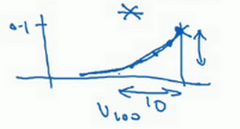

又因此当$\beta=0.9$的时候，我们说仿佛你在计算一个指数加权平均数，只关注了过去10天的温度，因为10天后，权重下降到不到当日权重的三分之一。

相反，如果，那么0.98需要多少次方才能达到这么小的数值？${(0.98)}^{50}$大约等于$\frac{1}{e}$，所以前50天这个数值比$\frac{1}{e}$大，数值会快速衰减，所以本质上这是一个下降幅度很大的函数，你可以看作平均了50天的温度。因为在例子中，要代入等式的左边，$\varepsilon=0.02$，所以$\frac{1}{\varepsilon}$为50，我们由此得到公式，我们平均了大约$\frac{1}{(1-\beta)}$天的温度，这里$\varepsilon$代替了$1-\beta$，也就是说根据一些常数，你能大概知道能够平均多少日的温度，不过这只是思考的大致方向，并不是正式的数学证明。

最后讲讲如何在实际中执行，还记得吗？我们一开始将$v_{0}$设置为0，然后计算第一天$v_{1}$，然后$v_{2}$，以此类推。

现在解释一下算法，可以将$v_{0}$，$v_{1}$，$v_{2}$等等写成明确的变量，不过在实际中执行的话，你要做的是，一开始将$v$初始化为0，然后在第一天使$v:= \beta v + (1 - \beta)\theta_{1}$，然后第二天，更新$v$值，$v: = \beta v + (1 -\beta)\theta_{2}$，以此类推，有些人会把$v$加下标，来表示$v$是用来计算数据的指数加权平均数。

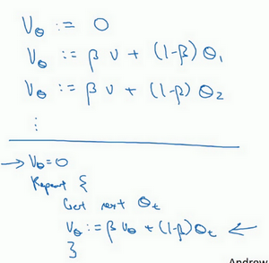

再说一次，但是换个说法，$v_{\theta} =0$，然后每一天，拿到第$t$天的数据，把$v$更新为$v: = \beta v_{\theta} + (1 -\beta)\theta_{t}$。

指数加权平均数公式的好处之一在于，它占用极少内存，电脑内存中只占用一行数字而已，然后把最新数据代入公式，不断覆盖就可以了，正因为这个原因，其效率，它基本上只占用一行代码，计算指数加权平均数也只占用单行数字的存储和内存，当然它并不是最好的，也不是最精准的计算平均数的方法。如果你要计算移动窗，你直接算出过去10天的总和，过去50天的总和，除以10和50就好，如此往往会得到更好的估测。但缺点是，如果保存所有最近的温度数据，和过去10天的总和，必须占用更多的内存，执行更加复杂，计算成本也更加高昂。

所以在接下来的视频中，我们会计算多个变量的平均值，从计算和内存效率来说，这是一个有效的方法，所以在机器学习中会经常使用，更不用说只要一行代码，这也是一个优势。

现在你学会了计算指数加权平均数，你还需要知道一个专业概念，叫做偏差修正，下一个视频我们会讲到它，接着你就可以用它构建更好的优化算法，而不是简单直接的梯度下降法。

# 5. 指数加权平均的偏差修正（Bias correction in exponentially weighted averages）

你学过了如何计算指数加权平均数，有一个技术名词叫做偏差修正，可以让平均数运算更加准确，来看看它是怎么运行的。

${{v}_{t}}=\beta {{v}_{t-1}}+(1-\beta ){{\theta }_{t}}$

在上一个视频中，这个（红色）曲线对应$\beta$的值为0.9，这个（绿色）曲线对应的$\beta$=0.98，如果你执行写在这里的公式，在$\beta$等于0.98的时候，得到的并不是绿色曲线，而是紫色曲线，你可以注意到紫色曲线的起点较低，我们来看看怎么处理。

计算移动平均数的时候，初始化$v_{0} = 0$，$v_{1} = 0.98v_{0} +0.02\theta_{1}$，但是$v_{0} =0$，所以这部分没有了（$0.98v_{0}$），所以$v_{1} =0.02\theta_{1}$，所以如果一天温度是40华氏度，那么$v_{1} = 0.02\theta_{1} =0.02 \times 40 = 8$，因此得到的值会小很多，所以第一天温度的估测不准。

$v_{2} = 0.98v_{1} + 0.02\theta_{2}$，如果代入$v_{1}$，然后相乘，所以$v_{2}= 0.98 \times 0.02\theta_{1} + 0.02\theta_{2} = 0.0196\theta_{1} +0.02\theta_{2}$，假设$\theta_{1}$和$\theta_{2}$都是正数，计算后$v_{2}$要远小于$\theta_{1}$和$\theta_{2}$，所以$v_{2}$不能很好估测出这一年前两天的温度。

有个办法可以修改这一估测，让估测变得更好，更准确，特别是在估测初期，也就是不用$v_{t}$，而是用$\frac{v_{t}}{1- \beta^{t}}$，t就是现在的天数。举个具体例子，当$t=2$时，$1 - \beta^{t} = 1 -  {0.98}^{2} = 0.0396$，因此对第二天温度的估测变成了$\frac{v_{2}}{0.0396} =\frac{0.0196\theta_{1} +  0.02\theta_{2}}{0.0396}$，也就是$\theta_{1}$和$\theta_{2}$的加权平均数，并去除了偏差。你会发现随着$t$增加，$\beta^{t}$接近于0，所以当$t$很大的时候，偏差修正几乎没有作用，因此当$t$较大的时候，紫线基本和绿线重合了。不过在开始学习阶段，你才开始预测热身练习，偏差修正可以帮助你更好预测温度，偏差修正可以帮助你使结果从紫线变成绿线。

在机器学习中，在计算指数加权平均数的大部分时候，大家不在乎执行偏差修正，因为大部分人宁愿熬过初始时期，拿到具有偏差的估测，然后继续计算下去。如果你关心初始时期的偏差，在刚开始计算指数加权移动平均数的时候，偏差修正能帮助你在早期获取更好的估测。
