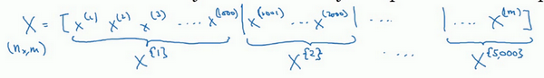
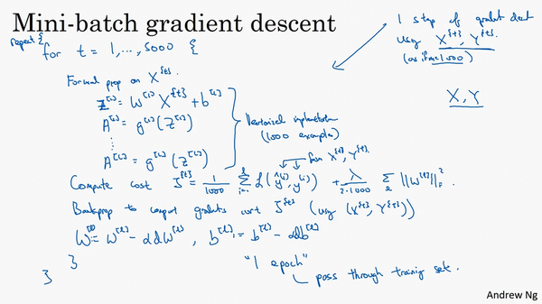
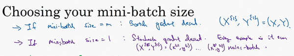

# 1. Mini-Batch 梯度下降

***一般用在大型数据集上***  
## KEY:
将数据集划分为若干个大小的子集合

本周将学习优化算法，这能让你的神经网络运行得更快。机器学习的应用是一个高度依赖经验的过程，伴随着大量迭代的过程，你需要训练诸多模型，才能找到合适的那一个，所以，优化算法能够帮助你快速训练模型。

其中一个难点在于，深度学习没有在大数据领域发挥最大的效果，我们可以利用一个巨大的数据集来训练神经网络，而在巨大的数据集基础上进行训练速度很慢。因此，你会发现，使用快速的优化算法，使用好用的优化算法能够大大提高你和团队的效率，那么，我们首先来谈谈**mini-batch**梯度下降法。

你之前学过，向量化能够让你有效地对所有$m$个样本进行计算，允许你处理整个训练集，而无需某个明确的公式。所以我们要把训练样本放大巨大的矩阵$X$当中去，$X= \lbrack x^{(1)}\ x^{(2)}\ x^{(3)}\ldots\ldots x^{(m)}\rbrack$，$Y$也是如此，$Y= \lbrack y^{(1)}\ y^{(2)}\ y^{(3)}\ldots \ldots y^{(m)}\rbrack$，所以$X$的维数是$(n_{x},m)$，$Y$的维数是$(1,m)$，向量化能够让你相对较快地处理所有$m$个样本。如果$m$很大的话，处理速度仍然缓慢。比如说，如果$m$是500万或5000万或者更大的一个数，在对整个训练集执行梯度下降法时，你要做的是，你必须处理整个训练集，然后才能进行一步梯度下降法，然后你需要再重新处理500万个训练样本，才能进行下一步梯度下降法。所以如果你在处理完整个500万个样本的训练集之前，先让梯度下降法处理一部分，你的算法速度会更快，准确地说，这是你可以做的一些事情。

你可以把训练集分割为小一点的子集训练，这些子集被取名为**mini-batch**，假设每一个子集中只有1000个样本，那么把其中的$x^{(1)}$到$x^{(1000)}$取出来，将其称为第一个子训练集，也叫做**mini-batch**，然后你再取出接下来的1000个样本，从$x^{(1001)}$到$x^{(2000)}$，然后再取1000个样本，以此类推。

接下来我要说一个新的符号，把$x^{(1)}$到$x^{(1000)}$称为$X^{\{1\}}$，$x^{(1001)}$到$x^{(2000)}$称为$X^{\{2\}}$，如果你的训练样本一共有500万个，每个**mini-batch**都有1000个样本，也就是说，你有5000个**mini-batch**，因为5000乘以1000就是5000万。

你共有5000个**mini-batch**，所以最后得到是$X^{\left\{ 5000 \right\}}$

对$Y$也要进行相同处理，你也要相应地拆分$Y$的训练集，所以这是$Y^{\{1\}}$，然后从$y^{(1001)}$到$y^{(2000)}$，这个叫$Y^{\{2\}}$，一直到$Y^{\{ 5000\}}$。

**mini-batch**的数量$t$组成了$X^{\{ t\}}$和$Y^{\{t\}}$，这就是1000个训练样本，包含相应的输入输出对。

在继续课程之前，先确定一下我的符号，之前我们使用了上角小括号$(i)$表示训练集里的值，所以$x^{(i)}$是第$i$个训练样本。我们用了上角中括号$[l]$来表示神经网络的层数，$z^{\lbrack l\rbrack}$表示神经网络中第$l$层的$z$值，我们现在引入了大括号${t}$来代表不同的**mini-batch**，所以我们有$X^{\{ t\}}$和$Y^{\{ t\}}$，检查一下自己是否理解无误。

$X^{\{ t\}}$和$Y^{\{ t\}}$的维数：如果$X^{\{1\}}$是一个有1000个样本的训练集，或者说是1000个样本的$x$值，所以维数应该是$(n_{x},1000)$，$X^{\{2\}}$的维数应该是$(n_{x},1000)$，以此类推。因此所有的子集维数都是$(n_{x},1000)$，而这些（$Y^{\{ t\}}$）的维数都是$(1,1000)$。

解释一下这个算法的名称，**batch**梯度下降法指的是我们之前讲过的梯度下降法算法，就是同时处理整个训练集，这个名字就是来源于能够同时看到整个**batch**训练集的样本被处理，这个名字不怎么样，但就是这样叫它。

相比之下，**mini-batch**梯度下降法，指的是我们在下一张幻灯片中会讲到的算法，你每次同时处理的单个的**mini-batch** $X^{\{t\}}$和$Y^{\{ t\}}$，而不是同时处理全部的$X$和$Y$训练集。

那么究竟**mini-batch**梯度下降法的原理是什么？在训练集上运行**mini-batch**梯度下降法，你运行`for t=1……5000`，因为我们有5000个各有1000个样本的组，在**for**循环里你要做得基本就是对$X^{\{t\}}$和$Y^{\{t\}}$执行一步梯度下降法。假设你有一个拥有1000个样本的训练集，而且假设你已经很熟悉一次性处理完的方法，你要用向量化去几乎同时处理1000个样本。

首先对输入也就是$X^{\{ t\}}$，执行前向传播，然后执行$z^{\lbrack 1\rbrack} =W^{\lbrack 1\rbrack}X + b^{\lbrack 1\rbrack}$，之前我们这里只有，但是现在你正在处理整个训练集，你在处理第一个**mini-batch**，在处理**mini-batch**时它变成了$X^{\{ t\}}$，即$z^{\lbrack 1\rbrack} = W^{\lbrack 1\rbrack}X^{\{ t\}} + b^{\lbrack1\rbrack}$，然后执行$A^{[1]k} =g^{[1]}(Z^{[1]})$，之所以用大写的$Z$是因为这是一个向量内涵，以此类推，直到$A^{\lbrack L\rbrack} = g^{\left\lbrack L \right\rbrack}(Z^{\lbrack L\rbrack})$，这就是你的预测值。注意这里你需要用到一个向量化的执行命令，这个向量化的执行命令，一次性处理1000个而不是500万个样本。接下来你要计算损失成本函数$J$，因为子集规模是1000，$J= \frac{1}{1000}\sum_{i = 1}^{l}{L(\hat y^{(i)},y^{(i)})}$，说明一下，这（$L(\hat y^{(i)},y^{(i)})$）指的是来自于**mini-batch**$X^{\{ t\}}$和$Y^{\{t\}}$中的样本。

如果你用到了正则化，你也可以使用正则化的术语，$J =\frac{1}{1000}\sum_{i = 1}^{l}{L(\hat y^{(i)},y^{(i)})} +\frac{\lambda}{2 1000}\sum_{l}^{}{||w^{[l]}||}_{F}^{2}$，因为这是一个**mini-batch**的损失，所以我将$J$损失记为上角标$t$，放在大括号里（$J^{\{t\}} = \frac{1}{1000}\sum_{i = 1}^{l}{L(\hat y^{(i)},y^{(i)})} +\frac{\lambda}{2 1000}\sum_{l}^{}{||w^{[l]}||}_{F}^{2}$）。

你也会注意到，我们做的一切似曾相识，其实跟之前我们执行梯度下降法如出一辙，除了你现在的对象不是$X​$，$Y​$，而是$X^{\{t\}}​$和$Y^{\{ t\}}​$。接下来，你执行反向传播来计算$J^{\{t\}}​$的梯度，你只是使用$X^{\{ t\}}​$和$Y^{\{t\}}​$，然后你更新加权值，$W​$实际上是$W^{\lbrack l\rbrack}​$，更新为$W^{[l]}:= W^{[l]} - adW^{[l]}​$，对$b​$做相同处理，$b^{[l]}:= b^{[l]} - adb^{[l]}​$。这是使用**mini-batch**梯度下降法训练样本的一步，我写下的代码也可被称为进行“一代”（**1 epoch**）的训练。一代这个词意味着只是一次遍历了训练集。

使用**batch**梯度下降法，一次遍历训练集只能让你做一个梯度下降，使用**mini-batch**梯度下降法，一次遍历训练集，能让你做5000个梯度下降。当然正常来说你想要多次遍历训练集，还需要为另一个**while**循环设置另一个**for**循环。所以你可以一直处理遍历训练集，直到最后你能收敛到一个合适的精度。

如果你有一个丢失的训练集，**mini-batch**梯度下降法比**batch**梯度下降法运行地更快，所以几乎每个研习深度学习的人在训练巨大的数据集时都会用到，下一个视频中，我们将进一步深度讨论**mini-batch**梯度下降法，你也会因此更好地理解它的作用和原理。

# 2. 理解mini-batch梯度下降法

在上周视频中，你知道了如何利用**mini-batch**梯度下降法来开始处理训练集和开始梯度下降，即使你只处理了部分训练集，即使你是第一次处理，本视频中，我们将进一步学习如何执行梯度下降法，更好地理解其作用和原理。

使用**batch**梯度下降法时，每次迭代你都需要历遍整个训练集，可以预期每次迭代成本都会下降，所以如果成本函数$J$是迭代次数的一个函数，它应该会随着每次迭代而减少，如果$J$在某次迭代中增加了，那肯定出了问题，也许你的学习率太大。

使用**mini-batch**梯度下降法，如果你作出成本函数在整个过程中的图，则并不是每次迭代都是下降的，特别是在每次迭代中，你要处理的是$X^{\{t\}}$和$Y^{\{ t\}}$，如果要作出成本函数$J^{\{ t\}}$的图，而$J^{\{t\}}$只和$X^{\{ t\}}$，$Y^{\{t\}}$有关，也就是每次迭代下你都在训练不同的样本集或者说训练不同的**mini-batch**，如果你要作出成本函数$J$的图，你很可能会看到这样的结果，走向朝下，但有更多的噪声，所以如果你作出$J^{\{t\}}$的图，因为在训练**mini-batch**梯度下降法时，会经过多代，你可能会看到这样的曲线。没有每次迭代都下降是不要紧的，但走势应该向下，噪声产生的原因在于也许$X^{\{1\}}$和$Y^{\{1\}}$是比较容易计算的**mini-batch**，因此成本会低一些。不过也许出于偶然，$X^{\{2\}}$和$Y^{\{2\}}$是比较难运算的**mini-batch**，或许你需要一些残缺的样本，这样一来，成本会更高一些，所以才会出现这些摆动，因为你是在运行**mini-batch**梯度下降法作出成本函数图。

你需要决定的变量之一是**mini-batch**的大小，$m$就是训练集的大小，极端情况下，如果**mini-batch**的大小等于$m$，其实就是**batch**梯度下降法，在这种极端情况下，你就有了**mini-batch**  $X^{\{1\}}$和$Y^{\{1\}}$，并且该**mini-batch**等于整个训练集，所以把**mini-batch**大小设为$m$可以得到**batch**梯度下降法。

另一个极端情况，假设**mini-batch**大小为1，就有了新的算法，叫做随机梯度下降法，每个样本都是独立的**mini-batch**，当你看第一个**mini-batch**，也就是$X^{\{1\}}$和$Y^{\{1\}}$，如果**mini-batch**大小为1，它就是你的第一个训练样本，这就是你的第一个训练样本。接着再看第二个**mini-batch**，也就是第二个训练样本，采取梯度下降步骤，然后是第三个训练样本，以此类推，一次只处理一个。

看在两种极端下成本函数的优化情况，如果这是你想要最小化的成本函数的轮廓，最小值在那里，**batch**梯度下降法从某处开始，相对噪声低些，幅度也大一些，你可以继续找最小值。

相反，在随机梯度下降法中，从某一点开始，我们重新选取一个起始点，每次迭代，你只对一个样本进行梯度下降，大部分时候你向着全局最小值靠近，有时候你会远离最小值，因为那个样本恰好给你指的方向不对，因此随机梯度下降法是有很多噪声的，平均来看，它最终会靠近最小值，不过有时候也会方向错误，因为随机梯度下降法永远不会收敛，而是会一直在最小值附近波动，但它并不会在达到最小值并停留在此。

实际上你选择的**mini-batch**大小在二者之间，大小在1和$m$之间，而1太小了，$m$太大了，原因在于如果使用**batch**梯度下降法，**mini-batch**的大小为$m$，每个迭代需要处理大量训练样本，该算法的主要弊端在于特别是在训练样本数量巨大的时候，单次迭代耗时太长。如果训练样本不大，**batch**梯度下降法运行地很好。

相反，如果使用随机梯度下降法，如果你只要处理一个样本，那这个方法很好，这样做没有问题，通过减小学习率，噪声会被改善或有所减小，但随机梯度下降法的一大缺点是，你会失去所有向量化带给你的加速，因为一次性只处理了一个训练样本，这样效率过于低下，所以实践中最好选择不大不小的**mini-batch**尺寸，实际上学习率达到最快。你会发现两个好处，一方面，你得到了大量向量化，上个视频中我们用过的例子中，如果**mini-batch**大小为1000个样本，你就可以对1000个样本向量化，比你一次性处理多个样本快得多。另一方面，你不需要等待整个训练集被处理完就可以开始进行后续工作，再用一下上个视频的数字，每次训练集允许我们采取5000个梯度下降步骤，所以实际上一些位于中间的**mini-batch**大小效果最好。

用**mini-batch**梯度下降法，我们从这里开始，一次迭代这样做，两次，三次，四次，它不会总朝向最小值靠近，但它比随机梯度下降要更持续地靠近最小值的方向，它也不一定在很小的范围内收敛或者波动，如果出现这个问题，可以慢慢减少学习率，我们在下个视频会讲到学习率衰减，也就是如何减小学习率。

## 如果**mini-batch**大小既不是1也不是$m$，应该取中间值，那应该怎么选择呢？其实是有指导原则的。

首先，如果训练集较小，直接使用**batch**梯度下降法，样本集较小就没必要使用**mini-batch**梯度下降法，你可以快速处理整个训练集，所以使用**batch**梯度下降法也很好，这里的少是说小于2000个样本，这样比较适合使用**batch**梯度下降法。不然，样本数目较大的话，一般的**mini-batch**大小为64到512，考虑到电脑内存设置和使用的方式，如果**mini-batch**大小是2的$n$次方，代码会运行地快一些，64就是2的6次方，以此类推，128是2的7次方，256是2的8次方，512是2的9次方。所以我经常把**mini-batch**大小设成2的次方。在上一个视频里，我的**mini-batch**大小设为了1000，建议你可以试一下1024，也就是2的10次方。也有**mini-batch**的大小为1024，不过比较少见，64到512的**mini-batch**比较常见。

最后需要注意的是在你的**mini-batch**中，要确保$X^{\{ t\}}​$和$Y^{\{t\}}​$要符合**CPU**/**GPU**内存，取决于你的应用方向以及训练集的大小。如果你处理的**mini-batch**和**CPU**/**GPU**内存不相符，不管你用什么方法处理数据，你会注意到算法的表现急转直下变得惨不忍睹，所以我希望你对一般人们使用的**mini-batch**大小有一个直观了解。事实上**mini-batch**大小是另一个重要的变量，你需要做一个快速尝试，才能找到能够最有效地减少成本函数的那个，我一般会尝试几个不同的值，几个不同的2次方，然后看能否找到一个让梯度下降优化算法最高效的大小。希望这些能够指导你如何开始找到这一数值。

你学会了如何执行**mini-batch**梯度下降，令算法运行得更快，特别是在训练样本数目较大的情况下。不过还有个更高效的算法，比梯度下降法和**mini-batch**梯度下降法都要高效的多，我们在接下来的视频中将为大家一一讲解。