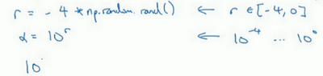
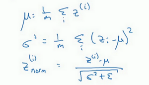

# 1. 调试处理


上图中调整的重要程度：  
红色==》橙色==》紫色==>Adam的参数

关于训练深度最难的事情之一是你要处理的参数的数量，从学习速率$a$到**Momentum**（动量梯度下降法）的参数$\beta$。如果使用**Momentum**或**Adam**优化算法的参数，$\beta_{1}$，${\beta}_{2}$和$\varepsilon$，也许你还得选择层数，也许你还得选择不同层中隐藏单元的数量，也许你还想使用学习率衰减。所以，你使用的不是单一的学习率$a$。接着，当然你可能还需要选择**mini-batch**的大小。

结果证实一些超参数比其它的更为重要，我认为，最为广泛的学习应用是$a$，学习速率是需要调试的最重要的超参数。

除了$a$，还有一些参数需要调试，例如**Momentum**参数$\beta$，0.9就是个很好的默认值。我还会调试**mini-batch**的大小，以确保最优算法运行有效。我还会经常调试隐藏单元，我用橙色圈住的这些，这三个是我觉得其次比较重要的，相对于$a$而言。重要性排第三位的是其他因素，层数有时会产生很大的影响，学习率衰减也是如此。当应用**Adam**算法时，事实上，我从不调试$\beta_{1}$，${\beta}_{2}$和$\varepsilon$，我总是选定其分别为0.9，0.999和$10^{-8}$，如果你想的话也可以调试它们。

但希望你粗略了解到哪些超参数较为重要，$a$无疑是最重要的，接下来是我用橙色圈住的那些，然后是我用紫色圈住的那些，但这不是严格且快速的标准，我认为，其它深度学习的研究者可能会很不同意我的观点或有着不同的直觉。

-------

**Summary**  
先在整体范围内找到相对最优点，然后再在最优点附近寻找最合适的点。  


现在，如果你尝试调整一些超参数，该如何选择调试值呢？在早一代的机器学习算法中，如果你有两个超参数，这里我会称之为超参1，超参2，常见的做法是在网格中取样点，像这样，然后系统的研究这些数值。这里我放置的是5×5的网格，实践证明，网格可以是5×5，也可多可少，但对于这个例子，你可以尝试这所有的25个点，然后选择哪个参数效果最好。当参数的数量相对较少时，这个方法很实用。

在深度学习领域，我们常做的，我推荐你采用下面的做法，随机选择点，所以你可以选择同等数量的点，对吗？25个点，接着，用这些随机取的点试验超参数的效果。之所以这么做是因为，对于你要解决的问题而言，你很难提前知道哪个超参数最重要，正如你之前看到的，一些超参数的确要比其它的更重要。

举个例子，假设超参数1是$a$（学习速率），取一个极端的例子，假设超参数2是**Adam**算法中，分母中的$\varepsilon$。在这种情况下，$a$的取值很重要，而$\varepsilon$取值则无关紧要。如果你在网格中取点，接着，你试验了$a$的5个取值，那你会发现，无论$\varepsilon$取何值，结果基本上都是一样的。所以，你知道共有25种模型，但进行试验的$a$值只有5个，我认为这是很重要的。

对比而言，如果你随机取值，你会试验25个独立的$a$，似乎你更有可能发现效果做好的那个。


我已经解释了两个参数的情况，实践中，你搜索的超参数可能不止两个。假如，你有三个超参数，这时你搜索的不是一个方格，而是一个立方体，超参数3代表第三维，接着，在三维立方体中取值，你会试验大量的更多的值，三个超参数中每个都是。


实践中，你搜索的可能不止三个超参数有时很难预知，哪个是最重要的超参数，对于你的具体应用而言，随机取值而不是网格取值表明，你探究了更多重要超参数的潜在值，无论结果是什么。

当你给超参数取值时，另一个惯例是采用由粗糙到精细的策略。


比如在二维的那个例子中，你进行了取值，也许你会发现效果最好的某个点，也许这个点周围的其他一些点效果也很好，那在接下来要做的是放大这块小区域（小蓝色方框内），然后在其中更密集得取值或随机取值，聚集更多的资源，在这个蓝色的方格中搜索，如果你怀疑这些超参数在这个区域的最优结果，那在整个的方格中进行粗略搜索后，你会知道接下来应该聚焦到更小的方格中。在更小的方格中，你可以更密集得取点。所以这种从粗到细的搜索也经常使用。

通过试验超参数的不同取值，你可以选择对训练集目标而言的最优值，或对于开发集而言的最优值，或在超参搜索过程中你最想优化的东西。

我希望，这能给你提供一种方法去系统地组织超参数搜索过程。另一个关键点是随机取值和精确搜索，考虑使用由粗糙到精细的搜索过程。但超参数的搜索内容还不止这些，在下一个视频中，我会继续讲解关于如何选择超参数取值的合理范围。

# 2. 为超参数选择合适的范围

## 随机均匀取值

适用于例如$n^{[l]},layers$，等一系列线性变化参数


假设你要选取隐藏单元的数量$n^{[l]}$，假设，你选取的取值范围是从50到100中某点，这种情况下，看到这条从50-100的数轴，你可以随机在其取点，这是一个搜索特定超参数的很直观的方式。或者，如果你要选取神经网络的层数，我们称之为字母$L$，你也许会选择层数为2到4中的某个值，接着顺着2，3，4随机均匀取样才比较合理，你还可以应用网格搜索，你会觉得2，3，4，这三个数值是合理的，这是在几个在你考虑范围内随机均匀取值的例子，这些取值还蛮合理的，但对某些超参数而言不适用。

## 对数取值


看看这个例子，假设你在搜索超参数$a$（学习速率），假设你怀疑其值最小是0.0001或最大是1。如果你画一条从0.0001到1的数轴，沿其随机均匀取值，那90%的数值将会落在0.1到1之间，结果就是，在0.1到1之间，应用了90%的资源，而在0.0001到0.1之间，只有10%的搜索资源，这看上去不太对。

反而，用对数标尺搜索超参数的方式会更合理，因此这里不使用线性轴，分别依次取0.0001，0.001，0.01，0.1，1，在对数轴上均匀随机取点，这样，在0.0001到0.001之间，就会有更多的搜索资源可用，还有在0.001到0.01之间等等。



所以在**Python**中，你可以这样做，
```Python
r = -14*np.random.rand() # r --> -4~0
alpha = np.power()
```


更常见的情况是，如果你在$10^{a}$和$10^{b}$之间取值，在此例中，这是$10^{a}$（0.0001），你可以通过$\operatorname{}{0.0001}$算出$a$的值，即-4，在右边的值是$10^{b}$，你可以算出$b$的值$\operatorname{}1$，即0。你要做的就是在$[a,b]$区间随机均匀地给$r$取值，这个例子中$r \in \lbrack - 4,0\rbrack$，然后你可以设置$a$的值，基于随机取样的超参数$a =10^{r}$。


所以总结一下，在对数坐标下取值，取最小值的对数就得到$a$的值，取最大值的对数就得到$b$值，所以现在你在对数轴上的$10^{a}$到$10^{b}$区间取值，在$a$，$b$间随意均匀的选取$r$值，将超参数设置为$10^{r}$，这就是在对数轴上取值的过程。


最后，另一个棘手的例子是给$\beta$ 取值，用于计算指数的加权平均值。假设你认为$\beta$是0.9到0.999之间的某个值，也许这就是你想搜索的范围。记住这一点，当计算指数的加权平均值时，取0.9就像在10个值中计算平均值，有点类似于计算10天的温度平均值，而取0.999就是在1000个值中取平均。

所以和上张幻灯片上的内容类似，如果你想在0.9到0.999区间搜索，那就不能用线性轴取值，对吧？不要随机均匀在此区间取值，所以考虑这个问题最好的方法就是，我们要探究的是$1-\beta$，此值在0.1到0.001区间内，所以我们会给$1-\beta$取值，大概是从0.1到0.001，应用之前幻灯片中介绍的方法，这是$10^{-1}$，这是$10^{-3}$，值得注意的是，在之前的幻灯片里，我们把最小值写在左边，最大值写在右边，但在这里，我们颠倒了大小。这里，左边的是最大值，右边的是最小值。所以你要做的就是在$[-3,-1]$里随机均匀的给r取值。你设定了$1- \beta = 10^{r}$，所以$\beta = 1-10^{r}$，然后这就变成了在特定的选择范围内超参数随机取值。希望用这种方式得到想要的结果，你在0.9到0.99区间探究的资源，和在0.99到0.999区间探究的一样多。


所以，如果你想研究更多正式的数学证明，关于为什么我们要这样做，为什么用线性轴取值不是个好办法，这是因为当$\beta$ 接近1时，所得结果的灵敏度会变化，即使$\beta$有微小的变化。所以$\beta$ 在0.9到0.9005之间取值，无关紧要，你的结果几乎不会变化。


但$\beta$值如果在0.999到0.9995之间，这会对你的算法产生巨大影响，对吧？在这两种情况下，是根据大概10个值取平均。但这里，它是指数的加权平均值，基于1000个值，现在是2000个值，因为这个公式$\frac{1}{1- \beta}$，当$\beta$接近1时，$\beta$就会对细微的变化变得很敏感。所以整个取值过程中，你需要更加密集地取值，在$\beta$ 接近1的区间内，或者说，当$1-\beta$ 接近于0时，这样，你就可以更加有效的分布取样点，更有效率的探究可能的结果。

希望能帮助你选择合适的标尺，来给超参数取值。如果你没有在超参数选择中作出正确的标尺决定，别担心，即使你在均匀的标尺上取值，如果数值总量较多的话，你也会得到还不错的结果，尤其是应用从粗到细的搜索方法，在之后的迭代中，你还是会聚焦到有用的超参数取值范围上。

希望这会对你的超参数搜索有帮助，下一个视频中，我们将会分享一些关于如何组建搜索过程的思考，希望它能使你的工作更高效。

# 3. 超参数调试的实践

一种是你照看一个模型，通常是有庞大的数据组，但没有许多计算资源或足够的**CPU**和**GPU**的前提下，基本而言，你只可以一次负担起试验一个模型或一小批模型，在这种情况下，即使当它在试验时，你也可以逐渐改良。比如，第0天，你将随机参数初始化，然后开始试验，然后你逐渐观察自己的学习曲线，也许是损失函数J，或者数据设置误差或其它的东西，在第1天内逐渐减少，那这一天末的时候，你可能会说，看，它学习得真不错。我试着增加一点学习速率，看看它会怎样，也许结果证明它做得更好，那是你第二天的表现。两天后，你会说，它依旧做得不错，也许我现在可以填充下**Momentum**或减少变量。然后进入第三天，每天，你都会观察它，不断调整你的参数。也许有一天，你会发现你的学习率太大了，所以你可能又回归之前的模型，像这样，但你可以说是在每天花时间照看此模型，即使是它在许多天或许多星期的试验过程中。所以这是一个人们照料一个模型的方法，观察它的表现，耐心地调试学习率，但那通常是因为你没有足够的计算能力，不能在同一时间试验大量模型时才采取的办法。


另一种方法则是同时试验多种模型，你设置了一些超参数，尽管让它自己运行，或者是一天甚至多天，然后你会获得像这样的学习曲线，这可以是损失函数J或实验误差或损失或数据误差的损失，但都是你曲线轨迹的度量。同时你可以开始一个有着不同超参数设定的不同模型，所以，你的第二个模型会生成一个不同的学习曲线，也许是像这样的一条（紫色曲线），我会说这条看起来更好些。与此同时，你可以试验第三种模型，其可能产生一条像这样的学习曲线（红色曲线），还有另一条（绿色曲线），也许这条有所偏离，像这样，等等。或者你可以同时平行试验许多不同的模型，橙色的线就是不同的模型。用这种方式你可以试验许多不同的参数设定，然后只是最后快速选择工作效果最好的那个。在这个例子中，也许这条看起来是最好的（下方绿色曲线）。

# 4. 正则化网络的激活函数

在深度学习兴起后，最重要的一个思想是它的一种算法，叫做**Batch**归一化，由**Sergey loffe**和**Christian Szegedy**两位研究者创造。**Batch**归一化会使你的参数搜索问题变得很容易，使神经网络对超参数的选择更加稳定，超参数的范围会更加庞大，工作效果也很好，也会是你的训练更加容易，甚至是深层网络。让我们来看看**Batch**归一化是怎么起作用的吧。


当训练一个模型，比如**logistic**回归时，你也许会记得，归一化输入特征可以加快学习过程。你计算了平均值，从训练集中减去平均值，计算了方差，接着根据方差归一化你的数据集，在之前的视频中我们看到，这是如何把学习问题的轮廓，从很长的东西，变成更圆的东西，更易于算法优化。所以这是有效的，对**logistic**回归和神经网络的归一化输入特征值而言。


那么更深的模型呢？你不仅输入了特征值$x$，而且这层有激活值$a^{[1]}$，这层有激活值$a^{[2]}$等等。如果你想训练这些参数，比如$w^{[3]}$，$b^{[3]}$，那归一化$a^{[2]}$的平均值和方差岂不是很好？以便使$w^{[3]}$，$b^{[3]}$的训练更有效率。在**logistic**回归的例子中，我们看到了如何归一化$x_{1}$，$x_{2}$，$x_{3}$，会帮助你更有效的训练$w$和$b$。

所以问题来了，对任何一个隐藏层而言，我们能否归一化$a$值，在此例中，比如说$a^{[2]}$的值，但可以是任何隐藏层的，以更快的速度训练$w^{[3]}$，$b^{[3]}$，因为$a^{[2]}$是下一层的输入值，所以就会影响$w^{[3]}$，$b^{[3]}$的训练。简单来说，这就是**Batch**归一化的作用。尽管严格来说，我们真正归一化的不是$a^{[2]}$，而是$z^{[2]}$，深度学习文献中有一些争论，关于在激活函数之前是否应该将值$z^{[2]}$归一化，或是否应该在应用激活函数$a^{[2]}$后再规范值。实践中，经常做的是归一化$z^{[2]}$，所以这就是我介绍的版本，我推荐其为默认选择，

## 那下面就是**Batch**归一化的使用方法。


在神经网络中，已知一些中间值，假设你有一些隐藏单元值，从$z^{(1)}$到$z^{(m)}$，这些来源于隐藏层，所以这样写会更准确，即$z^{[l](i)}$为隐藏层，$i$从1到$m$，但这样书写，我要省略$l$及方括号，以便简化这一行的符号。所以已知这些值，如下，你要计算平均值，强调一下，所有这些都是针对$l$层，但我省略$l$及方括号，然后用正如你常用的那个公式计算方差，接着，你会取每个$z^{(i)}$值，使其规范化，方法如下，减去均值再除以标准偏差，为了使数值稳定，通常将$\varepsilon$作为分母，以防$σ=0$的情况。



所以现在我们已把这些$z$值标准化，化为含平均值0和标准单位方差，所以$z$的每一个分量都含有平均值0和方差1，但我们不想让隐藏单元总是含有平均值0和方差1，也许隐藏单元有了不同的分布会有意义，所以我们所要做的就是计算，我们称之为${\tilde{z}}^{(i)}$，${\tilde{z}}^{(i)}= \gamma z_{\text{norm}}^{(i)} +\beta$，这里$\gamma$和$\beta$是你模型的学习参数，所以我们使用梯度下降或一些其它类似梯度下降的算法，比如**Momentum**或者**Nesterov**，**Adam**，你会更新$\gamma$和$\beta$，正如更新神经网络的权重一样。


请注意$\gamma$和$\beta$的作用是，你可以随意设置${\tilde{z}}^{(i)}$的平均值，事实上，如果$\gamma= \sqrt{\sigma^{2} +\varepsilon}$，如果$\gamma$等于这个分母项（$z_{\text{norm}}^{(i)} = \frac{z^{(i)} -\mu}{\sqrt{\sigma^{2} +\varepsilon}}$中的分母），$\beta$等于$\mu$，这里的这个值是$z_{\text{norm}}^{(i)}= \frac{z^{(i)} - \mu}{\sqrt{\sigma^{2} + \varepsilon}}$中的$\mu$，那么$\gamma z_{\text{norm}}^{(i)} +\beta$的作用在于，它会精确转化这个方程，如果这些成立（$\gamma =\sqrt{\sigma^{2} + \varepsilon},\beta =\mu$），那么${\tilde{z}}^{(i)} = z^{(i)}$。

通过对$\gamma$和$\beta$合理设定，规范化过程，即这四个等式，从根本来说，只是计算恒等函数，通过赋予$\gamma$和$\beta$其它值，可以使你构造含其它平均值和方差的隐藏单元值。


所以，在网络匹配这个单元的方式，之前可能是用$z^{(1)}$，$z^{(2)}$等等，现在则会用${\tilde{z}}^{(i)}$取代$z^{(i)}$，方便神经网络中的后续计算。如果你想放回$[l]$，以清楚的表明它位于哪层，你可以把它放这。


所以我希望你学到的是，归一化输入特征$X$是怎样有助于神经网络中的学习，**Batch**归一化的作用是它适用的归一化过程，不只是输入层，甚至同样适用于神经网络中的深度隐藏层。你应用**Batch**归一化了一些隐藏单元值中的平均值和方差，不过训练输入和这些隐藏单元值的一个区别是，你也许不想隐藏单元值必须是平均值0和方差1。


比如，如果你有**sigmoid**激活函数，你不想让你的值总是全部集中在这里，你想使它们有更大的方差，或不是0的平均值，以便更好的利用非线性的**sigmoid**函数，而不是使所有的值都集中于这个线性版本中，这就是为什么有了$\gamma$和$\beta$两个参数后，你可以确保所有的$z^{(i)}$值可以是你想赋予的任意值，或者它的作用是保证隐藏的单元已使均值和方差标准化。那里，均值和方差由两参数控制，即$\gamma$和$\beta$，学习算法可以设置为任何值，所以它真正的作用是，使隐藏单元值的均值和方差标准化，即$z^{(i)}$有固定的均值和方差，均值和方差可以是0和1，也可以是其它值，它是由$\gamma$和$\beta$两参数控制的。

我希望你能学会怎样使用**Batch**归一化，至少就神经网络的单一层而言，在下一个视频中，我会教你如何将**Batch**归一化与神经网络甚至是深度神经网络相匹配。对于神经网络许多不同层而言，又该如何使它适用，之后，我会告诉你，**Batch**归一化有助于训练神经网络的原因。所以如果觉得**Batch**归一化起作用的原因还显得有点神秘，那跟着我走，在接下来的两个视频中，我们会弄清楚。
