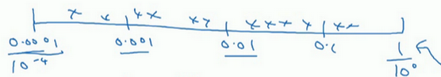
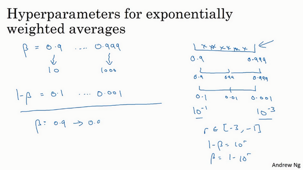

# 1. 调试处理


上图中调整的重要程度：  
红色==》橙色==》紫色==>Adam的参数

关于训练深度最难的事情之一是你要处理的参数的数量，从学习速率$a$到**Momentum**（动量梯度下降法）的参数$\beta$。如果使用**Momentum**或**Adam**优化算法的参数，$\beta_{1}$，${\beta}_{2}$和$\varepsilon$，也许你还得选择层数，也许你还得选择不同层中隐藏单元的数量，也许你还想使用学习率衰减。所以，你使用的不是单一的学习率$a$。接着，当然你可能还需要选择**mini-batch**的大小。

结果证实一些超参数比其它的更为重要，我认为，最为广泛的学习应用是$a$，学习速率是需要调试的最重要的超参数。

除了$a$，还有一些参数需要调试，例如**Momentum**参数$\beta$，0.9就是个很好的默认值。我还会调试**mini-batch**的大小，以确保最优算法运行有效。我还会经常调试隐藏单元，我用橙色圈住的这些，这三个是我觉得其次比较重要的，相对于$a$而言。重要性排第三位的是其他因素，层数有时会产生很大的影响，学习率衰减也是如此。当应用**Adam**算法时，事实上，我从不调试$\beta_{1}$，${\beta}_{2}$和$\varepsilon$，我总是选定其分别为0.9，0.999和$10^{-8}$，如果你想的话也可以调试它们。

但希望你粗略了解到哪些超参数较为重要，$a$无疑是最重要的，接下来是我用橙色圈住的那些，然后是我用紫色圈住的那些，但这不是严格且快速的标准，我认为，其它深度学习的研究者可能会很不同意我的观点或有着不同的直觉。

-------

**Summary**  
先在整体范围内找到相对最优点，然后再在最优点附近寻找最合适的点。  


现在，如果你尝试调整一些超参数，该如何选择调试值呢？在早一代的机器学习算法中，如果你有两个超参数，这里我会称之为超参1，超参2，常见的做法是在网格中取样点，像这样，然后系统的研究这些数值。这里我放置的是5×5的网格，实践证明，网格可以是5×5，也可多可少，但对于这个例子，你可以尝试这所有的25个点，然后选择哪个参数效果最好。当参数的数量相对较少时，这个方法很实用。

在深度学习领域，我们常做的，我推荐你采用下面的做法，随机选择点，所以你可以选择同等数量的点，对吗？25个点，接着，用这些随机取的点试验超参数的效果。之所以这么做是因为，对于你要解决的问题而言，你很难提前知道哪个超参数最重要，正如你之前看到的，一些超参数的确要比其它的更重要。

举个例子，假设超参数1是$a$（学习速率），取一个极端的例子，假设超参数2是**Adam**算法中，分母中的$\varepsilon$。在这种情况下，$a$的取值很重要，而$\varepsilon$取值则无关紧要。如果你在网格中取点，接着，你试验了$a$的5个取值，那你会发现，无论$\varepsilon$取何值，结果基本上都是一样的。所以，你知道共有25种模型，但进行试验的$a$值只有5个，我认为这是很重要的。

对比而言，如果你随机取值，你会试验25个独立的$a$，似乎你更有可能发现效果做好的那个。


我已经解释了两个参数的情况，实践中，你搜索的超参数可能不止两个。假如，你有三个超参数，这时你搜索的不是一个方格，而是一个立方体，超参数3代表第三维，接着，在三维立方体中取值，你会试验大量的更多的值，三个超参数中每个都是。


实践中，你搜索的可能不止三个超参数有时很难预知，哪个是最重要的超参数，对于你的具体应用而言，随机取值而不是网格取值表明，你探究了更多重要超参数的潜在值，无论结果是什么。

当你给超参数取值时，另一个惯例是采用由粗糙到精细的策略。


比如在二维的那个例子中，你进行了取值，也许你会发现效果最好的某个点，也许这个点周围的其他一些点效果也很好，那在接下来要做的是放大这块小区域（小蓝色方框内），然后在其中更密集得取值或随机取值，聚集更多的资源，在这个蓝色的方格中搜索，如果你怀疑这些超参数在这个区域的最优结果，那在整个的方格中进行粗略搜索后，你会知道接下来应该聚焦到更小的方格中。在更小的方格中，你可以更密集得取点。所以这种从粗到细的搜索也经常使用。

通过试验超参数的不同取值，你可以选择对训练集目标而言的最优值，或对于开发集而言的最优值，或在超参搜索过程中你最想优化的东西。

我希望，这能给你提供一种方法去系统地组织超参数搜索过程。另一个关键点是随机取值和精确搜索，考虑使用由粗糙到精细的搜索过程。但超参数的搜索内容还不止这些，在下一个视频中，我会继续讲解关于如何选择超参数取值的合理范围。

# 2. 为超参数选择合适的范围

## 随机均匀取值

适用于例如$n^{[l]},layers$，等一系列线性变化参数


假设你要选取隐藏单元的数量$n^{[l]}$，假设，你选取的取值范围是从50到100中某点，这种情况下，看到这条从50-100的数轴，你可以随机在其取点，这是一个搜索特定超参数的很直观的方式。或者，如果你要选取神经网络的层数，我们称之为字母$L$，你也许会选择层数为2到4中的某个值，接着顺着2，3，4随机均匀取样才比较合理，你还可以应用网格搜索，你会觉得2，3，4，这三个数值是合理的，这是在几个在你考虑范围内随机均匀取值的例子，这些取值还蛮合理的，但对某些超参数而言不适用。

## 对数取值


看看这个例子，假设你在搜索超参数$a$（学习速率），假设你怀疑其值最小是0.0001或最大是1。如果你画一条从0.0001到1的数轴，沿其随机均匀取值，那90%的数值将会落在0.1到1之间，结果就是，在0.1到1之间，应用了90%的资源，而在0.0001到0.1之间，只有10%的搜索资源，这看上去不太对。

反而，用对数标尺搜索超参数的方式会更合理，因此这里不使用线性轴，分别依次取0.0001，0.001，0.01，0.1，1，在对数轴上均匀随机取点，这样，在0.0001到0.001之间，就会有更多的搜索资源可用，还有在0.001到0.01之间等等。


所以在**Python**中，你可以这样做，
```Python
r = -14*np.random.rand() # r --> -4~0
alpha = np.power()
```


更常见的情况是，如果你在$10^{a}$和$10^{b}$之间取值，在此例中，这是$10^{a}$（0.0001），你可以通过$\operatorname{}{0.0001}$算出$a$的值，即-4，在右边的值是$10^{b}$，你可以算出$b$的值$\operatorname{}1$，即0。你要做的就是在$[a,b]$区间随机均匀地给$r$取值，这个例子中$r \in \lbrack - 4,0\rbrack$，然后你可以设置$a$的值，基于随机取样的超参数$a =10^{r}$。


所以总结一下，在对数坐标下取值，取最小值的对数就得到$a$的值，取最大值的对数就得到$b$值，所以现在你在对数轴上的$10^{a}$到$10^{b}$区间取值，在$a$，$b$间随意均匀的选取$r$值，将超参数设置为$10^{r}$，这就是在对数轴上取值的过程。


最后，另一个棘手的例子是给$\beta$ 取值，用于计算指数的加权平均值。假设你认为$\beta$是0.9到0.999之间的某个值，也许这就是你想搜索的范围。记住这一点，当计算指数的加权平均值时，取0.9就像在10个值中计算平均值，有点类似于计算10天的温度平均值，而取0.999就是在1000个值中取平均。

所以和上张幻灯片上的内容类似，如果你想在0.9到0.999区间搜索，那就不能用线性轴取值，对吧？不要随机均匀在此区间取值，所以考虑这个问题最好的方法就是，我们要探究的是$1-\beta$，此值在0.1到0.001区间内，所以我们会给$1-\beta$取值，大概是从0.1到0.001，应用之前幻灯片中介绍的方法，这是$10^{-1}$，这是$10^{-3}$，值得注意的是，在之前的幻灯片里，我们把最小值写在左边，最大值写在右边，但在这里，我们颠倒了大小。这里，左边的是最大值，右边的是最小值。所以你要做的就是在$[-3,-1]$里随机均匀的给r取值。你设定了$1- \beta = 10^{r}$，所以$\beta = 1-10^{r}$，然后这就变成了在特定的选择范围内超参数随机取值。希望用这种方式得到想要的结果，你在0.9到0.99区间探究的资源，和在0.99到0.999区间探究的一样多。



所以，如果你想研究更多正式的数学证明，关于为什么我们要这样做，为什么用线性轴取值不是个好办法，这是因为当$\beta$ 接近1时，所得结果的灵敏度会变化，即使$\beta$有微小的变化。所以$\beta$ 在0.9到0.9005之间取值，无关紧要，你的结果几乎不会变化。


但$\beta$值如果在0.999到0.9995之间，这会对你的算法产生巨大影响，对吧？在这两种情况下，是根据大概10个值取平均。但这里，它是指数的加权平均值，基于1000个值，现在是2000个值，因为这个公式$\frac{1}{1- \beta}$，当$\beta$接近1时，$\beta$就会对细微的变化变得很敏感。所以整个取值过程中，你需要更加密集地取值，在$\beta$ 接近1的区间内，或者说，当$1-\beta$ 接近于0时，这样，你就可以更加有效的分布取样点，更有效率的探究可能的结果。

希望能帮助你选择合适的标尺，来给超参数取值。如果你没有在超参数选择中作出正确的标尺决定，别担心，即使你在均匀的标尺上取值，如果数值总量较多的话，你也会得到还不错的结果，尤其是应用从粗到细的搜索方法，在之后的迭代中，你还是会聚焦到有用的超参数取值范围上。

希望这会对你的超参数搜索有帮助，下一个视频中，我们将会分享一些关于如何组建搜索过程的思考，希望它能使你的工作更高效。