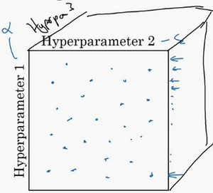

# 1. 调试处理

上图中调整的重要程度：  
红色==》橙色==》紫色==>Adam的参数

关于训练深度最难的事情之一是你要处理的参数的数量，从学习速率$a$到**Momentum**（动量梯度下降法）的参数$\beta$。如果使用**Momentum**或**Adam**优化算法的参数，$\beta_{1}$，${\beta}_{2}$和$\varepsilon$，也许你还得选择层数，也许你还得选择不同层中隐藏单元的数量，也许你还想使用学习率衰减。所以，你使用的不是单一的学习率$a$。接着，当然你可能还需要选择**mini-batch**的大小。

结果证实一些超参数比其它的更为重要，我认为，最为广泛的学习应用是$a$，学习速率是需要调试的最重要的超参数。

除了$a$，还有一些参数需要调试，例如**Momentum**参数$\beta$，0.9就是个很好的默认值。我还会调试**mini-batch**的大小，以确保最优算法运行有效。我还会经常调试隐藏单元，我用橙色圈住的这些，这三个是我觉得其次比较重要的，相对于$a$而言。重要性排第三位的是其他因素，层数有时会产生很大的影响，学习率衰减也是如此。当应用**Adam**算法时，事实上，我从不调试$\beta_{1}$，${\beta}_{2}$和$\varepsilon$，我总是选定其分别为0.9，0.999和$10^{-8}$，如果你想的话也可以调试它们。

但希望你粗略了解到哪些超参数较为重要，$a$无疑是最重要的，接下来是我用橙色圈住的那些，然后是我用紫色圈住的那些，但这不是严格且快速的标准，我认为，其它深度学习的研究者可能会很不同意我的观点或有着不同的直觉。

-------

现在，如果你尝试调整一些超参数，该如何选择调试值呢？在早一代的机器学习算法中，如果你有两个超参数，这里我会称之为超参1，超参2，常见的做法是在网格中取样点，像这样，然后系统的研究这些数值。这里我放置的是5×5的网格，实践证明，网格可以是5×5，也可多可少，但对于这个例子，你可以尝试这所有的25个点，然后选择哪个参数效果最好。当参数的数量相对较少时，这个方法很实用。

在深度学习领域，我们常做的，我推荐你采用下面的做法，随机选择点，所以你可以选择同等数量的点，对吗？25个点，接着，用这些随机取的点试验超参数的效果。之所以这么做是因为，对于你要解决的问题而言，你很难提前知道哪个超参数最重要，正如你之前看到的，一些超参数的确要比其它的更重要。

举个例子，假设超参数1是$a$（学习速率），取一个极端的例子，假设超参数2是**Adam**算法中，分母中的$\varepsilon$。在这种情况下，$a$的取值很重要，而$\varepsilon$取值则无关紧要。如果你在网格中取点，接着，你试验了$a$的5个取值，那你会发现，无论$\varepsilon$取何值，结果基本上都是一样的。所以，你知道共有25种模型，但进行试验的$a$值只有5个，我认为这是很重要的。

对比而言，如果你随机取值，你会试验25个独立的$a$，似乎你更有可能发现效果做好的那个。

我已经解释了两个参数的情况，实践中，你搜索的超参数可能不止两个。假如，你有三个超参数，这时你搜索的不是一个方格，而是一个立方体，超参数3代表第三维，接着，在三维立方体中取值，你会试验大量的更多的值，三个超参数中每个都是。

实践中，你搜索的可能不止三个超参数有时很难预知，哪个是最重要的超参数，对于你的具体应用而言，随机取值而不是网格取值表明，你探究了更多重要超参数的潜在值，无论结果是什么。

当你给超参数取值时，另一个惯例是采用由粗糙到精细的策略。

比如在二维的那个例子中，你进行了取值，也许你会发现效果最好的某个点，也许这个点周围的其他一些点效果也很好，那在接下来要做的是放大这块小区域（小蓝色方框内），然后在其中更密集得取值或随机取值，聚集更多的资源，在这个蓝色的方格中搜索，如果你怀疑这些超参数在这个区域的最优结果，那在整个的方格中进行粗略搜索后，你会知道接下来应该聚焦到更小的方格中。在更小的方格中，你可以更密集得取点。所以这种从粗到细的搜索也经常使用。

通过试验超参数的不同取值，你可以选择对训练集目标而言的最优值，或对于开发集而言的最优值，或在超参搜索过程中你最想优化的东西。

我希望，这能给你提供一种方法去系统地组织超参数搜索过程。另一个关键点是随机取值和精确搜索，考虑使用由粗糙到精细的搜索过程。但超参数的搜索内容还不止这些，在下一个视频中，我会继续讲解关于如何选择超参数取值的合理范围。