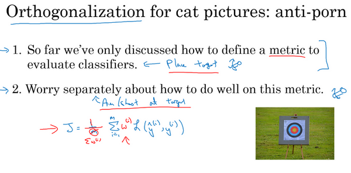

# 1. 为什么是ML策略 (Why ML strategy)

我们从一个启发性的例子开始讲，假设你正在调试你的猫分类器，经过一段时间的调整，你的系统达到了90%准确率，但对你的应用程序来说还不够好。

你可能有很多想法去改善你的系统，比如，你可能想我们去收集更多的训练数据吧。或者你会说，可能你的训练集的多样性还不够，你应该收集更多不同姿势的猫咪图片，或者更多样化的反例集。或者你想再用梯度下降训练算法，训练久一点。或者你想尝试用一个完全不同的优化算法，比如**Adam**优化算法。或者尝试使用规模更大或者更小的神经网络。或者你想试试**dropout**或者$L2$正则化。或者你想修改网络的架构，比如修改激活函数，改变隐藏单元的数目之类的方法。

当你尝试优化一个深度学习系统时，你通常可以有很多想法可以去试，问题在于，如果你做出了错误的选择，你完全有可能白费6个月的时间，往错误的方向前进，在6个月之后才意识到这方法根本不管用。比如，我见过一些团队花了6个月时间收集更多数据，却在6个月之后发现，这些数据几乎没有改善他们系统的性能。所以，假设你的项目没有6个月的时间可以浪费，如果有快速有效的方法能够判断哪些想法是靠谱的，或者甚至提出新的想法，判断哪些是值得一试的想法，哪些是可以放心舍弃的。

我希望在这门课程中，可以教给你们一些策略，一些分析机器学习问题的方法，可以指引你们朝着最有希望的方向前进。这门课中，我会和你们分享我在搭建和部署大量深度学习产品时学到的经验和教训，我想这些内容是这门课程独有的。比如说，很多大学深度学习课程很少提到这些策略。事实上，机器学习策略在深度学习的时代也在变化，因为现在对于深度学习算法来说能够做到的事情，比上一代机器学习算法大不一样。我希望这些策略能帮助你们提高效率，让你们的深度学习系统更快投入实用。

# 2. 正交化

其中：

Fit training set： 更大更复杂的网络、Adam优化算法

Fit dev set：更大的数据集、正则化

Fit test set： 更大的dev set

Fit realworld： 改变dev set 或者cost function

# 3. 单一数字评估指标
查准率(Precision):在你的分类器标记为猫的例子中，有多少真的是猫。所以如果分类器$A$有95%的查准率，这意味着你的分类器说这图有猫的时候，有95%的机会真的是猫。

查全率(Recall):对于所有真猫的图片，你的分类器正确识别出了多少百分比。实际为猫的图片中，有多少被系统识别出来？如果分类器$A$查全率是90%，这意味着对于所有的图像，比如说你的开发集都是真的猫图，分类器$A$准确地分辨出了其中的90%。

这种情况可以使用调和平均数:$\frac{2}{\frac{1}{P}+\frac{1}{R}} = \frac{2PR}{P+R}$

# 4. 满足和优化指标

满足指标(Satisficing Metrics):只需要满足一定的阈值即可

优化指标(Optimizing Metrics):越优化越好

比如上图中的满足指标可以是运行时间需要小于100ms,优化指标是Accuracy should be better。所以最优的Classifier是B。

# 5. 训练/开发/测试集划分
**dev set also called development set, or be called cross validation set.**

机器学习中的工作流程是，你尝试很多思路，用训练集训练不同的模型，然后使用开发集来评估不同的思路，然后选择一个，然后不断迭代去改善开发集的性能，直到最后你可以得到一个令你满意的成本，然后你再用测试集去评估。

***Should make sure your dev set and test ser comes from the same distribution.***

现在，举个例子，你要开发一个猫分类器，然后你在这些区域里运营，美国、英国、其他欧洲国家，南美洲、印度、中国，其他亚洲国家和澳大利亚，那么你应该如何设立开发集和测试集呢？

其中一种做法是，你可以选择其中4个区域，我打算使用这四个（前四个），但也可以是随机选的区域，然后说，来自这四个区域的数据构成开发集。然后其他四个区域，我打算用这四个（后四个），也可以随机选择4个，这些数据构成测试集。

事实证明，这个想法非常糟糕，因为这个例子中，你的开发集和测试集来自不同的分布。我建议你们不要这样，而是让你的开发集和测试集来自同一分布。我的意思是这样，你们要记住，我想就是设立你的开发集加上一个单实数评估指标，这就是像是定下目标，然后告诉你的团队，那就是你要瞄准的靶心，因为你一旦建立了这样的开发集和指标，团队就可以快速迭代，尝试不同的想法，跑实验，可以很快地使用开发集和指标去评估不同分类器，然后尝试选出最好的那个。所以，机器学习团队一般都很擅长使用不同方法去逼近目标，然后不断迭代，不断逼近靶心。所以，针对开发集上的指标优化。

# 6. 开发集和测试集的大小
在大数据时代旧的经验规则，这个70/30不再适用了。现在流行的是把大量数据分到训练集，然后少量数据分到开发集和测试集，特别是当你有一个非常大的数据集时。以前的经验法则其实是为了确保开发集足够大，能够达到它的目的，就是帮你评估不同的想法，然后选出$A$还是$B$更好。测试集的目的是评估你最终的成本偏差，你只需要设立足够大的测试集，可以用来这么评估就行了，可能只需要远远小于总体数据量的30%。

# 7. 什么时候改变开发/测试集和指标

你已经学过如何设置开发集和评估指标，就像是把目标定在某个位置，让你的团队瞄准。但有时候在项目进行途中，你可能意识到，目标的位置放错了。这种情况下，你应该移动你的目标。

我们来看一个例子，假设你在构建一个猫分类器，试图找到很多猫的照片，向你的爱猫人士用户展示，你决定使用的指标是分类错误率。所以算法$A$和$B$分别有3％错误率和5％错误率，所以算法$A$似乎做得更好。

但我们实际试一下这些算法，你观察一下这些算法，算法$A$由于某些原因，把很多色情图像分类成猫了。如果你部署算法$A$，那么用户就会看到更多猫图，因为它识别猫的错误率只有3%，但它同时也会给用户推送一些色情图像，这是你的公司完全不能接受的，你的用户也完全不能接受。相比之下，算法$B$有5％的错误率，这样分类器就得到较少的图像，但它不会推送色情图像。所以从你们公司的角度来看，以及从用户接受的角度来看，算法$B$实际上是一个更好的算法，因为它不让任何色情图像通过。

那么在这个例子中，发生的事情就是，算法A在评估指标上做得更好，它的错误率达到3%，但实际上是个更糟糕的算法。在这种情况下，评估指标加上开发集它们都倾向于选择算法$A$，因为它们会说，看算法A的错误率较低，这是你们自己定下来的指标评估出来的。但你和你的用户更倾向于使用算法$B$，因为它不会将色情图像分类为猫。所以当这种情况发生时，当你的评估指标无法正确衡量算法之间的优劣排序时，在这种情况下，原来的指标错误地预测算法A是更好的算法这就发出了信号，你应该改变评估指标了，或者要改变开发集或测试集。在这种情况下，你用的分类错误率指标可以写成这样：

$Error = \frac{1}{m_{{dev}}}\sum_{i = 1}^{m_{{dev}}}{I\{ y_{{pred}}^{(i)} \neq y^{(i)}\}}$

$m_{{dev}}$是你的开发集例子数，用$y_{{pred}}^{(i)}$表示预测值，其值为0或1，$I$这符号表示一个函数，统计出里面这个表达式为真的样本数，所以这个公式就统计了分类错误的样本。这个评估指标的问题在于，它对色情图片和非色情图片一视同仁，但你其实真的希望你的分类器不会错误标记色情图像。比如说把一张色情图片分类为猫，然后推送给不知情的用户，他们看到色情图片会非常不满。

其中一个修改评估指标的方法是，这里（$\frac{1}{m_{{dev}}}$与$\sum_{i =1}^{m_{{dev}}}{I\{ y_{{pred}}^{(i)} \neq y^{(i)}\}}$之间）加个权重项，即：

$Error = \frac{1}{m_{{dev}}}\sum_{i = 1}^{m_{{dev}}}{w^{(i)}I\{ y_{{pred}}^{(i)} \neq y^{(i)}\}}$

我们将这个称为$w^{\left( i \right)}$，其中如果图片$x^{(i)}$不是色情图片，则$w^{\left( i \right)} = 1$。如果$x^{(i)}$是色情图片，$w^{(i)}$可能就是10甚至100，这样你赋予了色情图片更大的权重，让算法将色情图分类为猫图时，错误率这个项快速变大。这个例子里，你把色情图片分类成猫这一错误的惩罚权重加大10倍。

如果你希望得到归一化常数，在技术上，就是$w^{(i)}$对所有$i$求和，这样错误率仍然在0和1之间，即：

$Error = \frac{1}{\sum_{}^{}w^{(i)}}\sum_{i = 1}^{m_{{dev}}}{w^{(i)}I\{ y_{{pred}}^{(i)} \neq y^{(i)}\}}$

加权的细节并不重要，实际上要使用这种加权，你必须自己过一遍开发集和测试集，在开发集和测试集里，自己把色情图片标记出来，这样你才能使用这个加权函数。

但粗略的结论是，如果你的评估指标无法正确评估好算法的排名，那么就需要花时间定义一个新的评估指标。这是定义评估指标的其中一种可能方式（上述加权法）。评估指标的意义在于，准确告诉你已知两个分类器，哪一个更适合你的应用。就这个视频的内容而言，我们不需要太注重新错误率指标是怎么定义的，关键在于，如果你对旧的错误率指标不满意，那就不要一直沿用你不满意的错误率指标，而应该尝试定义一个新的指标，能够更加符合你的偏好，定义出实际更适合的算法。

你可能注意到了，到目前为止我们只讨论了如何定义一个指标去评估分类器，也就是说，我们定义了一个评估指标帮助我们更好的把分类器排序，能够区分出它们在识别色情图片的不同水平，这实际上是一个正交化的例子。

我想你处理机器学习问题时，应该把它切分成独立的步骤。一步是弄清楚如何定义一个指标来衡量你想做的事情的表现，然后我们可以分开考虑如何改善系统在这个指标上的表现。你们要把机器学习任务看成两个独立的步骤，用目标这个比喻，第一步就是设定目标。所以要定义你要瞄准的目标，这是完全独立的一步，这是你可以调节的一个旋钮。如何设立目标是一个完全独立的问题，把它看成是一个单独的旋钮，可以调试算法表现的旋钮，如何精确瞄准，如何命中目标，定义指标是第一步。

然后第二步要做别的事情，在逼近目标的时候，也许你的学习算法针对某个长这样的成本函数优化，$J=\frac{1}{m}\sum\limits_{i=1}^{m}{L({{\hat y}^{(i)}},{{y}^{(i)}})}$，你要最小化训练集上的损失。你可以做的其中一件事是，修改这个，为了引入这些权重，也许最后需要修改这个归一化常数，即：

$J=\frac{1}{\sum{{{w}^{(i)}}}}\sum\limits_{i=1}^{m}{{{w}^{(i)}}L({{\hat y}^{(i)}},{{y}^{(i)}})}$

再次，如何定义$J$并不重要，关键在于正交化的思路，把设立目标定为第一步，然后瞄准和射击目标是独立的第二步。换种说法，我鼓励你们将定义指标看成一步，然后在定义了指标之后，你才能想如何优化系统来提高这个指标评分。比如改变你神经网络要优化的成本函数$J$。

在继续之前，我们再讲一个例子。假设你的两个猫分类器$A$和$B$，分别有用开发集评估得到3%的错误率和5%的错误率。或者甚至用在网上下载的图片构成的测试集上，这些是高质量，取景框很专业的图像。但也许你在部署算法产品时，你发现算法$B$看起来表现更好，即使它在开发集上表现不错，你发现你一直在用从网上下载的高质量图片训练，但当你部署到手机应用时，算法作用到用户上传的图片时，那些图片取景不专业，没有把猫完整拍下来，或者猫的表情很古怪，也许图像很模糊，当你实际测试算法时，你发现算法$B$表现其实更好。

这是另一个指标和开发集测试集出问题的例子，问题在于，你做评估用的是很漂亮的高分辨率的开发集和测试集，图片取景很专业。但你的用户真正关心的是，他们上传的图片能不能被正确识别。那些图片可能是没那么专业的照片，有点模糊，取景很业余。

所以方针是，如果你在指标上表现很好，在当前开发集或者开发集和测试集分布中表现很好，但你的实际应用程序，你真正关注的地方表现不好，那么就需要修改指标或者你的开发测试集。换句话说，如果你发现你的开发测试集都是这些高质量图像，但在开发测试集上做的评估无法预测你的应用实际的表现。因为你的应用处理的是低质量图像，那么就应该改变你的开发测试集，让你的数据更能反映你实际需要处理好的数据。

但总体方针就是，如果你当前的指标和当前用来评估的数据和你真正关心必须做好的事情关系不大，那就应该更改你的指标或者你的开发测试集，让它们能更够好地反映你的算法需要处理好的数据。

有一个评估指标和开发集让你可以更快做出决策，判断算法$A$还是算法$B$更优，这真的可以加速你和你的团队迭代的速度。所以我的建议是，即使你无法定义出一个很完美的评估指标和开发集，你直接快速设立出来，然后使用它们来驱动你们团队的迭代速度。如果在这之后，你发现选的不好，你有更好的想法，那么完全可以马上改。对于大多数团队，我建议最好不要在没有评估指标和开发集时跑太久，因为那样可能会减慢你的团队迭代和改善算法的速度。本视频讲的是什么时候需要改变你的评估指标和开发测试集，我希望这些方针能让你的整个团队设立一个明确的目标，一个你们可以高效迭代，改善性能的目标。