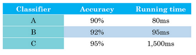

# 1. 为什么是ML策略 (Why ML strategy)

我们从一个启发性的例子开始讲，假设你正在调试你的猫分类器，经过一段时间的调整，你的系统达到了90%准确率，但对你的应用程序来说还不够好。

你可能有很多想法去改善你的系统，比如，你可能想我们去收集更多的训练数据吧。或者你会说，可能你的训练集的多样性还不够，你应该收集更多不同姿势的猫咪图片，或者更多样化的反例集。或者你想再用梯度下降训练算法，训练久一点。或者你想尝试用一个完全不同的优化算法，比如**Adam**优化算法。或者尝试使用规模更大或者更小的神经网络。或者你想试试**dropout**或者$L2$正则化。或者你想修改网络的架构，比如修改激活函数，改变隐藏单元的数目之类的方法。

当你尝试优化一个深度学习系统时，你通常可以有很多想法可以去试，问题在于，如果你做出了错误的选择，你完全有可能白费6个月的时间，往错误的方向前进，在6个月之后才意识到这方法根本不管用。比如，我见过一些团队花了6个月时间收集更多数据，却在6个月之后发现，这些数据几乎没有改善他们系统的性能。所以，假设你的项目没有6个月的时间可以浪费，如果有快速有效的方法能够判断哪些想法是靠谱的，或者甚至提出新的想法，判断哪些是值得一试的想法，哪些是可以放心舍弃的。

我希望在这门课程中，可以教给你们一些策略，一些分析机器学习问题的方法，可以指引你们朝着最有希望的方向前进。这门课中，我会和你们分享我在搭建和部署大量深度学习产品时学到的经验和教训，我想这些内容是这门课程独有的。比如说，很多大学深度学习课程很少提到这些策略。事实上，机器学习策略在深度学习的时代也在变化，因为现在对于深度学习算法来说能够做到的事情，比上一代机器学习算法大不一样。我希望这些策略能帮助你们提高效率，让你们的深度学习系统更快投入实用。

# 2. 正交化

其中：

Fit training set： 更大更复杂的网络、Adam优化算法

Fit dev set：更大的数据集、正则化

Fit test set： 更大的dev set

Fit realworld： 改变dev set 或者cost function

# 3. 单一数字评估指标
查准率(Precision):在你的分类器标记为猫的例子中，有多少真的是猫。所以如果分类器$A$有95%的查准率，这意味着你的分类器说这图有猫的时候，有95%的机会真的是猫。

查全率(Recall):对于所有真猫的图片，你的分类器正确识别出了多少百分比。实际为猫的图片中，有多少被系统识别出来？如果分类器$A$查全率是90%，这意味着对于所有的图像，比如说你的开发集都是真的猫图，分类器$A$准确地分辨出了其中的90%。

这种情况可以使用调和平均数:$\frac{2}{\frac{1}{P}+\frac{1}{R}} = \frac{2PR}{P+R}$

# 4. 满足和优化指标

满足指标(Satisficing Metrics):只需要满足一定的阈值即可

优化指标(Optimizing Metrics):越优化越好

比如上图中的满足指标可以是运行时间需要小于100ms,优化指标是Accuracy should be better。所以最优的Classifier是B。