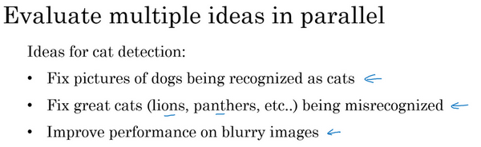

# 1. 进行误差分析

总结一下:进行错误分析，你应该找一组错误样本，可能在你的开发集里或者测试集里，观察错误标记的样本，看看假阳性（**false positives**）和假阴性（**false negatives**），统计属于不同错误类型的错误数量。在这个过程中，你可能会得到启发，归纳出新的错误类型，就像我们看到的那样。如果你过了一遍错误样本，然后说，天，有这么多**Instagram**滤镜或**Snapchat**滤镜，这些滤镜干扰了我的分类器，你就可以在途中新建一个错误类型。总之，通过统计不同错误标记类型占总数的百分比，可以帮你发现哪些问题需要优先解决，或者给你构思新优化方向的灵感。在做错误分析的时候，有时你会注意到开发集里有些样本被错误标记了，这时应该怎么做呢？我们下一个视频来讨论。

你好，欢迎回来，如果你希望让学习算法能够胜任人类能做的任务，但你的学习算法还没有达到人类的表现，那么人工检查一下你的算法犯的错误也许可以让你了解接下来应该做什么。这个过程称为错误分析，我们从一个例子开始讲吧。

假设你正在调试猫分类器，然后你取得了90%准确率，相当于10%错误，，在你的开发集上做到这样，这离你希望的目标还有很远。也许你的队员看了一下算法分类出错的例子，注意到算法将一些狗分类为猫，你看看这两只狗，它们看起来是有点像猫，至少乍一看是。所以也许你的队友给你一个建议，如何针对狗的图片优化算法。试想一下，你可以针对狗，收集更多的狗图，或者设计一些只处理狗的算法功能之类的，为了让你的猫分类器在狗图上做的更好，让算法不再将狗分类成猫。所以问题在于，你是不是应该去开始做一个项目专门处理狗？这项目可能需要花费几个月的时间才能让算法在狗图片上犯更少的错误，这样做值得吗？或者与其花几个月做这个项目，有可能最后发现这样一点用都没有。这里有个错误分析流程，可以让你很快知道这个方向是否值得努力。

这是我建议你做的，首先，收集一下，比如说100个错误标记的开发集样本，然后手动检查，一次只看一个，看看你的开发集里有多少错误标记的样本是狗。现在，假设事实上，你的100个错误标记样本中只有5%是狗，就是说在100个错误标记的开发集样本中，有5个是狗。这意味着100个样本，在典型的100个出错样本中，即使你完全解决了狗的问题，你也只能修正这100个错误中的5个。或者换句话说，如果只有5%的错误是狗图片，那么如果你在狗的问题上花了很多时间，那么你最多只能希望你的错误率从10%下降到9.5%，对吧？错误率相对下降了5%（总体下降了0.5%，100的错误样本，错误率为10%，则样本为1000），那就是10%下降到9.5%。你就可以确定这样花时间不好，或者也许应该花时间，但至少这个分析给出了一个上限。如果你继续处理狗的问题，能够改善算法性能的上限，对吧？在机器学习中，有时我们称之为性能上限，就意味着，最好能到哪里，完全解决狗的问题可以对你有多少帮助。

但现在，假设发生了另一件事，假设我们观察一下这100个错误标记的开发集样本，你发现实际有50张图都是狗，所以有50%都是狗的照片，现在花时间去解决狗的问题可能效果就很好。这种情况下，如果你真的解决了狗的问题，那么你的错误率可能就从10%下降到5%了。然后你可能觉得让错误率减半的方向值得一试，可以集中精力减少错误标记的狗图的问题。

我知道在机器学习中，有时候我们很鄙视手工操作，或者使用了太多人为数值。但如果你要搭建应用系统，那这个简单的人工统计步骤，错误分析，可以节省大量时间，可以迅速决定什么是最重要的，或者最有希望的方向。实际上，如果你观察100个错误标记的开发集样本，也许只需要5到10分钟的时间，亲自看看这100个样本，并亲自统计一下有多少是狗。根据结果，看看有没有占到5%、50%或者其他东西。这个在5到10分钟之内就能给你估计这个方向有多少价值，并且可以帮助你做出更好的决定，是不是把未来几个月的时间投入到解决错误标记的狗图这个问题。

在本幻灯片中，我们要描述一下如何使用错误分析来评估某个想法，这个样本里狗的问题是否值得解决。有时你在做错误分析时，也可以同时并行评估几个想法，比如，你有几个改善猫检测器的想法，也许你可以改善针对狗图的性能，或者有时候要注意，那些猫科动物，如狮子，豹，猎豹等等，它们经常被分类成小猫或者家猫，所以你也许可以想办法解决这个错误。或者也许你发现有些图像是模糊的，如果你能设计出一些系统，能够更好地处理模糊图像。也许你有些想法，知道大概怎么处理这些问题，要进行错误分析来评估这三个想法。

我会做的是建立这样一个表格，我通常用电子表格来做，但普通文本文件也可以。在最左边，人工过一遍你想分析的图像集，所以图像可能是从1到100，如果你观察100张图的话。电子表格的一列就对应你要评估的想法，所以狗的问题，猫科动物的问题，模糊图像的问题，我通常也在电子表格中留下空位来写评论。所以记住，在错误分析过程中，你就看看算法识别错误的开发集样本，如果你发现第一张识别错误的图片是狗图，那么我就在那里打个勾，为了帮我自己记住这些图片，有时我会在评论里注释，也许这是一张比特犬的图。如果第二张照片很模糊，也记一下。如果第三张是在下雨天动物园里的狮子，被识别成猫了，这是大型猫科动物，还有图片模糊，在评论部分写动物园下雨天，是雨天让图像模糊的之类的。最后，这组图像过了一遍之后，我可以统计这些算法(错误)的百分比，或者这里每个错误类型的百分比，有多少是狗，大猫或模糊这些错误类型。所以也许你检查的图像中8%是狗，可能43%属于大猫，61%属于模糊。这意味着扫过每一列，并统计那一列有多少百分比图像打了勾。

在这个步骤做到一半时，有时你可能会发现其他错误类型，比如说你可能发现有**Instagram**滤镜，那些花哨的图像滤镜，干扰了你的分类器。在这种情况下，实际上可以在错误分析途中，增加这样一列，比如多色滤镜
**Instagram**滤镜和**Snapchat**滤镜，然后再过一遍，也统计一下那些问题，并确定这个新的错误类型占了多少百分比，这个分析步骤的结果可以给出一个估计，是否值得去处理每个不同的错误类型。

例如，在这个样本中，有很多错误来自模糊图片，也有很多错误类型是大猫图片。所以这个分析的结果不是说你一定要处理模糊图片，这个分析没有给你一个严格的数学公式，告诉你应该做什么，但它能让你对应该选择那些手段有个概念。它也告诉你，比如说不管你对狗图片或者**Instagram**图片处理得有多好，在这些例子中，你最多只能取得8%或者12%的性能提升。而在大猫图片这一类型，你可以做得更好。或者模糊图像，这些类型有改进的潜力。这些类型里，性能提高的上限空间要大得多。所以取决于你有多少改善性能的想法，比如改善大猫图片或者模糊图片的表现。也许你可以选择其中两个，或者你的团队成员足够多，也许你把团队可以分成两个团队，其中一个想办法改善大猫的识别，另一个团队想办法改善模糊图片的识别。但这个快速统计的步骤，你可以经常做，最多需要几小时，就可以真正帮你选出高优先级任务，并了解每种手段对性能有多大提升空间。

# 2. 清除标注错误的数据

1. 深度学习对随机性错误不敏感(具有鲁棒性robust)，但是对系统性错误敏感。例如将所有的白色狗都标记为猫。
2. If you want to correct your data set, make sure do the same process to your dev and test sets to make sure they continue come from the same distribution.
3. Consider examining examples your algorithm got right as well as ones it got wrong.————我强烈建议你要考虑同时检验算法判断正确和判断错误的样本，要检查算法出错的样本很容易，只需要看看那些样本是否需要修正，但还有可能有些样本算法判断正确，那些也需要修正。如果你只修正算法出错的样本，你对算法的偏差估计可能会变大，这会让你的算法有一点不公平的优势，我们就需要再次检查出错的样本，但也需要再次检查做对的样本，因为算法有可能因为运气好把某个东西判断对了。在那个特例里，修正那些标签可能会让算法从判断对变成判断错。这第二点不是很容易做，所以通常不会这么做。通常不会这么做的原因是，如果你的分类器很准确，那么判断错的次数比判断正确的次数要少得多。那么就有2%出错，98%都是对的，所以更容易检查2%数据上的标签，然而检查98%数据上的标签要花的时间长得多，所以通常不这么做，但也是要考虑到的。

最后，如果你进入到一个开发集和测试集去修正这里的部分标签，你可能会，也可能不会去对训练集做同样的事情，还记得我们在其他视频里讲过，修正训练集中的标签其实相对没那么重要，你可能决定只修正开发集和测试集中的标签，因为它们通常比训练集小得多，你可能不想把所有额外的精力投入到修正大得多的训练集中的标签，所以这样其实是可以的。我们将在本周晚些时候讨论一些步骤，用于处理你的训练数据分布和开发与测试数据不同的情况，对于这种情况学习算法其实相当健壮，你的开发集和测试集来自同一分布非常重要。但如果你的训练集来自稍微不同的分布，通常这是一件很合理的事情，我会在本周晚些时候谈谈如何处理这个问题。

最后我讲几个建议：

首先，深度学习研究人员有时会喜欢这样说：“我只是把数据提供给算法，我训练过了，效果拔群”。这话说出了很多深度学习错误的真相，更多时候，我们把数据喂给算法，然后训练它，并减少人工干预，减少使用人类的见解。但我认为，在构造实际系统时，通常需要更多的人工错误分析，更多的人类见解来架构这些系统，尽管深度学习的研究人员不愿意承认这点。

其次，不知道为什么，我看一些工程师和研究人员不愿意亲自去看这些样本，也许做这些事情很无聊，坐下来看100或几百个样本来统计错误数量，但我经常亲自这么做。当我带领一个机器学习团队时，我想知道它所犯的错误，我会亲自去看看这些数据，尝试和一部分错误作斗争。我想就因为花了这几分钟，或者几个小时去亲自统计数据，真的可以帮你找到需要优先处理的任务，我发现花时间亲自检查数据非常值得，所以我强烈建议你们这样做，如果你在搭建你的机器学习系统的话，然后你想确定应该优先尝试哪些想法，或者哪些方向。

