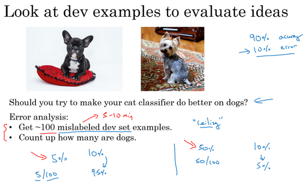
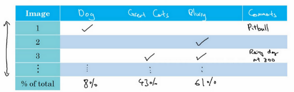
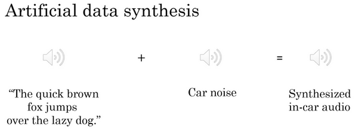
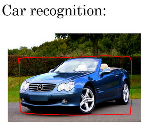

# 1. 进行误差分析

总结一下:进行错误分析，你应该找一组错误样本，可能在你的开发集里或者测试集里，观察错误标记的样本，看看假阳性（**false positives**）和假阴性（**false negatives**），统计属于不同错误类型的错误数量。在这个过程中，你可能会得到启发，归纳出新的错误类型，就像我们看到的那样。如果你过了一遍错误样本，然后说，天，有这么多**Instagram**滤镜或**Snapchat**滤镜，这些滤镜干扰了我的分类器，你就可以在途中新建一个错误类型。总之，通过统计不同错误标记类型占总数的百分比，可以帮你发现哪些问题需要优先解决，或者给你构思新优化方向的灵感。在做错误分析的时候，有时你会注意到开发集里有些样本被错误标记了，这时应该怎么做呢？我们下一个视频来讨论。

你好，欢迎回来，如果你希望让学习算法能够胜任人类能做的任务，但你的学习算法还没有达到人类的表现，那么人工检查一下你的算法犯的错误也许可以让你了解接下来应该做什么。这个过程称为错误分析，我们从一个例子开始讲吧。

假设你正在调试猫分类器，然后你取得了90%准确率，相当于10%错误，，在你的开发集上做到这样，这离你希望的目标还有很远。也许你的队员看了一下算法分类出错的例子，注意到算法将一些狗分类为猫，你看看这两只狗，它们看起来是有点像猫，至少乍一看是。所以也许你的队友给你一个建议，如何针对狗的图片优化算法。试想一下，你可以针对狗，收集更多的狗图，或者设计一些只处理狗的算法功能之类的，为了让你的猫分类器在狗图上做的更好，让算法不再将狗分类成猫。所以问题在于，你是不是应该去开始做一个项目专门处理狗？这项目可能需要花费几个月的时间才能让算法在狗图片上犯更少的错误，这样做值得吗？或者与其花几个月做这个项目，有可能最后发现这样一点用都没有。这里有个错误分析流程，可以让你很快知道这个方向是否值得努力。

这是我建议你做的，首先，收集一下，比如说100个错误标记的开发集样本，然后手动检查，一次只看一个，看看你的开发集里有多少错误标记的样本是狗。现在，假设事实上，你的100个错误标记样本中只有5%是狗，就是说在100个错误标记的开发集样本中，有5个是狗。这意味着100个样本，在典型的100个出错样本中，即使你完全解决了狗的问题，你也只能修正这100个错误中的5个。或者换句话说，如果只有5%的错误是狗图片，那么如果你在狗的问题上花了很多时间，那么你最多只能希望你的错误率从10%下降到9.5%，对吧？错误率相对下降了5%（总体下降了0.5%，100的错误样本，错误率为10%，则样本为1000），那就是10%下降到9.5%。你就可以确定这样花时间不好，或者也许应该花时间，但至少这个分析给出了一个上限。如果你继续处理狗的问题，能够改善算法性能的上限，对吧？在机器学习中，有时我们称之为性能上限，就意味着，最好能到哪里，完全解决狗的问题可以对你有多少帮助。

但现在，假设发生了另一件事，假设我们观察一下这100个错误标记的开发集样本，你发现实际有50张图都是狗，所以有50%都是狗的照片，现在花时间去解决狗的问题可能效果就很好。这种情况下，如果你真的解决了狗的问题，那么你的错误率可能就从10%下降到5%了。然后你可能觉得让错误率减半的方向值得一试，可以集中精力减少错误标记的狗图的问题。

我知道在机器学习中，有时候我们很鄙视手工操作，或者使用了太多人为数值。但如果你要搭建应用系统，那这个简单的人工统计步骤，错误分析，可以节省大量时间，可以迅速决定什么是最重要的，或者最有希望的方向。实际上，如果你观察100个错误标记的开发集样本，也许只需要5到10分钟的时间，亲自看看这100个样本，并亲自统计一下有多少是狗。根据结果，看看有没有占到5%、50%或者其他东西。这个在5到10分钟之内就能给你估计这个方向有多少价值，并且可以帮助你做出更好的决定，是不是把未来几个月的时间投入到解决错误标记的狗图这个问题。

在本幻灯片中，我们要描述一下如何使用错误分析来评估某个想法，这个样本里狗的问题是否值得解决。有时你在做错误分析时，也可以同时并行评估几个想法，比如，你有几个改善猫检测器的想法，也许你可以改善针对狗图的性能，或者有时候要注意，那些猫科动物，如狮子，豹，猎豹等等，它们经常被分类成小猫或者家猫，所以你也许可以想办法解决这个错误。或者也许你发现有些图像是模糊的，如果你能设计出一些系统，能够更好地处理模糊图像。也许你有些想法，知道大概怎么处理这些问题，要进行错误分析来评估这三个想法。

我会做的是建立这样一个表格，我通常用电子表格来做，但普通文本文件也可以。在最左边，人工过一遍你想分析的图像集，所以图像可能是从1到100，如果你观察100张图的话。电子表格的一列就对应你要评估的想法，所以狗的问题，猫科动物的问题，模糊图像的问题，我通常也在电子表格中留下空位来写评论。所以记住，在错误分析过程中，你就看看算法识别错误的开发集样本，如果你发现第一张识别错误的图片是狗图，那么我就在那里打个勾，为了帮我自己记住这些图片，有时我会在评论里注释，也许这是一张比特犬的图。如果第二张照片很模糊，也记一下。如果第三张是在下雨天动物园里的狮子，被识别成猫了，这是大型猫科动物，还有图片模糊，在评论部分写动物园下雨天，是雨天让图像模糊的之类的。最后，这组图像过了一遍之后，我可以统计这些算法(错误)的百分比，或者这里每个错误类型的百分比，有多少是狗，大猫或模糊这些错误类型。所以也许你检查的图像中8%是狗，可能43%属于大猫，61%属于模糊。这意味着扫过每一列，并统计那一列有多少百分比图像打了勾。

在这个步骤做到一半时，有时你可能会发现其他错误类型，比如说你可能发现有**Instagram**滤镜，那些花哨的图像滤镜，干扰了你的分类器。在这种情况下，实际上可以在错误分析途中，增加这样一列，比如多色滤镜
**Instagram**滤镜和**Snapchat**滤镜，然后再过一遍，也统计一下那些问题，并确定这个新的错误类型占了多少百分比，这个分析步骤的结果可以给出一个估计，是否值得去处理每个不同的错误类型。

例如，在这个样本中，有很多错误来自模糊图片，也有很多错误类型是大猫图片。所以这个分析的结果不是说你一定要处理模糊图片，这个分析没有给你一个严格的数学公式，告诉你应该做什么，但它能让你对应该选择那些手段有个概念。它也告诉你，比如说不管你对狗图片或者**Instagram**图片处理得有多好，在这些例子中，你最多只能取得8%或者12%的性能提升。而在大猫图片这一类型，你可以做得更好。或者模糊图像，这些类型有改进的潜力。这些类型里，性能提高的上限空间要大得多。所以取决于你有多少改善性能的想法，比如改善大猫图片或者模糊图片的表现。也许你可以选择其中两个，或者你的团队成员足够多，也许你把团队可以分成两个团队，其中一个想办法改善大猫的识别，另一个团队想办法改善模糊图片的识别。但这个快速统计的步骤，你可以经常做，最多需要几小时，就可以真正帮你选出高优先级任务，并了解每种手段对性能有多大提升空间。

# 2. 清除标注错误的数据

1. 深度学习对随机性错误不敏感(具有鲁棒性robust)，但是对系统性错误敏感。例如将所有的白色狗都标记为猫。
2. If you want to correct your data set, make sure do the same process to your dev and test sets to make sure they continue come from the same distribution.
3. Consider examining examples your algorithm got right as well as ones it got wrong.————我强烈建议你要考虑同时检验算法判断正确和判断错误的样本，要检查算法出错的样本很容易，只需要看看那些样本是否需要修正，但还有可能有些样本算法判断正确，那些也需要修正。如果你只修正算法出错的样本，你对算法的偏差估计可能会变大，这会让你的算法有一点不公平的优势，我们就需要再次检查出错的样本，但也需要再次检查做对的样本，因为算法有可能因为运气好把某个东西判断对了。在那个特例里，修正那些标签可能会让算法从判断对变成判断错。这第二点不是很容易做，所以通常不会这么做。通常不会这么做的原因是，如果你的分类器很准确，那么判断错的次数比判断正确的次数要少得多。那么就有2%出错，98%都是对的，所以更容易检查2%数据上的标签，然而检查98%数据上的标签要花的时间长得多，所以通常不这么做，但也是要考虑到的。

最后，如果你进入到一个开发集和测试集去修正这里的部分标签，你可能会，也可能不会去对训练集做同样的事情，还记得我们在其他视频里讲过，修正训练集中的标签其实相对没那么重要，你可能决定只修正开发集和测试集中的标签，因为它们通常比训练集小得多，你可能不想把所有额外的精力投入到修正大得多的训练集中的标签，所以这样其实是可以的。我们将在本周晚些时候讨论一些步骤，用于处理你的训练数据分布和开发与测试数据不同的情况，对于这种情况学习算法其实相当健壮，你的开发集和测试集来自同一分布非常重要。但如果你的训练集来自稍微不同的分布，通常这是一件很合理的事情，我会在本周晚些时候谈谈如何处理这个问题。

最后我讲几个建议：

首先，深度学习研究人员有时会喜欢这样说：“我只是把数据提供给算法，我训练过了，效果拔群”。这话说出了很多深度学习错误的真相，更多时候，我们把数据喂给算法，然后训练它，并减少人工干预，减少使用人类的见解。但我认为，在构造实际系统时，通常需要更多的人工错误分析，更多的人类见解来架构这些系统，尽管深度学习的研究人员不愿意承认这点。

其次，不知道为什么，我看一些工程师和研究人员不愿意亲自去看这些样本，也许做这些事情很无聊，坐下来看100或几百个样本来统计错误数量，但我经常亲自这么做。当我带领一个机器学习团队时，我想知道它所犯的错误，我会亲自去看看这些数据，尝试和一部分错误作斗争。我想就因为花了这几分钟，或者几个小时去亲自统计数据，真的可以帮你找到需要优先处理的任务，我发现花时间亲自检查数据非常值得，所以我强烈建议你们这样做，如果你在搭建你的机器学习系统的话，然后你想确定应该优先尝试哪些想法，或者哪些方向。

# 3.快速搭建你的第一个系统，并进行迭代
如果你正在开发全新的机器学习应用，我通常会给你这样的建议，你应该尽快建立你的第一个系统原型，然后快速迭代。

让我告诉你我的意思，我在语音识别领域研究了很多年，如果你正在考虑建立一个新的语音识别系统，其实你可以走很多方向，可以优先考虑很多事情。

比如，有一些特定的技术，可以让语音识别系统对嘈杂的背景更加健壮，嘈杂的背景可能是说咖啡店的噪音，背景里有很多人在聊天，或者车辆的噪音，高速上汽车的噪音或者其他类型的噪音。有一些方法可以让语音识别系统在处理带口音时更健壮，还有特定的问题和麦克风与说话人距离很远有关，就是所谓的远场语音识别。儿童的语音识别带来特殊的挑战，挑战来自单词发音方面，还有他们选择的词汇，他们倾向于使用的词汇。还有比如说，说话人口吃，或者说了很多无意义的短语，比如“哦”，“啊”之类的。你可以选择很多不同的技术，让你听写下来的文本可读性更强，所以你可以做很多事情来改进语音识别系统。

一般来说，对于几乎所有的机器学习程序可能会有50个不同的方向可以前进，并且每个方向都是相对合理的可以改善你的系统。但挑战在于，你如何选择一个方向集中精力处理。即使我已经在语音识别领域工作多年了，如果我要为一个新应用程序域构建新系统，我还是觉得很难不花时间去思考这个问题就直接选择方向。所以我建议你们，如果你想搭建全新的机器学习程序，就是快速搭好你的第一个系统，然后开始迭代。我的意思是我建议你快速设立开发集和测试集还有指标，这样就决定了你的目标所在，如果你的目标定错了，之后改也是可以的。但一定要设立某个目标，然后我建议你马上搭好一个机器学习系统原型，然后找到训练集，训练一下，看看效果，开始理解你的算法表现如何，在开发集测试集，你的评估指标上表现如何。当你建立第一个系统后，你就可以马上用到之前说的偏差方差分析，还有之前最后几个视频讨论的错误分析，来确定下一步优先做什么。特别是如果错误分析让你了解到大部分的错误的来源是说话人远离麦克风，这对语音识别构成特殊挑战，那么你就有很好的理由去集中精力研究这些技术，所谓远场语音识别的技术，这基本上就是处理说话人离麦克风很远的情况。

建立这个初始系统的所有意义在于，它可以是一个快速和粗糙的实现（**quick and dirty implementation**），你知道的，别想太多。初始系统的全部意义在于，有一个学习过的系统，有一个训练过的系统，让你确定偏差方差的范围，就可以知道下一步应该优先做什么，让你能够进行错误分析，可以观察一些错误，然后想出所有能走的方向，哪些是实际上最有希望的方向。

所以回顾一下，我建议你们快速建立你的第一个系统，然后迭代。不过如果你在这个应用程序领域有很多经验，这个建议适用程度要低一些。还有一种情况适应程度更低，当这个领域有很多可以借鉴的学术文献，处理的问题和你要解决的几乎完全相同，所以，比如说，人脸识别就有很多学术文献，如果你尝试搭建一个人脸识别设备，那么可以从现有大量学术文献为基础出发，一开始就搭建比较复杂的系统。但如果你第一次处理某个新问题，那我真的不鼓励你想太多，或者把第一个系统弄得太复杂。我建议你们构建一些快速而粗糙的实现，然后用来帮你找到改善系统要优先处理的方向。我见过很多机器学习项目，我觉得有些团队的解决方案想太多了，他们造出了过于复杂的系统。我也见过有限团队想的不够，然后造出过于简单的系统。平均来说，我见到更多的团队想太多，构建太复杂的系统。

所以我希望这些策略有帮助，如果你将机器学习算法应用到新的应用程序里，你的主要目标是弄出能用的系统，你的主要目标并不是发明全新的机器学习算法，这是完全不同的目标，那时你的目标应该是想出某种效果非常好的算法。所以我鼓励你们搭建快速而粗糙的实现，然后用它做偏差/方差分析，用它做错误分析，然后用分析结果确定下一步优先要做的方向。

# 4. 使用来自不同分布的数据，进行训练和测试

比如我们有200k张来自爬虫的猫咪图片(高清晰度)，和5k张来自用户上传的照片(模糊)，我们学习的任务是在用户上传照片的检测准确度达到较高的水平，然而数据集并不来自同一分布，那么我们有如下两种解决办法:
一. 你可以做的一件事是将两组数据合并在一起，这样你就有21万张照片，你可以把这21万张照片随机分配到训练、开发和测试集中。为了说明观点，我们假设你已经确定开发集和测试集各包含2500个样本，所以你的训练集有205000个样本。现在这么设立你的数据集有一些好处，也有坏处。好处在于，你的训练集、开发集和测试集都来自同一分布，这样更好管理。但坏处在于，这坏处还不小，就是如果你观察开发集，看看这2500个样本其中很多图片都来自网页下载的图片，那并不是你真正关心的数据分布，你真正要处理的是来自手机的图片。 

所以结果你的数据总量，这200,000个样本，我就用$200k$缩写表示，我把那些是从网页下载的数据总量写成$210k$，所以对于这2500个样本，数学期望值是：$2500\times \frac{200k}{210k} =2381$，有2381张图来自网页下载，这是期望值，确切数目会变化，取决于具体的随机分配操作。但平均而言，只有119张图来自手机上传。要记住，设立开发集的目的是告诉你的团队去瞄准的目标，而你瞄准目标的方式，你的大部分精力都用在优化来自网页下载的图片，这其实不是你想要的。所以我真的不建议使用第一个选项，因为这样设立开发集就是告诉你的团队，针对不同于你实际关心的数据分布去优化，所以不要这么做。

二. 训练集，比如说还是205,000张图片，我们的训练集是来自网页下载的200,000张图片，然后如果需要的话，再加上5000张来自手机上传的图片。然后对于开发集和测试集，这数据集的大小是按比例画的，你的开发集和测试集都是手机图。而训练集包含了来自网页的20万张图片，还有5000张来自应用的图片，开发集就是2500张来自应用的图片，测试集也是2500张来自应用的图片。这样将数据分成训练集、开发集和测试集的好处在于，现在你瞄准的目标就是你想要处理的目标，你告诉你的团队，我的开发集包含的数据全部来自手机上传，这是你真正关心的图片分布。我们试试搭建一个学习系统，让系统在处理手机上传图片分布时效果良好。缺点在于，当然了，现在你的训练集分布和你的开发集、测试集分布并不一样。但事实证明，这样把数据分成训练、开发和测试集，在长期能给你带来更好的系统性能。我们以后会讨论一些特殊的技巧，可以处理
训练集的分布和开发集和测试集分布不一样的情况。

# 5. 数据分布不匹配时，偏差与方差的分析

***Introduce***:

我们继续用猫分类器为例，我们说人类在这个任务上能做到几乎完美，所以贝叶斯错误率或者说贝叶斯最优错误率，我们知道这个问题里几乎是0%。所以要进行错误率分析，你通常需要看训练误差，也要看看开发集的误差。比如说，在这个样本中，你的训练集误差是1%，你的开发集误差是10%，如果你的开发集来自和训练集一样的分布，你可能会说，这里存在很大的方差问题，你的算法不能很好的从训练集出发泛化，它处理训练集很好，但处理开发集就突然间效果很差了。

但如果你的训练数据和开发数据来自不同的分布，你就不能再放心下这个结论了。特别是，也许算法在开发集上做得不错，可能因为训练集很容易识别，因为训练集都是高分辨率图片，很清晰的图像，但开发集要难以识别得多。所以也许软件没有方差问题，这只不过反映了开发集包含更难准确分类的图片。所以这个分析的问题在于，当你看训练误差，再看开发误差，有两件事变了。首先算法只见过训练集数据，没见过开发集数据。第二，开发集数据来自不同的分布。而且因为你同时改变了两件事情，很难确认这增加的9%误差率有多少是因为算法没看到开发集中的数据导致的，这是问题方差的部分，有多少是因为开发集数据就是不一样。

***Train-Dev Set***

我们引入Train-Dev Set的概念，它的数据分布与训练集相同。

我们要做的是随机打散训练集，然后分出一部分训练集作为训练-开发集（training-dev），就像开发集和测试集来自同一分布，训练集、训练-开发集也来自同一分布。但不同的地方是，现在你只在训练集训练你的神经网络，你不会让神经网络在训练-开发集上跑后向传播。为了进行误差分析，你应该做的是看看分类器在训练集上的误差，训练-开发集上的误差，还有开发集上的误差。

比如说这个样本中，训练误差是1%，我们说训练-开发集上的误差是9%，然后开发集误差是10%，和以前一样。你就可以从这里得到结论，当你从训练数据变到训练-开发集数据时，错误率真的上升了很多。而训练数据和训练-开发数据的差异在于，你的神经网络能看到第一部分数据并直接在上面做了训练，但没有在训练-开发集上直接训练，这就告诉你，算法存在方差问题，因为训练-开发集的错误率是在和训练集来自同一分布的数据中测得的。所以你知道，尽管你的神经网络在训练集中表现良好，但无法泛化到来自相同分布的训练-开发集里，它无法很好地泛化推广到来自同一分布，但以前没见过的数据中，所以在这个样本中我们确实有一个方差问题。

我们来看一个不同的样本，假设训练误差为1%，训练-开发误差为1.5%，但当你开始处理开发集时，错误率上升到10%。现在你的方差问题就很小了，因为当你从见过的训练数据转到训练-开发集数据，神经网络还没有看到的数据，错误率只上升了一点点。但当你转到开发集时，错误率就大大上升了，所以这是数据不匹配的问题。因为你的学习算法没有直接在训练-开发集或者开发集训练过，但是这两个数据集来自不同的分布。但不管算法在学习什么，它在训练-开发集上做的很好，但开发集上做的不好，所以总之你的算法擅长处理和你关心的数据不同的分布，我们称之为数据不匹配的问题。

我们再来看几个样本，我会在下一行里写出来，因上面没空间了。所以训练误差、训练-开发误差、还有开发误差，我们说训练误差是10%，训练-开发误差是11%，开发误差为12%，要记住，人类水平对贝叶斯错误率的估计大概是0%，如果你得到了这种等级的表现，那就真的存在偏差问题了。存在可避免偏差问题，因为算法做的比人类水平差很多，所以这里的偏差真的很高。

最后一个例子，如果你的训练集错误率是10%，你的训练-开发错误率是11%，开发错误率是20%，那么这其实有两个问题。第一，可避免偏差相当高，因为你在训练集上都没有做得很好，而人类能做到接近0%错误率，但你的算法在训练集上错误率为10%。这里方差似乎很小，但数据不匹配问题很大。所以对于这个样本，我说，如果你有很大的偏差或者可避免偏差问题，还有数据不匹配问题。

我们看看这张幻灯片里做了什么，然后写出一般的原则，我们要看的关键数据是人类水平错误率，你的训练集错误率，训练-开发集错误率，所以这分布和训练集一样，但你没有直接在上面训练。根据这些错误率之间差距有多大，你可以大概知道，可避免偏差、方差数据不匹配问题各自有多大。

我们说人类水平错误率是4%的话，你的训练错误率是7%，而你的训练-开发错误率是10%，而开发错误率是12%，这样你就大概知道可避免偏差有多大。因为你知道，你希望你的算法至少要在训练集上的表现接近人类。而这大概表明了方差大小，所以你从训练集泛化推广到训练-开发集时效果如何？而这告诉你数据不匹配的问题大概有多大。技术上你还可以再加入一个数字，就是测试集表现，我们写成测试集错误率，你不应该在测试集上开发，因为你不希望对测试集过拟合。但如果你看看这个，那么这里的差距就说明你对开发集过拟合的程度。所以如果开发集表现和测试集表现有很大差距，那么你可能对开发集过拟合了，所以也许你需要一个更大的开发集，对吧？要记住，你的开发集和测试集来自同一分布，所以这里存在很大差距的话。如果算法在开发集上做的很好，比测试集好得多，那么你就可能对开发集过拟合了。如果是这种情况，那么你可能要往回退一步，然后收集更多开发集数据。现在我写出这些数字，这数字列表越往后数字越大。

# 6. 处理数据不匹配问题
如果您的训练集来自和开发测试集不同的分布，如果错误分析显示你有一个数据不匹配的问题该怎么办？这个问题没有完全系统的解决方案，但我们可以看看一些可以尝试的事情。如果我发现有严重的数据不匹配问题，我通常会亲自做错误分析，尝试了解训练集和开发测试集的具体差异。技术上，为了避免对测试集过拟合，要做错误分析，你应该人工去看开发集而不是测试集。

但作为一个具体的例子，如果你正在开发一个语音激活的后视镜应用，你可能要看看……我想如果是语音的话，你可能要听一下来自开发集的样本，尝试弄清楚开发集和训练集到底有什么不同。所以，比如说你可能会发现很多开发集样本噪音很多，有很多汽车噪音，这是你的开发集和训练集差异之一。也许你还会发现其他错误，比如在你的车子里的语言激活后视镜，你发现它可能经常识别错误街道号码，因为那里有很多导航请求都有街道地址，所以得到正确的街道号码真的很重要。当你了解开发集误差的性质时，你就知道，开发集有可能跟训练集不同或者更难识别，那么你可以尝试把训练数据变得更像开发集一点，或者，你也可以收集更多类似你的开发集和测试集的数据。所以，比如说，如果你发现车辆背景噪音是主要的错误来源，那么你可以模拟车辆噪声数据，我会在下一张幻灯片里详细讨论这个问题。或者你发现很难识别街道号码，也许你可以有意识地收集更多人们说数字的音频数据，加到你的训练集里。

现在我知道这张幻灯片只给出了粗略的指南，列出一些你可以做的尝试，这不是一个系统化的过程，我想，这不能保证你一定能取得进展。但我发现这种人工见解，我们可以一起尝试收集更多和真正重要的场合相似的数据，这通常有助于解决很多问题。所以，如果你的目标是让训练数据更接近你的开发集，那么你可以怎么做呢？

你可以利用的其中一种技术是***人工合成数据***（**artificial data synthesis**），我们讨论一下。在解决汽车噪音问题的场合，所以要建立语音识别系统。也许实际上你没那么多实际在汽车背景噪音下录得的音频，或者在高速公路背景噪音下录得的音频。但我们发现，你可以合成。所以假设你录制了大量清晰的音频，不带车辆背景噪音的音频，“**The quick brown fox jumps over the lazy dog**”（音频播放），所以，这可能是你的训练集里的一段音频，顺便说一下，这个句子在AI测试中经常使用，因为这个短句包含了从a到z所有字母，所以你会经常见到这个句子。但是，有了这个“**the quick brown fox jumps over the lazy dog**”这段录音之后，你也可以收集一段这样的汽车噪音，（播放汽车噪音音频）这就是汽车内部的背景噪音，如果你一言不发开车的话，就是这种声音。如果你把两个音频片段放到一起，你就可以合成出"**the quick brown fox jumps over the lazy dog**"（带有汽车噪声），在汽车背景噪音中的效果，听起来像这样，所以这是一个相对简单的音频合成例子。在实践中，你可能会合成其他音频效果，比如混响，就是声音从汽车内壁上反弹叠加的效果。

但是通过人工数据合成，你可以快速制造更多的训练数据，就像真的在车里录的那样，那就不需要花时间实际出去收集数据，比如说在实际行驶中的车子，录下上万小时的音频。所以，如果错误分析显示你应该尝试让你的数据听起来更像在车里录的，那么人工合成那种音频，然后喂给你的机器学习算法，这样做是合理的。

现在我们要提醒一下，人工数据合成有一个潜在问题，比如说，你在安静的背景里录得10,000小时音频数据，然后，比如说，你只录了一小时车辆背景噪音，那么，你可以这么做，将这1小时汽车噪音回放10,000次，并叠加到在安静的背景下录得的10,000小时数据。如果你这么做了，人听起来这个音频没什么问题。但是有一个风险，有可能你的学习算法对这1小时汽车噪音过拟合。特别是，如果这组汽车里录的音频可能是你可以想象的所有汽车噪音背景的集合，如果你只录了一小时汽车噪音，那你可能只模拟了全部数据空间的一小部分，你可能只从汽车噪音的很小的子集来合成数据。

而对于人耳来说，这些音频听起来没什么问题，因为一小时的车辆噪音对人耳来说，听起来和其他任意一小时车辆噪音是一样的。但你有可能从这整个空间很小的一个子集出发合成数据，神经网络最后可能对你这一小时汽车噪音过拟合。我不知道以较低成本收集10,000小时的汽车噪音是否可行，这样你就不用一遍又一遍地回放那1小时汽车噪音，你就有10,000个小时永不重复的汽车噪音来叠加到10,000小时安静背景下录得的永不重复的语音录音。这是可以做的，但不保证能做。但是使用10,000小时永不重复的汽车噪音，而不是1小时重复学习，算法有可能取得更好的性能。人工数据合成的挑战在于，人耳的话，人耳是无法分辨这10,000个小时听起来和那1小时没什么区别，所以你最后可能会制造出这个原始数据很少的，在一个小得多的空间子集合成的训练数据，但你自己没意识到。

这里有人工合成数据的另一个例子，假设你在研发无人驾驶汽车，你可能希望检测出这样的车，然后用这样的框包住它。很多人都讨论过的一个思路是，为什么不用计算机合成图像来模拟成千上万的车辆呢？事实上，这里有几张车辆照片（下图后两张图片），其实是用计算机合成的，我想这个合成是相当逼真的，我想通过这样合成图片，你可以训练出一个相当不错的计算机视觉系统来检测车子。

不幸的是，上一张幻灯片介绍的情况也会在这里出现，比如这是所有车的集合，如果你只合成这些车中很小的子集，对于人眼来说也许这样合成图像没什么问题，但你的学习算法可能会对合成的这一个小子集过拟合。特别是很多人都独立提出了一个想法，一旦你找到一个电脑游戏，里面车辆渲染的画面很逼真，那么就可以截图，得到数量巨大的汽车图片数据集。事实证明，如果你仔细观察一个视频游戏，如果这个游戏只有20辆独立的车，那么这游戏看起来还行。因为你是在游戏里开车，你只看到这20辆车，这个模拟看起来相当逼真。但现实世界里车辆的设计可不只20种，如果你用着20量独特的车合成的照片去训练系统，那么你的神经网络很可能对这20辆车过拟合，但人类很难分辨出来。即使这些图像看起来很逼真，你可能真的只用了所有可能出现的车辆的很小的子集。

所以，总而言之，如果你认为存在数据不匹配问题，我建议你做错误分析，或者看看训练集，或者看看开发集，试图找出，试图了解这两个数据分布到底有什么不同，然后看看是否有办法收集更多看起来像开发集的数据作训练。

我们谈到其中一种办法是人工数据合成，人工数据合成确实有效。在语音识别中。我已经看到人工数据合成显著提升了已经非常好的语音识别系统的表现，所以这是可行的。但当你使用人工数据合成时，一定要谨慎，要记住你有可能从所有可能性的空间只选了很小一部分去模拟数据。

所以这就是如何处理数据不匹配问题，接下来，我想和你分享一些想法就是如何从多种类型的数据同时学习。