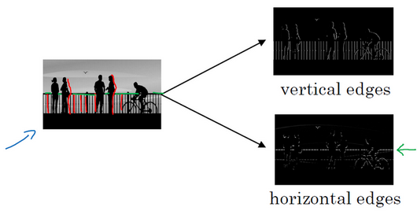
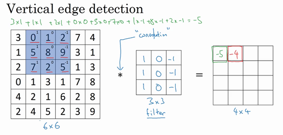
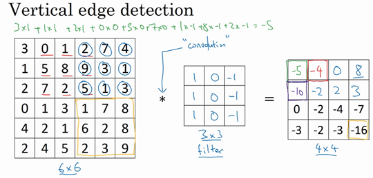
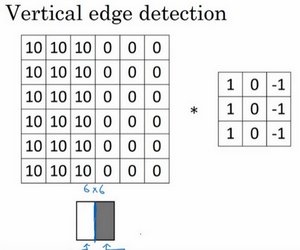

# 1. 计算机视觉
Application in computer version：  
Image Classification， Object Detection， Neural Style Transfer

Why use CNN:  
the dimension of picture is very large  
如果你要操作更大的图片，比如一张1000×1000的图片，它足有1兆那么大，但是特征向量的维度达到了1000×1000×3，因为有3个**RGB**通道，所以数字将会是300万。如果第一个隐藏层$L^1$有1000个单元，那么权重矩阵$W^{[1]}$的dimension就是$1000*3 million$

# 2. 边缘检测示例

***KEY：***  利用Filter(Kernel)对图进行卷积运算

卷积运算是卷积神经网络最基本的组成部分，使用边缘检测作为入门样例。在这个视频中，你会看到卷积是如何进行运算的。

在之前的视频中，我说过神经网络的前几层是如何检测边缘的，然后，后面的层有可能检测到物体的部分区域，更靠后的一些层可能检测到完整的物体，这个例子中就是人脸。在这个视频中，你会看到如何在一张图片中进行边缘检测。

让我们举个例子，给了这样一张图片，让电脑去搞清楚这张照片里有什么物体，你可能做的第一件事是检测图片中的垂直边缘。比如说，在这张图片中的栏杆就对应垂直线，与此同时，这些行人的轮廓线某种程度上也是垂线，这些线是垂直边缘检测器的输出。同样，你可能也想检测水平边缘，比如说这些栏杆就是很明显的水平线，它们也能被检测到，结果在这。所以如何在图像中检测这些边缘？

看一个例子，这是一个6×6的灰度图像。因为是灰度图像，所以它是6×6×1的矩阵，而不是6×6×3的，因为没有**RGB**三通道。为了检测图像中的垂直边缘，你可以构造一个3×3矩阵。在共用习惯中，在卷积神经网络的术语中，它被称为过滤器。我要构造一个3×3的过滤器，像这样$\begin{bmatrix}1 & 0 & -1\\ 1 & 0 & -1\\ 1 & 0 & -1\end{bmatrix}$。在论文它有时候会被称为核，而不是过滤器，但在这个视频中，我将使用过滤器这个术语。对这个6×6的图像进行卷积运算，卷积运算用“$*$”来表示，用3×3的过滤器对其进行卷积。

关于符号表示，有一些问题，在数学中“$*$”就是卷积的标准标志，但是在**Python**中，这个标识常常被用来表示乘法或者元素乘法。所以这个“$*$”有多层含义，它是一个重载符号，在这个视频中，当“$*$”表示卷积的时候我会特别说明。

这个卷积运算的输出将会是一个4×4的矩阵，你可以将它看成一个4×4的图像。下面来说明是如何计算得到这个4×4矩阵的。为了计算第一个元素，在4×4左上角的那个元素，使用3×3的过滤器，将其覆盖在输入图像，如下图所示。然后进行元素乘法（**element-wise products**）运算，所以$\begin{bmatrix} 3 \times 1 & 0 \times 0 & 1 \times \left(1 \right) \\ 1 \times 1 & 5 \times 0 & 8 \times \left( - 1 \right) \\ 2 \times1 & 7 \times 0 & 2 \times \left( - 1 \right) \\ \end{bmatrix} = \begin{bmatrix}3 & 0 & - 1 \\ 1 & 0 & - 8 \\ 2 & 0 & - 2 \\\end{bmatrix}$，然后将该矩阵每个元素相加得到最左上角的元素，即$3+1+2+0+0 +0+(-1)+(-8) +(-2)=-5$。

把这9个数加起来得到-5，当然，你可以把这9个数按任何顺序相加，我只是先写了第一列，然后第二列，第三列。

接下来，为了弄明白第二个元素是什么，你要把蓝色的方块，向右移动一步，像这样，把这些绿色的标记去掉：

继续做同样的元素乘法，然后加起来，所以是 $0×1+5×1+7×1+1×0+8×0+2×0+2×(-1)+ 9×(-1)+5×(-1)=-4 $。

接下来也是一样，继续右移一步，把9个数的点积加起来得到0。

继续移得到8，验证一下：$2×1+9×1+5×1+7×0+3×0+1×0+4×(-1)+ 1×(-1)+ 3×(-1)=8$。

接下来为了得到下一行的元素，现在把蓝色块下移，现在蓝色块在这个位置：

重复进行元素乘法，然后加起来。通过这样做得到-10。再将其右移得到-2，接着是2，3。以此类推，这样计算完矩阵中的其他元素。

为了说得更清楚一点，这个-16是通过底部右下角的3×3区域得到的。

因此6×6矩阵和3×3矩阵进行卷积运算得到4×4矩阵。这些图片和过滤器是不同维度的矩阵，但左边矩阵容易被理解为一张图片，中间的这个被理解为过滤器，右边的图片我们可以理解为另一张图片。这个就是垂直边缘检测器，下一页中你就会明白。

在往下讲之前，多说一句，如果你要使用编程语言实现这个运算，不同的编程语言有不同的函数，而不是用“$*$”来表示卷积。所以在编程练习中，你会使用一个叫**conv_forward**的函数。如果在**tensorflow**下，这个函数叫**tf.conv2d**。在其他深度学习框架中，在后面的课程中，你将会看到**Keras**这个框架，在这个框架下用**Conv2D**实现卷积运算。所有的编程框架都有一些函数来实现卷积运算。

为什么这个可以做垂直边缘检测呢？让我们来看另外一个例子。为了讲清楚，我会用一个简单的例子。这是一个简单的6×6图像，左边的一半是10，右边一般是0。如果你把它当成一个图片，左边那部分看起来是白色的，像素值10是比较亮的像素值，右边像素值比较暗，我使用灰色来表示0，尽管它也可以被画成黑的。图片里，有一个特别明显的垂直边缘在图像中间，这条垂直线是从黑到白的过渡线，或者从白色到深色。

所以，当你用一个3×3过滤器进行卷积运算的时候，这个3×3的过滤器可视化为下面这个样子，在左边有明亮的像素，然后有一个过渡，0在中间，然后右边是深色的。卷积运算后，你得到的是右边的矩阵。如果你愿意，可以通过数学运算去验证。举例来说，最左上角的元素0，就是由这个3×3块（绿色方框标记）经过元素乘积运算再求和得到的，$10×1+10×1+10×1+10×0+10×0+10×0+10×(-1)+10×(-1)+10×(-1)=0$

。相反这个30是由这个（红色方框标记）得到的，

$10×1+10×1+10×1+10×0+10×0+10×0+0×(-1)+0×(-1)+ 0×(-1)=30$。

如果把最右边的矩阵当成图像，它是这个样子。在中间有段亮一点的区域，对应检查到这个6×6图像中间的垂直边缘。这里的维数似乎有点不正确，检测到的边缘太粗了。因为在这个例子中，图片太小了。如果你用一个1000×1000的图像，而不是6×6的图片，你会发现其会很好地检测出图像中的垂直边缘。在这个例子中，在输出图像中间的亮处，表示在图像中间有一个特别明显的垂直边缘。从垂直边缘检测中可以得到的启发是，因为我们使用3×3的矩阵（过滤器），所以垂直边缘是一个3×3的区域，左边是明亮的像素，中间的并不需要考虑，右边是深色像素。在这个6×6图像的中间部分，明亮的像素在左边，深色的像素在右边，就被视为一个垂直边缘，卷积运算提供了一个方便的方法来发现图像中的垂直边缘。

所以你已经了解卷积是怎么工作的，在下一个视频中，你将会看到如何使用卷积运算作为卷积神经网络的基本模块的。