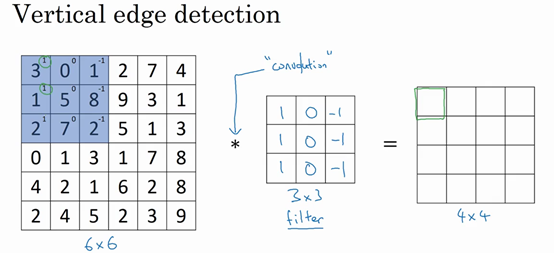
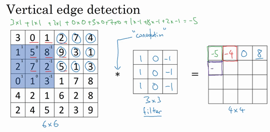
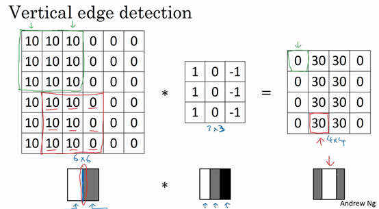
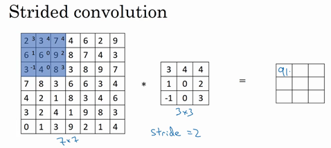
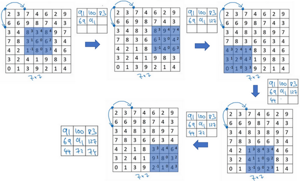
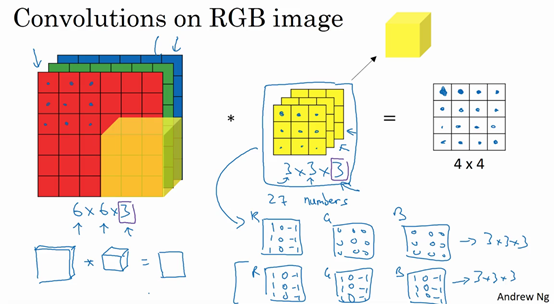
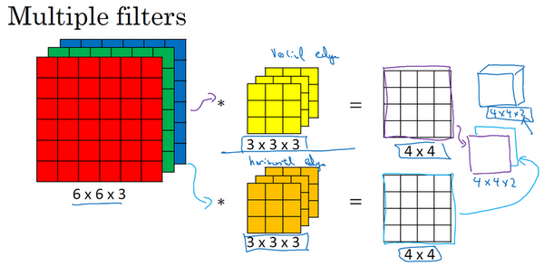

# 1. 计算机视觉
Application in computer version：  
Image Classification， Object Detection， Neural Style Transfer

Why use CNN:  
the dimension of picture is very large  
如果你要操作更大的图片，比如一张1000×1000的图片，它足有1兆那么大，但是特征向量的维度达到了1000×1000×3，因为有3个**RGB**通道，所以数字将会是300万。如果第一个隐藏层$L^1$有1000个单元，那么权重矩阵$W^{[1]}$的dimension就是$1000*3 million$

# 2. 边缘检测示例

***KEY：***  利用Filter(Kernel)对图进行卷积运算

卷积运算是卷积神经网络最基本的组成部分，使用边缘检测作为入门样例。在这个视频中，你会看到卷积是如何进行运算的。

在之前的视频中，我说过神经网络的前几层是如何检测边缘的，然后，后面的层有可能检测到物体的部分区域，更靠后的一些层可能检测到完整的物体，这个例子中就是人脸。在这个视频中，你会看到如何在一张图片中进行边缘检测。

让我们举个例子，给了这样一张图片，让电脑去搞清楚这张照片里有什么物体，你可能做的第一件事是检测图片中的垂直边缘。比如说，在这张图片中的栏杆就对应垂直线，与此同时，这些行人的轮廓线某种程度上也是垂线，这些线是垂直边缘检测器的输出。同样，你可能也想检测水平边缘，比如说这些栏杆就是很明显的水平线，它们也能被检测到，结果在这。所以如何在图像中检测这些边缘？

看一个例子，这是一个6×6的灰度图像。因为是灰度图像，所以它是6×6×1的矩阵，而不是6×6×3的，因为没有**RGB**三通道。为了检测图像中的垂直边缘，你可以构造一个3×3矩阵。在共用习惯中，在卷积神经网络的术语中，它被称为过滤器。我要构造一个3×3的过滤器，像这样$\begin{bmatrix}1 & 0 & -1\\ 1 & 0 & -1\\ 1 & 0 & -1\end{bmatrix}$。在论文它有时候会被称为核，而不是过滤器，但在这个视频中，我将使用过滤器这个术语。对这个6×6的图像进行卷积运算，卷积运算用“$*$”来表示，用3×3的过滤器对其进行卷积。

关于符号表示，有一些问题，在数学中“$*$”就是卷积的标准标志，但是在**Python**中，这个标识常常被用来表示乘法或者元素乘法。所以这个“$*$”有多层含义，它是一个重载符号，在这个视频中，当“$*$”表示卷积的时候我会特别说明。

这个卷积运算的输出将会是一个4×4的矩阵，你可以将它看成一个4×4的图像。下面来说明是如何计算得到这个4×4矩阵的。为了计算第一个元素，在4×4左上角的那个元素，使用3×3的过滤器，将其覆盖在输入图像，如下图所示。然后进行元素乘法（**element-wise products**）运算，所以$\begin{bmatrix} 3 \times 1 & 0 \times 0 & 1 \times \left(1 \right) \\ 1 \times 1 & 5 \times 0 & 8 \times \left( - 1 \right) \\ 2 \times1 & 7 \times 0 & 2 \times \left( - 1 \right) \\ \end{bmatrix} = \begin{bmatrix}3 & 0 & - 1 \\ 1 & 0 & - 8 \\ 2 & 0 & - 2 \\\end{bmatrix}$，然后将该矩阵每个元素相加得到最左上角的元素，即$3+1+2+0+0 +0+(-1)+(-8) +(-2)=-5$。

把这9个数加起来得到-5，当然，你可以把这9个数按任何顺序相加，我只是先写了第一列，然后第二列，第三列。

接下来，为了弄明白第二个元素是什么，你要把蓝色的方块，向右移动一步，像这样，把这些绿色的标记去掉：

继续做同样的元素乘法，然后加起来，所以是 $0×1+5×1+7×1+1×0+8×0+2×0+2×(-1)+ 9×(-1)+5×(-1)=-4 $。

接下来也是一样，继续右移一步，把9个数的点积加起来得到0。

继续移得到8，验证一下：$2×1+9×1+5×1+7×0+3×0+1×0+4×(-1)+ 1×(-1)+ 3×(-1)=8$。

接下来为了得到下一行的元素，现在把蓝色块下移，现在蓝色块在这个位置：

重复进行元素乘法，然后加起来。通过这样做得到-10。再将其右移得到-2，接着是2，3。以此类推，这样计算完矩阵中的其他元素。

为了说得更清楚一点，这个-16是通过底部右下角的3×3区域得到的。

因此6×6矩阵和3×3矩阵进行卷积运算得到4×4矩阵。这些图片和过滤器是不同维度的矩阵，但左边矩阵容易被理解为一张图片，中间的这个被理解为过滤器，右边的图片我们可以理解为另一张图片。这个就是垂直边缘检测器，下一页中你就会明白。

在往下讲之前，多说一句，如果你要使用编程语言实现这个运算，不同的编程语言有不同的函数，而不是用“$*$”来表示卷积。所以在编程练习中，你会使用一个叫**conv_forward**的函数。如果在**tensorflow**下，这个函数叫**tf.conv2d**。在其他深度学习框架中，在后面的课程中，你将会看到**Keras**这个框架，在这个框架下用**Conv2D**实现卷积运算。所有的编程框架都有一些函数来实现卷积运算。

为什么这个可以做垂直边缘检测呢？让我们来看另外一个例子。为了讲清楚，我会用一个简单的例子。这是一个简单的6×6图像，左边的一半是10，右边一般是0。如果你把它当成一个图片，左边那部分看起来是白色的，像素值10是比较亮的像素值，右边像素值比较暗，我使用灰色来表示0，尽管它也可以被画成黑的。图片里，有一个特别明显的垂直边缘在图像中间，这条垂直线是从黑到白的过渡线，或者从白色到深色。

所以，当你用一个3×3过滤器进行卷积运算的时候，这个3×3的过滤器可视化为下面这个样子，在左边有明亮的像素，然后有一个过渡，0在中间，然后右边是深色的。卷积运算后，你得到的是右边的矩阵。如果你愿意，可以通过数学运算去验证。举例来说，最左上角的元素0，就是由这个3×3块（绿色方框标记）经过元素乘积运算再求和得到的，$10×1+10×1+10×1+10×0+10×0+10×0+10×(-1)+10×(-1)+10×(-1)=0$

。相反这个30是由这个（红色方框标记）得到的，

$10×1+10×1+10×1+10×0+10×0+10×0+0×(-1)+0×(-1)+ 0×(-1)=30$。

如果把最右边的矩阵当成图像，它是这个样子。在中间有段亮一点的区域，对应检查到这个6×6图像中间的垂直边缘。这里的维数似乎有点不正确，检测到的边缘太粗了。因为在这个例子中，图片太小了。如果你用一个1000×1000的图像，而不是6×6的图片，你会发现其会很好地检测出图像中的垂直边缘。在这个例子中，在输出图像中间的亮处，表示在图像中间有一个特别明显的垂直边缘。从垂直边缘检测中可以得到的启发是，因为我们使用3×3的矩阵（过滤器），所以垂直边缘是一个3×3的区域，左边是明亮的像素，中间的并不需要考虑，右边是深色像素。在这个6×6图像的中间部分，明亮的像素在左边，深色的像素在右边，就被视为一个垂直边缘，卷积运算提供了一个方便的方法来发现图像中的垂直边缘。

所以你已经了解卷积是怎么工作的，在下一个视频中，你将会看到如何使用卷积运算作为卷积神经网络的基本模块的。

# 3. 更多边缘检测内容

你已经见识到用卷积运算实现垂直边缘检测，在本视频中，你将学习如何区分正边和负边，这实际就是由亮到暗与由暗到亮的区别，也就是边缘的过渡。你还能了解到其他类型的边缘检测以及如何去实现这些算法，而不要总想着去自己编写一个边缘检测程序，让我们开始吧。

还是上一个视频中的例子，这张6×6的图片，左边较亮，而右边较暗，将它与垂直边缘检测滤波器进行卷积，检测结果就显示在了右边这幅图的中间部分。

现在这幅图有什么变化呢？它的颜色被翻转了，变成了左边比较暗，而右边比较亮。现在亮度为10的点跑到了右边，为0的点则跑到了左边。如果你用它与相同的过滤器进行卷积，最后得到的图中间会是-30，而不是30。如果你将矩阵转换为图片，就会是该矩阵下面图片的样子。现在中间的过渡部分被翻转了，之前的30翻转成了-30，表明是由暗向亮过渡，而不是由亮向暗过渡。

如果你不在乎这两者的区别，你可以取出矩阵的绝对值。但这个特定的过滤器确实可以为我们区分这两种明暗变化的区别。

再来看看更多的边缘检测的例子，我们已经见过这个3×3的过滤器，它可以检测出垂直的边缘。所以，看到右边这个过滤器，我想你应该猜出来了，它能让你检测出水平的边缘。提醒一下，一个垂直边缘过滤器是一个3×3的区域，它的左边相对较亮，而右边相对较暗。相似的，右边这个水平边缘过滤器也是一个3×3的区域，它的上边相对较亮，而下方相对较暗。

这里还有个更复杂的例子，左上方和右下方都是亮度为10的点。如果你将它绘成图片，右上角是比较暗的地方，这边都是亮度为0的点，我把这些比较暗的区域都加上阴影。而左上方和右下方都会相对较亮。如果你用这幅图与水平边缘过滤器卷积，就会得到右边这个矩阵。

再举个例子，这里的30（右边矩阵中绿色方框标记元素）代表了左边这块3×3的区域（左边矩阵绿色方框标记部分），这块区域确实是上边比较亮，而下边比较暗的，所以它在这里发现了一条正边缘。而这里的-30（右边矩阵中紫色方框标记元素）又代表了左边另一块区域（左边矩阵紫色方框标记部分），这块区域确实是底部比较亮，而上边则比较暗，所以在这里它是一条负边。

再次强调，我们现在所使用的都是相对很小的图片，仅有6×6。但这些中间的数值，比如说这个10（右边矩阵中黄色方框标记元素）代表的是左边这块区域（左边6×6矩阵中黄色方框标记的部分）。这块区域左边两列是正边，右边一列是负边，正边和负边的值加在一起得到了一个中间值。但假如这个一个非常大的1000×1000的类似这样棋盘风格的大图，就不会出现这些亮度为10的过渡带了，因为图片尺寸很大，这些中间值就会变得非常小。

总而言之，通过使用不同的过滤器，你可以找出垂直的或是水平的边缘。但事实上，对于这个3×3的过滤器来说，我们使用了其中的一种数字组合。

但在历史上，在计算机视觉的文献中，曾公平地争论过怎样的数字组合才是最好的，所以你还可以使用这种：$\begin{bmatrix}1 & 0 & - 1 \\ 2 & 0 & - 2 \\ 1 & 0 & - 1 \\\end{bmatrix}$，叫做**Sobel**的过滤器，它的优点在于增加了中间一行元素的权重，这使得结果的鲁棒性会更高一些。

但计算机视觉的研究者们也会经常使用其他的数字组合，比如这种：$\begin{bmatrix} 3& 0 & - 3 \\ 10 & 0 & - 10 \\ 3 & 0 & - 3 \\\end{bmatrix}$，这叫做Scharr过滤器，它有着和之前完全不同的特性，实际上也是一种垂直边缘检测，如果你将其翻转90度，你就能得到对应水平边缘检测。

随着深度学习的发展，我们学习的其中一件事就是当你真正想去检测出复杂图像的边缘，你不一定要去使用那些研究者们所选择的这九个数字，但你可以从中获益匪浅。把这矩阵中的9个数字当成9个参数，并且在之后你可以学习使用反向传播算法，其目标就是去理解这9个参数。

当你得到左边这个6×6的图片，将其与这个3×3的过滤器进行卷积，将会得到一个出色的边缘检测。这就是你在下节视频中将会看到的，把这9个数字当成参数的过滤器，通过反向传播，你可以学习这种$\begin{bmatrix}1 & 0 & - 1 \\ 1 & 0 & - 1 \\ 1 & 0 & - 1 \\\end{bmatrix}$的过滤器，或者**Sobel**过滤器和**Scharr**过滤器。还有另一种过滤器，这种过滤器对于数据的捕捉能力甚至可以胜过任何之前这些手写的过滤器。相比这种单纯的垂直边缘和水平边缘，它可以检测出45°或70°或73°，甚至是任何角度的边缘。所以将矩阵的所有数字都设置为参数，通过数据反馈，让神经网络自动去学习它们，我们会发现神经网络可以学习一些低级的特征，例如这些边缘的特征。尽管比起那些研究者们，我们要更费劲一些，但确实可以动手写出这些东西。不过构成这些计算的基础依然是卷积运算，使得反向传播算法能够让神经网络学习任何它所需要的3×3的过滤器，并在整幅图片上去应用它。这里，这里，还有这里（左边矩阵蓝色方框标记部分），去输出这些，任何它所检测到的特征，不管是垂直的边缘，水平的边缘，还有其他奇怪角度的边缘，甚至是其它的连名字都没有的过滤器。

所以这种将这9个数字当成参数的思想，已经成为计算机视觉中最为有效的思想之一。在接下来的课程中，也就是下个星期，我们将详细去探讨如何使用反向传播去让神经网络学习这9个数字。但在此之前，我们需要先讨论一些其它细节，比如一些基础的卷积运算的变量。在下面两节视频中，我将与你们讨论如何去使用**padding**，以及卷积各种不同的发展，这两节内容将会是卷积神经网络中卷积模块的重要组成部分，所以我们下节视频再见。

# 4. Padding

***KEY:***解决进行卷积操作的时候，边缘信息条件丢失的情况

如果一个图像矩阵的大小是$N*N$,一个filter的大小是$f*f$，那么经过卷积后的矩阵大小是$(N-f+1)*(N-f+1)$。

这样的话会有两个缺点，第一个缺点是每次做卷积操作，你的图像就会缩小，从6×6缩小到4×4，你可能做了几次之后，你的图像就会变得很小了，可能会缩小到只有1×1的大小。你可不想让你的图像在每次识别边缘或其他特征时都缩小，这就是第一个缺点。

第二个缺点时，如果你注意角落边缘的像素，这个像素点（绿色阴影标记）只被一个输出所触碰或者使用，因为它位于这个3×3的区域的一角。但如果是在中间的像素点，比如这个（红色方框标记），就会有许多3×3的区域与之重叠。所以那些在角落或者边缘区域的像素点在输出中采用较少，意味着你丢掉了图像边缘位置的许多信息。

为了解决这些问题，你可以在卷积操作之前填充(***Padding***)这幅图像。在这个案例中，你可以沿着图像边缘再填充一层像素。如果你这样操作了，那么6×6的图像就被你填充成了一个8×8的图像。如果你用3×3的图像对这个8×8的图像卷积，你得到的输出就不是4×4的，而是6×6的图像，你就得到了一个尺寸和原始图像6×6的图像。习惯上，你可以用0去填充，如果$p$是填充的数量，在这个案例中，$p=1$，因为我们在周围都填充了一个像素点，输出也就变成了$(n+2p-f+1)×(n+2p-f+1)$，所以就变成了$(6+2×1-3+1)×(6+2×1-3+1)=6×6$，和输入的图像一样大。这个涂绿的像素点（左边矩阵）影响了输出中的这些格子（右边矩阵）。这样一来，丢失信息或者更准确来说角落或图像边缘的信息发挥的作用较小的这一缺点就被削弱了。

如果padding的大小是p,那么输出图像大小是$(N+2p-f+1)×(N+2p-f+1)$

至于选择填充多少像素，通常有两个选择，分别叫做**Valid**卷积和**Same**卷积。

**Valid**卷积意味着不填充，这样的话，如果你有一个$n×n$的图像，用一个$f×f$的过滤器卷积，它将会给你一个$(n-f+1)×(n-f+1)$维的输出。这类似于我们在前面的视频中展示的例子，有一个6×6的图像，通过一个3×3的过滤器，得到一个4×4的输出。

另一个经常被用到的填充方法叫做**Same**卷积，那意味你填充后，你的输出大小和输入大小是一样的。根据这个公式$n-f+1$，当你填充$p$个像素点，$n$就变成了$n+2p$，最后公式变为$n+2p-f+1$。因此如果你有一个$n×n$的图像，用$p$个像素填充边缘，输出的大小就是这样的$(n+2p-f+1)×(n+2p-f+1)$。如果你想让$n+2p-f+1=n$的话，使得输出和输入大小相等，如果你用这个等式求解$p$，那么$p=(f-1)/2$。所以当$f$是一个奇数的时候，只要选择相应的填充尺寸，你就能确保得到和输入相同尺寸的输出。这也是为什么前面的例子，当过滤器是3×3时，和上一张幻灯片的例子一样，使得输出尺寸等于输入尺寸，所需要的填充是(3-1)/2，也就是1个像素。另一个例子，当你的过滤器是5×5，如果$f=5$，然后代入那个式子，你就会发现需要2层填充使得输出和输入一样大，这是过滤器5×5的情况。

习惯上，计算机视觉中，$f$通常是奇数，甚至可能都是这样。你很少看到一个偶数的过滤器在计算机视觉里使用，我认为有两个原因。

其中一个可能是，如果$f$是一个偶数，那么你只能使用一些不对称填充。只有$f$是奇数的情况下，**Same**卷积才会有自然的填充，我们可以以同样的数量填充四周，而不是左边填充多一点，右边填充少一点，这样不对称的填充。

第二个原因是当你有一个奇数维过滤器，比如3×3或者5×5的，它就有一个中心点。有时在计算机视觉里，如果有一个中心像素点会更方便，便于指出过滤器的位置。

也许这些都不是为什么$f$通常是奇数的充分原因，但如果你看了卷积的文献，你经常会看到3×3的过滤器，你也可能会看到一些5×5，7×7的过滤器。后面我们也会谈到1×1的过滤器，以及什么时候它是有意义的。但是习惯上，我推荐你只使用奇数的过滤器。我想如果你使用偶数f也可能会得到不错的表现，如果遵循计算机视觉的惯例，我通常使用奇数值的$f$。

# 5. 卷积步长(Strided Convolution)

如果一个图像矩阵的大小是$N*N$,一个filter的大小是$f*f$，Padding 长度是 p, 步长是s，那么经过卷积后的矩阵大小是

$$(\frac{n+2p-f}{s}+1)*(\frac{n+2p-f}{s}+1)$$

在我们的这个例子里，$n=7$，$p=0$，$f=3$，$s=2$，$\ \frac{7 + 0 - 3}{2} + 1 =3$，即3×3的输出。

现在只剩下最后的一个细节了，如果商不是一个整数怎么办？在这种情况下，我们向下取整。$⌊ ⌋$这是向下取整的符号，这也叫做对$z$进行地板除(**floor**)，这意味着$z$向下取整到最近的整数。这个原则实现的方式是，你只在蓝框完全包括在图像或填充完的图像内部时，才对它进行运算。如果有任意一个蓝框移动到了外面，那你就不要进行相乘操作，这是一个惯例。你的3×3的过滤器必须完全处于图像中或者填充之后的图像区域内才输出相应结果，这就是惯例。因此正确计算输出维度的方法是向下取整，以免$\frac{n + 2p - f}{s}$不是整数。

总结一下维度情况，如果你有一个$n×n$的矩阵或者$n×n$的图像，与一个$f×f$的矩阵卷积，或者说$f×f$的过滤器。**Padding**是$p$，步幅为$s$没输出尺寸就是这样：

可以选择所有的数使结果是整数是挺不错的，尽管一些时候，你不必这样做，只要向下取整也就可以了。你也可以自己选择一些$n$，$f$，$p$和$s$的值来验证这个输出尺寸的公式是对的。

在讲下一部分之前，这里有一个关于互相关和卷积的技术性建议，这不会影响到你构建卷积神经网络的方式，但取决于你读的是数学教材还是信号处理教材，在不同的教材里符号可能不一致。如果你看的是一本典型的数学教科书，那么卷积的定义是做元素乘积求和，实际上还有一个步骤是你首先要做的，也就是在把这个6×6的矩阵和3×3的过滤器卷积之前，首先你将3×3的过滤器沿水平和垂直轴翻转，所以$\begin{bmatrix}3 & 4 & 5 \\ 1 & 0 & 2 \\  - 1 & 9 & 7 \\ \end{bmatrix}$变为$\begin{bmatrix} 7& 2 & 5 \\ 9 & 0 & 4 \\  - 1 & 1 & 3 \\\end{bmatrix}$，这相当于将3×3的过滤器做了个镜像，在水平和垂直轴上（整理者注：此处应该是先顺时针旋转90得到$\begin{bmatrix}-1 & 1 & 3 \\ 9 & 0 & 4 \\ 7 & 2 & 5 \\\end{bmatrix}$，再水平翻转得到$\begin{bmatrix}  7& 2 & 5 \\ 9 & 0 & 4 \\  - 1& 1 & 3 \\\end{bmatrix}$）。然后你再把这个翻转后的矩阵复制到这里（左边的图像矩阵），你要把这个翻转矩阵的元素相乘来计算输出的4×4矩阵左上角的元素，如图所示。然后取这9个数字，把它们平移一个位置，再平移一格，以此类推。

所以我们在这些视频中定义卷积运算时，我们跳过了这个镜像操作。从技术上讲，我们实际上做的，我们在前面视频中使用的操作，有时被称为互相关（**cross-correlation**）而不是卷积（**convolution**）。但在深度学习文献中，按照惯例，我们将这（不进行翻转操作）叫做卷积操作。

总结来说，按照机器学习的惯例，我们通常不进行翻转操作。从技术上说，这个操作可能叫做互相关更好。但在大部分的深度学习文献中都把它叫做卷积运算，因此我们将在这些视频中使用这个约定。如果你读了很多机器学习文献的话，你会发现许多人都把它叫做卷积运算，不需要用到这些翻转。

事实证明在信号处理中或某些数学分支中，在卷积的定义包含翻转，使得卷积运算符拥有这个性质，即$(A*B)*C=A*(B*C)$，这在数学中被称为结合律。这对于一些信号处理应用来说很好，但对于深度神经网络来说它真的不重要，因此省略了这个双重镜像操作，就简化了代码，并使神经网络也能正常工作。

根据惯例，我们大多数人都叫它卷积，尽管数学家们更喜欢称之为互相关，但这不会影响到你在编程练习中要实现的任何东西，也不会影响你阅读和理解深度学习文献。

现在你已经看到了如何进行卷积，以及如何使用填充，如何在卷积中选择步幅。但到目前为止，我们所使用的是关于矩阵的卷积，例如6×6的矩阵。在下一集视频中，你将看到如何对立体进行卷积，这将会使你的卷积变得更加强大，让我们继续下一个视频。

# 6. 三维卷积（Convolutions over volumes）

你已经知道如何对二维图像做卷积了，现在看看如何执行卷积不仅仅在二维图像上，而是三维立体上。

我们从一个例子开始，假如说你不仅想检测灰度图像的特征，也想检测**RGB**彩色图像的特征。彩色图像如果是6×6×3，这里的3指的是三个颜色通道，你可以把它想象成三个6×6图像的堆叠。为了检测图像的边缘或者其他的特征，不是把它跟原来的3×3的过滤器做卷积，而是跟一个三维的过滤器，它的维度是3×3×3，这样这个过滤器也有三层，对应红绿、蓝三个通道。

给这些起个名字（原图像），这里的第一个6代表图像高度，第二个6代表宽度，这个3代表通道的数目。同样你的过滤器也有一个高，宽和通道数，并且图像的通道数必须和过滤器的通道数匹配，所以这两个数（紫色方框标记的两个数）必须相等。下个幻灯片里，我们就会知道这个卷积操作是如何进行的了，这个的输出会是一个4×4的图像，注意是4×4×1，最后一个数不是3了。

我们研究下这背后的细节，首先先换一张好看的图片。这个是6×6×3的图像，这个是3×3×3的过滤器，最后一个数字通道数必须和过滤器中的通道数相匹配。为了简化这个3×3×3过滤器的图像，我们不把它画成3个矩阵的堆叠，而画成这样，一个三维的立方体。

为了计算这个卷积操作的输出，你要做的就是把这个3×3×3的过滤器先放到最左上角的位置，这个3×3×3的过滤器有27个数，27个参数就是3的立方。依次取这27个数，然后乘以相应的红绿蓝通道中的数字。先取红色通道的前9个数字，然后是绿色通道，然后再是蓝色通道，乘以左边黄色立方体覆盖的对应的27个数，然后把这些数都加起来，就得到了输出的第一个数字。

如果要计算下一个输出，你把这个立方体滑动一个单位，再与这27个数相乘，把它们都加起来，就得到了下一个输出，以此类推。

那么，这个能干什么呢？举个例子，这个过滤器是3×3×3的，如果你想检测图像红色通道的边缘，那么你可以将第一个过滤器设为$\begin{bmatrix}1 & 0 & - 1 \\ 1 & 0 & - 1 \\ 1 & 0 & - 1 \\\end{bmatrix}$，和之前一样，而绿色通道全为0，$\begin{bmatrix} 0& 0 & 0 \\ 0 &0 & 0 \\ 0 & 0 & 0 \\\end{bmatrix}$，蓝色也全为0。如果你把这三个堆叠在一起形成一个3×3×3的过滤器，那么这就是一个检测垂直边界的过滤器，但只对红色通道有用。

或者如果你不关心垂直边界在哪个颜色通道里，那么你可以用一个这样的过滤器，$\begin{bmatrix}1 & 0 & - 1 \\ 1 & 0 & - 1 \\ 1 & 0 & - 1 \\ \end{bmatrix}$，$\begin{bmatrix}1 & 0 & - 1 \\ 1 & 0 & - 1 \\ 1 & 0 & - 1 \\ \end{bmatrix}$，$\begin{bmatrix}1 & 0 & - 1 \\ 1 & 0 & - 1 \\ 1 & 0 & - 1 \\\end{bmatrix}$，所有三个通道都是这样。所以通过设置第二个过滤器参数，你就有了一个边界检测器，3×3×3的边界检测器，用来检测任意颜色通道里的边界。参数的选择不同，你就可以得到不同的特征检测器，所有的都是3×3×3的过滤器。

按照计算机视觉的惯例，当你的输入有特定的高宽和通道数时，你的过滤器可以有不同的高，不同的宽，但是必须一样的通道数。理论上，我们的过滤器只关注红色通道，或者只关注绿色或者蓝色通道也是可行的。

再注意一下这个卷积立方体，一个6×6×6的输入图像卷积上一个3×3×3的过滤器，得到一个4×4的二维输出。

现在你已经了解了如何对立方体卷积，还有最后一个概念，对建立卷积神经网络至关重要。就是，如果我们不仅仅想要检测垂直边缘怎么办？如果我们同时检测垂直边缘和水平边缘，还有45°倾斜的边缘，还有70°倾斜的边缘怎么做？换句话说，如果你想同时用多个过滤器怎么办？

这是我们上一张幻灯片的图片，我们让这个6×6×3的图像和这个3×3×3的过滤器卷积，得到4×4的输出。（第一个）这可能是一个垂直边界检测器或者是学习检测其他的特征。第二个过滤器可以用橘色来表示，它可以是一个水平边缘检测器。

所以和第一个过滤器卷积，可以得到第一个4×4的输出，然后卷积第二个过滤器，得到一个不同的4×4的输出。我们做完卷积，然后把这两个4×4的输出，取第一个把它放到前面，然后取第二个过滤器输出，我把它画在这，放到后面。所以把这两个输出堆叠在一起，这样你就都得到了一个4×4×2的输出立方体，你可以把这个立方体当成，重新画在这，就是一个这样的盒子，所以这就是一个4×4×2的输出立方体。它用6×6×3的图像，然后卷积上这两个不同的3×3的过滤器，得到两个4×4的输出，它们堆叠在一起，形成一个4×4×2的立方体，这里的2的来源于我们用了两个不同的过滤器。

我们总结一下维度，如果你有一个$n \times n \times n_{c}$（通道数）的输入图像，在这个例子中就是6×6×3，这里的$n_{c}$就是通道数目，然后卷积上一个$f×f×n_{c}$，这个例子中是3×3×3，按照惯例，这个（前一个$n_{c}$）和这个（后一个$n_{c}$）必须数值相同。然后你就得到了$（n-f+1）×（n-f+1）×n_{c^{'}}$，这里$n_{c^{'}}$其实就是下一层的通道数，它就是你用的过滤器的个数，在我们的例子中，那就是4×4×2。我写下这个假设时，用的步幅为1，并且没有**padding**。如果你用了不同的步幅或者**padding**，那么这个$n-f+1$数值会变化，正如前面的视频演示的那样。

这个对立方体卷积的概念真的很有用，你现在可以用它的一小部分直接在三个通道的**RGB**图像上进行操作。更重要的是，你可以检测两个特征，比如垂直和水平边缘或者10个或者128个或者几百个不同的特征，并且输出的通道数会等于你要检测的特征数。

对于这里的符号，我一直用通道数（$n_{c}$）来表示最后一个维度，在文献里大家也把它叫做3维立方体的深度。这两个术语，即通道或者深度，经常被用在文献中。但我觉得深度容易让人混淆，因为你通常也会说神经网络的深度。所以，在这些视频里我会用通道这个术语来表示过滤器的第三个维度的大小。