# 1. 为什么要进行实例探究

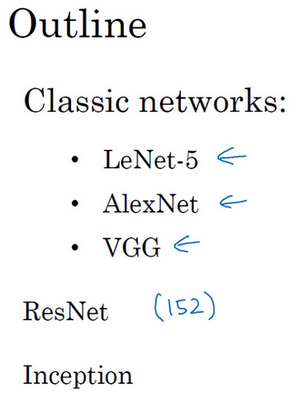

**LeNet-5**网络，我记得应该是1980年代的，经常被引用的**AlexNet**，还有**VGG**网络。这些都是非常有效的神经网络范例，当中的一些思路为现代计算机视觉技术的发展奠定了基础。论文中的这些想法可能对你大有裨益，对你的工作也可能有所帮助。

然后是**ResNet**，又称残差网络。神经网络正在不断加深，对此你可能有所了解。**ResNet**神经网络训练了一个深达152层的神经网络，并且在如何有效训练方面，总结出了一些有趣的想法和窍门。课程最后，我们还会讲一个**Inception**神经网络的实例分析。

# 2. 经典网络

## 2.1 LeNet-5

首先看看**LeNet-5**的网络结构，假设你有一张32×32×1的图片，**LeNet-5**可以识别图中的手写数字，比如像这样手写数字7。**LeNet-5**是针对灰度图片训练的，所以图片的大小只有32×32×1。实际上**LeNet-5**的结构和我们上周讲的最后一个范例非常相似，使用6个5×5的过滤器，步幅为1。由于使用了6个过滤器，步幅为1，**padding**为0，输出结果为28×28×6，图像尺寸从32×32缩小到28×28。然后进行池化操作，在这篇论文写成的那个年代，人们更喜欢使用平均池化，而现在我们可能用最大池化更多一些。在这个例子中，我们进行平均池化，过滤器的宽度为2，步幅为2，图像的尺寸，高度和宽度都缩小了2倍，输出结果是一个14×14×6的图像。我觉得这张图片应该不是完全按照比例绘制的，如果严格按照比例绘制，新图像的尺寸应该刚好是原图像的一半。

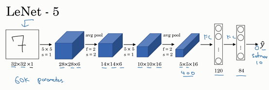

接下来是卷积层，我们用一组16个5×5的过滤器，新的输出结果有16个通道。**LeNet-5**的论文是在1998年撰写的，当时人们并不使用**padding**，或者总是使用**valid**卷积，这就是为什么每进行一次卷积，图像的高度和宽度都会缩小，所以这个图像从14到14缩小到了10×10。然后又是池化层，高度和宽度再缩小一半，输出一个5×5×16的图像。将所有数字相乘，乘积是400。

下一层是全连接层，在全连接层中，有400个节点，每个节点有120个神经元，这里已经有了一个全连接层。但有时还会从这400个节点中抽取一部分节点构建另一个全连接层，就像这样，有2个全连接层。

最后一步就是利用这84个特征得到最后的输出，我们还可以在这里再加一个节点用来预测$\hat{y}$的值，$\hat{y}$有10个可能的值，对应识别0-9这10个数字。在现在的版本中则使用**softmax**函数输出十种分类结果，而在当时，**LeNet-5**网络在输出层使用了另外一种，现在已经很少用到的分类器。

相比现代版本，这里得到的神经网络会小一些，只有约6万个参数。而现在，我们经常看到含有一千万到一亿个参数的神经网络，比这大1000倍的神经网络也不在少数。

不管怎样，如果我们从左往右看，随着网络越来越深，图像的高度和宽度在缩小，从最初的32×32缩小到28×28，再到14×14、10×10，最后只有5×5。与此同时，随着网络层次的加深，通道数量一直在增加，从1增加到6个，再到16个。

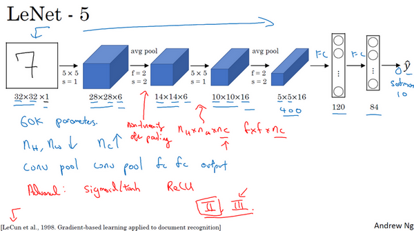

这个神经网络中还有一种模式至今仍然经常用到，就是一个或多个卷积层后面跟着一个池化层，然后又是若干个卷积层再接一个池化层，然后是全连接层，最后是输出，这种排列方式很常用。

对于那些想尝试阅读论文的同学，我再补充几点。接下来的部分主要针对那些打算阅读经典论文的同学，所以会更加深入。这些内容你完全可以跳过，算是对神经网络历史的一种回顾吧，听不懂也不要紧。

读到这篇经典论文时，你会发现，过去，人们使用**sigmod**函数和**tanh**函数，而不是**ReLu**函数，这篇论文中使用的正是**sigmod**函数和**tanh**函数。这种网络结构的特别之处还在于，各网络层之间是有关联的，这在今天看来显得很有趣。

比如说，你有一个$n_{H} \times n_{W} \times n_{C}$的网络，有$n_{C}$个通道，使用尺寸为$f×f×n_{C}$的过滤器，每个过滤器的通道数和它上一层的通道数相同。这是由于在当时，计算机的运行速度非常慢，为了减少计算量和参数，经典的**LeNet-5**网络使用了非常复杂的计算方式，每个过滤器都采用和输入模块一样的通道数量。论文中提到的这些复杂细节，现在一般都不用了。

我认为当时所进行的最后一步其实到现在也还没有真正完成，就是经典的**LeNet-5**网络在池化后进行了非线性函数处理，在这个例子中，池化层之后使用了**sigmod**函数。如果你真的去读这篇论文，这会是最难理解的部分之一，我们会在后面的课程中讲到。

下面要讲的网络结构简单一些，幻灯片的大部分类容来自于原文的第二段和第三段，原文的后几段介绍了另外一种思路。文中提到的这种图形变形网络如今并没有得到广泛应用，所以在读这篇论文的时候，我建议精读第二段，这段重点介绍了这种网络结构。泛读第三段，这里面主要是一些有趣的实验结果。

我要举例说明的第二种神经网络是**AlexNet**，是以论文的第一作者**Alex Krizhevsky**的名字命名的，另外两位合著者是**ilya Sutskever**和**Geoffery Hinton**。

## 2.2 AlexNet

**AlexNet**首先用一张227×227×3的图片作为输入，实际上原文中使用的图像是224×224×3，但是如果你尝试去推导一下，你会发现227×227这个尺寸更好一些。第一层我们使用96个11×11的过滤器，步幅为4，由于步幅是4，因此尺寸缩小到55×55，缩小了4倍左右。然后用一个3×3的过滤器构建最大池化层，$f=3$，步幅$s$为2，卷积层尺寸缩小为27×27×96。接着再执行一个5×5的卷积，**padding**之后，输出是27×27×276。然后再次进行最大池化，尺寸缩小到13×13。再执行一次**same**卷积，相同的**padding**，得到的结果是13×13×384，384个过滤器。再做一次**same**卷积，就像这样。再做一次同样的操作，最后再进行一次最大池化，尺寸缩小到6×6×256。6×6×256等于9216，将其展开为9216个单元，然后是一些全连接层。最后使用**softmax**函数输出识别的结果，看它究竟是1000个可能的对象中的哪一个。

实际上，这种神经网络与**LeNet**有很多相似之处，不过**AlexNet**要大得多。正如前面讲到的**LeNet**或**LeNet-5**大约有6万个参数，而**AlexNet**包含约6000万个参数。当用于训练图像和数据集时，**AlexNet**能够处理非常相似的基本构造模块，这些模块往往包含着大量的隐藏单元或数据，这一点**AlexNet**表现出色。**AlexNet**比**LeNet**表现更为出色的另一个原因是它使用了**ReLu**激活函数。

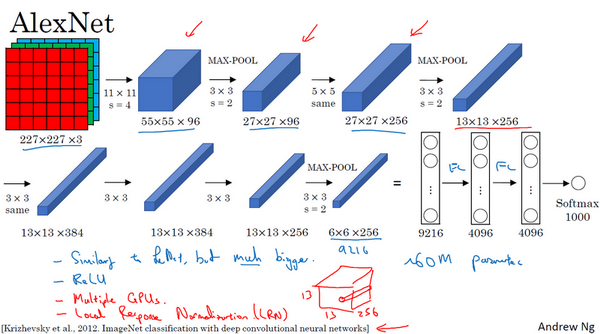

同样的，我还会讲一些比较深奥的内容，如果你并不打算阅读论文，不听也没有关系。第一点，在写这篇论文的时候，**GPU**的处理速度还比较慢，所以**AlexNet**采用了非常复杂的方法在两个**GPU**上进行训练。大致原理是，这些层分别拆分到两个不同的**GPU**上，同时还专门有一个方法用于两个**GPU**进行交流。

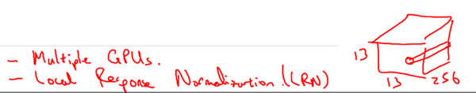

论文还提到，经典的**AlexNet**结构还有另一种类型的层，叫作“局部响应归一化层”（**Local Response Normalization**），即**LRN**层，这类层应用得并不多，所以我并没有专门讲。局部响应归一层的基本思路是，假如这是网络的一块，比如是13×13×256，**LRN**要做的就是选取一个位置，比如说这样一个位置，从这个位置穿过整个通道，能得到256个数字，并进行归一化。进行局部响应归一化的动机是，对于这张13×13的图像中的每个位置来说，我们可能并不需要太多的高激活神经元。但是后来，很多研究者发现**LRN**起不到太大作用，这应该是被我划掉的内容之一，因为并不重要，而且我们现在并不用**LRN**来训练网络。

如果你对深度学习的历史感兴趣的话，我认为在**AlexNet**之前，深度学习已经在语音识别和其它几个领域获得了一些关注，但正是通过这篇论文，计算机视觉群体开始重视深度学习，并确信深度学习可以应用于计算机视觉领域。此后，深度学习在计算机视觉及其它领域的影响力与日俱增。如果你并不打算阅读这方面的论文，其实可以不用学习这节课。但如果你想读懂一些相关的论文，这是比较好理解的一篇，学起来会容易一些。

**AlexNet**网络结构看起来相对复杂，包含大量超参数，这些数字（55×55×96、27×27×96、27×27×256……）都是**Alex Krizhevsky**及其合著者不得不给出的。

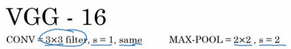

## 2.3 VGG-16

这节课要讲的第三个，也是最后一个范例是**VGG**，也叫作**VGG-16**网络。值得注意的一点是，**VGG-16**网络没有那么多超参数，这是一种只需要专注于构建卷积层的简单网络。首先用3×3，步幅为1的过滤器构建卷积层，**padding**参数为**same**卷积中的参数。然后用一个2×2，步幅为2的过滤器构建最大池化层。因此**VGG**网络的一大优点是它确实简化了神经网络结构，下面我们具体讲讲这种网络结构。

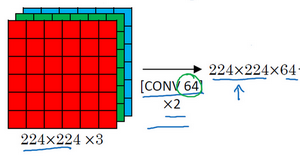

假设要识别这个图像，在最开始的两层用64个3×3的过滤器对输入图像进行卷积，输出结果是224×224×64，因为使用了**same**卷积，通道数量也一样。**VGG-16**其实是一个很深的网络，这里我并没有把所有卷积层都画出来。

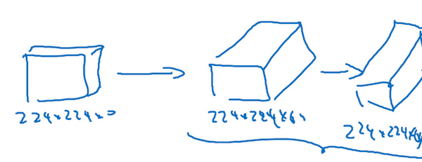

假设这个小图是我们的输入图像，尺寸是224×224×3，进行第一个卷积之后得到224×224×64的特征图，接着还有一层224×224×64，得到这样2个厚度为64的卷积层，意味着我们用64个过滤器进行了两次卷积。正如我在前面提到的，这里采用的都是大小为3×3，步幅为1的过滤器，并且都是采用**same**卷积，所以我就不再把所有的层都画出来了，只用一串数字代表这些网络。

接下来创建一个池化层，池化层将输入图像进行压缩，从224×224×64缩小到多少呢？没错，减少到112×112×64。然后又是若干个卷积层，使用129个过滤器，以及一些**same**卷积，我们看看输出什么结果，112×112×128.然后进行池化，可以推导出池化后的结果是这样（56×56×128）。接着再用256个相同的过滤器进行三次卷积操作，然后再池化，然后再卷积三次，再池化。如此进行几轮操作后，将最后得到的7×7×512的特征图进行全连接操作，得到4096个单元，然后进行**softmax**激活，输出从1000个对象中识别的结果。

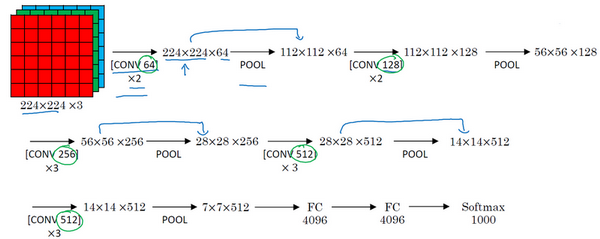

顺便说一下，**VGG-16**的这个数字16，就是指在这个网络中包含16个卷积层和全连接层。确实是个很大的网络，总共包含约1.38亿个参数，即便以现在的标准来看都算是非常大的网络。但**VGG-16**的结构并不复杂，这点非常吸引人，而且这种网络结构很规整，都是几个卷积层后面跟着可以压缩图像大小的池化层，池化层缩小图像的高度和宽度。同时，卷积层的过滤器数量变化存在一定的规律，由64翻倍变成128，再到256和512。作者可能认为512已经足够大了，所以后面的层就不再翻倍了。无论如何，每一步都进行翻倍，或者说在每一组卷积层进行过滤器翻倍操作，正是设计此种网络结构的另一个简单原则。这种相对一致的网络结构对研究者很有吸引力，而它的主要缺点是需要训练的特征数量非常巨大。

有些文章还介绍了**VGG-19**网络，它甚至比**VGG-16**还要大，如果你想了解更多细节，请参考幻灯片下方的注文，阅读由**Karen Simonyan**和**Andrew Zisserman**撰写的论文。由于**VGG-16**的表现几乎和**VGG-19**不分高下，所以很多人还是会使用**VGG-16**。我最喜欢它的一点是，文中揭示了，随着网络的加深，图像的高度和宽度都在以一定的规律不断缩小，每次池化后刚好缩小一半，而通道数量在不断增加，而且刚好也是在每组卷积操作后增加一倍。也就是说，图像缩小的比例和通道数增加的比例是有规律的。从这个角度来看，这篇论文很吸引人。

以上就是三种经典的网络结构，如果你对这些论文感兴趣，我建议从介绍**AlexNet**的论文开始，然后就是**VGG**的论文，最后是**LeNet**的论文。虽然有些晦涩难懂，但对于了解这些网络结构很有帮助。

# 3. 残差网络(Residual Networks (ResNets))

非常非常深的神经网络是很难训练的，因为存在梯度消失和梯度爆炸问题。这节课我们学习跳跃连接（**Skip connection**），它可以从某一层网络层获取激活，然后迅速反馈给另外一层，甚至是神经网络的更深层。我们可以利用跳跃连接构建能够训练深度网络的**ResNets**，有时深度能够超过100层，让我们开始吧。

**ResNets**是由残差块（**Residual block**）构建的，首先我解释一下什么是残差块。

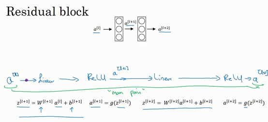

这是一个两层神经网络，在$L$层进行激活，得到$a^{\left\lbrack l + 1 \right\rbrack}$，再次进行激活，两层之后得到$a^{\left\lbrack l + 2 \right\rbrack}$。计算过程是从$a^{[l]}$开始，首先进行线性激活，根据这个公式：$z^{\left\lbrack l + 1 \right\rbrack} = W^{\left\lbrack l + 1 \right\rbrack}a^{[l]} + b^{\left\lbrack l + 1 \right\rbrack}$，通过$a^{[l]}$算出$z^{\left\lbrack l + 1 \right\rbrack}$，即$a^{[l]}$乘以权重矩阵，再加上偏差因子。然后通过**ReLU**非线性激活函数得到$a^{\left\lbrack l + 1 \right\rbrack}$，$a^{\left\lbrack l + 1 \right\rbrack} =g(z^{\left\lbrack l + 1 \right\rbrack})$计算得出。接着再次进行线性激活，依据等式$z^{\left\lbrack l + 2 \right\rbrack} = W^{\left\lbrack 2 + 1 \right\rbrack}a^{\left\lbrack l + 1 \right\rbrack} + b^{\left\lbrack l + 2 \right\rbrack}$，最后根据这个等式再次进行**ReLu**非线性激活，即$a^{\left\lbrack l + 2 \right\rbrack} = g(z^{\left\lbrack l + 2   \right\rbrack})$，这里的$g$是指**ReLU**非线性函数，得到的结果就是$a^{\left\lbrack l + 2 \right\rbrack}$。换句话说，信息流从$a^{\left\lbrack l   \right\rbrack}$到$a^{\left\lbrack l + 2  \right\rbrack}$需要经过以上所有步骤，即这组网络层的主路径。

在残差网络中有一点变化，我们将$a^{[l]}$直接向后，拷贝到神经网络的深层，在**ReLU**非线性激活函数前加上$a^{[l]}$，这是一条捷径。$a^{[l]}$的信息直接到达神经网络的深层，不再沿着主路径传递，这就意味着最后这个等式($a^{\left\lbrack l + 2 \right\rbrack} = g(z^{\left\lbrack l + 2 \right\rbrack})$)去掉了，取而代之的是另一个**ReLU**非线性函数，仍然对$z^{\left\lbrack l + 2 \right\rbrack}$进行$g$函数处理，但这次要加上$a^{[l]}$，即：$\ a^{\left\lbrack l + 2 \right\rbrack} = g\left(z^{\left\lbrack l + 2 \right\rbrack} + a^{[l]}\right)$，也就是加上的这个$a^{[l]}$产生了一个残差块。

在上面这个图中，我们也可以画一条捷径，直达第二层。实际上这条捷径是在进行**ReLU**非线性激活函数之前加上的，而这里的每一个节点都执行了线性函数和**ReLU**激活函数。所以$a^{[l]}$插入的时机是在线性激活之后，**ReLU**激活之前。除了捷径，你还会听到另一个术语“跳跃连接”，就是指$a^{[l]}$跳过一层或者好几层，从而将信息传递到神经网络的更深层。

**ResNet**的发明者是**何凯明**（**Kaiming He**）、**张翔宇**（**Xiangyu Zhang**）、**任少卿**（**Shaoqing Ren**）和**孙剑**（**Jiangxi Sun**），他们发现使用残差块能够训练更深的神经网络。所以构建一个**ResNet**网络就是通过将很多这样的残差块堆积在一起，形成一个很深神经网络，我们来看看这个网络。

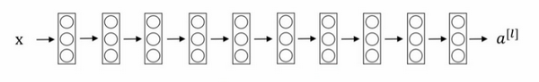

这并不是一个残差网络，而是一个普通网络（**Plain network**），这个术语来自**ResNet**论文。

把它变成**ResNet**的方法是加上所有跳跃连接，正如前一张幻灯片中看到的，每两层增加一个捷径，构成一个残差块。如图所示，5个残差块连接在一起构成一个残差网络。

如果我们使用标准优化算法训练一个普通网络，比如说梯度下降法，或者其它热门的优化算法。如果没有残差，没有这些捷径或者跳跃连接，凭经验你会发现随着网络深度的加深，训练错误会先减少，然后增多。而理论上，随着网络深度的加深，应该训练得越来越好才对。也就是说，理论上网络深度越深越好。但实际上，如果没有残差网络，对于一个普通网络来说，深度越深意味着用优化算法越难训练。实际上，随着网络深度的加深，训练错误会越来越多。

但有了**ResNets**就不一样了，即使网络再深，训练的表现却不错，比如说训练误差减少，就算是训练深达100层的网络也不例外。有人甚至在1000多层的神经网络中做过实验，尽管目前我还没有看到太多实际应用。但是对$x$的激活，或者这些中间的激活能够到达网络的更深层。这种方式确实有助于解决梯度消失和梯度爆炸问题，让我们在训练更深网络的同时，又能保证良好的性能。也许从另外一个角度来看，随着网络越来深，网络连接会变得臃肿，但是**ResNet**确实在训练深度网络方面非常有效。

# 4. 残差网络为什么有效

为什么**ResNets**能有如此好的表现，我们来看个例子，它解释了其中的原因，至少可以说明，如何构建更深层次的**ResNets**网络的同时还不降低它们在训练集上的效率。希望你已经通过第三门课了解到，通常来讲，网络在训练集上表现好，才能在**Hold-Out**交叉验证集或**dev**集和测试集上有好的表现，所以至少在训练集上训练好**ResNets**是第一步。

先来看个例子，上节课我们了解到，一个网络深度越深，它在训练集上训练的效率就会有所减弱，这也是有时候我们不希望加深网络的原因。而事实并非如此，至少在训练**ResNets**网络时，并非完全如此，举个例子。

假设有一个大型神经网络，其输入为$X$，输出激活值$a^{[l]}$。假如你想增加这个神经网络的深度，那么用**Big NN**表示，输出为$ a^{\left\lbrack l\right\rbrack}$。再给这个网络额外添加两层，依次添加两层，最后输出为$a^{\left\lbrack l + 2 \right\rbrack}$，可以把这两层看作一个**ResNets**块，即具有捷径连接的残差块。为了方便说明，假设我们在整个网络中使用**ReLU**激活函数，所以激活值都大于等于0，包括输入$X$的非零异常值。因为**ReLU**激活函数输出的数字要么是0，要么是正数。

我们看一下$a^{\left\lbrack l + 2\right\rbrack}$的值，也就是上节课讲过的表达式，即$a^{\left\lbrack l + 2\right\rbrack} = g(z^{\left\lbrack l + 2 \right\rbrack} + a^{\left\lbrack l\right\rbrack})$，添加项$a^{\left\lbrack l\right\rbrack}$是刚添加的跳跃连接的输入。展开这个表达式$a^{\left\lbrack l + 2 \right\rbrack} = g(W^{\left\lbrack l + 2 \right\rbrack}a^{\left\lbrack l + 1 \right\rbrack} + b^{\left\lbrack l + 2 \right\rbrack} + a^{\left\lbrack l\right\rbrack})$，其中$z^{\left\lbrack l + 2 \right\rbrack} = W^{\left\lbrack l + 2 \right\rbrack}a^{\left\lbrack l + 1 \right\rbrack} + b^{\left\lbrack l + 2\right\rbrack}$。注意一点，如果使用**L2**正则化或权重衰减，它会压缩$W^{\left\lbrack l + 2\right\rbrack}$的值。如果对$b$应用权重衰减也可达到同样的效果，尽管实际应用中，你有时会对$b$应用权重衰减，有时不会。这里的$W$是关键项，如果$W^{\left\lbrack l + 2 \right\rbrack} = 0$，为方便起见，假设$b^{\left\lbrack l + 2 \right\rbrack} = 0$，这几项就没有了，因为它们（$W^{\left\lbrack l + 2 \right\rbrack}a^{\left\lbrack l + 1 \right\rbrack} + b^{\left\lbrack l + 2\right\rbrack}$）的值为0。最后$ a^{\left\lbrack l + 2 \right\rbrack} = \ g\left( a^{[l]} \right) = a^{\left\lbrack l\right\rbrack}$，因为我们假定使用**ReLU**激活函数，并且所有激活值都是非负的，$g\left(a^{[l]} \right)$是应用于非负数的**ReLU**函数，所以$a^{[l+2]} =a^{[l]}$。

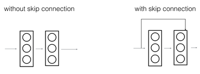

结果表明，残差块学习这个恒等式函数并不难，跳跃连接使我们很容易得出$ a^{\left\lbrack l + 2 \right\rbrack} = a^{\left\lbrack l\right\rbrack}$。这意味着，即使给神经网络增加了这两层，它的效率也并不逊色于更简单的神经网络，因为学习恒等函数对它来说很简单。尽管它多了两层，也只把$a^{[l]}$的值赋值给$a^{\left\lbrack l + 2 \right\rbrack}$。所以给大型神经网络增加两层，不论是把残差块添加到神经网络的中间还是末端位置，都不会影响网络的表现。

当然，我们的目标不仅仅是保持网络的效率，还要提升它的效率。想象一下，如果这些隐藏层单元学到一些有用信息，那么它可能比学习恒等函数表现得更好。而这些不含有残差块或跳跃连接的深度普通网络情况就不一样了，当网络不断加深时，就算是选用学习恒等函数的参数都很困难，所以很多层最后的表现不但没有更好，反而更糟。

我认为残差网络起作用的主要原因就是这些残差块学习恒等函数非常容易，你能确定网络性能不会受到影响，很多时候甚至可以提高效率，或者说至少不会降低网络的效率，因此创建类似残差网络可以提升网络性能。

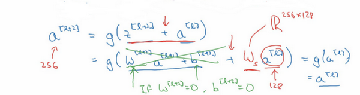

除此之外，关于残差网络，另一个值得探讨的细节是，假设$ z^{\left\lbrack l + 2\right\rbrack}$与$a^{[l]}$具有相同维度，所以**ResNets**使用了许多**same**卷积，所以这个$a^{\left\lbrack l\right\rbrack}$的维度等于这个输出层的维度。之所以能实现跳跃连接是因为**same**卷积保留了维度，所以很容易得出这个捷径连接，并输出这两个相同维度的向量。

如果输入和输出有不同维度，比如输入的维度是128，$ a^{\left\lbrack l + 2\right\rbrack}$的维度是256，再增加一个矩阵，这里标记为$W_{s}$，$W_{s}$是一个256×128维度的矩阵，所以$W_{s}a^{\left\lbrack l\right\rbrack}$的维度是256，这个新增项是256维度的向量。你不需要对$W_{s}$做任何操作，它是网络通过学习得到的矩阵或参数，它是一个固定矩阵，**padding**值为0，用0填充$a^{[l]}$，其维度为256，所以者几个表达式都可以。

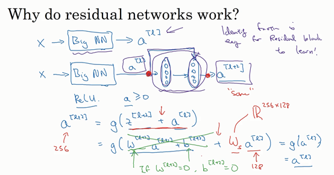

最后，我们来看看**ResNets**的图片识别。这些图片是我从何凯明等人论文中截取的，这是一个普通网络，我们给它输入一张图片，它有多个卷积层，最后输出了一个**Softmax**。

如何把它转化为**ResNets**呢？只需要添加跳跃连接。这里我们只讨论几个细节，这个网络有很多层3×3卷积，而且它们大多都是**same**卷积，这就是添加等维特征向量的原因。所以这些都是卷积层，而不是全连接层，因为它们是**same**卷积，维度得以保留，这也解释了添加项$ z^{\left\lbrack l + 2 \right\rbrack} + a^{\left\lbrack l\right\rbrack}$（维度相同所以能够相加）。

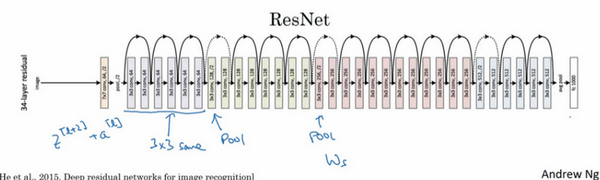

**ResNets**类似于其它很多网络，也会有很多卷积层，其中偶尔会有池化层或类池化层的层。不论这些层是什么类型，正如我们在上一张幻灯片看到的，你都需要调整矩阵$W_{s}$的维度。普通网络和**ResNets**网络常用的结构是：卷积层-卷积层-卷积层-池化层-卷积层-卷积层-卷积层-池化层……依此重复。直到最后，有一个通过**softmax**进行预测的全连接层。

# 5. 网络中的网络以及 1×1 卷积

作用: 可以减少信道(channels)的数量，简化运算，或者是单纯为其添加一个非线性函数，使其可以学习更复杂的函数。

比如$Layer^n$的维度是$N_h × N_w × N_c$,那么我们使用$N_{c^{'}}$个$1 × 1 × N_c$的filter，就可以改变他的维度为$N_h × N_w × N_{c^{'}}$。

过滤器为1×1，这里是数字2，输入一张6×6×1的图片，然后对它做卷积，起过滤器大小为1×1×1，结果相当于把这个图片乘以数字2，所以前三个单元格分别是2、4、6等等。用1×1的过滤器进行卷积，似乎用处不大，只是对输入矩阵乘以某个数字。但这仅仅是对于6×6×1的一个通道图片来说，1×1卷积效果不佳。

如果是一张6×6×32的图片，那么使用1×1过滤器进行卷积效果更好。具体来说，1×1卷积所实现的功能是遍历这36个单元格，计算左图中32个数字和过滤器中32个数字的元素积之和，然后应用**ReLU**非线性函数。

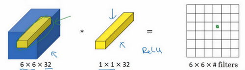

我们以其中一个单元为例，它是这个输入层上的某个切片，用这36个数字乘以这个输入层上1×1切片，得到一个实数，像这样把它画在输出中。

这个1×1×32过滤器中的32个数字可以这样理解，一个神经元的输入是32个数字（输入图片中左下角位置32个通道中的数字），即相同高度和宽度上某一切片上的32个数字，这32个数字具有不同通道，乘以32个权重（将过滤器中的32个数理解为权重），然后应用**ReLU**非线性函数，在这里输出相应的结果。

一般来说，如果过滤器不止一个，而是多个，就好像有多个输入单元，其输入内容为一个切片上所有数字，输出结果是6×6过滤器数量。

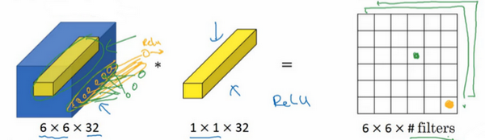

所以1×1卷积可以从根本上理解为对这32个不同的位置都应用一个全连接层，全连接层的作用是输入32个数字（过滤器数量标记为$n_{C}^{\left\lbrack l + 1\right\rbrack}$，在这36个单元上重复此过程）,输出结果是6×6×\#filters（过滤器数量），以便在输入层上实施一个非平凡（**non-trivial**）计算。

这种方法通常称为1×1卷积，有时也被称为**Network in Network**，在林敏、陈强和杨学成的论文中有详细描述。虽然论文中关于架构的详细内容并没有得到广泛应用，但是1×1卷积或**Network in Network**这种理念却很有影响力，很多神经网络架构都受到它的影响，包括下节课要讲的**Inception**网络。

举个1×1卷积的例子，相信对大家有所帮助，这是它的一个应用。

假设这是一个28×28×192的输入层，你可以使用池化层压缩它的高度和宽度，这个过程我们很清楚。但如果通道数量很大，该如何把它压缩为28×28×32维度的层呢？你可以用32个大小为1×1的过滤器，严格来讲每个过滤器大小都是1×1×192维，因为过滤器中通道数量必须与输入层中通道的数量保持一致。但是你使用了32个过滤器，输出层为28×28×32，这就是压缩通道数（$n_{c}$）的方法，对于池化层我只是压缩了这些层的高度和宽度。

在之后我们看到在某些网络中1×1卷积是如何压缩通道数量并减少计算的。当然如果你想保持通道数192不变，这也是可行的，1×1卷积只是添加了非线性函数，当然也可以让网络学习更复杂的函数，比如，我们再添加一层，其输入为28×28×192，输出为28×28×192。

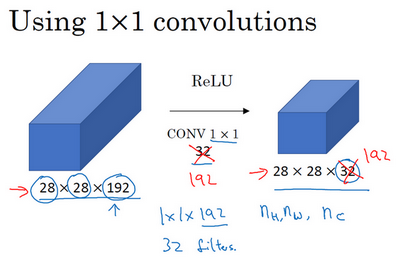

1×1卷积层就是这样实现了一些重要功能的（**doing something pretty non-trivial**），它给神经网络添加了一个非线性函数，从而减少或保持输入层中的通道数量不变，当然如果你愿意，也可以增加通道数量。后面你会发现这对构建**Inception**网络很有帮助，我们放在下节课讲。