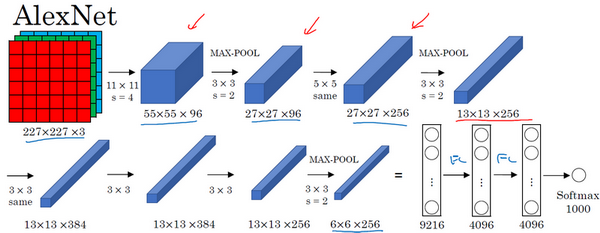

# 1. 为什么要进行实例探究

**LeNet-5**网络，我记得应该是1980年代的，经常被引用的**AlexNet**，还有**VGG**网络。这些都是非常有效的神经网络范例，当中的一些思路为现代计算机视觉技术的发展奠定了基础。论文中的这些想法可能对你大有裨益，对你的工作也可能有所帮助。

然后是**ResNet**，又称残差网络。神经网络正在不断加深，对此你可能有所了解。**ResNet**神经网络训练了一个深达152层的神经网络，并且在如何有效训练方面，总结出了一些有趣的想法和窍门。课程最后，我们还会讲一个**Inception**神经网络的实例分析。

# 2. 经典网络

## 2.1 LeNet-5

首先看看**LeNet-5**的网络结构，假设你有一张32×32×1的图片，**LeNet-5**可以识别图中的手写数字，比如像这样手写数字7。**LeNet-5**是针对灰度图片训练的，所以图片的大小只有32×32×1。实际上**LeNet-5**的结构和我们上周讲的最后一个范例非常相似，使用6个5×5的过滤器，步幅为1。由于使用了6个过滤器，步幅为1，**padding**为0，输出结果为28×28×6，图像尺寸从32×32缩小到28×28。然后进行池化操作，在这篇论文写成的那个年代，人们更喜欢使用平均池化，而现在我们可能用最大池化更多一些。在这个例子中，我们进行平均池化，过滤器的宽度为2，步幅为2，图像的尺寸，高度和宽度都缩小了2倍，输出结果是一个14×14×6的图像。我觉得这张图片应该不是完全按照比例绘制的，如果严格按照比例绘制，新图像的尺寸应该刚好是原图像的一半。

接下来是卷积层，我们用一组16个5×5的过滤器，新的输出结果有16个通道。**LeNet-5**的论文是在1998年撰写的，当时人们并不使用**padding**，或者总是使用**valid**卷积，这就是为什么每进行一次卷积，图像的高度和宽度都会缩小，所以这个图像从14到14缩小到了10×10。然后又是池化层，高度和宽度再缩小一半，输出一个5×5×16的图像。将所有数字相乘，乘积是400。

下一层是全连接层，在全连接层中，有400个节点，每个节点有120个神经元，这里已经有了一个全连接层。但有时还会从这400个节点中抽取一部分节点构建另一个全连接层，就像这样，有2个全连接层。

最后一步就是利用这84个特征得到最后的输出，我们还可以在这里再加一个节点用来预测$\hat{y}$的值，$\hat{y}$有10个可能的值，对应识别0-9这10个数字。在现在的版本中则使用**softmax**函数输出十种分类结果，而在当时，**LeNet-5**网络在输出层使用了另外一种，现在已经很少用到的分类器。

相比现代版本，这里得到的神经网络会小一些，只有约6万个参数。而现在，我们经常看到含有一千万到一亿个参数的神经网络，比这大1000倍的神经网络也不在少数。

不管怎样，如果我们从左往右看，随着网络越来越深，图像的高度和宽度在缩小，从最初的32×32缩小到28×28，再到14×14、10×10，最后只有5×5。与此同时，随着网络层次的加深，通道数量一直在增加，从1增加到6个，再到16个。

这个神经网络中还有一种模式至今仍然经常用到，就是一个或多个卷积层后面跟着一个池化层，然后又是若干个卷积层再接一个池化层，然后是全连接层，最后是输出，这种排列方式很常用。

对于那些想尝试阅读论文的同学，我再补充几点。接下来的部分主要针对那些打算阅读经典论文的同学，所以会更加深入。这些内容你完全可以跳过，算是对神经网络历史的一种回顾吧，听不懂也不要紧。

读到这篇经典论文时，你会发现，过去，人们使用**sigmod**函数和**tanh**函数，而不是**ReLu**函数，这篇论文中使用的正是**sigmod**函数和**tanh**函数。这种网络结构的特别之处还在于，各网络层之间是有关联的，这在今天看来显得很有趣。

比如说，你有一个$n_{H} \times n_{W} \times n_{C}$的网络，有$n_{C}$个通道，使用尺寸为$f×f×n_{C}$的过滤器，每个过滤器的通道数和它上一层的通道数相同。这是由于在当时，计算机的运行速度非常慢，为了减少计算量和参数，经典的**LeNet-5**网络使用了非常复杂的计算方式，每个过滤器都采用和输入模块一样的通道数量。论文中提到的这些复杂细节，现在一般都不用了。

我认为当时所进行的最后一步其实到现在也还没有真正完成，就是经典的**LeNet-5**网络在池化后进行了非线性函数处理，在这个例子中，池化层之后使用了**sigmod**函数。如果你真的去读这篇论文，这会是最难理解的部分之一，我们会在后面的课程中讲到。

下面要讲的网络结构简单一些，幻灯片的大部分类容来自于原文的第二段和第三段，原文的后几段介绍了另外一种思路。文中提到的这种图形变形网络如今并没有得到广泛应用，所以在读这篇论文的时候，我建议精读第二段，这段重点介绍了这种网络结构。泛读第三段，这里面主要是一些有趣的实验结果。

我要举例说明的第二种神经网络是**AlexNet**，是以论文的第一作者**Alex Krizhevsky**的名字命名的，另外两位合著者是**ilya Sutskever**和**Geoffery Hinton**。

## 2.2 AlexNet

**AlexNet**首先用一张227×227×3的图片作为输入，实际上原文中使用的图像是224×224×3，但是如果你尝试去推导一下，你会发现227×227这个尺寸更好一些。第一层我们使用96个11×11的过滤器，步幅为4，由于步幅是4，因此尺寸缩小到55×55，缩小了4倍左右。然后用一个3×3的过滤器构建最大池化层，$f=3$，步幅$s$为2，卷积层尺寸缩小为27×27×96。接着再执行一个5×5的卷积，**padding**之后，输出是27×27×276。然后再次进行最大池化，尺寸缩小到13×13。再执行一次**same**卷积，相同的**padding**，得到的结果是13×13×384，384个过滤器。再做一次**same**卷积，就像这样。再做一次同样的操作，最后再进行一次最大池化，尺寸缩小到6×6×256。6×6×256等于9216，将其展开为9216个单元，然后是一些全连接层。最后使用**softmax**函数输出识别的结果，看它究竟是1000个可能的对象中的哪一个。

实际上，这种神经网络与**LeNet**有很多相似之处，不过**AlexNet**要大得多。正如前面讲到的**LeNet**或**LeNet-5**大约有6万个参数，而**AlexNet**包含约6000万个参数。当用于训练图像和数据集时，**AlexNet**能够处理非常相似的基本构造模块，这些模块往往包含着大量的隐藏单元或数据，这一点**AlexNet**表现出色。**AlexNet**比**LeNet**表现更为出色的另一个原因是它使用了**ReLu**激活函数。

同样的，我还会讲一些比较深奥的内容，如果你并不打算阅读论文，不听也没有关系。第一点，在写这篇论文的时候，**GPU**的处理速度还比较慢，所以**AlexNet**采用了非常复杂的方法在两个**GPU**上进行训练。大致原理是，这些层分别拆分到两个不同的**GPU**上，同时还专门有一个方法用于两个**GPU**进行交流。

论文还提到，经典的**AlexNet**结构还有另一种类型的层，叫作“局部响应归一化层”（**Local Response Normalization**），即**LRN**层，这类层应用得并不多，所以我并没有专门讲。局部响应归一层的基本思路是，假如这是网络的一块，比如是13×13×256，**LRN**要做的就是选取一个位置，比如说这样一个位置，从这个位置穿过整个通道，能得到256个数字，并进行归一化。进行局部响应归一化的动机是，对于这张13×13的图像中的每个位置来说，我们可能并不需要太多的高激活神经元。但是后来，很多研究者发现**LRN**起不到太大作用，这应该是被我划掉的内容之一，因为并不重要，而且我们现在并不用**LRN**来训练网络。

如果你对深度学习的历史感兴趣的话，我认为在**AlexNet**之前，深度学习已经在语音识别和其它几个领域获得了一些关注，但正是通过这篇论文，计算机视觉群体开始重视深度学习，并确信深度学习可以应用于计算机视觉领域。此后，深度学习在计算机视觉及其它领域的影响力与日俱增。如果你并不打算阅读这方面的论文，其实可以不用学习这节课。但如果你想读懂一些相关的论文，这是比较好理解的一篇，学起来会容易一些。

**AlexNet**网络结构看起来相对复杂，包含大量超参数，这些数字（55×55×96、27×27×96、27×27×256……）都是**Alex Krizhevsky**及其合著者不得不给出的。

## 2.3 VGG-16

这节课要讲的第三个，也是最后一个范例是**VGG**，也叫作**VGG-16**网络。值得注意的一点是，**VGG-16**网络没有那么多超参数，这是一种只需要专注于构建卷积层的简单网络。首先用3×3，步幅为1的过滤器构建卷积层，**padding**参数为**same**卷积中的参数。然后用一个2×2，步幅为2的过滤器构建最大池化层。因此**VGG**网络的一大优点是它确实简化了神经网络结构，下面我们具体讲讲这种网络结构。

假设要识别这个图像，在最开始的两层用64个3×3的过滤器对输入图像进行卷积，输出结果是224×224×64，因为使用了**same**卷积，通道数量也一样。**VGG-16**其实是一个很深的网络，这里我并没有把所有卷积层都画出来。

假设这个小图是我们的输入图像，尺寸是224×224×3，进行第一个卷积之后得到224×224×64的特征图，接着还有一层224×224×64，得到这样2个厚度为64的卷积层，意味着我们用64个过滤器进行了两次卷积。正如我在前面提到的，这里采用的都是大小为3×3，步幅为1的过滤器，并且都是采用**same**卷积，所以我就不再把所有的层都画出来了，只用一串数字代表这些网络。

接下来创建一个池化层，池化层将输入图像进行压缩，从224×224×64缩小到多少呢？没错，减少到112×112×64。然后又是若干个卷积层，使用129个过滤器，以及一些**same**卷积，我们看看输出什么结果，112×112×128.然后进行池化，可以推导出池化后的结果是这样（56×56×128）。接着再用256个相同的过滤器进行三次卷积操作，然后再池化，然后再卷积三次，再池化。如此进行几轮操作后，将最后得到的7×7×512的特征图进行全连接操作，得到4096个单元，然后进行**softmax**激活，输出从1000个对象中识别的结果。

顺便说一下，**VGG-16**的这个数字16，就是指在这个网络中包含16个卷积层和全连接层。确实是个很大的网络，总共包含约1.38亿个参数，即便以现在的标准来看都算是非常大的网络。但**VGG-16**的结构并不复杂，这点非常吸引人，而且这种网络结构很规整，都是几个卷积层后面跟着可以压缩图像大小的池化层，池化层缩小图像的高度和宽度。同时，卷积层的过滤器数量变化存在一定的规律，由64翻倍变成128，再到256和512。作者可能认为512已经足够大了，所以后面的层就不再翻倍了。无论如何，每一步都进行翻倍，或者说在每一组卷积层进行过滤器翻倍操作，正是设计此种网络结构的另一个简单原则。这种相对一致的网络结构对研究者很有吸引力，而它的主要缺点是需要训练的特征数量非常巨大。

有些文章还介绍了**VGG-19**网络，它甚至比**VGG-16**还要大，如果你想了解更多细节，请参考幻灯片下方的注文，阅读由**Karen Simonyan**和**Andrew Zisserman**撰写的论文。由于**VGG-16**的表现几乎和**VGG-19**不分高下，所以很多人还是会使用**VGG-16**。我最喜欢它的一点是，文中揭示了，随着网络的加深，图像的高度和宽度都在以一定的规律不断缩小，每次池化后刚好缩小一半，而通道数量在不断增加，而且刚好也是在每组卷积操作后增加一倍。也就是说，图像缩小的比例和通道数增加的比例是有规律的。从这个角度来看，这篇论文很吸引人。

以上就是三种经典的网络结构，如果你对这些论文感兴趣，我建议从介绍**AlexNet**的论文开始，然后就是**VGG**的论文，最后是**LeNet**的论文。虽然有些晦涩难懂，但对于了解这些网络结构很有帮助。