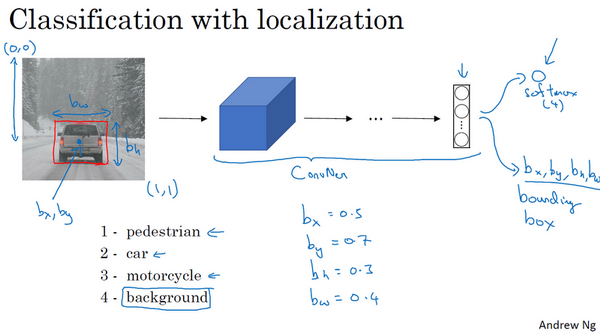
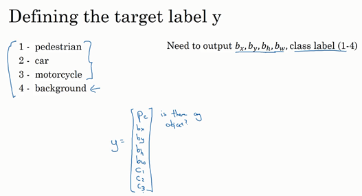
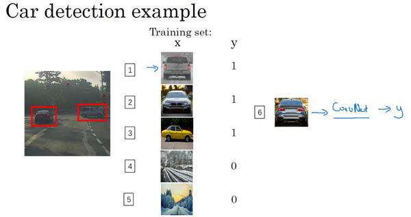
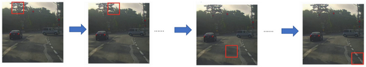
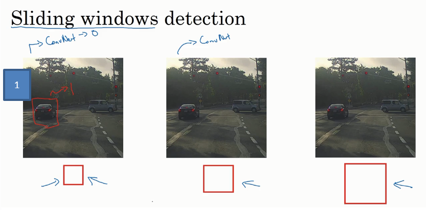
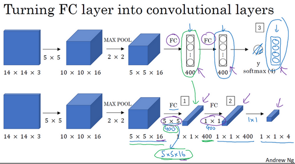
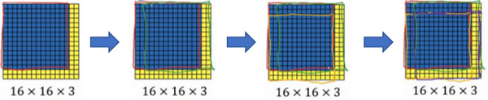
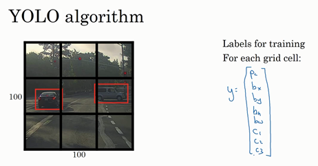
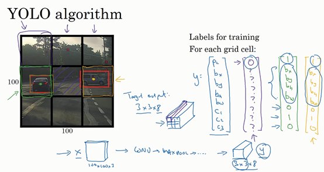
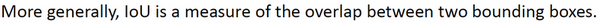

# 1. 目标定位

大家好，欢迎回来，这一周我们学习的主要内容是对象检测，它是计算机视觉领域中一个新兴的应用方向，相比前两年，它的性能越来越好。在构建对象检测之前，我们先了解一下对象定位，首先我们看看它的定义。

图片分类任务我们已经熟悉了，就是算法遍历图片，判断其中的对象是不是汽车，这就是图片分类。这节课我们要学习构建神经网络的另一个问题，即定位分类问题。这意味着，我们不仅要用算法判断图片中是不是一辆汽车，还要在图片中标记出它的位置，用边框或红色方框把汽车圈起来，这就是定位分类问题。其中“定位”的意思是判断汽车在图片中的具体位置。这周后面几天，我们再讲讲当图片中有多个对象时，应该如何检测它们，并确定出位置。比如，你正在做一个自动驾驶程序，程序不但要检测其它车辆，还要检测其它对象，如行人、摩托车等等，稍后我们再详细讲。

本周我们要研究的分类定位问题，通常只有一个较大的对象位于图片中间位置，我们要对它进行识别和定位。而在对象检测问题中，图片可以含有多个对象，甚至单张图片中会有多个不同分类的对象。因此，图片分类的思路可以帮助学习分类定位，而对象定位的思路又有助于学习对象检测，我们先从分类和定位开始讲起。

图片分类问题你已经并不陌生了，例如，输入一张图片到多层卷积神经网络。这就是卷积神经网络，它会输出一个特征向量，并反馈给**softmax**单元来预测图片类型。

如果你正在构建汽车自动驾驶系统，那么对象可能包括以下几类：行人、汽车、摩托车和背景，这意味着图片中不含有前三种对象，也就是说图片中没有行人、汽车和摩托车，输出结果会是背景对象，这四个分类就是softmax函数可能输出的结果。

这就是标准的分类过程，如果你还想定位图片中汽车的位置，该怎么做呢？我们可以让神经网络多输出几个单元，输出一个边界框。具体说就是让神经网络再多输出4个数字，标记为$b_{x}$,$b_{y}$,$b_{h}$和$b_{w}$，这四个数字是被检测对象的边界框的参数化表示。

我们先来约定本周课程将使用的符号表示，图片左上角的坐标为$(0,0)$，右下角标记为$(1,1)$。要确定边界框的具体位置，需要指定红色方框的中心点，这个点表示为($b_{x}$,$b_{y}$)，边界框的高度为$b_{h}$，宽度为$b_{w}$。因此训练集不仅包含神经网络要预测的对象分类标签，还要包含表示边界框的这四个数字，接着采用监督学习算法，输出一个分类标签，还有四个参数值，从而给出检测对象的边框位置。此例中，$b_{x}$的理想值是0.5，因为它表示汽车位于图片水平方向的中间位置；$b_{y}$大约是0.7，表示汽车位于距离图片底部$\frac{3}{10}$的位置；$b_{h}$约为0.3，因为红色方框的高度是图片高度的0.3倍；$b_{w}$约为0.4，红色方框的宽度是图片宽度的0.4倍。

下面我再具体讲讲如何为监督学习任务定义目标标签 $y$。

请注意，这有四个分类，神经网络输出的是这四个数字和一个分类标签，或分类标签出现的概率。目标标签$y$的定义如下：$y= \ \begin{bmatrix} p_{c} \\ b_{x} \\ b_{y} \\ b_{h} \\ b_{w} \\ c_{1} \\ c_{2}\\ c_{3} \\\end{bmatrix}$

它是一个向量，第一个组件$p_{c}$表示是否含有对象，如果对象属于前三类（行人、汽车、摩托车），则$p_{c}= 1$，如果是背景，则图片中没有要检测的对象，则$p_{c} =0$。我们可以这样理解$p_{c}$，它表示被检测对象属于某一分类的概率，背景分类除外。

如果检测到对象，就输出被检测对象的边界框参数$b_{x}$、$b_{y}$、$b_{h}$和$b_{w}$。最后，如果存在某个对象，那么$p_{c}=1$，同时输出$c_{1}$、$c_{2}$和$c_{3}$，表示该对象属于1-3类中的哪一类，是行人，汽车还是摩托车。鉴于我们所要处理的问题，我们假设图片中只含有一个对象，所以针对这个分类定位问题，图片最多只会出现其中一个对象。

我们再看几个样本，假如这是一张训练集图片，标记为$x$，即上图的汽车图片。而在$y$当中，第一个元素$p_{c} =1$，因为图中有一辆车，$b_{x}$、$b_{y}$、$b_{h}$和$b_{w}$会指明边界框的位置，所以标签训练集需要标签的边界框。图片中是一辆车，所以结果属于分类2，因为定位目标不是行人或摩托车，而是汽车，所以$c_{1}= 0$，$c_{2} = 1$，$c_{3} =0$，$c_{1}$、$c_{2}$和$c_{3}$中最多只有一个等于1。

这是图片中只有一个检测对象的情况，如果图片中没有检测对象呢？如果训练样本是这样一张图片呢？

这种情况下，$p_{c} =0$，$y$的其它参数将变得毫无意义，这里我全部写成问号，表示“毫无意义”的参数，因为图片中不存在检测对象，所以不用考虑网络输出中边界框的大小，也不用考虑图片中的对象是属于$c_{1}$、$c_{2}$和$c_{3}$中的哪一类。针对给定的被标记的训练样本，不论图片中是否含有定位对象，构建输入图片$x$和分类标签$y$的具体过程都是如此。这些数据最终定义了训练集。

最后，我们介绍一下神经网络的损失函数，其参数为类别$y$和网络输出$\hat{y}$，如果采用平方误差策略，则$L\left(\hat{y},y \right) = \left( \hat{y_1} - y_{1} \right)^{2} + \left(\hat{y_2} - y_{2}\right)^{2} + \ldots\left( \hat{y_8} - y_{8}\right)^{2}$，损失值等于每个元素相应差值的平方和。

如果图片中存在定位对象，那么$y_{1} = 1$，所以$y_{1} =p_{c}$，同样地，如果图片中存在定位对象，$p_{c} =1$，损失值就是不同元素的平方和。

另一种情况是，$y_{1} = 0$，也就是$p_{c} = 0$，损失值是$\left(\hat{y_1} - y_{1}\right)^{2}$，因为对于这种情况，我们不用考虑其它元素，只需要关注神经网络输出$p_{c}$的准确度。

回顾一下，当$y_{1} =1$时，也就是这种情况（编号1），平方误差策略可以减少这8个元素预测值和实际输出结果之间差值的平方。如果$y_{1}=0$，$y$  矩阵中的后7个元素都不用考虑（编号2），只需要考虑神经网络评估$y_{1}$（即$p_{c}$）的准确度。

为了让大家了解对象定位的细节，这里我用平方误差简化了描述过程。实际应用中，你可以不对$c_{1}$、$c_{2}$、$c_{3}$和**softmax**激活函数应用对数损失函数，并输出其中一个元素值，通常做法是对边界框坐标应用平方差或类似方法，对$p_{c}$应用逻辑回归函数，甚至采用平方预测误差也是可以的。

以上就是利用神经网络解决对象分类和定位问题的详细过程，结果证明，利用神经网络输出批量实数来识别图片中的对象是个非常有用的算法。下节课，我想和大家分享另一种思路，就是把神经网络输出的实数集作为一个回归任务，这个思想也被应用于计算机视觉的其它领域，也是非常有效的，所以下节课见。

# 2. 特征点检测

上节课，我们讲了如何利用神经网络进行对象定位，即通过输出四个参数值$b_{x}$、$b_{y}$、$b_{h}$和$b_{w}$给出图片中对象的边界框。更概括地说，神经网络可以通过输出图片上特征点的$(x,y)$坐标来实现对目标特征的识别，我们看几个例子。

假设你正在构建一个人脸识别应用，出于某种原因，你希望算法可以给出眼角的具体位置。眼角坐标为$(x,y)$，你可以让神经网络的最后一层多输出两个数字$l_{x}$和$l_{y}$，作为眼角的坐标值。如果你想知道两只眼睛的四个眼角的具体位置，那么从左到右，依次用四个特征点来表示这四个眼角。对神经网络稍做些修改，输出第一个特征点（$l_{1x}$，$l_{1y}$），第二个特征点（$l_{2x}$，$l_{2y}$），依此类推，这四个脸部特征点的位置就可以通过神经网络输出了。

也许除了这四个特征点，你还想得到更多的特征点输出值，这些（图中眼眶上的红色特征点）都是眼睛的特征点，你还可以根据嘴部的关键点输出值来确定嘴的形状，从而判断人物是在微笑还是皱眉，也可以提取鼻子周围的关键特征点。为了便于说明，你可以设定特征点的个数，假设脸部有64个特征点，有些点甚至可以帮助你定义脸部轮廓或下颌轮廓。选定特征点个数，并生成包含这些特征点的标签训练集，然后利用神经网络输出脸部关键特征点的位置。

具体做法是，准备一个卷积网络和一些特征集，将人脸图片输入卷积网络，输出1或0，1表示有人脸，0表示没有人脸，然后输出（$l_{1x}$，$l_{1y}$）……直到（$l_{64x}$，$l_{64y}$）。这里我用$l$代表一个特征，这里有129个输出单元，其中1表示图片中有人脸，因为有64个特征，64×2=128，所以最终输出128+1=129个单元，由此实现对图片的人脸检测和定位。这只是一个识别脸部表情的基本构造模块，如果你玩过**Snapchat**或其它娱乐类应用，你应该对**AR**（增强现实）过滤器多少有些了解，**Snapchat**过滤器实现了在脸上画皇冠和其他一些特殊效果。检测脸部特征也是计算机图形效果的一个关键构造模块，比如实现脸部扭曲，头戴皇冠等等。当然为了构建这样的网络，你需要准备一个标签训练集，也就是图片$x$和标签$y$的集合，这些点都是人为辛苦标注的。

最后一个例子，如果你对人体姿态检测感兴趣，你还可以定义一些关键特征点，如胸部的中点，左肩，左肘，腰等等。然后通过神经网络标注人物姿态的关键特征点，再输出这些标注过的特征点，就相当于输出了人物的姿态动作。当然，要实现这个功能，你需要设定这些关键特征点，从胸部中心点($l_{1x}$，$l_{1y}$)一直往下，直到($l_{32x}$，$l_{32y}$)。

一旦了解如何用二维坐标系定义人物姿态，操作起来就相当简单了，批量添加输出单元，用以输出要识别的各个特征点的$(x,y)$坐标值。要明确一点，特征点1的特性在所有图片中必须保持一致，就好比，特征点1始终是右眼的外眼角，特征点2是右眼的内眼角，特征点3是左眼内眼角，特征点4是左眼外眼角等等。所以标签在所有图片中必须保持一致，假如你雇用他人或自己标记了一个足够大的数据集，那么神经网络便可以输出上述所有特征点，你可以利用它们实现其他有趣的效果，比如判断人物的动作姿态，识别图片中的人物表情等等。

# 3. 目标检测

学过了对象定位和特征点检测，今天我们来构建一个对象检测算法。这节课，我们将学习如何通过卷积网络进行对象检测，采用的是基于滑动窗口的目标检测算法。

假如你想构建一个汽车检测算法，步骤是，首先创建一个标签训练集，也就是$x$和$y$表示适当剪切的汽车图片样本，这张图片（编号1）$x$是一个正样本，因为它是一辆汽车图片，这几张图片（编号2、3）也有汽车，但这两张（编号4、5）没有汽车。出于我们对这个训练集的期望，你一开始可以使用适当剪切的图片，就是整张图片$x$几乎都被汽车占据，你可以照张照片，然后剪切，剪掉汽车以外的部分，使汽车居于中间位置，并基本占据整张图片。有了这个标签训练集，你就可以开始训练卷积网络了，输入这些适当剪切过的图片（编号6），卷积网络输出$y$，0或1表示图片中有汽车或没有汽车。训练完这个卷积网络，就可以用它来实现滑动窗口目标检测，具体步骤如下。

假设这是一张测试图片，首先选定一个特定大小的窗口，比如图片下方这个窗口，将这个红色小方块输入卷积神经网络，卷积网络开始进行预测，即判断红色方框内有没有汽车。

滑动窗口目标检测算法接下来会继续处理第二个图像，即红色方框稍向右滑动之后的区域，并输入给卷积网络，因此输入给卷积网络的只有红色方框内的区域，再次运行卷积网络，然后处理第三个图像，依次重复操作，直到这个窗口滑过图像的每一个角落。

为了滑动得更快，我这里选用的步幅比较大，思路是以固定步幅移动窗口，遍历图像的每个区域，把这些剪切后的小图像输入卷积网络，对每个位置按0或1进行分类，这就是所谓的图像滑动窗口操作。

重复上述操作，不过这次我们选择一个更大的窗口，截取更大的区域，并输入给卷积神经网络处理，你可以根据卷积网络对输入大小调整这个区域，然后输入给卷积网络，输出0或1。

再以某个固定步幅滑动窗口，重复以上操作，遍历整个图像，输出结果。

然后第三次重复操作，这次选用更大的窗口。

如果你这样做，不论汽车在图片的什么位置，总有一个窗口可以检测到它。

比如，将这个窗口（编号1）输入卷积网络，希望卷积网络对该输入区域的输出结果为1，说明网络检测到图上有辆车。

这种算法叫作滑动窗口目标检测，因为我们以某个步幅滑动这些方框窗口遍历整张图片，对这些方形区域进行分类，判断里面有没有汽车。

***滑动窗口目标检测算法也有很明显的缺点***，就是计算成本，因为你在图片中剪切出太多小方块，卷积网络要一个个地处理。如果你选用的步幅很大，显然会减少输入卷积网络的窗口个数，但是粗糙间隔尺寸可能会影响性能。反之，如果采用小粒度或小步幅，传递给卷积网络的小窗口会特别多，这意味着超高的计算成本。

所以在神经网络兴起之前，人们通常采用更简单的分类器进行对象检测，比如通过采用手工处理工程特征的简单的线性分类器来执行对象检测。至于误差，因为每个分类器的计算成本都很低，它只是一个线性函数，所以滑动窗口目标检测算法表现良好，是个不错的算法。然而，卷积网络运行单个分类人物的成本却高得多，像这样滑动窗口太慢。除非采用超细粒度或极小步幅，否则无法准确定位图片中的对象。

不过，庆幸的是，计算成本问题已经有了很好的解决方案，大大提高了卷积层上应用滑动窗口目标检测器的效率，关于它的具体实现，我们下节课再讲。

# 4. 滑动窗口的卷积实现

可以直接输入图片进行卷积操作，不必再切割进行多次预测

上节课，我们学习了如何通过卷积网络实现滑动窗口对象检测算法，但效率很低。这节课我们讲讲如何在卷积层上应用这个算法。

为了构建滑动窗口的卷积应用，首先要知道如何把神经网络的全连接层转化成卷积层。我们先讲解这部分内容，下一张幻灯片，我们将按照这个思路来演示卷积的应用过程。

假设对象检测算法输入一个14×14×3的图像，图像很小，不过演示起来方便。在这里过滤器大小为5×5，数量是16，14×14×3的图像在过滤器处理之后映射为10×10×16。然后通过参数为2×2的最大池化操作，图像减小到5×5×16。然后添加一个连接400个单元的全连接层，接着再添加一个全连接层，最后通过**softmax**单元输出$y$。为了跟下图区分开，我先做一点改动，用4个数字来表示$y$，它们分别对应**softmax**单元所输出的4个分类出现的概率。这4个分类可以是行人、汽车、摩托车和背景或其它对象。

现在我要演示的就是如何把这些全连接层转化为卷积层，画一个这样的卷积网络，它的前几层和之前的一样，而对于下一层，也就是这个全连接层，我们可以用5×5的过滤器来实现，数量是400个（编号1所示），输入图像大小为5×5×16，用5×5的过滤器对它进行卷积操作，过滤器实际上是5×5×16，因为在卷积过程中，过滤器会遍历这16个通道，所以这两处的通道数量必须保持一致，输出结果为1×1。假设应用400个这样的5×5×16过滤器，输出维度就是1×1×400，我们不再把它看作一个含有400个节点的集合，而是一个1×1×400的输出层。从数学角度看，它和全连接层是一样的，因为这400个节点中每个节点都有一个5×5×16维度的过滤器，所以每个值都是上一层这些5×5×16激活值经过某个任意线性函数的输出结果。

我们再添加另外一个卷积层（编号2所示），这里用的是1×1卷积，假设有400个1×1的过滤器，在这400个过滤器的作用下，下一层的维度是1×1×400，它其实就是上个网络中的这一全连接层。最后经由1×1过滤器的处理，得到一个**softmax**激活值，通过卷积网络，我们最终得到这个1×1×4的输出层，而不是这4个数字（编号3所示）。

以上就是用卷积层代替全连接层的过程，结果这几个单元集变成了1×1×400和1×1×4的维度。

参考论文：**Sermanet, Pierre, et al. "OverFeat: Integrated Recognition, Localization and Detection using Convolutional Networks." *Eprint Arxiv* (2013).**

掌握了卷积知识，我们再看看如何通过卷积实现滑动窗口对象检测算法。讲义中的内容借鉴了屏幕下方这篇关于**OverFeat**的论文，它的作者包括**Pierre Sermanet**，**David Eigen**，**张翔**，**Michael Mathieu**，**Rob Fergus**，**Yann LeCun**。

假设向滑动窗口卷积网络输入14×14×3的图片，为了简化演示和计算过程，这里我们依然用14×14的小图片。和前面一样，神经网络最后的输出层，即**softmax**单元的输出是1×1×4，我画得比较简单，严格来说，14×14×3应该是一个长方体，第二个10×10×16也是一个长方体，但为了方便，我只画了正面。所以，对于1×1×400的这个输出层，我也只画了它1×1的那一面，所以这里显示的都是平面图，而不是3D图像。

假设输入给卷积网络的图片大小是14×14×3，测试集图片是16×16×3，现在给这个输入图片加上黄色条块，在最初的滑动窗口算法中，你会把这片蓝色区域输入卷积网络（红色笔标记）生成0或1分类。接着滑动窗口，步幅为2个像素，向右滑动2个像素，将这个绿框区域输入给卷积网络，运行整个卷积网络，得到另外一个标签0或1。继续将这个橘色区域输入给卷积网络，卷积后得到另一个标签，最后对右下方的紫色区域进行最后一次卷积操作。我们在这个16×16×3的小图像上滑动窗口，卷积网络运行了4次，于是输出了了4个标签。

结果发现，这4次卷积操作中很多计算都是重复的。所以执行滑动窗口的卷积时使得卷积网络在这4次前向传播过程中共享很多计算，尤其是在这一步操作中（编号1），卷积网络运行同样的参数，使得相同的5×5×16过滤器进行卷积操作，得到12×12×16的输出层。然后执行同样的最大池化（编号2），输出结果6×6×16。照旧应用400个5×5的过滤器（编号3），得到一个2×2×400的输出层，现在输出层为2×2×400，而不是1×1×400。应用1×1过滤器（编号4）得到另一个2×2×400的输出层。再做一次全连接的操作（编号5），最终得到2×2×4的输出层，而不是1×1×4。最终，在输出层这4个子方块中，蓝色的是图像左上部分14×14的输出（红色箭头标识），右上角方块是图像右上部分（绿色箭头标识）的对应输出，左下角方块是输入层左下角（橘色箭头标识），也就是这个14×14区域经过卷积网络处理后的结果，同样，右下角这个方块是卷积网络处理输入层右下角14×14区域(紫色箭头标识)的结果。

如果你想了解具体的计算步骤，以绿色方块为例，假设你剪切出这块区域（编号1），传递给卷积网络，第一层的激活值就是这块区域（编号2），最大池化后的下一层的激活值是这块区域（编号3），这块区域对应着后面几层输出的右上角方块（编号4，5，6）。

所以该卷积操作的原理是我们不需要把输入图像分割成四个子集，分别执行前向传播，而是把它们作为一张图片输入给卷积网络进行计算，其中的公共区域可以共享很多计算，就像这里我们看到的这个4个14×14的方块一样。

下面我们再看一个更大的图片样本，假如对一个28×28×3的图片应用滑动窗口操作，如果以同样的方式运行前向传播，最后得到8×8×4的结果。跟上一个范例一样，以14×14区域滑动窗口，首先在这个区域应用滑动窗口，其结果对应输出层的左上角部分。接着以大小为2的步幅不断地向右移动窗口，直到第8个单元格，得到输出层的第一行。然后向图片下方移动，最终输出这个8×8×4的结果。因为最大池化参数为2，相当于以大小为2的步幅在原始图片上应用神经网络。

总结一下滑动窗口的实现过程，在图片上剪切出一块区域，假设它的大小是14×14，把它输入到卷积网络。继续输入下一块区域，大小同样是14×14，重复操作，直到某个区域识别到汽车。

但是正如在前一页所看到的，我们不能依靠连续的卷积操作来识别图片中的汽车，比如，我们可以对大小为28×28的整张图片进行卷积操作，一次得到所有预测值，如果足够幸运，神经网络便可以识别出汽车的位置。

以上就是在卷积层上应用滑动窗口算法的内容，它提高了整个算法的效率。不过这种算法仍然存在一个缺点，就是边界框的位置可能不够准确。下节课，我们将学习如何解决这个问题。

# 5. Bounding Box 预测

在上一个视频中，你们学到了滑动窗口法的卷积实现，这个算法效率更高，但仍然存在问题，不能输出最精准的边界框。在这个视频中，我们看看如何得到更精准的边界框。

在滑动窗口法中，你取这些离散的位置集合，然后在它们上运行分类器，在这种情况下，这些边界框没有一个能完美匹配汽车位置，也许这个框（编号1）是最匹配的了。还有看起来这个真实值，最完美的边界框甚至不是方形，稍微有点长方形（红色方框所示），长宽比有点向水平方向延伸，有没有办法让这个算法输出更精准的边界框呢？

其中一个能得到更精准边界框的算法是**YOLO**算法，**YOLO**(**You only look once**)意思是你只看一次，这是由**Joseph Redmon**，**Santosh Divvala**，**Ross Girshick**和**Ali Farhadi**提出的算法。

是这么做的，比如你的输入图像是100×100的，然后在图像上放一个网格。为了介绍起来简单一些，我用3×3网格，实际实现时会用更精细的网格，可能是19×19。基本思路是使用图像分类和定位算法，前几个视频介绍过的，然后将算法应用到9个格子上。（基本思路是，采用图像分类和定位算法，本周第一个视频中介绍过的，逐一应用在图像的9个格子中。）更具体一点，你需要这样定义训练标签，所以对于9个格子中的每一个指定一个标签$y$，$y$是8维的，和你之前看到的一样，$y= \ \begin{bmatrix} p_{c} \\ b_{x} \\ b_{y} \\ b_{h} \\ b_{w} \\ c_{1} \\ c_{2}\\ c_{3} \\\end{bmatrix}$，$p_{c}$等于0或1取决于这个绿色格子中是否有图像。然后$b_{x}$、$b_{y}$、$b_{h}$和$b_{w}$作用就是，如果那个格子里有对象，那么就给出边界框坐标。然后$c_{1}$、$c_{2}$和$c_{3}$就是你想要识别的三个类别，背景类别不算，所以你尝试在背景类别中识别行人、汽车和摩托车，那么$c_{1}$、$c_{2}$和$c_{3}$可以是行人、汽车和摩托车类别。这张图里有9个格子，所以对于每个格子都有这么一个向量。

我们看看左上方格子，这里这个（编号1），里面什么也没有，所以左上格子的标签向量$y$是$\begin{bmatrix}0 \\ ? \\ ? \\ ? \\ ? \\ ? \\ ? \\ ? \\\end{bmatrix}$。然后这个格子（编号2）的输出标签$y$也是一样，这个格子（编号3），还有其他什么也没有的格子都一样。

现在这个格子呢？讲的更具体一点，这张图有两个对象，**YOLO**算法做的就是，取两个对象的中点，然后将这个对象分配给包含对象中点的格子。所以左边的汽车就分配到这个格子上（编号4），然后这辆**Condor**（车型：神鹰）中点在这里，分配给这个格子（编号6）。所以即使中心格子（编号5）同时有两辆车的一部分，我们就假装中心格子没有任何我们感兴趣的对象，所以对于中心格子，分类标签$y$和这个向量类似，和这个没有对象的向量类似，即$y= \ \begin{bmatrix} 0 \\ ? \\ ? \\ ? \\ ? \\ ? \\ ? \\ ? \\\end{bmatrix}$。而对于这个格子，这个用绿色框起来的格子（编号4），目标标签就是这样的，这里有一个对象，$p_{c}=1$，然后你写出$b_{x}$、$b_{y}$、$b_{h}$和$b_{w}$来指定边界框位置，然后还有类别1是行人，那么$c_{1}= 0$，类别2是汽车，所以$c_{2} = 1$，类别3是摩托车，则数值$c_{3} = 0$，即$y= \begin{bmatrix} 1 \\ b_{x} \\ b_{y} \\ b_{h} \\ b_{w} \\ 0 \\ 1 \\0 \\\end{bmatrix}$。右边这个格子（编号6）也是类似的，因为这里确实有一个对象，它的向量应该是这个样子的，$y=\begin{bmatrix} 1 \\ b_{x} \\ b_{y} \\ b_{h} \\ b_{w} \\ 0 \\ 1 \\0 \\ \end{bmatrix}$作为目标向量对应右边的格子。

所以对于这里9个格子中任何一个，你都会得到一个8维输出向量，因为这里是3×3的网格，所以有9个格子，总的输出尺寸是3×3×8，所以目标输出是3×3×8。因为这里有3×3格子，然后对于每个格子，你都有一个8维向量$y$，所以目标输出尺寸是3×3×8。

对于这个例子中，左上格子是1×1×8，对应的是9个格子中左上格子的输出向量。所以对于这3×3中每一个位置而言，对于这9个格子，每个都对应一个8维输出目标向量$y$，其中一些值可以是**dont care-s**（即？），如果这里没有对象的话。所以总的目标输出，这个图片的输出标签尺寸就是3×3×8。

如果你现在要训练一个输入为100×100×3的神经网络，现在这是输入图像，然后你有一个普通的卷积网络，卷积层，最大池化层等等，最后你会有这个，选择卷积层和最大池化层，这样最后就映射到一个3×3×8输出尺寸。所以你要做的是，有一个输入$x$，就是这样的输入图像，然后你有这些3×3×8的目标标签$y$。当你用反向传播训练神经网络时，将任意输入$x$映射到这类输出向量$y$。

所以这个算法的优点在于神经网络可以输出精确的边界框，所以测试的时候，你做的是喂入输入图像$x$，然后跑正向传播，直到你得到这个输出$y$。然后对于这里3×3位置对应的9个输出，我们在输出中展示过的，你就可以读出1或0（编号1位置），你就知道9个位置之一有个对象。如果那里有个对象，那个对象是什么（编号3位置），还有格子中这个对象的边界框是什么（编号2位置）。只要每个格子中对象数目没有超过1个，这个算法应该是没问题的。一个格子中存在多个对象的问题，我们稍后再讨论。但实践中，我们这里用的是比较小的3×3网格，实践中你可能会使用更精细的19×19网格，所以输出就是19×19×8。这样的网格精细得多，那么多个对象分配到同一个格子得概率就小得多。

重申一下，把对象分配到一个格子的过程是，你观察对象的中点，然后将这个对象分配到其中点所在的格子，所以即使对象可以横跨多个格子，也只会被分配到9个格子其中之一，就是3×3网络的其中一个格子，或者19×19网络的其中一个格子。在19×19网格中，两个对象的中点（图中蓝色点所示）处于同一个格子的概率就会更低。

所以要注意，首先这和图像分类和定位算法非常像，我们在本周第一节课讲过的，就是它显式地输出边界框坐标，所以这能让神经网络输出边界框，可以具有任意宽高比，并且能输出更精确的坐标，不会受到滑动窗口分类器的步长大小限制。其次，这是一个卷积实现，你并没有在3×3网格上跑9次算法，或者，如果你用的是19×19的网格，19平方是361次，所以你不需要让同一个算法跑361次。相反，这是单次卷积实现，但你使用了一个卷积网络，有很多共享计算步骤，在处理这3×3计算中很多计算步骤是共享的，或者你的19×19的网格，所以这个算法效率很高。

事实上**YOLO**算法有一个好处，也是它受欢迎的原因，因为这是一个卷积实现，实际上它的运行速度非常快，可以达到实时识别。在结束之前我还想给你们分享一个小细节，如何编码这些边界框$b_{x}$、$b_{y}$、$b_{h}$和$b_{w}$，我们在下一张幻灯片上讨论。

这里有两辆车，我们有个3×3网格，我们以右边的车为例（编号1），红色格子里有个对象，所以目标标签$y$就是，$p_{c}= 1$，然后$b_{x}$、$b_{y}$、$b_{h}$和$b_{w}$，然后$c_{1} =0$，$c_{2} = 1$，$c_{3} = 0$，即$y = \begin{bmatrix} 1 \\ b_{x}\\ b_{y} \\ b_{h} \\ b_{w} \\ 0 \\ 1 \\ 0 \\\end{bmatrix}$。你怎么指定这个边界框呢？

**Specify the bounding boxes**：

在**YOLO**算法中，对于这个方框（编号1所示），我们约定左上这个点是$(0,0)$，然后右下这个点是$(1,1)$,要指定橙色中点的位置，$b_{x}$大概是0.4，因为它的位置大概是水平长度的0.4，然后$b_{y}$大概是0.3，然后边界框的高度用格子总体宽度的比例表示，所以这个红框的宽度可能是蓝线（编号2所示的蓝线）的90%，所以$b_{h}$是0.9，它的高度也许是格子总体高度的一半，这样的话$b_{w}$就是0.5。换句话说，$b_{x}$、$b_{y}$、$b_{h}$和$b_{w}$单位是相对于格子尺寸的比例，所以$b_{x}$和$b_{y}$必须在0和1之间，因为从定义上看，橙色点位于对象分配到格子的范围内，如果它不在0和1之间，如果它在方块外，那么这个对象就应该分配到另一个格子上。这个值（$b_{h}$和$b_{w}$）可能会大于1，特别是如果有一辆汽车的边界框是这样的（编号3所示），那么边界框的宽度和高度有可能大于1。

指定边界框的方式有很多，但这种约定是比较合理的，如果你去读**YOLO**的研究论文，**YOLO**的研究工作有其他参数化的方式，可能效果会更好，我这里就只给出了一个合理的约定，用起来应该没问题。不过还有其他更复杂的参数化方式，涉及到**sigmoid**函数，确保这个值（$b_{x}$和$b_{y}$）介于0和1之间，然后使用指数参数化来确保这些（$b_{h}$和$b_{w}$）都是非负数，因为0.9和0.5，这个必须大于等于0。还有其他更高级的参数化方式，可能效果要更好一点，但我这里讲的办法应该是管用的。

这就是**YOLO**算法，你只看一次算法，在接下来的几个视频中，我会告诉你一些其他的思路可以让这个算法做的更好。在此期间，如果你感兴趣，也可以看看**YOLO**的论文，在前几张幻灯片底部引用的**YOLO**论文。

**Redmon, Joseph, et al. "You Only Look Once: Unified, Real-Time Object Detection." (2015):779-788.**

# 6. 交并比（Intersection over union）

你如何判断对象检测算法运作良好呢？在本视频中，你将了解到并交比函数，可以用来评价对象检测算法。在下一个视频中，我们用它来插入一个分量来进一步改善检测算法，我们开始吧。

在对象检测任务中，你希望能够同时定位对象，所以如果实际边界框是这样的，你的算法给出这个紫色的边界框，那么这个结果是好还是坏？所以交并比（**loU**）函数做的是计算两个边界框交集和并集之比。两个边界框的并集是这个区域，就是属于包含两个边界框区域（绿色阴影表示区域），而交集就是这个比较小的区域（橙色阴影表示区域），那么交并比就是交集的大小，这个橙色阴影面积，然后除以绿色阴影的并集面积。

一般约定，在计算机检测任务中，如果$loU≥0.5$，就说检测正确，如果预测器和实际边界框完美重叠，**loU**就是1，因为交集就等于并集。但一般来说只要$loU≥0.5$，那么结果是可以接受的，看起来还可以。一般约定，0.5是阈值，用来判断预测的边界框是否正确。一般是这么约定，但如果你希望更严格一点，你可以将**loU**定得更高，比如说大于0.6或者更大的数字，但**loU**越高，边界框越精确。

所以这是衡量定位精确度的一种方式，你只需要统计算法正确检测和定位对象的次数，你就可以用这样的定义判断对象定位是否准确。再次，0.5是人为约定，没有特别深的理论依据，如果你想更严格一点，可以把阈值定为0.6。有时我看到更严格的标准，比如0.6甚至0.7，但很少见到有人将阈值降到0.5以下。

人们定义**loU**这个概念是为了评价你的对象定位算法是否精准，但更一般地说，**loU**衡量了两个边界框重叠地相对大小。如果你有两个边界框，你可以计算交集，计算并集，然后求两个数值的比值，所以这也可以判断两个边界框是否相似，我们将在下一个视频中再次用到这个函数，当我们讨论非最大值抑制时再次用到。

