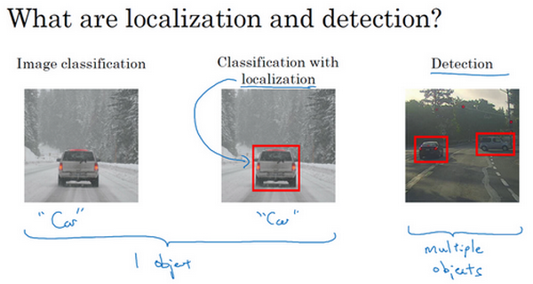
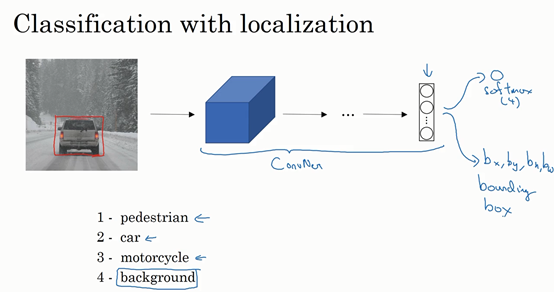
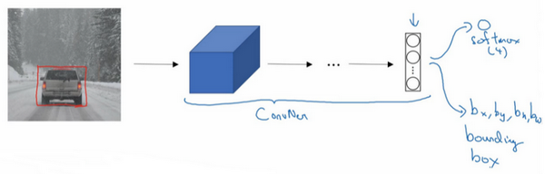

# 1. 目标定位

大家好，欢迎回来，这一周我们学习的主要内容是对象检测，它是计算机视觉领域中一个新兴的应用方向，相比前两年，它的性能越来越好。在构建对象检测之前，我们先了解一下对象定位，首先我们看看它的定义。

图片分类任务我们已经熟悉了，就是算法遍历图片，判断其中的对象是不是汽车，这就是图片分类。这节课我们要学习构建神经网络的另一个问题，即定位分类问题。这意味着，我们不仅要用算法判断图片中是不是一辆汽车，还要在图片中标记出它的位置，用边框或红色方框把汽车圈起来，这就是定位分类问题。其中“定位”的意思是判断汽车在图片中的具体位置。这周后面几天，我们再讲讲当图片中有多个对象时，应该如何检测它们，并确定出位置。比如，你正在做一个自动驾驶程序，程序不但要检测其它车辆，还要检测其它对象，如行人、摩托车等等，稍后我们再详细讲。

本周我们要研究的分类定位问题，通常只有一个较大的对象位于图片中间位置，我们要对它进行识别和定位。而在对象检测问题中，图片可以含有多个对象，甚至单张图片中会有多个不同分类的对象。因此，图片分类的思路可以帮助学习分类定位，而对象定位的思路又有助于学习对象检测，我们先从分类和定位开始讲起。

图片分类问题你已经并不陌生了，例如，输入一张图片到多层卷积神经网络。这就是卷积神经网络，它会输出一个特征向量，并反馈给**softmax**单元来预测图片类型。

如果你正在构建汽车自动驾驶系统，那么对象可能包括以下几类：行人、汽车、摩托车和背景，这意味着图片中不含有前三种对象，也就是说图片中没有行人、汽车和摩托车，输出结果会是背景对象，这四个分类就是softmax函数可能输出的结果。

这就是标准的分类过程，如果你还想定位图片中汽车的位置，该怎么做呢？我们可以让神经网络多输出几个单元，输出一个边界框。具体说就是让神经网络再多输出4个数字，标记为$b_{x}$,$b_{y}$,$b_{h}$和$b_{w}$，这四个数字是被检测对象的边界框的参数化表示。

我们先来约定本周课程将使用的符号表示，图片左上角的坐标为$(0,0)$，右下角标记为$(1,1)$。要确定边界框的具体位置，需要指定红色方框的中心点，这个点表示为($b_{x}$,$b_{y}$)，边界框的高度为$b_{h}$，宽度为$b_{w}$。因此训练集不仅包含神经网络要预测的对象分类标签，还要包含表示边界框的这四个数字，接着采用监督学习算法，输出一个分类标签，还有四个参数值，从而给出检测对象的边框位置。此例中，$b_{x}$的理想值是0.5，因为它表示汽车位于图片水平方向的中间位置；$b_{y}$大约是0.7，表示汽车位于距离图片底部$\frac{3}{10}$的位置；$b_{h}$约为0.3，因为红色方框的高度是图片高度的0.3倍；$b_{w}$约为0.4，红色方框的宽度是图片宽度的0.4倍。

下面我再具体讲讲如何为监督学习任务定义目标标签 $y$。

请注意，这有四个分类，神经网络输出的是这四个数字和一个分类标签，或分类标签出现的概率。目标标签$y$的定义如下：$y= \ \begin{bmatrix} p_{c} \\ b_{x} \\ b_{y} \\ b_{h} \\ b_{w} \\ c_{1} \\ c_{2}\\ c_{3} \\\end{bmatrix}$

它是一个向量，第一个组件$p_{c}$表示是否含有对象，如果对象属于前三类（行人、汽车、摩托车），则$p_{c}= 1$，如果是背景，则图片中没有要检测的对象，则$p_{c} =0$。我们可以这样理解$p_{c}$，它表示被检测对象属于某一分类的概率，背景分类除外。

如果检测到对象，就输出被检测对象的边界框参数$b_{x}$、$b_{y}$、$b_{h}$和$b_{w}$。最后，如果存在某个对象，那么$p_{c}=1$，同时输出$c_{1}$、$c_{2}$和$c_{3}$，表示该对象属于1-3类中的哪一类，是行人，汽车还是摩托车。鉴于我们所要处理的问题，我们假设图片中只含有一个对象，所以针对这个分类定位问题，图片最多只会出现其中一个对象。

我们再看几个样本，假如这是一张训练集图片，标记为$x$，即上图的汽车图片。而在$y$当中，第一个元素$p_{c} =1$，因为图中有一辆车，$b_{x}$、$b_{y}$、$b_{h}$和$b_{w}$会指明边界框的位置，所以标签训练集需要标签的边界框。图片中是一辆车，所以结果属于分类2，因为定位目标不是行人或摩托车，而是汽车，所以$c_{1}= 0$，$c_{2} = 1$，$c_{3} =0$，$c_{1}$、$c_{2}$和$c_{3}$中最多只有一个等于1。

这是图片中只有一个检测对象的情况，如果图片中没有检测对象呢？如果训练样本是这样一张图片呢？

这种情况下，$p_{c} =0$，$y$的其它参数将变得毫无意义，这里我全部写成问号，表示“毫无意义”的参数，因为图片中不存在检测对象，所以不用考虑网络输出中边界框的大小，也不用考虑图片中的对象是属于$c_{1}$、$c_{2}$和$c_{3}$中的哪一类。针对给定的被标记的训练样本，不论图片中是否含有定位对象，构建输入图片$x$和分类标签$y$的具体过程都是如此。这些数据最终定义了训练集。

最后，我们介绍一下神经网络的损失函数，其参数为类别$y$和网络输出$\hat{y}$，如果采用平方误差策略，则$L\left(\hat{y},y \right) = \left( \hat{y_1} - y_{1} \right)^{2} + \left(\hat{y_2} - y_{2}\right)^{2} + \ldots\left( \hat{y_8} - y_{8}\right)^{2}$，损失值等于每个元素相应差值的平方和。

如果图片中存在定位对象，那么$y_{1} = 1$，所以$y_{1} =p_{c}$，同样地，如果图片中存在定位对象，$p_{c} =1$，损失值就是不同元素的平方和。

另一种情况是，$y_{1} = 0$，也就是$p_{c} = 0$，损失值是$\left(\hat{y_1} - y_{1}\right)^{2}$，因为对于这种情况，我们不用考虑其它元素，只需要关注神经网络输出$p_{c}$的准确度。

回顾一下，当$y_{1} =1$时，也就是这种情况（编号1），平方误差策略可以减少这8个元素预测值和实际输出结果之间差值的平方。如果$y_{1}=0$，$y$  矩阵中的后7个元素都不用考虑（编号2），只需要考虑神经网络评估$y_{1}$（即$p_{c}$）的准确度。

为了让大家了解对象定位的细节，这里我用平方误差简化了描述过程。实际应用中，你可以不对$c_{1}$、$c_{2}$、$c_{3}$和**softmax**激活函数应用对数损失函数，并输出其中一个元素值，通常做法是对边界框坐标应用平方差或类似方法，对$p_{c}$应用逻辑回归函数，甚至采用平方预测误差也是可以的。

以上就是利用神经网络解决对象分类和定位问题的详细过程，结果证明，利用神经网络输出批量实数来识别图片中的对象是个非常有用的算法。下节课，我想和大家分享另一种思路，就是把神经网络输出的实数集作为一个回归任务，这个思想也被应用于计算机视觉的其它领域，也是非常有效的，所以下节课见。

# 2. 特征点检测

上节课，我们讲了如何利用神经网络进行对象定位，即通过输出四个参数值$b_{x}$、$b_{y}$、$b_{h}$和$b_{w}$给出图片中对象的边界框。更概括地说，神经网络可以通过输出图片上特征点的$(x,y)$坐标来实现对目标特征的识别，我们看几个例子。

假设你正在构建一个人脸识别应用，出于某种原因，你希望算法可以给出眼角的具体位置。眼角坐标为$(x,y)$，你可以让神经网络的最后一层多输出两个数字$l_{x}$和$l_{y}$，作为眼角的坐标值。如果你想知道两只眼睛的四个眼角的具体位置，那么从左到右，依次用四个特征点来表示这四个眼角。对神经网络稍做些修改，输出第一个特征点（$l_{1x}$，$l_{1y}$），第二个特征点（$l_{2x}$，$l_{2y}$），依此类推，这四个脸部特征点的位置就可以通过神经网络输出了。

也许除了这四个特征点，你还想得到更多的特征点输出值，这些（图中眼眶上的红色特征点）都是眼睛的特征点，你还可以根据嘴部的关键点输出值来确定嘴的形状，从而判断人物是在微笑还是皱眉，也可以提取鼻子周围的关键特征点。为了便于说明，你可以设定特征点的个数，假设脸部有64个特征点，有些点甚至可以帮助你定义脸部轮廓或下颌轮廓。选定特征点个数，并生成包含这些特征点的标签训练集，然后利用神经网络输出脸部关键特征点的位置。

具体做法是，准备一个卷积网络和一些特征集，将人脸图片输入卷积网络，输出1或0，1表示有人脸，0表示没有人脸，然后输出（$l_{1x}$，$l_{1y}$）……直到（$l_{64x}$，$l_{64y}$）。这里我用$l$代表一个特征，这里有129个输出单元，其中1表示图片中有人脸，因为有64个特征，64×2=128，所以最终输出128+1=129个单元，由此实现对图片的人脸检测和定位。这只是一个识别脸部表情的基本构造模块，如果你玩过**Snapchat**或其它娱乐类应用，你应该对**AR**（增强现实）过滤器多少有些了解，**Snapchat**过滤器实现了在脸上画皇冠和其他一些特殊效果。检测脸部特征也是计算机图形效果的一个关键构造模块，比如实现脸部扭曲，头戴皇冠等等。当然为了构建这样的网络，你需要准备一个标签训练集，也就是图片$x$和标签$y$的集合，这些点都是人为辛苦标注的。

最后一个例子，如果你对人体姿态检测感兴趣，你还可以定义一些关键特征点，如胸部的中点，左肩，左肘，腰等等。然后通过神经网络标注人物姿态的关键特征点，再输出这些标注过的特征点，就相当于输出了人物的姿态动作。当然，要实现这个功能，你需要设定这些关键特征点，从胸部中心点($l_{1x}$，$l_{1y}$)一直往下，直到($l_{32x}$，$l_{32y}$)。

一旦了解如何用二维坐标系定义人物姿态，操作起来就相当简单了，批量添加输出单元，用以输出要识别的各个特征点的$(x,y)$坐标值。要明确一点，特征点1的特性在所有图片中必须保持一致，就好比，特征点1始终是右眼的外眼角，特征点2是右眼的内眼角，特征点3是左眼内眼角，特征点4是左眼外眼角等等。所以标签在所有图片中必须保持一致，假如你雇用他人或自己标记了一个足够大的数据集，那么神经网络便可以输出上述所有特征点，你可以利用它们实现其他有趣的效果，比如判断人物的动作姿态，识别图片中的人物表情等等。

# 3. 目标检测

学过了对象定位和特征点检测，今天我们来构建一个对象检测算法。这节课，我们将学习如何通过卷积网络进行对象检测，采用的是基于滑动窗口的目标检测算法。

假如你想构建一个汽车检测算法，步骤是，首先创建一个标签训练集，也就是$x$和$y$表示适当剪切的汽车图片样本，这张图片（编号1）$x$是一个正样本，因为它是一辆汽车图片，这几张图片（编号2、3）也有汽车，但这两张（编号4、5）没有汽车。出于我们对这个训练集的期望，你一开始可以使用适当剪切的图片，就是整张图片$x$几乎都被汽车占据，你可以照张照片，然后剪切，剪掉汽车以外的部分，使汽车居于中间位置，并基本占据整张图片。有了这个标签训练集，你就可以开始训练卷积网络了，输入这些适当剪切过的图片（编号6），卷积网络输出$y$，0或1表示图片中有汽车或没有汽车。训练完这个卷积网络，就可以用它来实现滑动窗口目标检测，具体步骤如下。

假设这是一张测试图片，首先选定一个特定大小的窗口，比如图片下方这个窗口，将这个红色小方块输入卷积神经网络，卷积网络开始进行预测，即判断红色方框内有没有汽车。

滑动窗口目标检测算法接下来会继续处理第二个图像，即红色方框稍向右滑动之后的区域，并输入给卷积网络，因此输入给卷积网络的只有红色方框内的区域，再次运行卷积网络，然后处理第三个图像，依次重复操作，直到这个窗口滑过图像的每一个角落。

为了滑动得更快，我这里选用的步幅比较大，思路是以固定步幅移动窗口，遍历图像的每个区域，把这些剪切后的小图像输入卷积网络，对每个位置按0或1进行分类，这就是所谓的图像滑动窗口操作。

重复上述操作，不过这次我们选择一个更大的窗口，截取更大的区域，并输入给卷积神经网络处理，你可以根据卷积网络对输入大小调整这个区域，然后输入给卷积网络，输出0或1。

再以某个固定步幅滑动窗口，重复以上操作，遍历整个图像，输出结果。

然后第三次重复操作，这次选用更大的窗口。

如果你这样做，不论汽车在图片的什么位置，总有一个窗口可以检测到它。

比如，将这个窗口（编号1）输入卷积网络，希望卷积网络对该输入区域的输出结果为1，说明网络检测到图上有辆车。

这种算法叫作滑动窗口目标检测，因为我们以某个步幅滑动这些方框窗口遍历整张图片，对这些方形区域进行分类，判断里面有没有汽车。

***滑动窗口目标检测算法也有很明显的缺点***，就是计算成本，因为你在图片中剪切出太多小方块，卷积网络要一个个地处理。如果你选用的步幅很大，显然会减少输入卷积网络的窗口个数，但是粗糙间隔尺寸可能会影响性能。反之，如果采用小粒度或小步幅，传递给卷积网络的小窗口会特别多，这意味着超高的计算成本。

所以在神经网络兴起之前，人们通常采用更简单的分类器进行对象检测，比如通过采用手工处理工程特征的简单的线性分类器来执行对象检测。至于误差，因为每个分类器的计算成本都很低，它只是一个线性函数，所以滑动窗口目标检测算法表现良好，是个不错的算法。然而，卷积网络运行单个分类人物的成本却高得多，像这样滑动窗口太慢。除非采用超细粒度或极小步幅，否则无法准确定位图片中的对象。

不过，庆幸的是，计算成本问题已经有了很好的解决方案，大大提高了卷积层上应用滑动窗口目标检测器的效率，关于它的具体实现，我们下节课再讲。