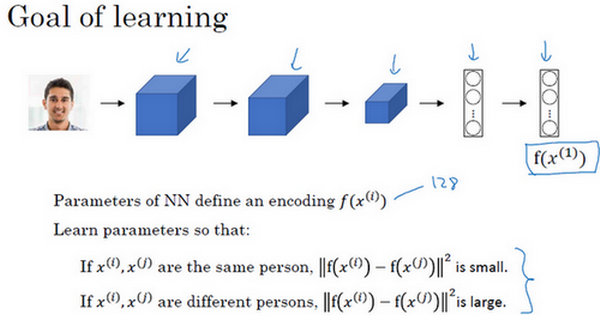
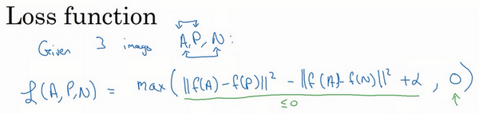
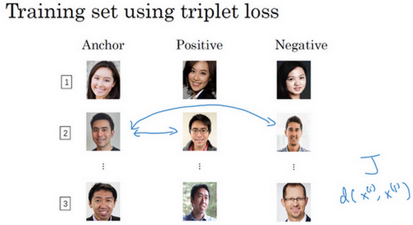

[TOC]

# 1. 什么是人脸识别

首先，让我们了解一下人脸识别的一些术语。

在人脸识别的相关文献中，人们经常提到人脸验证（**face verification**）和人脸识别（**face recognition**）。

这是人脸验证问题，如果你有一张输入图片，以及某人的**ID**或者是名字，这个系统要做的是，验证输入图片是否是这个人。有时候也被称作1对1问题，只需要弄明白这个人是否和他声称的身份相符。

而人脸识别问题比人脸验证问题难很多（整理者注：1对多问题（$1:K$）），为什么呢？假设你有一个验证系统，准确率是99%，还可以。但是现在，假设在识别系统中，$K=100$，如果你把这个验证系统应用在100个人身上，人脸识别上，你犯错的机会就是100倍了。如果每个人犯错的概率是1%，如果你有一个上百人的数据库，如果你想得到一个可接受的识别误差，你要构造一个验证系统，其准确率为99.9%或者更高，然后才可以在100人的数据库上运行，而保证有很大几率不出错。事实上，如果我们有一个100人的数据库，正确率可能需要远大于99%，才能得到很好的效果。

在之后的几个视频中，我们主要讲构造一个人脸验证，作为基本模块，如果准确率够高，你就可以把它用在识别系统上。

# 2. One-shot learning

***KEY:学习一个similarity函数，输出两个图片的差异大小，而不是使用softmax函数来完成按人识别***

人脸识别所面临的一个挑战就是你需要解决一次学习问题，这意味着在大多数人脸识别应用中，你需要通过单单一张图片或者单单一个人脸样例就能去识别这个人。而历史上，当深度学习只有一个训练样例时，它的表现并不好，让我们看一个直观的例子，并讨论如何去解决这个问题。

假设你的数据库里有4张你们公司的员工照片，实际上他们确实是我们**deeplearning.ai**的员工，分别是**Kian**，**Danielle**，**Younes**和**Tian**。现在假设有个人（编号1所示）来到办公室，并且她想通过带有人脸识别系统的栅门，现在系统需要做的就是，仅仅通过一张已有的**Danielle**照片，来识别前面这个人确实是她。相反，如果机器看到一个不在数据库里的人（编号2所示），机器应该能分辨出她不是数据库中四个人之一。

所以在一次学习问题中，只能通过一个样本进行学习，以能够认出同一个人。大多数人脸识别系统都需要解决这个问题，因为在你的数据库中每个雇员或者组员可能都只有一张照片。

有一种办法是，将人的照片放进卷积神经网络中，使用**softmax**单元来输出4种，或者说5种标签，分别对应这4个人，或者4个都不是，所以**softmax**里我们会有5种输出。但实际上这样效果并不好，因为如此小的训练集不足以去训练一个稳健的神经网络。

而且，假如有新人加入你的团队，你现在将会有5个组员需要识别，所以输出就变成了6种，这时你要重新训练你的神经网络吗？这听起来实在不像一个好办法。

所以要让人脸识别能够做到一次学习，为了能有更好的效果，你现在要做的应该是学习**Similarity**函数。详细地说，你想要神经网络学习这样一个用$d$表示的函数，$d(img1,img2) = degree\ of\ difference\ between\ images$，它以两张图片作为输入，然后输出这两张图片的差异值。如果你放进同一个人的两张照片，你希望它能输出一个很小的值，如果放进两个长相差别很大的人的照片，它就输出一个很大的值。所以在识别过程中，如果这两张图片的差异值小于某个阈值$\tau$，它是一个超参数，那么这时就能预测这两张图片是同一个人，如果差异值大于τ，就能预测这是不同的两个人，这就是解决人脸验证问题的一个可行办法。

要将它应用于识别任务，你要做的是拿这张新图片（编号6），然后用$d$函数去比较这两张图片（编号1和编号6），这样可能会输出一个非常大的数字，在该例中，比如说这个数字是10。之后你再让它和数据库中第二张图（编号2）片比较，因为这两张照片是同一个人，所以我们希望会输出一个很小的数。然后你再用它与数据库中的其他图片（编号3、4）进行比较，通过这样的计算，最终你能够知道，这个人确实是**Danielle**。

对应的，如果某个人（编号7）不在你的数据库中，你通过函数$d$将他们的照片两两进行比较，最后我们希望$d$会对所有的比较都输出一个很大的值，这就证明这个人并不是数据库中4个人的其中一个。

要注意在这过程中你是如何解决一次学习问题的，只要你能学习这个函数$d$，通过输入一对图片，它将会告诉你这两张图片是否是同一个人。如果之后有新人加入了你的团队（编号5），你只需将他的照片加入你的数据库，系统依然能照常工作。

# 3. Siamese 网络（Siamese network）

你经常看到这样的卷积网络，输入图片$x^{(1)}$，然后通过一些列卷积，池化和全连接层，最终得到这样的特征向量（编号1）。有时这个会被送进**softmax**单元来做分类，但在这个视频里我们不会这么做。我们关注的重点是这个向量（编号1），假如它有128个数，它是由网络深层的全连接层计算出来的，我要给这128个数命个名字，把它叫做$f(x^{(1)})$。你可以把$f(x^{(1)})$看作是输入图像$x^{(1)}$的编码，取这个输入图像（编号2），在这里是**Kian**的图片，然后表示成128维的向量。

建立一个人脸识别系统的方法就是，如果你要比较两个图片的话，例如这里的第一张（编号1）和第二张图片（编号2），你要做的就是把第二张图片喂给有同样参数的同样的神经网络，然后得到一个不同的128维的向量（编号3），这个向量代表或者编码第二个图片，我要把第二张图片的编码叫做$f(x^{(2)})$。这里我用$x^{(1)}$和$x^{(2)}$仅仅代表两个输入图片，他们没必要非是第一个和第二个训练样本，可以是任意两个图片。

最后如果你相信这些编码很好地代表了这两个图片，你要做的就是定义$d$，将$x^{(1)}$和$x^{(2)}$的距离定义为这两幅图片的编码之差的范数，$d( x^{( 1)},x^{( 2)}) =|| f( x^{( 1)}) - f( x^{( 2)})||_{2}^{2}$。

对于两个不同的输入，运行相同的卷积神经网络，然后比较它们，这一般叫做**Siamese**网络架构。这里提到的很多观点，都来自于**Yaniv Taigman**，**Ming Yang**，**Marc’ Aurelio Ranzato**，**Lior Wolf**的这篇论文，他们开发的系统叫做**DeepFace**。

怎么训练这个**Siamese**神经网络呢？不要忘了这两个网络有相同的参数，所以你实际要做的就是训练一个网络，它计算得到的编码可以用于函数$d$，它可以告诉你两张图片是否是同一个人。更准确地说，神经网络的参数定义了一个编码函数$f(x^{(i)})$，如果给定输入图像$x^{(i)}$，这个网络会输出$x^{(i)}$的128维的编码。你要做的就是学习参数，使得如果两个图片$x^{( i)}$和$x^{( j)}$是同一个人，那么你得到的两个编码的距离就小。前面几个幻灯片我都用的是$x^{(1)}$和$x^{( 2)}$，其实训练集里任意一对$x^{(i)}$和$x^{(j)}$都可以。相反，如果$x^{(i)}$和$x^{(j)}$是不同的人，那么你会想让它们之间的编码距离大一点。

如果你改变这个网络所有层的参数，你会得到不同的编码结果，你要做的就是用反向传播来改变这些所有的参数，以确保满足这些条件。

# 4. Triplet 损失

要想通过学习神经网络的参数来得到优质的人脸图片编码，方法之一就是定义三元组损失函数然后应用梯度下降。

我们看下这是什么意思，为了应用三元组损失函数，你需要比较成对的图像，比如这个图片，为了学习网络的参数，你需要同时看几幅图片，比如这对图片（编号1和编号2），你想要它们的编码相似，因为这是同一个人。然而假如是这对图片（编号3和编号4），你会想要它们的编码差异大一些，因为这是不同的人。

用三元组损失的术语来说，你要做的通常是看一个 **Anchor** 图片，你想让**Anchor**图片和**Positive**图片（**Positive**意味着是同一个人）的距离很接近。然而，当**Anchor**图片与**Negative**图片（**Negative**意味着是非同一个人）对比时，你会想让他们的距离离得更远一点。

这就是为什么叫做三元组损失，它代表你通常会同时看三张图片，你需要看**Anchor**图片、**Postive**图片，还有**Negative**图片，我要把**Anchor**图片、**Positive**图片和**Negative**图片简写成$A$、$P$、$N$。

把这些写成公式的话，你想要的是网络的参数或者编码能够满足以下特性，也就是说你想要$|| f(A) - f(P) ||^{2}$，你希望这个数值很小，准确地说，你想让它小于等$f(A)$和$f(N)$之间的距离，或者说是它们的范数的平方（即：$|| f(A) - f(P)||^{2} \leq ||f(A) - f(N)||^{2}$）。（$|| f(A) - f(P) ||^{2}$）当然这就是$d(A,P)$，（$|| f(A) - f(N) ||^{2}$）这是$d(A,N)$，你可以把$d$ 看作是距离(**distance**)函数，这也是为什么我们把它命名为$d$。

现在如果我把方程右边项移到左边，最终就得到：

$|| f(A) - f(P)||^{2} \leq ||f(A) - f(N)||^{2}$

现在我要对这个表达式做一些小的改变，有一种情况满足这个表达式，但是没有用处，就是把所有的东西都学成0，如果$f$总是输出0，即0-0≤0，这就是0减去0还等于0，如果所有图像的$f$都是一个零向量，那么总能满足这个方程。所以为了确保网络对于所有的编码不会总是输出0，也为了确保它不会把所有的编码都设成互相相等的。另一种方法能让网络得到这种没用的输出，就是如果每个图片的编码和其他图片一样，这种情况，你还是得到0-0。

为了阻止网络出现这种情况，我们需要修改这个目标，也就是，这个不能是刚好小于等于0，应该是比0还要小，所以这个应该小于一个$-a$值（即$|| f(A) - f(P)||^{2} -||f(A) - f(N)||^{2} \leq -a$），这里的$a$是另一个超参数，这个就可以阻止网络输出无用的结果。按照惯例，我们习惯写$+a$（即$|| f(A) - f(P)||^{2} -||f(A) - f(N)||^{2} +a\leq0$），而不是把$-a$写在后面，它也叫做间隔(**margin**)，这个术语你会很熟悉，如果你看过关于支持向量机 (**SVM**)的文献，没看过也不用担心。我们可以把上面这个方程（$|| f(A) - f(P)||^{2}  -||f(A) - f(N)||^{2}$）也修改一下，加上这个间隔参数。haox 

举个例子，假如间隔设置成0.2，如果在这个例子中，$d(A,P) =0.5$，如果 **Anchor**和 **Negative**图片的$d$，即$d(A,N)$只大一点，比如说0.51，条件就不能满足。虽然0.51也是大于0.5的，但还是不够好，我们想要$d(A,N)$比$d(A,P)$大很多，你会想让这个值（$d(A,N)$）至少是0.7或者更高，或者为了使这个间隔，或者间距至少达到0.2，你可以把这项调大或者这个调小，这样这个间隔$a$，超参数$a$ 至少是0.2，在$d(A,P)$和$d(A,N)$之间至少相差0.2，这就是间隔参数$a$的作用。它拉大了**Anchor**和**Positive** 图片对和**Anchor**与**Negative** 图片对之间的差距。取下面的这个方框圈起来的方程式，在下个幻灯片里，我们会更公式化表示，然后定义三元组损失函数。

三元组损失函数的定义基于三张图片，假如三张图片$A$、$P$、$N$，即**Anchor**样本、**Positive**样本和**Negative**样本，其中**Positive**图片和**Anchor**图片是同一个人，但是**Negative**图片和**Anchor**不是同一个人。

## Loss Function

接下来我们定义损失函数，这个例子的损失函数，它的定义基于三元图片组，我先从前一张幻灯片复制过来一些式子，就是$|| f( A) - f( P)||^{2} -||f( A) - f( N)||^{2} +a \leq0$。所以为了定义这个损失函数，我们取这个和0的最大值：

$L( A,P,N) = max(|| f( A) - f( P)||^{2} -|| f( A) - f( N)||^{2} + a,0)$

这个$max$函数的作用就是，只要这个$|| f( A) - f( P)||^{2} -|| f( A) - f( N)||^{2} + a\leq0$，那么损失函数就是0。只要你能使画绿色下划线部分小于等于0，只要你能达到这个目标，那么这个例子的损失就是0。

另一方面如果这个$|| f( A) - f( P)||^{2} -|| f( A) - f( N)||^{2} + a\leq0$，然后你取它们的最大值，最终你会得到绿色下划线部分（即$|| f(A) - f( P)||^{2} -|| f( A) - f( N)||^{2} +a$）是最大值，这样你会得到一个正的损失值。通过最小化这个损失函数达到的效果就是使这部分$|| f( A) - f( P)||^{2} -||f( A) - f( N)||^{2} +a$成为0，或者小于等于0。只要这个损失函数小于等于0，网络不会关心它负值有多大。

这是一个三元组定义的损失，整个网络的代价函数应该是训练集中这些单个三元组损失的总和。假如你有一个10000个图片的训练集，里面是1000个不同的人的照片，你要做的就是取这10000个图片，然后生成这样的三元组，然后训练你的学习算法，对这种代价函数用梯度下降，这个代价函数就是定义在你数据集里的这样的三元组图片上。

注意，为了定义三元组的数据集你需要成对的$A$和$P$，即同一个人的成对的图片，为了训练你的系统你确实需要一个数据集，里面有同一个人的多个照片。这是为什么在这个例子中，我说假设你有1000个不同的人的10000张照片，也许是这1000个人平均每个人10张照片，组成了你整个数据集。如果你只有每个人一张照片，那么根本没法训练这个系统。当然，训练完这个系统之后，你可以应用到你的一次学习问题上，对于你的人脸识别系统，可能你只有想要识别的某个人的一张照片。但对于训练集，你需要确保有同一个人的多个图片，至少是你训练集里的一部分人，这样就有成对的**Anchor**和**Positive**图片了。

现在我们来看，你如何选择这些三元组来形成训练集。一个问题是如果你从训练集中，随机地选择$A$、$P$和$N$，遵守$A$和$P$是同一个人，而$A$和$N$是不同的人这一原则。有个问题就是，如果随机的选择它们，那么这个约束条件（$d(A,P) + a \leq d(A,N)$）很容易达到，因为随机选择的图片，$A$和$N$比$A$和$P$差别很大的概率很大。我希望你还记得这个符号$d(A,P)$就是前几个幻灯片里写的$|| f(A) - f(P)||^{2}$，$d(A,N)$就是$||f(A) -f(N)||^{2}$，$d(A,P) + a \leq d(A,N)$即$|| f( A) - f( P)||^{2} + a \leq|| f(A) - f( N)||^{2}$。但是如果$A$和$N$是随机选择的不同的人，有很大的可能性$||f(A) - f(N)||^{2}$会比左边这项$||f( A) - f(P)||^{2}$大，而且差距远大于$a$，这样网络并不能从中学到什么。

所以为了构建一个数据集，你要做的就是尽可能选择难训练的三元组$A$、$P$和$N$。具体而言，你想要所有的三元组都满足这个条件（$d(A,P) + a \leq d(A,N)$），难训练的三元组就是，你的$A$、$P$和$N$的选择使得$d(A,P)$很接近$d(A,N)$，即$d(A,P) \approx d(A,N)$，这样你的学习算法会竭尽全力使右边这个式子变大（$d(A,N)$），或者使左边这个式子（$d(A,P)$）变小，这样左右两边至少有一个$a$的间隔。并且选择这样的三元组还可以增加你的学习算法的计算效率，如果随机的选择这些三元组，其中有太多会很简单，梯度算法不会有什么效果，因为网络总是很轻松就能得到正确的结果，只有选择难的三元组梯度下降法才能发挥作用，使得这两边离得尽可能远。

如果你对此感兴趣的话，这篇论文中有更多细节，作者是**Florian Schroff**, **Dmitry Kalenichenko**, **James Philbin**，他们建立了这个叫做**FaceNet**的系统，我视频里许多的观点都是来自于他们的工作。

•  **Florian Schroff, Dmitry Kalenichenko, James Philbin (2015).** [FaceNet: A Unified Embedding forFace Recognition and Clustering](https://arxiv.org/pdf/1503.03832.pdf)

顺便说一下，这有一个有趣的事实，关于在深度学习领域，算法是如何命名的。如果你研究一个特定的领域，假如说“某某”领域，通常会将系统命名为“某某”网络或者深度“某某”，我们一直讨论人脸识别，所以这篇论文叫做**FaceNet**(人脸网络)，上个视频里你看到过**DeepFace**(深度人脸)。“某某”网络或者深度“某某”，是深度学习领域流行的命名算法的方式，你可以看一下这篇论文，如果你想要了解更多的关于通过选择最有用的三元组训练来加速算法的细节，这是一个很棒的论文。

总结一下，训练这个三元组损失你需要取你的训练集，然后把它做成很多三元组，这就是一个三元组（编号1），有一个**Anchor**图片和**Positive**图片，这两个（**Anchor**和**Positive**）是同一个人，还有一张另一个人的**Negative**图片。这是另一组（编号2），其中**Anchor**和**Positive**图片是同一个人，但是**Anchor**和**Negative**不是同一个人，等等。

定义了这些包括$A$、$P$和$N$图片的数据集之后，你还需要做的就是用梯度下降最小化我们之前定义的代价函数$J$，这样做的效果就是反向传播到网络中的所有参数来学习到一种编码，使得如果两个图片是同一个人，那么它们的$d$就会很小，如果两个图片不是同一个人，它们的$d$ 就会很大。

这就是三元组损失，并且如何用它来训练网络输出一个好的编码用于人脸识别。现在的人脸识别系统，尤其是大规模的商业人脸识别系统都是在很大的数据集上训练，超过百万图片的数据集并不罕见，一些公司用千万级的图片，还有一些用上亿的图片来训练这些系统。这些是很大的数据集，即使按照现在的标准，这些数据集并不容易获得。幸运的是，一些公司已经训练了这些大型的网络并且上传了模型参数。所以相比于从头训练这些网络，在这一领域，由于这些数据集太大，这一领域的一个实用操作就是下载别人的预训练模型，而不是一切都要从头开始。但是即使你下载了别人的预训练模型，我认为了解怎么训练这些算法也是有用的，以防针对一些应用你需要从头实现这些想法。

# 5. 人脸验证与二分类

**Triplet loss**是一个学习人脸识别卷积网络参数的好方法，还有其他学习参数的方法，让我们看看如何将人脸识别当成一个二分类问题。

另一个训练神经网络的方法是选取一对神经网络，选取**Siamese**网络，使其同时计算这些嵌入，比如说128维的嵌入（编号1），或者更高维，然后将其输入到逻辑回归单元，然后进行预测，如果是相同的人，那么输出是1，若是不同的人，输出是0。这就把人脸识别问题转换为一个二分类问题，训练这种系统时可以替换**Triplet loss**的方法。

最后的逻辑回归单元是怎么处理的？输出$\hat y$会变成，比如说**sigmoid**函数应用到某些特征上，相比起直接放入这些编码（$f(x^{(i)}),f( x^{(j)})$），你可以利用编码之间的不同。

$\hat y = \sigma(\sum_{k = 1}^{128}{w_{i}| f( x^{( i)})_{k} - f( x^{( j)})_{k}| + b})$

我解释一下，符号$f( x^{( i)})_{k}$代表图片$x^{(i)}$的编码，下标$k$代表选择这个向量中的第$k$个元素，$| f(x^{( i)})_{k} - f( x^{( j)})_{k}|$对这两个编码取元素差的绝对值。你可能想，把这128个元素当作特征，然后把他们放入逻辑回归中，最后的逻辑回归可以增加参数$w_{i}$和$b$，就像普通的逻辑回归一样。你将在这128个单元上训练合适的权重，用来预测两张图片是否是一个人，这是一个很合理的方法来学习预测0或者1，即是否是同一个人。

还有其他不同的形式来计算绿色标记的这部分公式（$| f( x^{( i)})_{k} - f( x^{( j)})_{k}|$），比如说，公式可以是$\frac{(f( x^{( i)})_{k} - f(x^{( j)})_{k})^{2}}{f(x^{( i)})_{k} + f( x^{( j)})_{k}}$，这个公式也被叫做$\chi^{2}$公式，是一个希腊字母$\chi$，也被称为$\chi$平方相似度。

•      **Yaniv Taigman, Ming Yang, Marc'Aurelio Ranzato, Lior Wolf (2014).** [DeepFace:Closing the gap to human-level performance in face verification](https://research.fb.com/wp-content/uploads/2016/11/deepface-closing-the-gap-to-human-level-performance-in-face-verification.pdf)

这些公式及其变形在这篇**DeepFace**论文中有讨论，我之前也引用过。

但是在这个学习公式中，输入是一对图片，这是你的训练输入$x$（编号1、2），输出$y$是0或者1，取决于你的输入是相似图片还是非相似图片。与之前类似，你正在训练一个**Siamese**网络，意味着上面这个神经网络拥有的参数和下面神经网络的相同（编号3和4所示的网络），两组参数是绑定的，这样的系统效果很好。

之前提到一个计算技巧可以帮你显著提高部署效果，如果这是一张新图片（编号1），当员工走进门时，希望门可以自动为他们打开，这个（编号2）是在数据库中的图片，不需要每次都计算这些特征（编号6），不需要每次都计算这个嵌入，你可以提前计算好，那么当一个新员工走近时，你可以使用上方的卷积网络来计算这些编码（编号5），然后使用它，和预先计算好的编码进行比较，然后输出预测值$\hat y$。

因为不需要存储原始图像，如果你有一个很大的员工数据库，你不需要为每个员工每次都计算这些编码。这个预先计算的思想，可以节省大量的计算，这个预训练的工作可以用在**Siamese**网路结构中，将人脸识别当作一个二分类问题，也可以用在学习和使用**Triplet loss**函数上，我在之前的视频中描述过。

总结一下，把人脸验证当作一个监督学习，创建一个只有成对图片的训练集，不是三个一组，而是成对的图片，目标标签是1表示一对图片是一个人，目标标签是0表示图片中是不同的人。利用不同的成对图片，使用反向传播算法去训练神经网络，训练**Siamese**神经网络。

