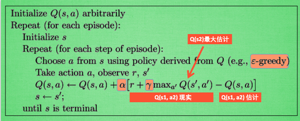

# Q-Learning

## what is Q-Learning

### 简介
从状态s1-->s2，有两种行为a1和a2，假设a2更大，然后再在s2上采取行动，获得下一步的奖励值。  
$Q(s_1,a_2)_{现实} = R + \gamma \max Q(s_2)$  
其中R为s1到达s2获得的奖励，$\max Q(s_2)$为后续获得的最大奖励。  

$Q(s_1,a_2)_{估计} = Q(s_1,a_2)$

**差距 = 现实 - 估计**

$$Q(s_1,a_2)_{new} = Q(s_1,a_2) + \alpha[R + \gamma \max Q(s_2) - Q(s_1,a_2)]$$

但时刻记住, 我们虽然用 maxQ(s2) 估算了一下 s2 状态, 但还没有在 s2 做出任何的行为, s2 的行为决策要等到更新完了以后再重新另外做. 这就是 off-policy 的 Q learning 是如何决策和学习优化决策的过程.

### 整体算法

其中$\epsilon-greedy$是用在决策上的一种策略, 比如 epsilon = 0.9 时, 就说明有90% 的情况我会按照 Q 表的最优值选择行为, 10% 的时间使用随机选行为.
$\alpha$是学习率，$\gamma$是对未来奖励的衰减值，当其越接近1，奖励越远视；

$$Q(s_1) = R_2 + \gamma Q(s_2) = R_2 + \gamma [R_3 + \gamma Q(s_3)] = R_2 + \gamma [R_3 + \gamma [R_4 + \gamma Q(s_4)]] = ...$$

等价于

$$Q(s_1) = R_2 + \gamma R_3 + \gamma^2 R_4 + \gamma^3 R_5 + ...$$

所以可以看到当$\gamma$越接近1的时候，越考虑到后续奖励。