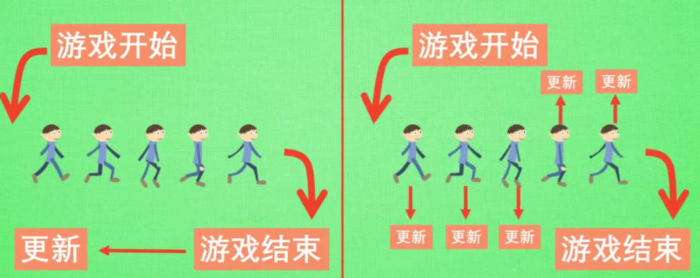

# 强化学习方式汇总

## 按照模型分类
(1) Model-Free Learning：
1. Q-Learning
2. Sarsa
3. PolicyGradient

(2)Model-Based Learning
区别：需要为现实世界建模；model-free需要等待现实世界的反馈，而model-based可以根据想象预判断
1. Q-Learning
2. Sarsa
3. PolicyGradient

## 按照概论
(1) Policy-Based RL  
为每个action打出概率，按照概率选择下一步的动作;可以解决连续动作的问题。
1. Policy-Gradient
(2) Value-Based RL
为每个action打分，按照最高分执行下一步的动作
1. Q-Learning
2. Sarsa

(3)综合：Actor-Critic

## 更新
(1) Monte-Carlo Update 回合更新
1. 基础版 Policy-Gradient
2. Monte-Carlo Learning
(2) Temporal-Difference Update 单步更新(更常用)
1. Q-Learning
2. Sarsa
3. 升级版 Policy-Gradient

## 在线学习和离线学习
(1) On-Policy 在线学习
1. Sarsa
(2) Off-Policy 离线学习 
1. Q-Learning
2. Deep Q Network